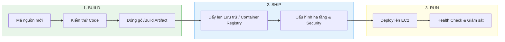

# Triển khai ứng dụng trên AWS EC2

Tài liệu này đóng vai trò là chương mở đầu trong chuỗi các hướng dẫn triển khai (Deployment) trên đám mây AWS. Tài liệu cung cấp cái nhìn tổng quan về kiến trúc, các phương pháp triển khai phổ biến, quy trình chuẩn hóa và hướng dẫn liên kết thực hành chi tiết.

---

## Chương I: Tổng quan về Triển khai ứng dụng trên AWS EC2

Triển khai ứng dụng trên máy chủ ảo **Amazon EC2 (Elastic Compute Cloud)** là phương pháp triển khai truyền thống và phổ biến nhất (Infrastructure as a Service - IaaS). Bằng cách thuê các máy chủ ảo chạy trên đám mây, các nhà phát triển có toàn quyền kiểm soát hệ điều hành, môi trường runtime và các phần mềm hệ thống đi kèm.

### 1. Lợi ích của việc triển khai trên EC2
*   **Toàn quyền kiểm soát (Full Control)**: Quyền root cao nhất cho phép cấu hình bất kỳ thư viện hoặc phần mềm nào (Docker, Node.js, Python, Java, Nginx).
*   **Hiệu năng dự đoán trước**: Khác với môi trường Serverless (như AWS Lambda), EC2 chạy liên tục và không gặp phải vấn đề trễ khởi động lạnh (Cold Start).
*   **Khả năng mở rộng linh hoạt**: Dễ dàng nâng cấp hoặc hạ cấp cấu hình máy chủ (Scale-up) hoặc tích hợp Auto Scaling Group để tự động thêm máy chủ khi tải cao (Scale-out).

### 2. Thách thức cần giải quyết
*   **Trách nhiệm quản trị**: Người vận hành phải tự chịu trách nhiệm cập nhật bản vá hệ điều hành (OS patching), bảo mật tường lửa và cấu hình sao lưu dữ liệu.
*   **Quản lý chi phí**: Tài nguyên được tính phí liên tục theo thời gian máy ảo chạy (Running), bất kể ứng dụng có nhận được traffic hay không.

---

## Chương II: Các phương thức triển khai phổ biến

Tùy vào quy mô dự án và mức độ tự động hóa mong muốn, chúng ta có thể áp dụng 4 phương thức triển khai chính:

### 1. Triển khai thủ công (Manual Deployment)
*   **Cách làm**: Người quản trị kết nối trực tiếp vào máy chủ qua giao thức bảo mật SSH, sao chép mã nguồn, cấu hình cài đặt thủ công.
*   **Phù hợp**: Môi trường thử nghiệm (Sandbox/Testing), học tập hoặc các dự án nhỏ có tần suất cập nhật thấp.

### 2. Triển khai bằng kịch bản tự động (Scripted Deployment)
*   **Cách làm**: Sử dụng tính năng **User Data** của AWS khi khởi chạy EC2 để tự động chạy các đoạn mã Bash script, hoặc sử dụng các công cụ cấu hình hệ thống chuyên nghiệp như **Ansible, Chef, Puppet**.
*   **Phù hợp**: Tự động hóa cấu hình ban đầu của máy chủ (Provisioning).

### 3. Triển khai dựa trên Docker & Docker Compose
*   **Cách làm**: Đóng gói toàn bộ ứng dụng thành các container. Cài đặt Docker trên EC2 và chạy ứng dụng thông qua các lệnh đơn giản hoặc file cấu hình `docker-compose.yml`.
*   **Phù hợp**: Các dự án microservices nhỏ hoặc ứng dụng cần tính nhất quán cao giữa môi trường local và production.

### 4. Triển khai tự động hóa qua CI/CD hiện đại
*   **Cách làm**: Tích hợp các công cụ tự động hóa như **GitHub Actions, GitLab CI/CD, Jenkins** kết hợp với các dịch vụ AWS gốc như **AWS CodeDeploy** để tự động kiểm thử, đóng gói và đẩy mã nguồn mới lên EC2 mỗi khi có thay đổi trong Git repository.
*   **Phù hợp**: Môi trường Production lớn đòi hỏi cập nhật liên tục (Continuous Deployment) và giảm thiểu tối đa sai sót từ con người.

---

## Chương III: Quy trình triển khai chuẩn hóa

Một quy trình triển khai ứng dụng chuẩn trên môi trường đám mây cần tuân thủ 3 giai đoạn cốt lõi:

1.  **Giai đoạn Build**: Thực hiện kiểm tra chất lượng mã nguồn (Linter, Unit Tests) và đóng gói mã nguồn thành các file phân phối (như `.jar`, `.tar.gz`, Docker Image).
2.  **Giai đoạn Ship**: Chuyển giao các gói sản phẩm đã build tới nơi lưu trữ an toàn (AWS S3, AWS ECR) và cấu hình các thông số bảo mật liên quan (Security Group, IAM Role).
3.  **Giai đoạn Run**: Thực hiện deploy gói phần mềm mới lên EC2, khởi chạy ứng dụng, cấu hình khởi động cùng hệ thống và tiến hành các bước kiểm tra trạng thái hoạt động thực tế (Health check).

---

## Chương IV: Hướng dẫn thực hành triển khai thủ công

Để giúp các nhà phát triển làm quen với hạ tầng đám mây thực tế, bước đầu tiên quan trọng nhất là tự tay xây dựng một máy chủ ảo, thiết lập cấu hình mạng an toàn và vận hành một ứng dụng Web tĩnh.

Để xem hướng dẫn chi tiết từng bước bao gồm:
*   Khởi tạo máy ảo EC2 sử dụng **Amazon Linux 2**.
*   Tạo và cấu hình an toàn cho **Key Pair (RSA .pem)**.
*   Sửa lỗi bảo mật quyền truy cập tệp tin `.pem` trên hệ điều hành Windows qua giao diện Advanced Security.
*   Cài đặt và thiết lập máy chủ Web **Apache (httpd)** cùng trang chủ HTML tĩnh.
*   Thực hiện sao lưu bằng **Snapshot** và nhân bản hệ thống bằng **AMI (Amazon Machine Image)**.

Vui lòng tham khảo tài liệu hướng dẫn thực hành chi tiết tại liên kết sau:
👉 **[Tài liệu thực hành chi tiết: Amazon EC2 Hands-on Lab](file:///d:/Code/Deploy/cloud/aws/services/1.%20EC2/4.%20Amazon%20EC2%20Hands-on%20Lab.md)**
*(Đường dẫn tương đối: `../services/1. EC2/4. Amazon EC2 Hands-on Lab.md`)*
