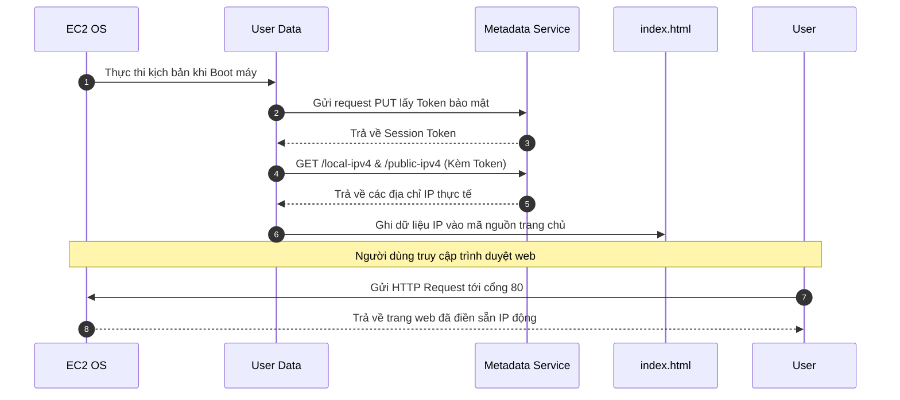

# 3. Amazon EC2 User Data and Metadata Lab

## I. Sơ đồ hoạt động (Architecture)
Quy trình thực thi kịch bản User Data cài đặt Apache và gọi Metadata Service (IMDSv2) để ghi nhận IP động:

---

## II. Tổng quan bài Lab (Yêu cầu)
Bài thực hành này hướng dẫn bạn các bước cơ bản để tự động hóa cấu hình hệ thống trên EC2 và lấy dữ liệu động của máy chủ:

1. **Cấu hình kịch bản tự động hóa (User Data):**
   * Sử dụng shell script dán vào phần cài đặt nâng cao lúc khởi chạy máy chủ.
   * Kịch bản tự động cài đặt và khởi chạy máy chủ web Apache (`httpd`).
2. **Truy xuất Metadata qua tiêu chuẩn bảo mật IMDSv2:**
   * Tạo Token xác thực thời gian sống tạm thời.
   * Gửi request kèm Token để lấy thông tin Private IP (`local-ipv4`) và Public IP (`public-ipv4`) của máy chủ.
   * Ghi các thông tin IP này vào tệp tin HTML trang chủ `/var/www/html/index.html`.
3. **Xác minh hoạt động:**
   * Mở trình duyệt truy cập qua IP công cộng và xem kết quả hiển thị thông tin máy chủ.

---

## III. Hướng dẫn chi tiết
Vui lòng xem các bước triển khai chi tiết từng bước tại:
 **[Hướng dẫn thực hành chi tiết (README.md)](README.md)**

---

* **Bài trước**: [2. Amazon EC2 Hands-on Lab(Windows)](../2.%20Amazon%20EC2%20Hands-on%20Lab%28Windows%29.md)
* **Bài tiếp theo**: [4. Amazon EC2 Hands-on Lab(Windows Volume)](../4.%20Amazon%20EC2%20Hands-on%20Lab%28Windows%20Volume%29.md)
