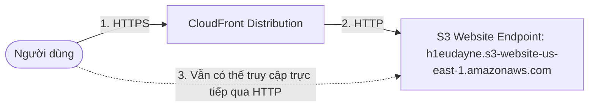
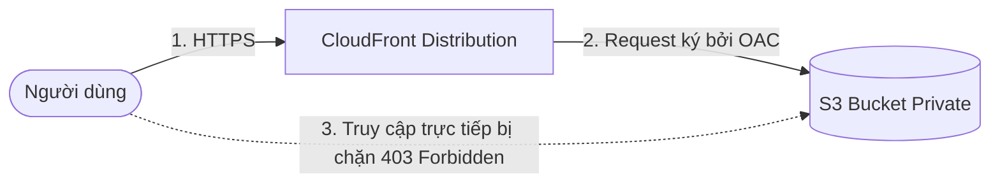

# 1. Lab 1 – Sử dụng CloudFront kết hợp với S3

## I. Sơ đồ hoạt động (Architecture)

### Phương án 1: Sử dụng S3 Static Website Hosting Endpoint (Custom HTTP Origin)
*Phương án thực tế đang cấu hình theo ảnh chụp màn hình (Bucket public, CloudFront làm lớp CDN).*

### Phương án 2: Sử dụng S3 REST Endpoint kết hợp OAC (Bảo mật - Khuyên dùng)
*S3 Bucket được cấu hình Private hoàn toàn, chỉ cho phép truy cập thông qua CloudFront.*

---

## II. Tổng quan bài Lab (Yêu cầu)

Bài thực hành này hướng dẫn triển khai tích hợp dịch vụ **Amazon CloudFront** với nguồn lưu trữ tệp tĩnh **Amazon S3** thông qua hai phương pháp phổ biến:

1. **Phương pháp 1: Tích hợp với S3 Static Website Hosting Endpoint (Theo thực tế cấu hình):**
   * Sử dụng website tĩnh đã được cấu hình từ bài lab S3 trước đó (bucket `h1eudayne`).
   * Khởi tạo CloudFront Distribution trỏ Origin tới domain website endpoint `h1eudayne.s3-website-us-east-1.amazonaws.com`.
   * Cấu hình chuyển hướng HTTP sang HTTPS, kích hoạt chính sách Cache và bật tính năng bảo mật cơ bản (WAF).
2. **Phương pháp 2: Tích hợp bảo mật sử dụng S3 REST API & Origin Access Control (OAC):**
   * Chuyển bucket S3 về chế độ Private hoàn toàn (Block all public access).
   * Tạo CloudFront Distribution và cấu hình **Origin Access Control (OAC)**.
   * Cập nhật S3 Bucket Policy chỉ cho phép Service Principal của CloudFront truy cập đọc tệp tin (`s3:GetObject`).
3. **[Mở rộng] Tích hợp Tên miền tùy chỉnh (Custom Domain) & SSL/TLS Certificate (Route 53 & ACM):**
   * Đăng ký tên miền riêng thông qua dịch vụ **Amazon Route 53** (ví dụ thực tế trong lab: `h1eudayne.click`).
   * Yêu cầu cấp chứng chỉ bảo mật SSL/TLS miễn phí qua **AWS Certificate Manager (ACM)** ở Region `us-east-1`.
   * Cấu hình tên miền tùy chỉnh (Alternate Domain Names / CNAMEs) và chứng chỉ SSL vào CloudFront Distribution.
   * Cấu hình bản ghi DNS (A Record / Alias) trên Route 53 để trỏ tên miền về CloudFront.

---

## III. Hướng dẫn chi tiết

Vui lòng xem các bước triển khai chi tiết từng bước tại:
 **[Hướng dẫn thực hành chi tiết (README.md)](README.md)**

---

* **Bài trước**: Không có
* **Bài tiếp theo**: [2. Lab 2 – Sử dụng CloudFront kết hợp với API Gateway and S3](../2.%20Lab%202%20-%20Integrate%20CloudFront%20with%20API%20Gateway%20and%20S3/2.%20Lab%202%20-%20Integrate%20CloudFront%20with%20API%20Gateway%20and%20S3.md)
