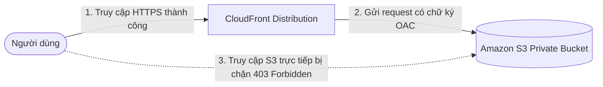

# 1. Lab 1 – Sử dụng CloudFront kết hợp với S3

## I. Sơ đồ hoạt động (Architecture)

---

## II. Tổng quan bài Lab (Yêu cầu)

Bài Lab này hướng dẫn triển khai một Static Website lưu trữ trên S3 bucket được bảo mật hoàn toàn ở chế độ Private, chỉ cho phép người dùng truy cập thông qua dịch vụ **Amazon CloudFront** sử dụng tính năng **Origin Access Control (OAC)**:

1. **Khởi tạo Amazon S3 Bucket:**
   * Tạo S3 bucket ở chế độ Private (Block all public access).
   * Tải tệp tin trang chủ tĩnh (`index.html`) lên bucket.
2. **Khởi tạo CloudFront Distribution:**
   * Tạo một bản phân phối với Origin là S3 bucket vừa khởi tạo.
   * Kích hoạt cơ chế xác thực **Origin Access Control (OAC)** để ký số cho các yêu cầu chuyển tiếp sang S3.
   * Sử dụng Caching Policy `CachingOptimized` để tối ưu hóa bộ nhớ đệm.
3. **Cấu hình S3 Bucket Policy:**
   * Cập nhật S3 Bucket Policy cho phép OAC của CloudFront được phép đọc đối tượng (`s3:GetObject`).
4. **Kiểm thử và xác minh hoạt động:**
   * Gọi trực tiếp tài nguyên từ S3 Object URL -> Nhận lỗi `403 Forbidden`.
   * Gọi tài nguyên qua tên miền của CloudFront -> Truy cập thành công và hiển thị trang web tĩnh.

---

## III. Hướng dẫn chi tiết

Vui lòng xem các bước triển khai chi tiết từng bước tại:
 **[Hướng dẫn thực hành chi tiết (README.md)](README.md)**

---

* **Bài trước**: Không có
* **Bài tiếp theo**: [2. Lab 2 – Sử dụng CloudFront kết hợp với API Gateway and S3](../2.%20Lab%202%20-%20Integrate%20CloudFront%20with%20API%20Gateway%20and%20S3/2.%20Lab%202%20-%20Integrate%20CloudFront%20with%20API%20Gateway%20and%20S3.md)
