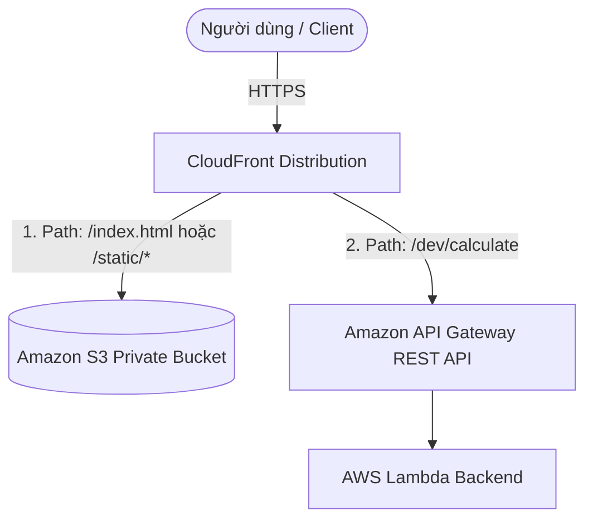

# 2. Lab 2 – Sử dụng CloudFront kết hợp với API Gateway and S3

## I. Sơ đồ hoạt động (Architecture)

---

## II. Tổng quan bài Lab (Yêu cầu)

Bài Lab này hướng dẫn triển khai cấu hình tích hợp **Amazon CloudFront** với **API Gateway** và **Amazon S3** để tạo thành điểm truy cập hợp nhất (Single Entry Point) cho cả tài nguyên tĩnh và API động:

1. **Chuẩn bị cấu hình API Gateway (Setup):**
   * Tắt tính năng xác thực Cognito Authorizer và yêu cầu API Key trên phương thức `POST /calculate` của API Gateway để chuẩn bị tích hợp trơn tru qua CDN.
2. **Cấu hình Multi-Origin trên CloudFront:**
   * Thêm Origin mới trỏ tới API Gateway Endpoint (ví dụ thực tế trong lab: `da0brxb62b.execute-api.us-east-1.amazonaws.com`) với giao thức HTTPS Only.
3. **Cấu hình Cache Behavior để định tuyến:**
   * **Default Behavior (`*`):** Định tuyến tới S3 bucket để tải giao diện website tĩnh.
   * **Custom Behavior (ví dụ: `/dev/calculate`):** Định tuyến tới API Gateway. Tắt cache (`CachingDisabled`) và cho phép chuyển tiếp đầy đủ dữ liệu viewer (`AllViewer`).
4. **Kiểm thử tích hợp hệ thống:**
   * Xác minh các request API động và trang tĩnh hoạt động chính xác qua tên miền duy nhất của CloudFront.

---

## III. Hướng dẫn chi tiết

Vui lòng xem các bước triển khai chi tiết từng bước tại:
 **[Hướng dẫn thực hành chi tiết (README.md)](README.md)**

---

* **Bài trước**: [1. Lab 1 – Sử dụng CloudFront kết hợp với S3](../1.%20Lab%201%20-%20Integrate%20CloudFront%20with%20S3/1.%20Lab%201%20-%20Integrate%20CloudFront%20with%20S3.md)
* **Bài tiếp theo**: Sắp ra mắt (Coming soon...)
