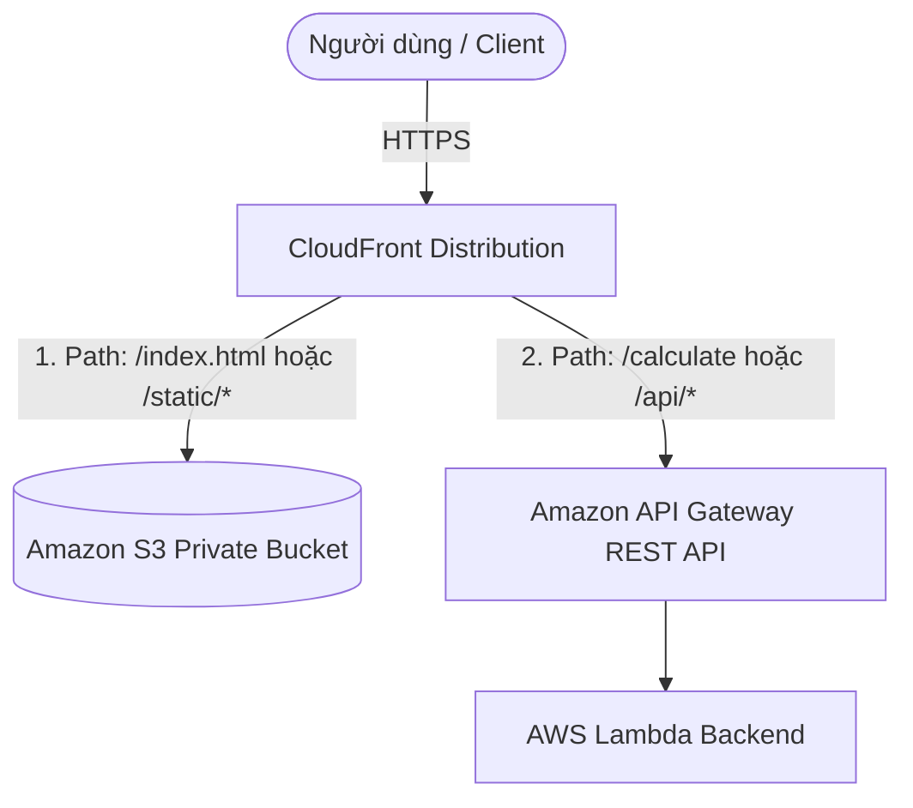

# 2. Lab 2 – Sử dụng CloudFront kết hợp với API Gateway and S3

## I. Sơ đồ hoạt động (Architecture)

---

## II. Tổng quan bài Lab (Yêu cầu)

Bài Lab này hướng dẫn triển khai kiến trúc Multi-Origin trên CloudFront, đóng vai trò là điểm truy cập hợp nhất cho toàn bộ hệ thống (Single Entry Point), định tuyến các yêu cầu tĩnh và yêu cầu động về các nguồn gốc (Origins) tương ứng:

1. **Chuẩn bị hạ tầng:**
   * Tái sử dụng Amazon S3 bucket từ Lab 1 làm Origin cho nội dung tĩnh.
   * Tái sử dụng API Gateway REST API và Lambda Backend đã hoàn tất cấu hình từ các bài Lab trước làm Origin cho nội dung động.
2. **Cấu hình Multi-Origin trên CloudFront:**
   * Thêm Origin thứ hai trỏ đến API Gateway Endpoint.
3. **Cấu hình Behaviors định tuyến theo Path Pattern:**
   * **Default Behavior (`*`):** Định tuyến tới S3 bucket để tải giao diện website.
   * **Custom Behavior (ví dụ: `/calculate`):** Định tuyến tới API Gateway. Cấu hình tắt Caching (`CachingDisabled`) và cho phép chuyển tiếp đầy đủ dữ liệu (`AllViewer`).
4. **Kiểm thử tích hợp hệ thống:**
   * Truy cập trang web tĩnh thông qua tên miền CloudFront.
   * Gửi request API động tới tên miền CloudFront để nhận kết quả tính toán trả về từ Lambda.

---

## III. Hướng dẫn chi tiết

Vui lòng xem các bước triển khai chi tiết từng bước tại:
 **[Hướng dẫn thực hành chi tiết (README.md)](README.md)**

---

* **Bài trước**: [1. Lab 1 – Sử dụng CloudFront kết hợp với S3](../1.%20Lab%201%20-%20Integrate%20CloudFront%20with%20S3/1.%20Lab%201%20-%20Integrate%20CloudFront%20with%20S3.md)
* **Bài tiếp theo**: Sắp ra mắt (Coming soon...)
