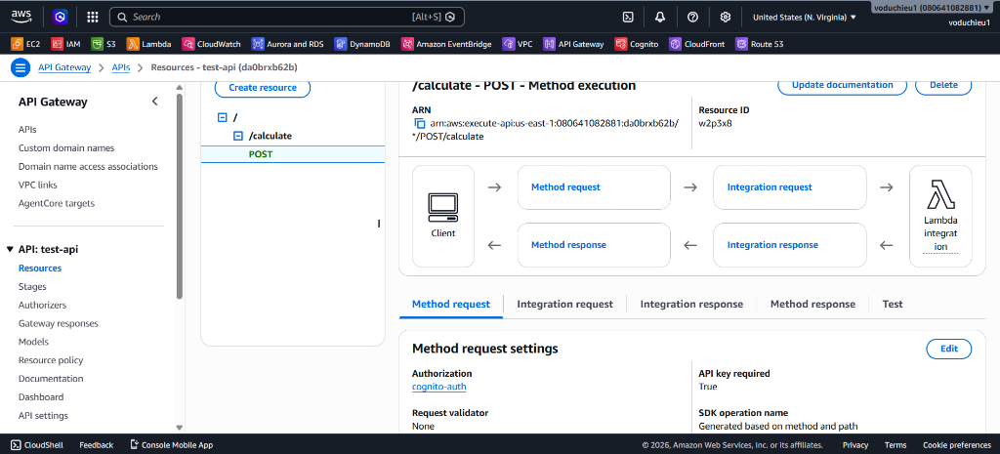
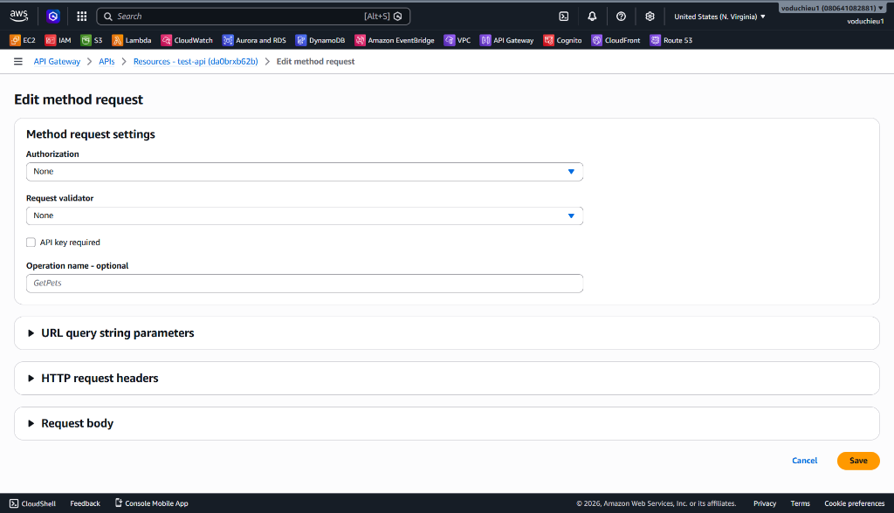
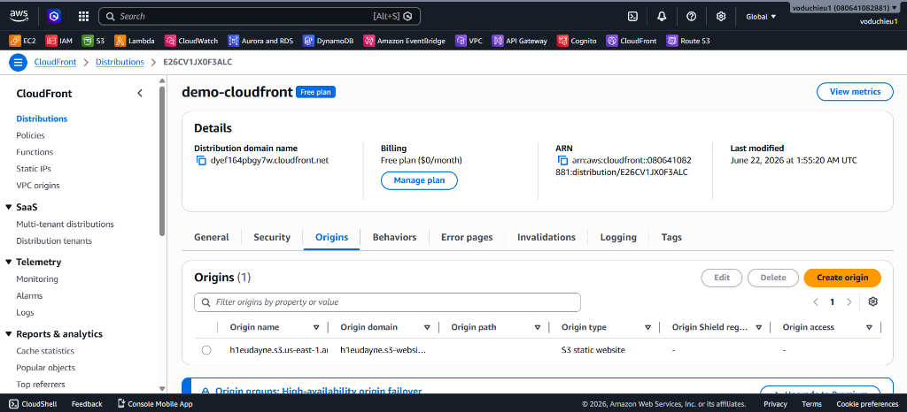
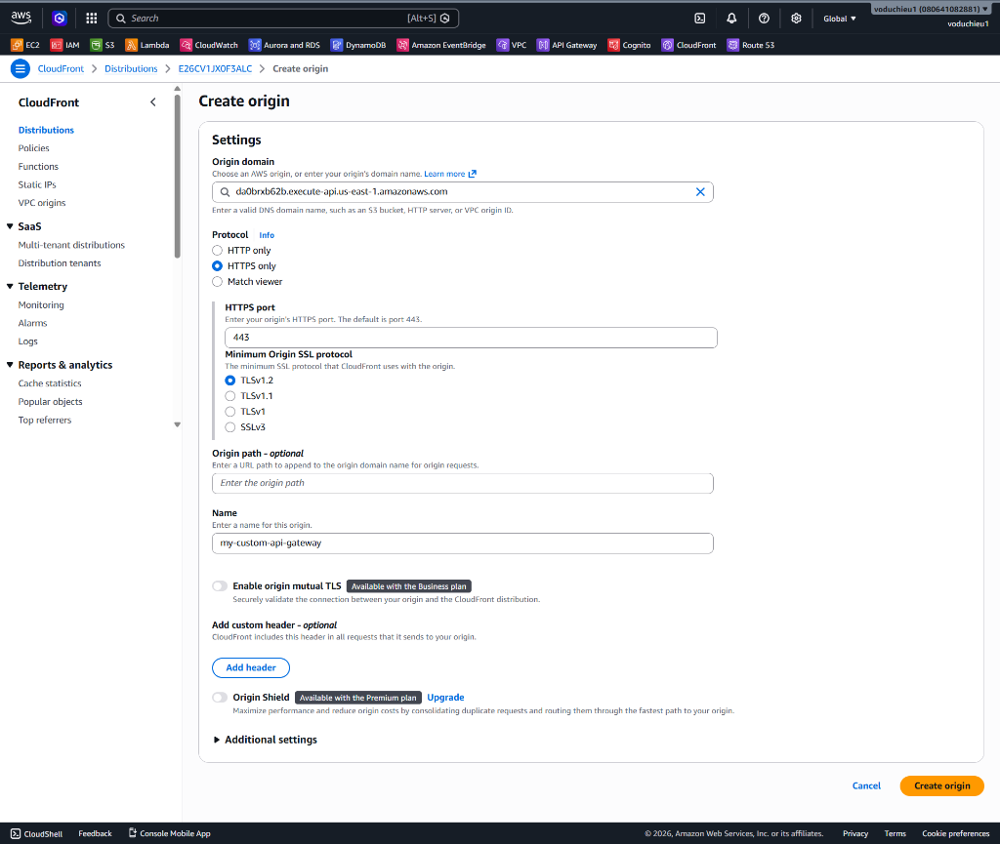
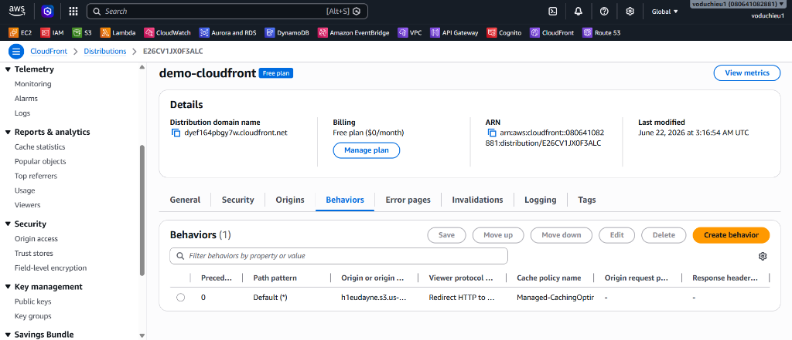
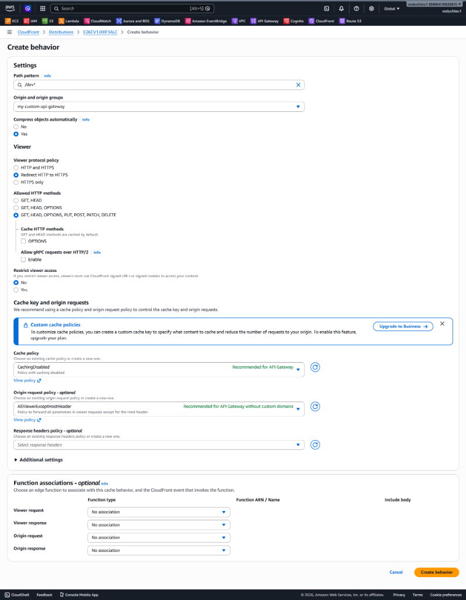
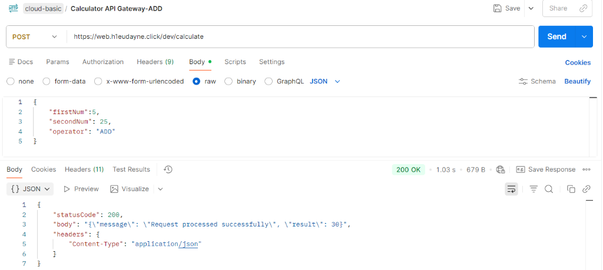

# Lab 2 - Sử dụng CloudFront kết hợp với API Gateway and S3 - Hướng dẫn chi tiết

 **[Xem Đề bài / Yêu cầu bài Lab](2.%20Lab%202%20-%20Integrate%20CloudFront%20with%20API%20Gateway%20and%20S3.md)**

---

## Các bước thực hiện chi tiết

### Bước 1: Chuẩn bị cấu hình (Setup) trên API Gateway

Trước khi tích hợp qua CloudFront, ta cần loại bỏ các lớp xác thực tạm thời trên API Gateway để kiểm thử định tuyến dễ dàng hơn:

1. Đăng nhập vào AWS Console, mở dịch vụ **API Gateway** và chọn API của bạn (ví dụ: `test-api` - `da0brxb62b`).
2. Di chuyển tới mục **Resources** ở menu bên trái > Chọn tài nguyên `/calculate` > phương thức **POST**.
3. Tại tab **Method request**, kiểm tra cấu hình hiện tại (ở các lab trước đang yêu cầu Cognito Authorizer và API Key). Nhấp chọn nút **Edit** ở góc phải phần *Method request settings*.

   
   *Hình 1: Trạng thái thiết lập Method Request ban đầu với Authorizer và API Key.*

4. Trong màn hình chỉnh sửa:
   * **Authorization**: Chọn **None** (Chuyển tất cả bộ xác thực về None).
   * **API key required**: Bỏ tích chọn (Thiết lập thành False/Không yêu cầu).
5. Click chọn **Save**.

   
   *Hình 2: Chuyển cấu hình Method request về None và tắt yêu cầu API key.*

6. **Lưu ý cực kỳ quan trọng:** Sau khi lưu, bạn phải nhấn chọn nút **Deploy API** ở góc trên bên phải > Chọn Stage tương ứng (ví dụ: `dev`) > Click **Deploy** để các thay đổi này chính thức có hiệu lực trên Internet.

---

### Bước 2: Thêm API Gateway làm Origin cho CloudFront

Chúng ta sẽ khai báo thêm API Gateway làm nguồn gốc (Origin) thứ hai cho bản phân phối CloudFront:

1. Truy cập dịch vụ **CloudFront** trên AWS Console.
2. Click chọn Distribution của bạn (ví dụ: `demo-cloudfront` - ID: `E26CV1JX0F3ALC`).
3. Chuyển sang tab **Origins** > Click chọn nút **Create origin**.

   
   *Hình 3: Giao diện tab Origins hiển thị danh sách các nguồn hiện tại - Chọn Create origin.*

4. Thiết lập cấu hình Origin mới:
   * **Origin domain**: Dán địa chỉ Endpoint API Gateway của bạn (ví dụ: `da0brxb62b.execute-api.us-east-1.amazonaws.com`).
   * **Protocol**: Tích chọn **HTTPS only** (API Gateway bắt buộc kết nối bảo mật).
   * **Origin path - optional**: **Để trống** (không điền Stage name `/dev` ở đây như thực tế cấu hình trong ảnh chụp màn hình).
   * **Name**: Nhập `my-custom-api-gateway` (hoặc tên bất kỳ bạn tự chọn).
   * Các mục khác giữ nguyên mặc định.
5. Click chọn nút **Create origin**.

   
   *Hình 4: Thiết lập thông số và domain API Gateway làm HTTP Origin mới.*

---

### Bước 3: Tạo Cache Behavior định tuyến cho API động

Sau khi đã có 2 Origins (S3 chứa web tĩnh và API Gateway xử lý logic động), chúng ta cần tạo quy luật định tuyến (Behavior) trên CloudFront:

1. Di chuyển sang tab **Behaviors** > Click chọn nút **Create behavior**.

   
   *Hình 5: Danh sách Behaviors hiện tại của Distribution - Chọn Create behavior.*

2. Thiết lập thông số Behavior:
   * **Path pattern**: Nhập `/dev*` (dùng dấu wildcard để khớp với tất cả các API requests đi qua stage `/dev`).
   * **Origin**: Chọn Origin API Gateway vừa tạo ở Bước 2 (`my-custom-api-gateway`).
   * **Viewer protocol policy**: Chọn **Redirect HTTP to HTTPS** (Tự động nâng cấp kết nối bảo mật).
   * **Allowed HTTP methods**: Chọn **`GET, HEAD, OPTIONS, PUT, POST, PATCH, DELETE`** (Cho phép đầy đủ các phương thức để API hoạt động bình thường).
3. Tại mục **Cache key and origin requests**:
   * **Cache policy**: Chọn **`CachingDisabled`** (Tắt cache hoàn toàn đối với request API động).
   * **Origin request policy**: Chọn chính sách **`AllViewerExceptHostHeader`** (Đây là cấu hình khuyên dùng cho API Gateway không có custom domain để tránh lỗi không khớp Host header khi forward request).
4. Click chọn nút **Create behavior**.

   
   *Hình 6: Thiết lập chi tiết Path pattern /dev* và chính sách Caching/Origin Request.*

5. Đảm bảo thứ tự ưu tiên (Precedence) tại bảng danh sách Behaviors:
   * **Thứ tự 0**: Path `/dev*` trỏ tới API Gateway.
   * **Thứ tự 1 (Default `*`)**: Path mặc định trỏ tới S3 bucket.

---

### Bước 4: Kiểm thử và Xác minh

Sau khi cấu hình hoàn tất và CloudFront đã deploy xong (trạng thái Last modified hiển thị thời gian cụ thể), CloudFront sẽ đồng thời phục vụ **2 backend song song** thông qua một tên miền duy nhất (ở đây là Custom Domain `web.h1eudayne.click`).

#### 1. Kiểm thử định tuyến API động qua Custom Domain (Postman)
1. Mở Postman, cấu hình request **POST**.
2. **Địa chỉ URL:** Sử dụng tên miền riêng của bạn thay thế cho link API Gateway trực tiếp trước đây:
   `https://web.h1eudayne.click/dev/calculate`
3. Tại tab **Body**, dán payload JSON phép tính (ví dụ thực hiện phép tính `5 + 25`):
   ```json
   {
       "firstNum": 5,
       "secondNum": 25,
       "operator": "ADD"
   }
   ```
4. Click chọn **Send**.
5. **Kết quả:** Trả về mã phản hồi **`200 OK`** cùng kết quả tính toán chính xác từ Lambda Backend (`result: 30`). Điều này xác nhận CloudFront đã nhận diện tiền tố `/dev`, bỏ qua cache và chuyển tiếp chính xác request về API Gateway.

   
   *Hình 7: Postman gọi thành công qua Custom Domain CloudFront, trả về kết quả tính toán 30 từ Lambda.*

#### 2. Kiểm thử định tuyến trang tĩnh S3
1. Truy cập `https://web.h1eudayne.click/index.html` hoặc trực tiếp trang chủ trên trình duyệt.
2. **Kết quả:** Trang web tĩnh DIMENSION hiển thị bình thường. 
3. **Giải thích cơ chế:** Vì request này không khớp với Path pattern `/dev*`, nên CloudFront tự động khớp với Default Behavior (`*`) và định tuyến về S3 Origin để tải tệp tĩnh lên trình duyệt. Quy trình này diễn ra hoàn toàn trong suốt với người dùng.

---

* **Bài trước**: [1. Lab 1 – Sử dụng CloudFront kết hợp với S3](../1.%20Lab%201%20-%20Integrate%20CloudFront%20with%20S3/1.%20Lab%201%20-%20Integrate%20CloudFront%20with%20S3.md)
* **Bài tiếp theo**: Sắp ra mắt (Coming soon...)
