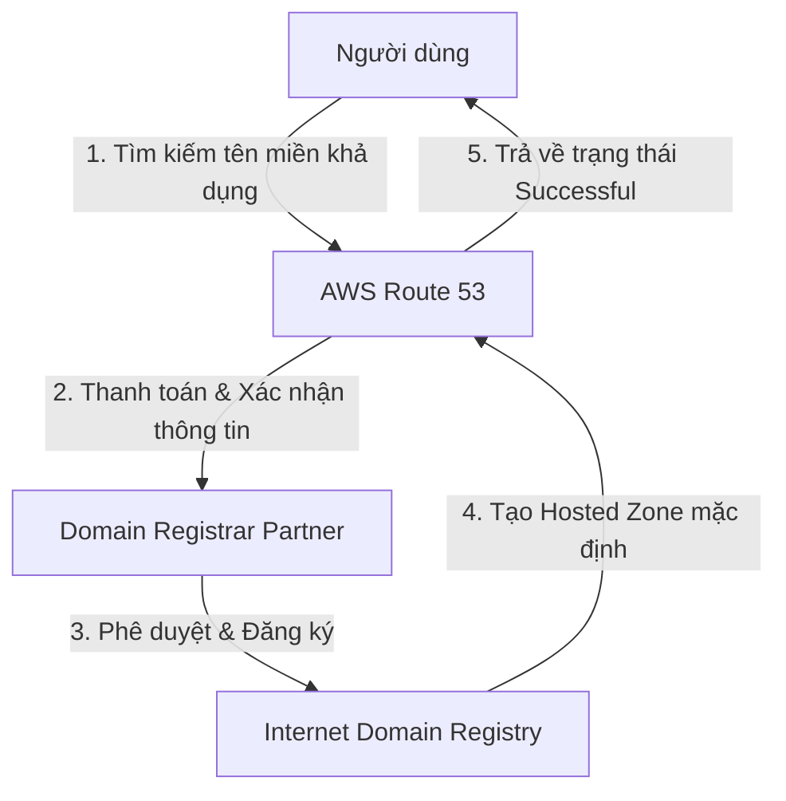

# 1. Lab 1 – Đăng ký tên miền (Register Domain) bằng Route 53

## I. Quy trình hoạt động (Workflow)
Quy trình đăng ký một tên miền mới trên AWS được mô tả qua sơ đồ sau:

---

## II. Tổng quan bài Lab (Yêu cầu)
Bài thực hành này hướng dẫn bạn các bước cơ bản để sở hữu một tên miền Internet riêng thông qua AWS Route 53:

1. **Tìm kiếm và Lựa chọn Tên miền:**
   * Sử dụng AWS Route 53 Console để kiểm tra tính sẵn sàng của tên miền mong muốn.
   * Lựa chọn đuôi mở rộng (Top-Level Domain - TLD) phù hợp với ngân sách (ví dụ đuôi `.click` thường có chi phí rất rẻ khoảng $3.00 USD/năm).
2. **Khai báo Thông tin Đăng ký (Contact Information):**
   * Cung cấp thông tin liên hệ của chủ sở hữu tên miền (tên, địa chỉ, số điện thoại, email) theo đúng quy định quốc tế của ICANN.
3. **Kiểm tra Tiến độ Đăng ký (Verification):**
   * Theo dõi trạng thái của yêu cầu đăng ký tại mục Route 53 Requests.
   * Chờ hệ thống xác nhận và tạo Hosted Zone tự động tương ứng sau khi tên miền được đăng ký thành công.

---

## III. Hướng dẫn chi tiết
Nội dung thực hành mua và đăng ký tên miền đã được thực hiện chi tiết trong phần mở rộng của bài Lab 1 CloudFront. Vui lòng xem hướng dẫn chi tiết từng bước triển khai tại:
 **[Lab 1 CloudFront - Bước 1: Mua và đăng ký tên miền riêng trên AWS Route 53](../../10.%20CloudFront/1.%20Lab%201%20-%20Integrate%20CloudFront%20with%20S3/README.md#buoc-1-mua-va-dang-ky-ten-mien-rieng-tren-aws-route-53)**

---

* **Bài trước**: Không có
* **Bài tiếp theo**: [2. Lab 2 – Thực hành A-Record & Root Domain](../2.%20Lab%202%20-%20A-Record%20and%20Root%20Domain%20to%20EC2/2.%20Lab%202%20-%20A-Record%20and%20Root%20Domain%20to%20EC2.md)
