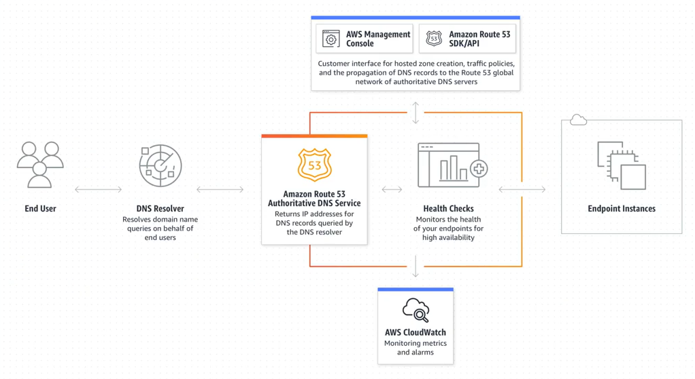
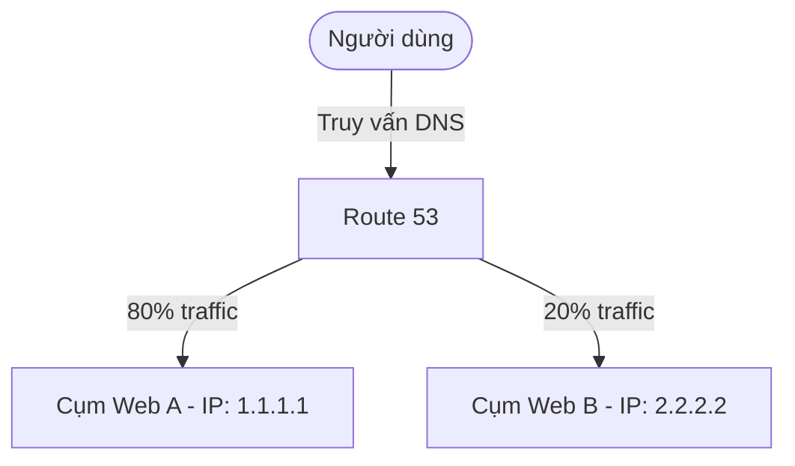

# 11. Route 53 – Dịch vụ DNS của AWS

## I. Giới thiệu dịch vụ Route 53

### 1. DNS – Domain Name System là gì?
**DNS (Domain Name System)** là một hệ thống quản lý các tên miền và ánh xạ chúng thành địa chỉ IP của máy chủ, cho phép các ứng dụng truy cập vào các dịch vụ trên internet bằng tên miền thân thiện (như `h1eudayne.click`) thay vì sử dụng địa chỉ IP dạng số phức tạp (như `192.0.2.1` hay `2001:db8::1`). Nó hoạt động như một danh bạ điện thoại khổng lồ của Internet.

### 2. AWS Route 53 là gì?
**Amazon Route 53** là một dịch vụ quản lý tên miền và DNS (Domain Name System) được quản lý toàn phần (fully managed) có độ sẵn sàng và độ tin cậy cực cao được cung cấp bởi Amazon Web Services (AWS). Tên gọi "Route 53" được lấy cảm hứng từ cổng **Port 53** – cổng mạng chuẩn được sử dụng để xử lý các yêu cầu DNS trên toàn cầu qua giao thức TCP/UDP.

AWS Route 53 cho phép bạn đăng ký và quản lý tên miền, tạo và cấu hình các bản ghi DNS, và điều hướng các yêu cầu từ tên miền đến các nguồn tài nguyên khác nhau trên AWS và bên ngoài. Điều này bao gồm điều hướng yêu cầu đến máy chủ web (EC2/ELB), máy chủ email, CDN (CloudFront) và các tài nguyên khác.

Route 53 cung cấp một loạt tính năng như đám mây DNS, chống chịu tải (Failover/Weighted Routing), đám mây phân phối nội dung, bảo mật và theo dõi tình trạng tài nguyên (Health Checks). Nó cũng tích hợp tốt với các dịch vụ khác của AWS, cho phép bạn tự động cập nhật bản ghi DNS khi tạo hoặc xoá các nguồn tài nguyên trên AWS.

*Hình 1: Sơ đồ kiến trúc tổng quan và luồng xử lý truy vấn DNS của Amazon Route 53.*

---

## II. Các tính năng chính của Route 53
Route 53 kết hợp ba chức năng quan trọng để quản lý lưu lượng mạng cho ứng dụng của bạn:
1. **Đăng ký tên miền (Domain Registration):** Cho phép bạn tìm kiếm và đăng ký mua các tên miền mới (như `.com`, `.net`, `.click`,...) trực tiếp từ AWS Console.
2. **Định tuyến DNS (DNS Routing):** Biên dịch tên miền và điều hướng các yêu cầu của người dùng tới hạ tầng của bạn trên AWS (như EC2 instances, Application Load Balancers, CloudFront, S3 buckets,...) hoặc hạ tầng bên ngoài AWS.
3. **Giám sát sức khỏe (Health Checking):** Tự động gửi các yêu cầu kiểm tra định kỳ tới tài nguyên của bạn để xác minh trạng thái hoạt động. Nếu phát hiện sự cố, Route 53 có thể tự động cấu hình lại DNS để chuyển hướng người dùng sang các máy chủ dự phòng khỏe mạnh.

---

## III. Route 53 Hosted Zone (Vùng lưu trữ bản ghi DNS)
Hosted Zone là một container chứa toàn bộ thông tin định tuyến (các DNS Records) cho một tên miền cụ thể. Có hai loại Hosted Zone chính:

| Tiêu chí | Public Hosted Zone | Private Hosted Zone |
| :--- | :--- | :--- |
| **Phạm vi hoạt động** | Công khai trên Internet. | Nội bộ bên trong mạng đám mây ảo VPC. |
| **Đặc điểm phân giải** | Bất kỳ ai trên Internet cũng có thể tra cứu và phân giải được các bản ghi DNS bên trong zone này. | Chỉ có các máy chủ EC2 hoặc tài nguyên nằm trong các VPC được liên kết mới có thể phân giải được. |
| **Ví dụ sử dụng** | Định tuyến người dùng Internet tới trang web công khai: `web.h1eudayne.click` | Định tuyến kết nối nội bộ từ ứng dụng sang cơ sở dữ liệu bảo mật: `db.corp.internal` |

---

## IV. Các loại DNS Record phổ biến
Bên trong Hosted Zone, bạn sẽ cấu hình các bản ghi DNS (Records) để định rõ cách dịch chuyển tên miền. Các loại bản ghi được AWS Route 53 hỗ trợ bao gồm:

* **A (Address Record):** Ánh xạ trực tiếp một tên miền thành một địa chỉ **IPv4** (ví dụ: `app.h1eudayne.click` ➔ `192.0.2.12`).
* **AAAA (IPv6 Address Record):** Ánh xạ một tên miền thành địa chỉ **IPv6** (ví dụ: `app.h1eudayne.click` ➔ `2001:db8::1`).
* **CNAME (Canonical Name):** Ánh xạ một tên miền phụ (subdomain) sang một tên miền phụ khác (ví dụ: `cdn.h1eudayne.click` ➔ `dyef164pbgy7w.cloudfront.net`). 
  > [!WARNING]
  > **Hạn chế của CNAME:** Theo chuẩn DNS quốc tế, bản ghi CNAME **không thể** được thiết lập tại tên miền gốc (Apex/Root Domain - ví dụ: `h1eudayne.click` không có tiền tố như `www` hay `cdn`).
* **ALIAS Record (Bản ghi bí danh):** Đây là bản ghi **đặc quyền và độc quyền** do AWS phát triển để mở rộng chuẩn DNS truyền thống:
  * Cho phép bạn trỏ trực tiếp cả **Root Domain** (như `h1eudayne.click`) lẫn subdomain tới các tài nguyên của AWS (như ALB, CloudFront Distribution, S3 Website, API Gateway,...).
  * Tự động nhận diện và cập nhật địa chỉ IP khi tài nguyên AWS thay đổi IP (như Load Balancer co giãn hoặc CloudFront cập nhật cụm server Edge).
  * Truy vấn DNS đến bản ghi ALIAS trỏ tới tài nguyên AWS được **miễn phí hoàn toàn**.

---

## V. Routing Policies (Chính sách định tuyến của Route 53)
Routing Policy xác định cách Route 53 phản hồi các truy vấn DNS từ người dùng để tối ưu hiệu năng và tính sẵn sàng:

### 1. Simple Routing Policy (Định tuyến đơn giản)
* **Cách hoạt động:** Cấu hình một bản ghi duy nhất trả về một hoặc nhiều địa chỉ IP (dạng danh sách).
* **Đặc điểm:** Route 53 sẽ trả về toàn bộ danh sách IP cho Client và Client tự chọn ngẫu nhiên một IP để kết nối. Không hỗ trợ kiểm tra sức khỏe (Health Check) để loại bỏ tự động IP bị lỗi.

### 2. Weighted Routing Policy (Định tuyến theo trọng số)
* **Cách hoạt động:** Chỉ định tỷ lệ phần trăm phân phối lưu lượng cho nhiều tài nguyên khác nhau xử lý cùng một tên miền.
* **Ví dụ:** Gửi 80% lưu lượng truy cập tới cụm máy chủ A và 20% tới cụm máy chủ B. Rất hữu dụng khi triển khai thử nghiệm phiên bản mới (Blue/Green Deployment hoặc Canary Testing).

### 3. Latency-based Routing Policy (Định tuyến theo độ trễ)
* **Cách hoạt động:** Điều hướng yêu cầu của người dùng tới AWS Region có độ trễ mạng thấp nhất (ping nhanh nhất) đối với vị trí của người dùng đó.
* **Ví dụ:** Người dùng ở Việt Nam truy cập sẽ nhận được IP máy chủ tại Region Singapore (`ap-southeast-1`), trong khi người dùng ở New York sẽ nhận được IP máy chủ tại Region Northern Virginia (`us-east-1`).

### 4. Failover Routing Policy (Định tuyến dự phòng)
* **Cách hoạt động:** Cấu hình theo mô hình Active-Passive (Chính - Phụ).
* **Nguyên lý:** Route 53 liên kết bản ghi chính (Primary) với một Health Check. Khi máy chủ chính hoạt động tốt, mọi truy cập đều hướng về Primary. Nếu máy chủ chính gặp sự cố (Health Check báo Unhealthy), DNS sẽ tự động chuyển hướng người dùng sang máy chủ dự phòng (Secondary).

### 5. Geolocation Routing Policy (Định tuyến theo vị trí địa lý)
* **Cách hoạt động:** Định tuyến dựa trên vị trí quốc gia/châu lục của người dùng mà Route 53 nhận diện qua địa chỉ IP.
* **Ứng dụng:** Hiển thị ngôn ngữ trang web phù hợp với quốc gia của người dùng, hoặc giới hạn nội dung phân phối theo pháp lý của từng khu vực.

### 6. Geoproximity Routing Policy (Định tuyến theo khoảng cách vật lý)
* **Cách hoạt động:** Định tuyến lưu lượng truy cập dựa trên khoảng cách vật lý giữa người dùng và tài nguyên hạ tầng.
* **Tính năng Bias:** Cho phép thu hẹp hoặc mở rộng tầm ảnh hưởng địa lý của một Region bằng cách tăng/giảm giá trị bias (Cần cấu hình qua Route 53 Traffic Flow).

### 7. Multivalue Answer Routing Policy (Định tuyến đa giá trị)
* **Cách hoạt động:** Trả về ngẫu nhiên tối đa 8 bản ghi IP khỏe mạnh.
* **So sánh với Simple Routing:** Khác với Simple (luôn trả về mọi IP bất kể sống chết), Multivalue tích hợp kèm **Health Check** để đảm bảo Route 53 chỉ trả về các IP của máy chủ đang hoạt động bình thường, nâng cao khả năng chịu lỗi ở tầng DNS client.

---

## VI. Route 53 Health Checks (Kiểm tra sức khỏe)
Route 53 giám sát các tài nguyên bằng cách gửi các yêu cầu kiểm tra (probe) từ các tác nhân kiểm tra nằm rải rác trên toàn thế giới:
* **Các loại kiểm tra:** Giám sát Endpoint (địa chỉ IP hoặc domain qua TCP, HTTP, HTTPS), giám sát trạng thái của CloudWatch Alarm, hoặc kiểm tra kết hợp từ nhiều Health Check con.
* **Tích hợp:** Kết hợp chặt chẽ với CloudWatch Alarm để kích hoạt cảnh báo email (qua SNS) khi phát hiện hệ thống offline.

---

## VII. Mô hình tính giá (Route 53 Pricing)
Chi phí sử dụng Route 53 bao gồm các thành phần chính sau:
1. **Duy trì Hosted Zone:** `$0.50` cho mỗi Hosted Zone (Public/Private) trên một tháng (tính theo block 25 hosted zones đầu tiên).
2. **Chi phí truy vấn DNS (DNS Queries):** 
   * `$0.40` trên 1 triệu lượt truy vấn đối với Standard Queries (truy vấn cơ bản).
   * `$0.60` trên 1 triệu lượt truy vấn đối với Latency-based/Geoproximity Queries.
   * **Miễn phí** các truy vấn trỏ tới bản ghi ALIAS của tài nguyên AWS (như CloudFront, S3 Website, Load Balancer).
3. **Chi phí Health Checks:**
   * `$0.50` cho mỗi Health Check một tháng đối với tài nguyên nội bộ của AWS.
   * `$0.75` cho mỗi Health Check một tháng đối với tài nguyên không thuộc AWS (máy chủ vật lý bên ngoài).

---

## VIII. Danh sách bài thực hành (Hands-on Labs)
Để làm chủ Route 53, chúng ta sẽ thực hiện chuỗi bài Lab thực tế sau:
1. **[Lab 1 – Đăng ký tên miền (Register Domain)](1.%20Lab%201%20-%20Register%20Domain/1.%20Lab%201%20-%20Register%20Domain.md):** Tiến hành mua và sở hữu tên miền riêng trên AWS.
2. **[Lab 2 – Thực hành A-Record & Root Domain](2.%20Lab%202%20-%20A-Record%20and%20Root%20Domain%20to%20EC2/2.%20Lab%202%20-%20A-Record%20and%20Root%20Domain%20to%20EC2.md):** Trỏ subdomain và tên miền gốc về một máy chủ EC2 thực tế.
3. **[Lab 3 – Thực hành CNAME Record](3.%20Lab%203%20-%20CNAME%20Record/3.%20Lab%203%20-%20CNAME%20Record.md):** Tích hợp tên miền phụ qua CloudFront CDN và xin chứng chỉ bảo mật SSL qua Certificate Manager (ACM).
4. **[Lab 4 – Route 53 Health Check & Failover](4.%20Lab%204%20-%20Route%2053%20Health%20Check/4.%20Lab%204%20-%20Route%2053%20Health%20Check.md):** Cấu hình tự động chuyển hướng người dùng sang trang dự phòng khi máy chủ chính gặp sự cố.
5. **[Lab 5 – Thực hành Private Hosted Zone](5.%20Lab%205%20-%20Private%20Hosted%20Zone/5.%20Lab%205%20-%20Private%20Hosted%20Zone.md):** Thiết lập và phân giải tên miền nội bộ giữa các mạng VPC bảo mật.
