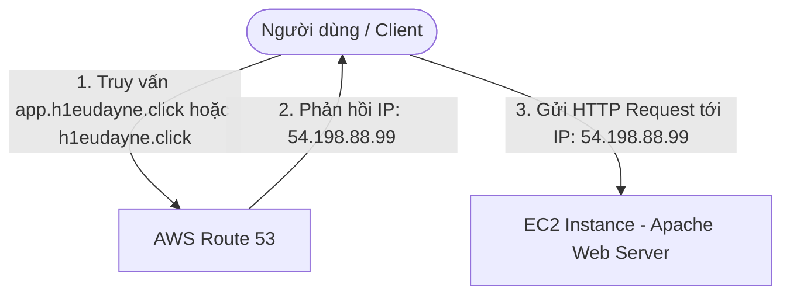

# 2. Lab 2 – Thực hành A-Record & Sử dụng root domain để trỏ tới một EC2 Instance

## I. Sơ đồ hoạt động (Architecture)
Sơ đồ mô tả luồng truy cập của Client tới máy chủ web EC2 thông qua tên miền phụ (subdomain) và tên miền gốc (root domain) sử dụng bản ghi loại A:

---

## II. Tổng quan bài Lab (Yêu cầu)
Trong bài thực hành này, chúng ta sẽ thực hiện cấu hình các bản ghi loại A (Address Record) để kết nối tên miền đã đăng ký trực tiếp tới một máy chủ ảo EC2:

1. **Khởi tạo Máy chủ Web (EC2 Setup):**
   * Khởi tạo một EC2 Instance chạy Linux.
   * Sử dụng User Data để tự động cài đặt và khởi chạy máy chủ web Apache (`httpd`) phục vụ một trang HTML chào mừng đơn giản.
2. **Cấu hình bản ghi A cho Subdomain:**
   * Tạo bản ghi loại **A-Record** trỏ một tên miền phụ (ví dụ: `app.h1eudayne.click`) về địa chỉ Public IP tĩnh của EC2 Instance.
3. **Cấu hình bản ghi A cho Root Domain (Tên miền gốc):**
   * Cấu hình trỏ trực tiếp tên miền gốc (ví dụ: `h1eudayne.click` - không có tiền tố `www`) về địa chỉ IP của EC2.
   * Thảo luận về cách thiết lập khi sử dụng **A-Record truyền thống** (đối với IP tĩnh của EC2) hoặc sử dụng tính năng **ALIAS Record** (đối với Elastic Load Balancer - ELB).
4. **Kiểm thử hệ thống:**
   * Sử dụng các công cụ phân giải DNS như `nslookup` hoặc `dig` trên máy cá nhân để xác minh DNS trỏ đúng IP.
   * Truy cập thử bằng tên miền trên trình duyệt để hiển thị giao diện web.

---

## III. Hướng dẫn chi tiết
Vui lòng xem các bước triển khai chi tiết từng bước tại:
 **[Hướng dẫn thực hành chi tiết (README.md)](README.md)**

---

* **Bài trước**: [1. Lab 1 – Đăng ký tên miền (Register Domain)](../1.%20Lab%201%20-%20Register%20Domain/1.%20Lab%201%20-%20Register%20Domain.md)
* **Bài tiếp theo**: [3. Lab 3 – Thực hành CNAME Record](../3.%20Lab%203%20-%20CNAME%20Record/3.%20Lab%203%20-%20CNAME%20Record.md)
