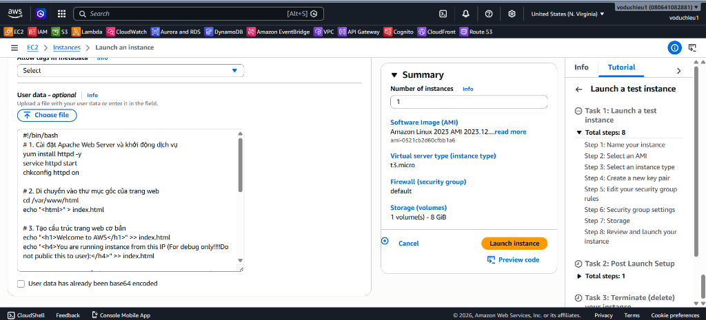
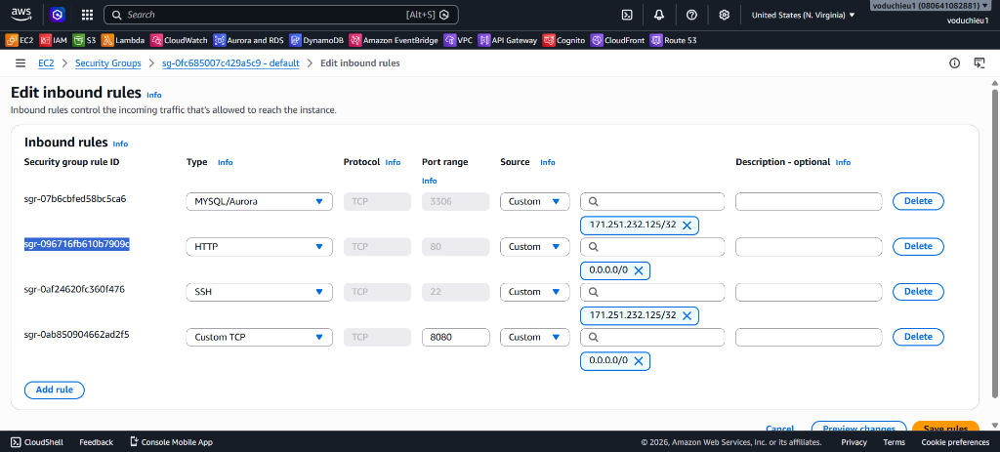
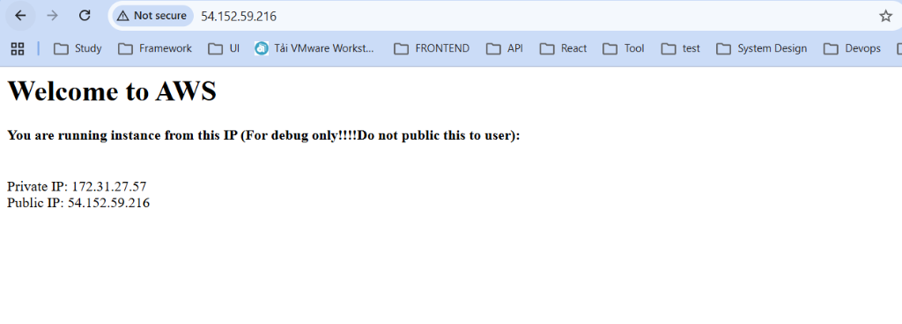
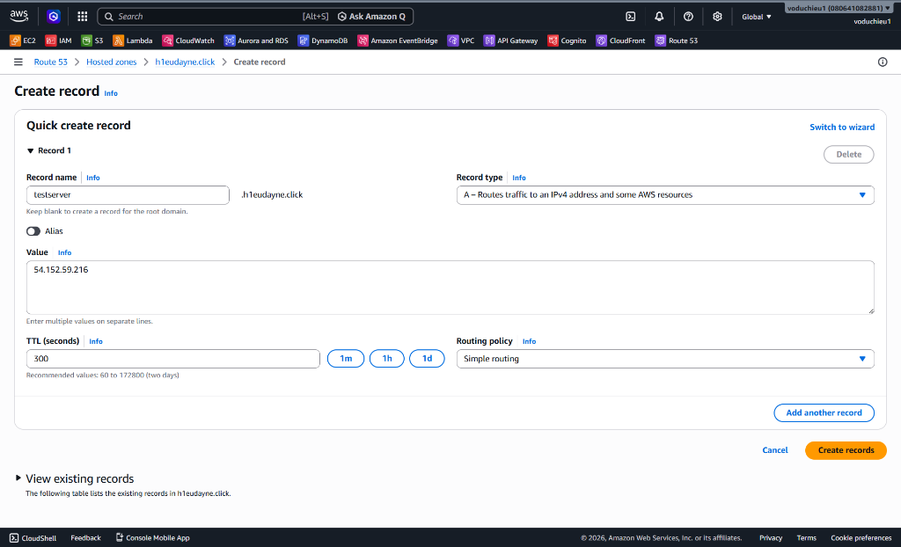
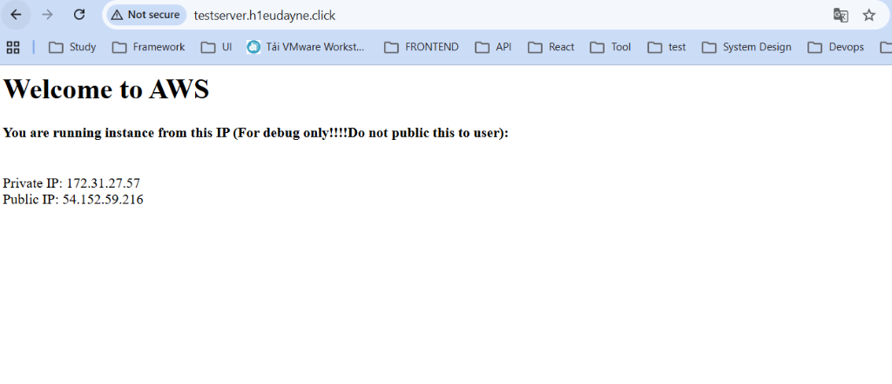

# Lab 2 - Thực hành A-Record & Sử dụng root domain để trỏ tới một EC2 Instance - Hướng dẫn chi tiết

 **[Xem Đề bài / Yêu cầu bài Lab](2.%20Lab%202%20-%20A-Record%20and%20Root%20Domain%20to%20EC2.md)**

---

## Các bước thực hiện chi tiết

### Bước 1: Khởi tạo máy chủ Web EC2 và cấu hình User Data
1. Truy cập dịch vụ **Amazon EC2** trên AWS Console > Click chọn **Launch instance**.
2. Thiết lập thông số cơ bản cho instance:
   * **Name:** Nhập `web-server-lab2`.
   * **OS:** Chọn **Amazon Linux 2023** (hoặc Amazon Linux 2).
   * **Instance type:** Chọn **t3.micro** (hoặc `t2.micro` tùy thuộc vào Free Tier ở khu vực của bạn).
   * **Key pair:** Chọn key pair có sẵn của bạn để SSH (nếu cần).
3. Cấu hình **User Data**:
   * Cuộn xuống phần **Advanced details**, tại mục **User data**, dán nội dung từ tệp script có sẵn của bài học EC2:
     👉 **[lab3-user-data-meta-data.sh](../../1.%20EC2/3.%20Amazon%20EC2%20User%20Data%20and%20Metadata%20Lab/lab3-user-data-meta-data.sh)**
   * Nội dung script này sẽ tự động cài đặt máy chủ web Apache (`httpd`), tạo trang web mẫu, đồng thời truy xuất Private IP và Public IP từ IMDSv2 để hiển thị lên màn hình.

   
   *Hình 1: Cấu hình dán đoạn mã User Data trong quá trình khởi tạo EC2 Instance.*

4. Cấu hình **Security Group (Mở port 80)**:
   * Chắc chắn rằng Security Group của bạn có quy tắc cho phép traffic **HTTP (Port 80)** từ nguồn bất kỳ (`0.0.0.0/0`) để có thể truy cập được trang web từ bên ngoài Internet.

   
   *Hình 2: Cấu hình Inbound Rules của Security Group cho phép truy cập cổng 80 (HTTP) từ bất cứ đâu.*

5. Click chọn **Launch instance** và đợi trạng thái của instance chuyển sang *Running*.
6. Chọn instance mới tạo để xem chi tiết và lưu lại địa chỉ **Public IPv4 address** (trong ví dụ thực tế này là: `54.152.59.216`).

---

### Bước 2: Kiểm tra truy cập máy chủ Web bằng Public IP
Trước khi cấu hình DNS trên Route 53, hãy kiểm tra xem máy chủ Web đã hoạt động bình thường chưa:
1. Mở trình duyệt web của bạn.
2. Nhập địa chỉ Public IP: `http://54.152.59.216`.
3. Trang web hiển thị thành công dòng thông tin chào mừng kèm theo thông tin địa chỉ IP nội bộ và công cộng được lấy tự động qua Metadata Service.


*Hình 3: Kết quả truy cập trang web thông qua địa chỉ Public IP tĩnh của EC2.*

---

### Bước 3: Tạo bản ghi loại A-Record trỏ subdomain về Public IP
1. Truy cập dịch vụ **Route 53** > Click chọn **Hosted zones** > Chọn tên miền của bạn (ở đây là: `h1eudayne.click`).
2. Nhấp chọn nút **Create record** ở góc trên bên phải.
3. Cấu hình bản ghi DNS như sau:
   * **Record name:** Nhập `testserver` (để tạo tên miền phụ `testserver.h1eudayne.click`).
   * **Record type:** Chọn **A – Routes traffic to an IPv4 address and some AWS resources**.
   * **Alias:** Để tắt (**No**).
   * **Value:** Dán địa chỉ Public IP của EC2 vừa lấy được ở trên (`54.152.59.216`).
   * **TTL (seconds):** Giữ mặc định `300` (5 phút).
   * **Routing policy:** Chọn **Simple routing**.


*Hình 4: Thiết lập tạo bản ghi loại A-Record cho tên miền phụ testserver trỏ về Public IP của EC2.*

4. Click chọn **Create records** và chờ hệ thống DNS cập nhật.

---

### Bước 4: Cấu hình trỏ Root Domain về EC2 Instance (Tùy chọn)
Để trỏ tên miền gốc (Root Domain / Apex Domain - ví dụ: `h1eudayne.click` không chứa tiền tố) về máy chủ EC2, ta có 2 phương án:

#### Phương án 1: Trỏ trực tiếp về IP tĩnh của EC2 (Tương tự subdomain)
1. Trong Hosted Zone, click chọn **Create record**.
2. Điền cấu hình bản ghi:
   * **Record name:** **Để trống** (để cấu hình trực tiếp cho tên miền gốc `h1eudayne.click`).
   * **Record type:** Chọn **A – Routes traffic to an IPv4 address...**
   * **Alias:** Để tắt (**No**).
   * **Value:** Dán địa chỉ Public IP của EC2 (`54.152.59.216`).
   * Click chọn **Create records**.

#### Phương án 2: Trỏ về Elastic Load Balancer (ELB) bằng bản ghi ALIAS (Môi trường Product)
Trong thực tế sản xuất, các máy chủ EC2 thường đứng sau một bộ cân bằng tải (ELB). ELB không sử dụng IP cố định mà sử dụng một DNS mặc định (dạng `my-load-balancer-123.amazonaws.com`).
Vì chuẩn DNS quốc tế không cho phép tạo bản ghi CNAME tại Root Domain, ta bắt buộc phải sử dụng bản ghi **ALIAS** (bí danh) của Route 53:
1. Nhấp chọn **Create record**.
2. **Record name:** **Để trống**.
3. **Record type:** Chọn **A – Routes traffic to an IPv4 address...**
4. **Alias:** Gạt nút sang bật (**Yes**).
5. **Route traffic to:**
   * Chọn *Alias to Application and Classic Load Balancer*.
   * Chọn *Region* tương ứng (ví dụ: *us-east-1*).
   * Chọn bộ cân bằng tải *Load Balancer* của bạn từ danh sách gợi ý.
6. Click chọn **Create records**. (Route 53 sẽ tự động phân giải DNS của ELB sang các địa chỉ IP tương ứng cho Client hoàn toàn miễn phí).

---

### Bước 5: Kiểm thử và Xác minh DNS

#### 1. Sử dụng công cụ dòng lệnh (nslookup/dig)
Mở PowerShell hoặc Command Prompt trên máy tính cá nhân của bạn và chạy lệnh sau để kiểm tra xem tên miền đã được phân giải đúng IP chưa:
```powershell
nslookup testserver.h1eudayne.click
```
**Kết quả phân giải thành công sẽ có dạng:**
```text
Server:  UnKnown
Address:  192.168.1.1

Non-authoritative answer:
Name:    testserver.h1eudayne.click
Address:  54.152.59.216
```
Địa chỉ IP trả về trùng khớp với Public IP của EC2 chứng tỏ bản ghi A-Record đã hoạt động chính xác.

#### 2. Kiểm thử trên Trình duyệt bằng Subdomain
1. Mở trình duyệt web.
2. Truy cập địa chỉ tên miền phụ đã tạo: `http://testserver.h1eudayne.click`.
3. Trang web hiển thị thành công với giao diện giống hệt như khi truy cập trực tiếp bằng IP.


*Hình 5: Trang web hiển thị thành công khi truy cập bằng tên miền phụ testserver.h1eudayne.click.*
