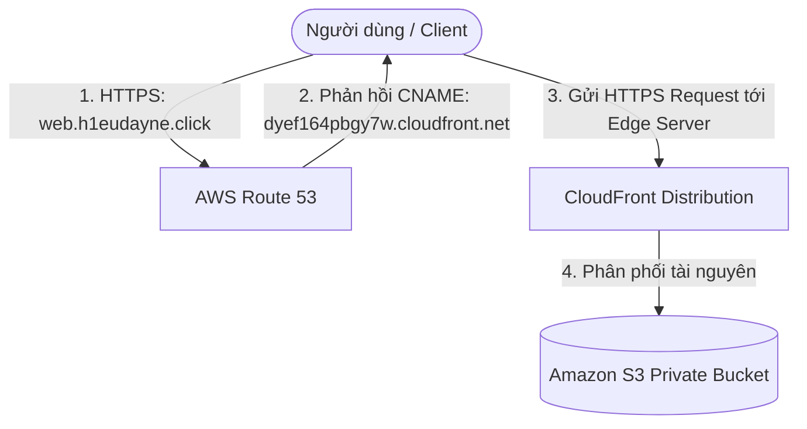

# 3. Lab 3 – Thực hành CNAME Record (Tích hợp CloudFront & ACM)

## I. Sơ đồ hoạt động (Architecture)
Sơ đồ định tuyến lưu lượng truy cập qua subdomain (CNAME) tới CloudFront distribution được mã hóa bảo mật SSL/TLS:

---

## II. Tổng quan bài Lab (Yêu cầu)
Trong bài thực hành này, chúng ta sẽ liên kết tên miền phụ với dịch vụ phân phối nội dung toàn cầu Amazon CloudFront thông qua bản ghi loại **CNAME** (Canonical Name), đồng thời tích hợp chứng chỉ bảo mật SSL/TLS:

1. **Chuẩn bị hạ tầng CloudFront & S3:**
   * Sử dụng CloudFront Distribution đã được cấu hình trỏ tới S3 Static Website từ bài lab CloudFront trước đó.
2. **Yêu cầu cấp Chứng chỉ SSL/TLS miễn phí (ACM Setup):**
   * Yêu cầu phát hành chứng chỉ bảo mật cho subdomain của bạn thông qua **AWS Certificate Manager (ACM)**.
3. **Tạo bản ghi CNAME cho Subdomain:**
   * Tạo bản ghi loại **CNAME** trỏ subdomain (ví dụ: `web.h1eudayne.click`) về tên miền mặc định của CloudFront (ví dụ: `dyef164pbgy7w.cloudfront.net`).
4. **Cấu hình Alternate Domain trong CloudFront:**
   * Khai báo subdomain và gán chứng chỉ SSL vừa được cấp bởi ACM vào cấu hình của CloudFront Distribution.
5. **Kiểm thử truy cập:**
   * Truy cập kiểm tra trang web tĩnh an toàn qua giao thức bảo mật HTTPS (`https://web.h1eudayne.click`).

---

## III. Lưu ý cực kỳ quan trọng cho bài Lab 3
> [!IMPORTANT]
> **1. Quy định về Region của ACM đối với CloudFront:**
> Khi sử dụng chứng chỉ SSL/TLS tùy chỉnh cho CloudFront Distribution, **bắt buộc** bạn phải yêu cầu cấp chứng chỉ này tại AWS Certificate Manager (ACM) thuộc Region **`us-east-1` (US East - N. Virginia)**. Nếu bạn tạo chứng chỉ ở bất kỳ Region nào khác (ví dụ: `ap-southeast-1` - Singapore), CloudFront sẽ **không thể** nhận diện và hiển thị chứng chỉ để bạn cấu hình.
>
> **2. Cơ chế xác thực quyền sở hữu tên miền (DNS Validation):**
> Để ACM cấp phát chứng chỉ SSL/TLS cho tên miền phụ của bạn, bạn phải chứng minh quyền sở hữu đối với tên miền đó. ACM sẽ tạo ra một bản ghi CNAME xác thực (ví dụ: `_x2.web.h1eudayne.click` trỏ tới `_y2.acm-validations.aws`). Bạn phải thêm bản ghi này vào Hosted Zone trên Route 53. Rất tiện lợi là ACM cung cấp nút bấm tự động tạo bản ghi này trên Route 53 chỉ bằng một cú click chuột.

---

## IV. Hướng dẫn chi tiết
Vui lòng xem các lưu ý đặc biệt và các bước triển khai chi tiết:
* 👉 **[Lưu ý quan trọng về CloudFront & ACM (Note - CloudFront and Certificate Manager.md)](Note%20-%20CloudFront%20and%20Certificate%20Manager.md)**
* **[Hướng dẫn thực hành chi tiết (README.md)](README.md)**

---

* **Bài trước**: [2. Lab 2 – Thực hành A-Record & Root Domain](../2.%20Lab%202%20-%20A-Record%20and%20Root%20Domain%20to%20EC2/2.%20Lab%202%20-%20A-Record%20and%20Root%20Domain%20to%20EC2.md)
* **Bài tiếp theo**: [4. Lab 4 – Route 53 Health Check & Failover](../4.%20Lab%204%20-%20Route%2053%20Health%20Check/4.%20Lab%204%20-%20Route%2053%20Health%20Check.md)
