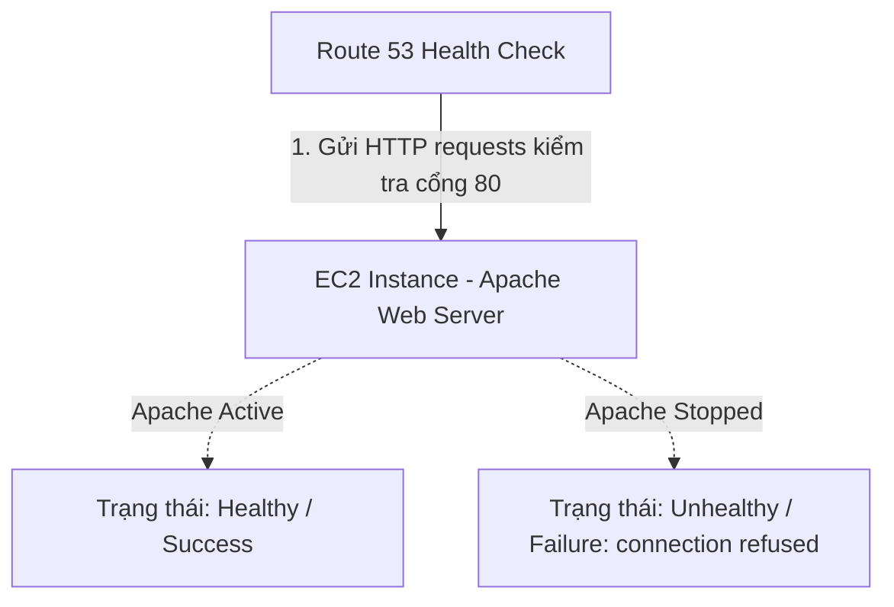

# 4. Lab 4 – Thực hành với Route 53 Health Check

## I. Sơ đồ hoạt động (Architecture)
Sơ đồ hoạt động mô tả cơ chế giám sát liên tục trạng thái sẵn sàng của máy chủ web từ dịch vụ Route 53 Health Check:

---

## II. Tổng quan bài Lab (Yêu cầu)
Trong bài thực hành này, chúng ta sẽ làm quen với việc giám sát sức khỏe của máy chủ sử dụng **Route 53 Health Check**:

1. **Sử dụng tài nguyên sẵn có:**
   * Sử dụng lại máy chủ EC2 Web Server đã tạo thành công từ **Lab 2**.
2. **Khởi tạo Route 53 Health Check:**
   * Tạo một bộ kiểm tra sức khỏe giám sát địa chỉ Public IP tĩnh của máy chủ EC2 trên giao thức HTTP cổng 80.
3. **Xác minh trạng thái bình thường (Healthy):**
   * Theo dõi và xác nhận các Endpoint kiểm tra từ Route 53 gửi request thành công (trả về trạng thái `Success: HTTP Status Code 200, OK`).
4. **Giả lập sự cố máy chủ:**
   * Truy cập terminal của EC2 Instance, dừng dịch vụ máy chủ web Apache (`httpd`).
5. **Xác minh trạng thái Unhealthy:**
   * Quan sát sự thay đổi trạng thái của Health Check trên Route 53 Console chuyển sang màu đỏ báo lỗi (`Failure: connection refused`).

---

## III. Hướng dẫn chi tiết
Vui lòng xem các bước triển khai chi tiết từng bước tại:
 **[Hướng dẫn thực hành chi tiết (README.md)](README.md)**

---

* **Bài trước**: [3. Lab 3 – Thực hành CNAME Record](../3.%20Lab%203%20-%20CNAME%20Record/3.%20Lab%203%20-%20CNAME%20Record.md)
* **Bài tiếp theo**: [5. Lab 5 – Thực hành với Private Hosted Zone](../5.%20Lab%205%20-%20Private%20Hosted%20Zone/5.%20Lab%205%20-%20Private%20Hosted%20Zone.md)
