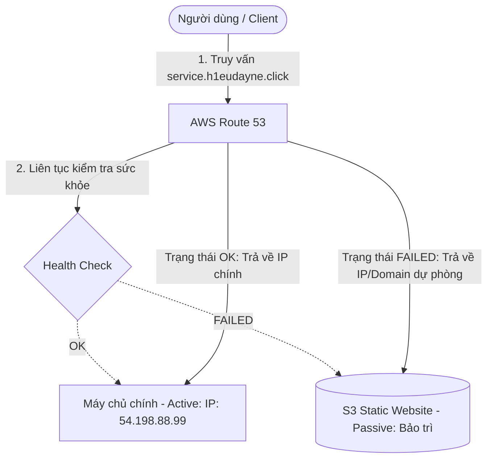

# 4. Lab 4 – Thực hành với Route 53 Health check & Failover Routing

## I. Sơ đồ hoạt động (Architecture)
Sơ đồ hoạt động của cơ chế tự động phát hiện sự cố và chuyển hướng dự phòng (Active-Passive):

---

## II. Tổng quan bài Lab (Yêu cầu)
Trong bài thực hành này, chúng ta sẽ xây dựng cơ chế phục hồi sau sự cố ở tầng DNS bằng cách sử dụng tính năng giám sát sức khỏe **Route 53 Health Check** và chính sách định tuyến **Failover**:

1. **Chuẩn bị Tài nguyên Chính & Dự phòng:**
   * **Tài nguyên chính (Primary):** Sử dụng máy chủ EC2 Web Server đã tạo từ Lab 2 (hoặc tạo mới) hiển thị nội dung hoạt động bình thường.
   * **Tài nguyên dự phòng (Secondary):** Sử dụng S3 Static Website Hosting (từ bài lab S3 trước) hiển thị một trang HTML thông báo bảo trì hệ thống ("System under maintenance").
2. **Khởi tạo Route 53 Health Check:**
   * Cấu hình một bộ kiểm tra sức khỏe để giám sát liên tục trạng thái sẵn sàng của EC2 Web Server chính qua giao thức HTTP (cổng 80).
3. **Cấu hình Bản ghi Failover Routing Policy:**
   * Tạo bản ghi chính (Primary) liên kết với Health Check đã cấu hình.
   * Tạo bản ghi phụ (Secondary) trỏ tới S3 Static Website dự phòng.
4. **Kiểm thử mô phỏng sự cố:**
   * Giả lập sự cố bằng cách tắt dịch vụ máy chủ web Apache trên máy chủ chính.
   * Theo dõi trạng thái thay đổi của Health Check trong Route 53 Console.
   * Xác minh trình duyệt của Client tự động hiển thị trang thông báo bảo trì sau khi máy chủ chính offline.

---

## III. Hướng dẫn chi tiết
Vui lòng xem các bước triển khai chi tiết từng bước tại:
 **[Hướng dẫn thực hành chi tiết (README.md)](README.md)**

---

* **Bài trước**: [3. Lab 3 – Thực hành CNAME Record](../3.%20Lab%203%20-%20CNAME%20Record/3.%20Lab%203%20-%20CNAME%20Record.md)
* **Bài tiếp theo**: [5. Lab 5 – Thực hành với Private Hosted Zone](../5.%20Lab%205%20-%20Private%20Hosted%20Zone/5.%20Lab%205%20-%20Private%20Hosted%20Zone.md)
