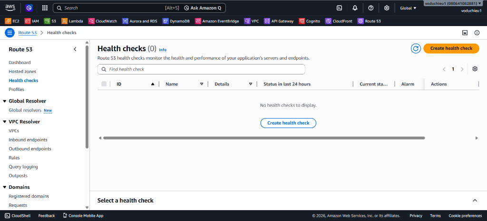
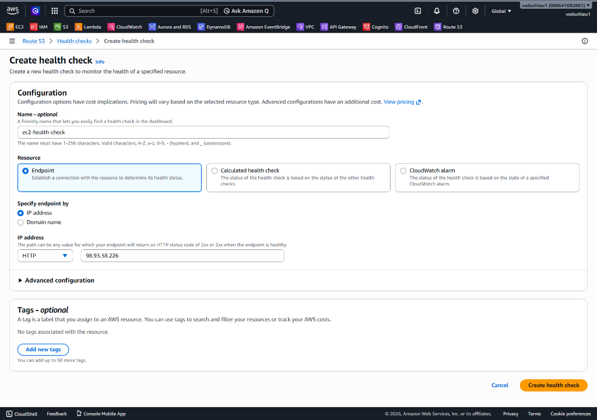
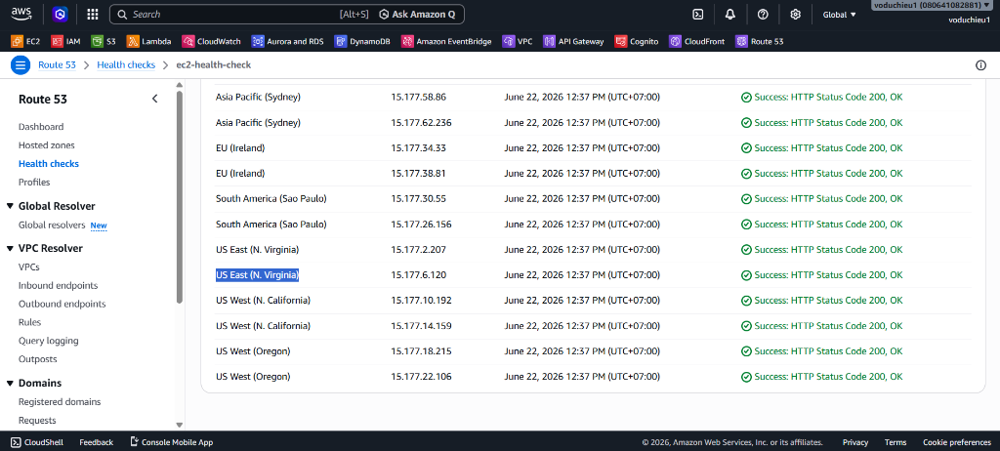
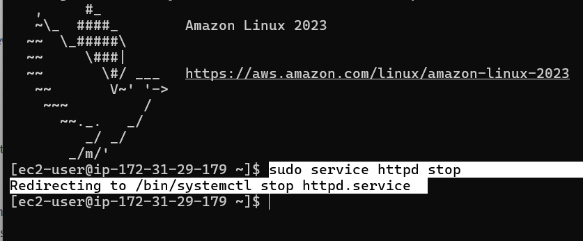
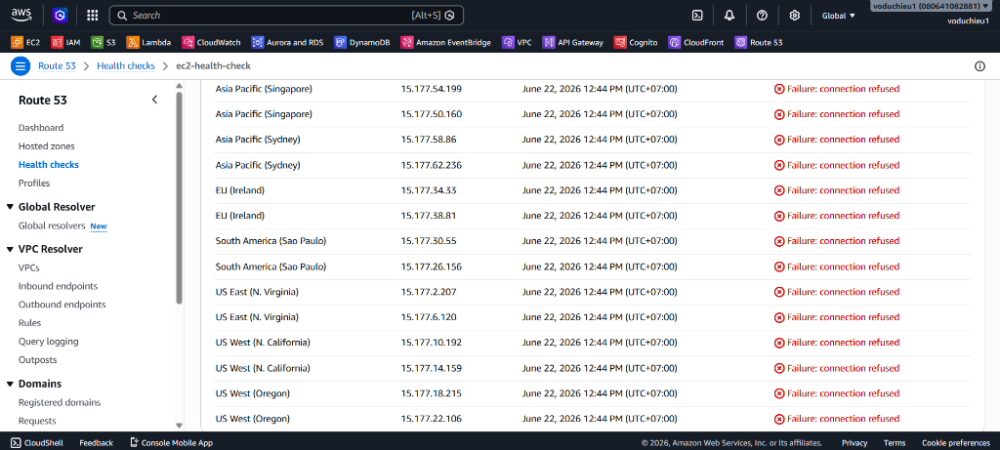

# Lab 4 - Thực hành Giám sát Sức khỏe Máy chủ (Route 53 Health Check) - Hướng dẫn chi tiết

 **[Xem Đề bài / Yêu cầu bài Lab](4.%20Lab%204%20-%20Route%2053%20Health%20Check.md)**

---

## Các bước thực hiện chi tiết

### Bước 1: Sử dụng lại máy chủ EC2 đã tạo ở Lab 2
1. Đảm bảo máy chủ EC2 từ **Lab 2** của bạn đang chạy bình thường.
2. Kiểm tra và ghi lại địa chỉ **Public IPv4 address** của máy chủ đó (trong ví dụ thực tế này là: `98.93.38.226`).
3. Đảm bảo cổng HTTP (80) đang mở trong Security Group và bạn có thể truy cập được trang web qua IP này.

---

### Bước 2: Khởi tạo Route 53 Health Check
1. Đăng nhập vào AWS Console và mở dịch vụ **Route 53**.
2. Tại menu điều hướng bên trái, nhấp chọn mục **Health checks** (Kiểm tra sức khỏe).


*Hình 1: Giao diện quản lý Health checks ban đầu (chưa có bộ kiểm tra sức khỏe nào).*

3. Click chọn nút **Create health check** ở góc trên bên phải.
4. Cấu hình thông tin kiểm tra sức khỏe máy chủ như sau:
   * **Name - optional:** Nhập `ec2-health-check`.
   * **What to monitor:** Chọn **Endpoint** (để theo dõi một máy chủ hoặc tài nguyên cụ thể).
   * **Specify endpoint by:** Chọn **IP address**.
   * **Protocol:** Chọn **HTTP** (kiểm tra cổng 80).
   * **IP address:** Nhập địa chỉ Public IP của EC2 ở Bước 1 (`98.93.38.226`).
   * **Port:** Nhập `80`.
   * **Path:** Nhập `/` (để kiểm tra đường dẫn gốc chứa trang `index.html`).


*Hình 2: Cấu hình chi tiết endpoint cho ec2-health-check trỏ về Public IP của máy chủ.*

5. Nhấp chọn **Next**.
6. Tại bước cấu hình Cảnh báo (Create alarm), tích chọn **No** ở mục *Create alarm* (để đơn giản hóa lab và tránh phát sinh chi phí CloudWatch/SNS).
7. Nhấp chọn **Create health check**.

---

### Bước 3: Kiểm tra trạng thái hoạt động ban đầu (Healthy)
1. Sau khi tạo xong, trạng thái ban đầu của Health check sẽ hiển thị là *Unknown* trong khoảng 1 - 2 phút.
2. Route 53 sẽ gửi các yêu cầu kiểm tra liên tục từ các máy chủ giám sát toàn cầu (checkers) tới IP máy chủ của bạn.
3. Click chọn vào tên Health check `ec2-health-check` vừa tạo, chọn tab **Monitoring** hoặc xem trực tiếp trạng thái:
   * **Kết quả:** Trạng thái chuyển sang màu xanh lá với cột tin nhắn **Success: HTTP Status Code 200, OK** từ tất cả các khu vực giám sát (Singapore, Sydney, Virginia, Oregon, v.v.).


*Hình 3: Các checker toàn cầu gửi yêu cầu thành công và ghi nhận trạng thái Healthy.*

---

### Bước 4: Giả lập sự cố - Stop dịch vụ máy chủ Web Apache
Để kiểm chứng khả năng giám sát của Route 53 khi hệ thống gặp lỗi:
1. Mở Terminal (PowerShell hoặc Git Bash) và kết nối SSH vào máy chủ EC2.
2. Chạy lệnh sau để tắt dịch vụ máy chủ web Apache (`httpd`):
   ```bash
   sudo service httpd stop
   ```
   *(Hệ thống Amazon Linux 2023 sẽ tự động chuyển hướng lệnh sang `systemctl stop httpd.service`)*.


*Hình 4: Chạy lệnh stop httpd trên terminal của EC2 để giả lập sự cố máy chủ offline.*

---

### Bước 5: Kiểm tra lại trạng thái Health Check (Unhealthy)
1. Quay lại trang Route 53 Console > mục **Health checks** > Chọn `ec2-health-check`.
2. Chờ khoảng 1 - 2 phút để Route 53 cập nhật trạng thái sau khi số lần thất bại (Failure threshold) đạt giới hạn mặc định (3 lần).
3. **Kết quả:** Trạng thái của Health check chuyển sang màu đỏ báo lỗi **Failure: connection refused** tại tất cả các khu vực. Hệ thống đã phát hiện chính xác sự cố máy chủ web bị sập.


*Hình 5: Route 53 ghi nhận sự cố kết nối bị từ chối và báo động Unhealthy.*

---

### Bước 6: Khôi phục dịch vụ (Tùy chọn)
1. Quay lại terminal EC2 và khởi động lại dịch vụ Apache:
   ```bash
   sudo service httpd start
   ```
2. Đợi 1 - 2 phút và kiểm tra lại Route 53 Console, trạng thái của `ec2-health-check` sẽ tự động chuyển sang màu xanh lá **Healthy** trở lại.
