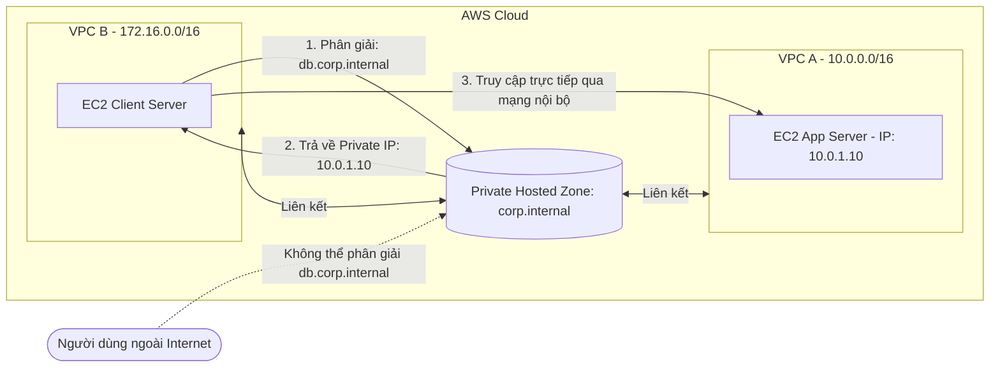

# 5. Lab 5 – Thực hành với Private Hosted Zone

## I. Sơ đồ mạng (Architecture)
Sơ đồ mạng mô tả cơ chế phân giải tên miền nội bộ (Private Hosted Zone) giữa các VPC độc lập:

---

## II. Tổng quan bài Lab (Yêu cầu)
Trong bài thực hành này, chúng ta sẽ thiết lập một vùng phân giải tên miền nội bộ **Private Hosted Zone** để cho phép các máy chủ trong mạng đám mây ảo VPC có thể liên lạc với nhau bằng tên miền riêng tư, an toàn và hoàn toàn độc lập với hệ thống DNS công cộng:

1. **Chuẩn bị môi trường mạng (VPC Setup):**
   * Khởi tạo hai VPC độc lập: **VPC-A** (dải CIDR `10.0.0.0/16`) và **VPC-B** (dải CIDR `172.16.0.0/16`).
   * Bật hai thuộc tính DNS quan trọng trên cả hai VPC: **`Enable DNS resolution`** và **`Enable DNS hostnames`**.
2. **Khởi tạo và Liên kết Private Hosted Zone:**
   * Tạo một Private Hosted Zone mới (ví dụ tên miền nội bộ: `corp.internal`).
   * Thực hiện liên kết (Associate) zone này với cả **VPC-A** và **VPC-B**.
3. **Khởi tạo Máy chủ & Bản ghi DNS:**
   * Khởi tạo một EC2 Instance đóng vai trò máy chủ ứng dụng nằm trong VPC-A và lấy Private IP của nó.
   * Tạo bản ghi loại **A-Record** trong Private Hosted Zone trỏ tên miền phụ nội bộ `db.corp.internal` về Private IP của EC2 trong VPC-A.
4. **Kiểm thử phân giải tên miền nội bộ:**
   * Khởi tạo một EC2 Instance đóng vai trò client nằm trong VPC-B.
   * Đăng nhập vào EC2 trong VPC-B, sử dụng lệnh `nslookup` để kiểm tra phân giải tên miền nội bộ `db.corp.internal` thành công.
   * Kiểm nghiệm từ máy tính cá nhân ngoài Internet để xác nhận không thể tra cứu hoặc phân giải được tên miền này.

---

## III. Hướng dẫn chi tiết
Vui lòng xem các bước triển khai chi tiết từng bước tại:
 **[Hướng dẫn thực hành chi tiết (README.md)](README.md)**

---

* **Bài trước**: [4. Lab 4 – Route 53 Health Check & Failover](../4.%20Lab%204%20-%20Route%2053%20Health%20Check/4.%20Lab%204%20-%20Route%2053%20Health%20Check.md)
* **Bài tiếp theo**: Không có
