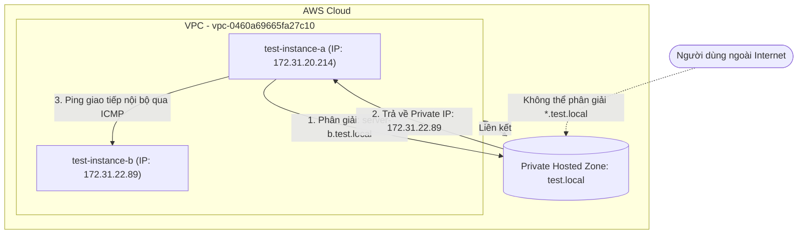

# 5. Lab 5 – Thực hành với Private Hosted Zone

## I. Sơ đồ mạng (Architecture)
Sơ đồ mạng mô tả cơ chế phân giải tên miền nội bộ (Private Hosted Zone) trong cùng một VPC:

---

## II. Tổng quan bài Lab (Yêu cầu)
Trong bài thực hành này, chúng ta sẽ thiết lập một vùng phân giải tên miền nội bộ **Private Hosted Zone** để cho phép các máy chủ trong mạng đám mây ảo VPC có thể liên lạc với nhau bằng tên miền riêng tư, an toàn và hoàn toàn độc lập với hệ thống DNS công cộng:

1. **Chuẩn bị 2 EC2 Instance (A/B):**
   * Khởi tạo 2 EC2 Instance `test-instance-a` và `test-instance-b` trong cùng một VPC.
   * Đảm bảo đã kích hoạt Public IP cho cả 2 máy chủ và bật thuộc tính DNS quan trọng trên VPC: **`Enable DNS resolution`** và **`Enable DNS hostnames`**.
2. **Khởi tạo và Liên kết Private Hosted Zone:**
   * Tạo một Private Hosted Zone mới với tên miền nội bộ: `test.local`.
   * Thực hiện liên kết (Associate) zone này với VPC hiện tại.
3. **Tạo bản ghi DNS A-Record nội bộ:**
   * Tạo bản ghi loại **A-Record** trong Private Hosted Zone trỏ `server-a.test.local` về Private IP của `test-instance-a` (`172.31.20.214`).
   * Tạo bản ghi loại **A-Record** trỏ `server-b.test.local` về Private IP của `test-instance-b` (`172.31.22.89`).
4. **Cấu hình Security Group (SG):**
   * Cấu hình Inbound Rules cho Security Group: Cho phép **`All ICMP - IPv4`** với nguồn (Source) là chính Security Group ID của nó để cho phép các máy chủ ping lẫn nhau nội bộ.
5. **Kiểm thử phân giải tên miền và kết nối nội bộ:**
   * SSH vào máy chủ `test-instance-a`.
   * Sử dụng lệnh `ping` đến `server-b.test.local` để xác thực hệ thống tự động phân giải ra Private IP của Server B và kết nối ping thành công.

---

## III. Hướng dẫn chi tiết
Vui lòng xem các bước triển khai chi tiết từng bước tại:
 **[Hướng dẫn thực hành chi tiết (README.md)](README.md)**

---

* **Bài trước**: [4. Lab 4 – Route 53 Health Check & Failover](../4.%20Lab%204%20-%20Route%2053%20Health%20Check/4.%20Lab%204%20-%20Route%2053%20Health%20Check.md)
* **Bài tiếp theo**: Không có
