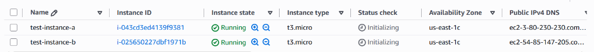
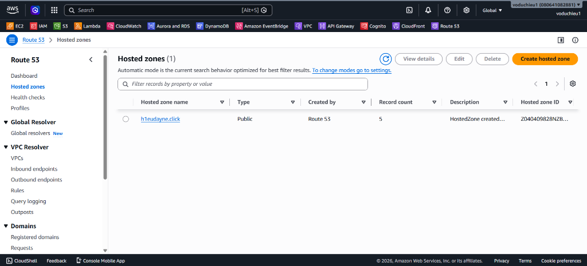
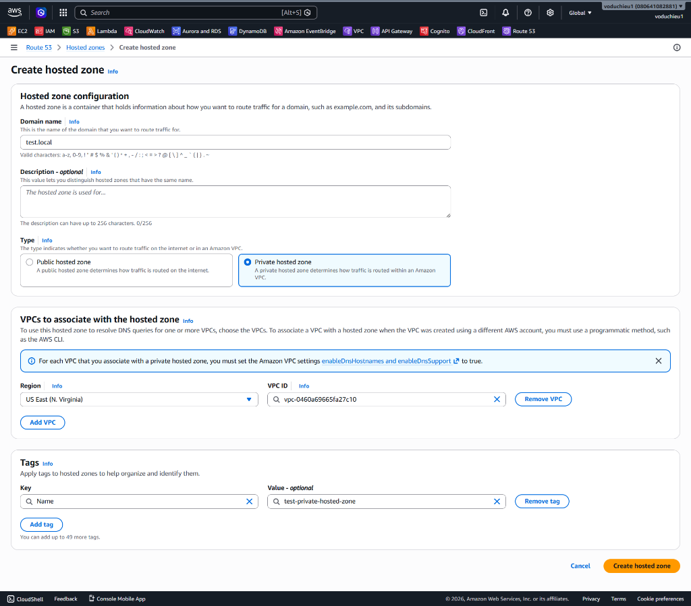
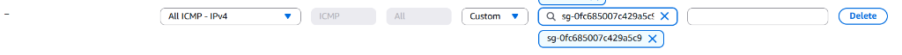

# Lab 5 - Thực hành với Private Hosted Zone - Hướng dẫn chi tiết

  **[Xem Đề bài / Yêu cầu bài Lab](5.%20Lab%205%20-%20Private%20Hosted%20Zone.md)**

---

## Các bước thực hiện chi tiết

### Bước 1: Khởi tạo hai EC2 Instance (A & B) và bật tính năng DNS trên VPC
Để thực hành phân giải tên miền nội bộ, trước hết chúng ta cần tạo 2 máy chủ EC2 cùng nằm trong một mạng ảo VPC:
1. Mở dịch vụ **EC2** trên AWS Console > Click chọn **Launch instances**.
2. Khởi tạo 2 máy chủ ảo với các thông số sau:
   * **Instance A**: Đặt tên là `test-instance-a` (ví dụ sử dụng Instance Type `t3.micro`).
   * **Instance B**: Đặt tên là `test-instance-b` (ví dụ sử dụng Instance Type `t3.micro`).
   * **Network Settings**: Đảm bảo chọn cùng một mạng ảo **VPC** (ví dụ: `vpc-0460a69665fa27c10`) và **bắt buộc chọn Enable** tại mục **Auto-assign public IP** để chúng ta có thể SSH từ máy cá nhân vào cấu hình.
3. Sau khi khởi tạo thành công, ghi nhận lại địa chỉ **Private IP** của cả hai Server:
   * **Server A (test-instance-a)**: `172.31.20.214`
   * **Server B (test-instance-b)**: `172.31.22.89`



4. **Kích hoạt tính năng DNS cho mạng VPC (Nếu chưa bật):**
   * Truy cập dịch vụ **VPC** trên AWS Console.
   * Chọn VPC đang sử dụng (`vpc-0460a69665fa27c10`) > Click **Actions** > Chọn **Edit VPC settings**.
   * Đảm bảo hai ô cấu hình sau đã được tích chọn:
     * **Enable DNS resolution** (Cho phép phân giải DNS).
     * **Enable DNS hostnames** (Cấp phát DNS hostname).
   * Click **Save** để lưu lại thiết lập.

---

### Bước 2: Tạo Private Hosted Zone liên kết với VPC
Chúng ta sẽ tạo một vùng phân giải tên miền riêng tư và gán nó vào VPC chứa các máy chủ trên:
1. Truy cập dịch vụ **Route 53** > Chọn **Hosted zones** trong menu bên trái. Lúc này, trên hệ thống chỉ có sẵn bản ghi Public Hosted Zone ban đầu (ví dụ: `h1eudayne.click`).



2. Click chọn nút **Create hosted zone** ở góc trên bên phải.
3. Thiết lập cấu hình zone nội bộ như sau:
   * **Domain name**: Nhập tên miền riêng tư muốn dùng, ví dụ: `test.local`.
   * **Type**: Chọn **Private hosted zone** (Vùng lưu trữ bản ghi nội bộ).
   * **VPCs to associate with the hosted zone**:
     * **Region**: Chọn đúng Region chứa các EC2 của bạn (ví dụ: *US East (N. Virginia) / us-east-1*).
     * **VPC ID**: Chọn VPC ID tương ứng (`vpc-0460a69665fa27c10`).
   * **Tags**: Đặt tag Name là `test-private-hosted-zone` để dễ quản lý.



4. Click chọn nút **Create hosted zone** ở cuối trang để hoàn tất khởi tạo.

---

### Bước 3: Tạo bản ghi A-Record trỏ tới các Server tương ứng
Bây giờ, chúng ta sẽ định nghĩa các tên miền nội bộ tương ứng với Private IP của Server A và Server B:
1. Nhấp chọn Hosted Zone `test.local` vừa tạo.
2. Click chọn nút **Create record**.
3. Cấu hình bản ghi đầu tiên dành cho **Server A**:
   * **Record name**: Nhập `server-a` (tên miền đầy đủ sẽ là `server-a.test.local`).
   * **Record type**: Chọn **A – Routes traffic to an IPv4 address and some AWS resources**.
   * **Value**: Nhập địa chỉ Private IP của Server A (`172.31.20.214`).
   * **TTL (seconds)**: Nhập `300` (5 phút).
   * **Routing policy**: Chọn `Simple routing`.
   * Click **Create records**.
4. Tiếp tục click chọn **Create record** để cấu hình bản ghi cho **Server B**:
   * **Record name**: Nhập `server-b` (tên miền đầy đủ sẽ là `server-b.test.local`).
   * **Record type**: Chọn **A – Routes traffic to an IPv4 address...**
   * **Value**: Nhập địa chỉ Private IP của Server B (`172.31.22.89`).
   * **TTL (seconds)**: Nhập `300`.
   * **Routing policy**: Chọn `Simple routing`.
   * Click **Create records**.

Sau khi hoàn tất, danh sách bản ghi DNS nội bộ sẽ hiển thị như sau:


---

### Bước 4: Cấu hình Security Group cho phép ping nội bộ
Để Server A và Server B có thể giao tiếp qua lệnh `ping` (sử dụng giao thức ICMP), ta cần cấu hình Inbound Rules cho Security Group (SG) của chúng:
1. Truy cập dịch vụ **EC2** > Tìm đến mục **Security Groups** ở menu bên trái.
2. Nhấp chọn Security Group đang được gán cho 2 máy chủ trên (ví dụ: `sg-0fc685007c429a5c9`).
3. Chuyển sang tab **Inbound rules** và click chọn nút **Edit inbound rules**.
4. Thêm một quy tắc (Rule) mới:
   * **Type**: Chọn **All ICMP - IPv4**.
   * **Source**: Chọn **Custom** và dán chính **Security Group ID** đó (`sg-0fc685007c429a5c9`). Điều này cho phép bất kỳ máy chủ nào cùng sử dụng Security Group này đều có thể gửi tin nhắn ICMP (ping) tới nhau một cách an toàn.



5. Click chọn **Save rules** để áp dụng thay đổi.

---

### Bước 5: Đăng nhập vào Server A và ping tới Server B để kiểm nghiệm
1. Mở Terminal/PowerShell trên máy tính cá nhân của bạn.
2. SSH vào **Server A (test-instance-a)** bằng Public IP của nó (ví dụ: `3.80.230.230`):
   ```bash
   ssh -i "path/to/your-key.pem" ec2-user@3.80.230.230
   ```
3. Sau khi kết nối thành công vào Server A, thực hiện lệnh `ping` tới Server B bằng tên miền nội bộ:
   ```bash
   ping server-b.test.local
   ```
4. **Kết quả kỳ vọng**:
   * Tên miền `server-b.test.local` được phân giải thành công sang Private IP của Server B là `172.31.22.89`.
   * Các gói tin ICMP được gửi và nhận phản hồi bình thường (do ta đã mở quy tắc Inbound cho Security Group ở Bước 4):
   ```text
   PING server-b.test.local (172.31.22.89) 56(84) bytes of data.
   64 bytes from server-b.test.local (172.31.22.89): icmp_seq=1 ttl=64 time=0.482 ms
   64 bytes from server-b.test.local (172.31.22.89): icmp_seq=2 ttl=64 time=0.448 ms
   64 bytes from server-b.test.local (172.31.22.89): icmp_seq=3 ttl=64 time=0.435 ms
   ```

   > [!NOTE]
   > **Kiểm thử từ bên ngoài Internet:**
   > Nếu bạn chạy lệnh `nslookup server-b.test.local` hoặc `ping server-b.test.local` trực tiếp từ máy tính cá nhân ở nhà (ngoài Internet), hệ thống DNS công cộng sẽ báo lỗi không tìm thấy tên miền (`NXDOMAIN`). Điều này khẳng định tên miền `*.test.local` chỉ hoạt động bảo mật và được giải quyết bên trong hạ tầng mạng đám mây VPC đã khai báo.
