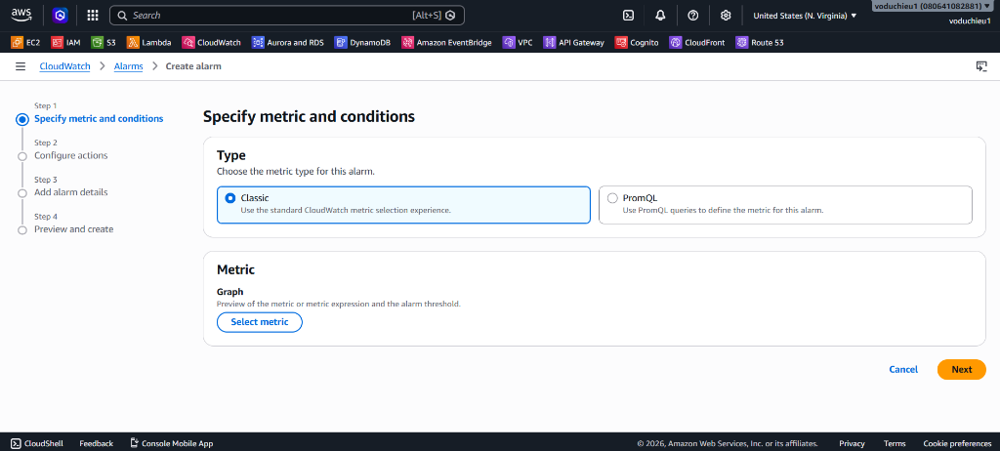
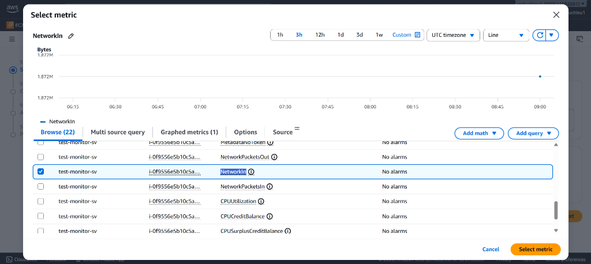
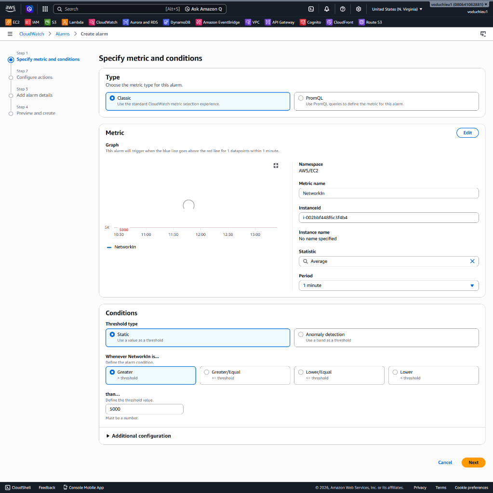
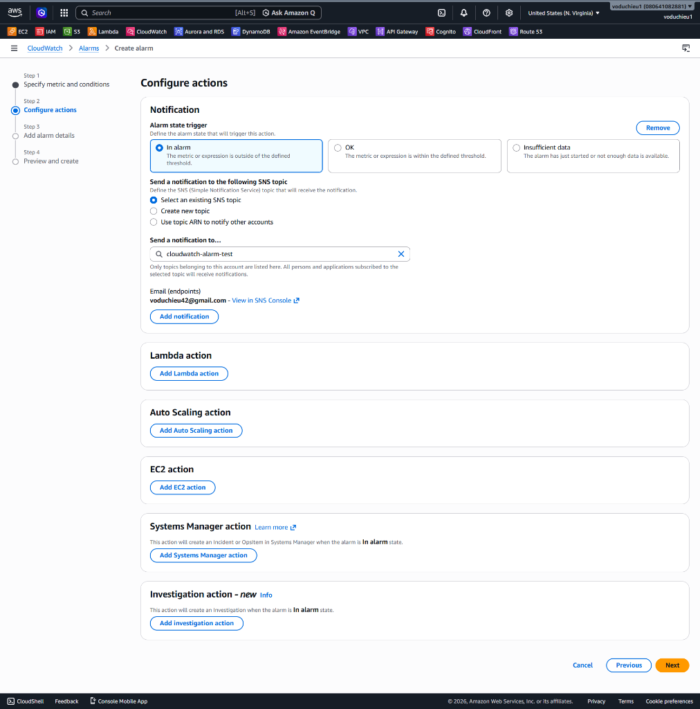
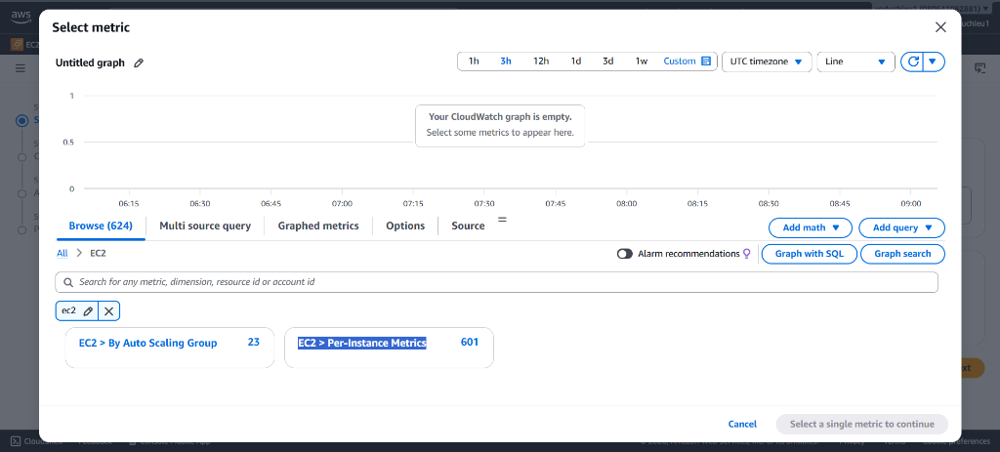

# Lab 1 - Thực hành với CloudWatch Alarm

## I. Yêu cầu bài Lab
Thiết lập giám sát và cảnh báo tự động cho máy chủ EC2 bao gồm:
1. Cảnh báo lưu lượng mạng đi vào (**NetworkIn**) vượt quá 2000 Bytes (hoặc 5000 Bytes) trong chu kỳ 1 phút.
2. Cảnh báo tỷ lệ sử dụng CPU (**CPUUtilization**) vượt quá 20% trong chu kỳ 1 phút.
3. Cấu hình gửi email thông báo tự động qua **Amazon SNS** và thực hành giả lập tải cao để nhận mail kiểm thử.

---

## II. Các bước thực hiện chi tiết

### Bước 1: Khởi tạo EC2 Instance, cài đặt Apache Web Server (httpd)
1. Truy cập EC2 Console > Click **Launch Instance**.
2. Cấu hình máy chủ:
   * **Name**: `test-monitor-sv`
   * **AMI**: Amazon Linux 2023.
   * **Instance Type**: `t2.micro` (hoặc `t3.micro`).
   * **Key pair**: Chọn key pair hiện có hoặc tạo mới.
   * **Security Group**: Bật tùy chọn **Allow HTTP traffic from the internet** và **Allow SSH traffic from anywhere**.
3. Tại phần **Advanced Details**, cuộn xuống dưới cùng và nhập đoạn script **User Data** sau để tự động cài đặt Apache:
   ```bash
   #!/bin/bash
   yum update -y
   yum install httpd -y
   systemctl start httpd
   systemctl enable httpd
   echo "<h1>Hello from AWS CloudWatch Lab!</h1>" > /var/www/html/index.html
   ```
4. Click **Launch instance**.
5. Sau khi instance ở trạng thái *Running*, copy **Public IPv4 address** của máy chủ, dán vào trình duyệt web để kiểm tra xem trang web "Hello from AWS..." hiển thị thành công.

---

### Bước 2: Khởi tạo Amazon SNS Topic để nhận thông báo
1. Truy cập dịch vụ **Simple Notification Service (SNS)** trên AWS Console.
2. Tại menu bên trái, chọn **Topics** > Click **Create topic**.
3. Chọn loại **Standard**:
   * **Name**: Nhập `network-alert-topic`.
   * Click **Create topic**.
4. Chọn topic vừa tạo, click **Create subscription**:
   * **Protocol**: Chọn **Email**.
   * **Endpoint**: Nhập địa chỉ email cá nhân của bạn để nhận cảnh báo.
   * Click **Create subscription**.
5. **Xác nhận liên kết Subscription**:
   * Mở hộp thư email của bạn. Tìm kiếm email gửi từ AWS có tiêu đề *AWS Notification - Subscription Confirmation*.
   * Click vào liên kết **Confirm subscription** bên trong email. Trạng thái subscription trên console sẽ chuyển từ *PendingConfirmation* sang *Confirmed*.

---

### Bước 3: Tạo CloudWatch Alarm giám sát chỉ số NetworkIn

1. Truy cập dịch vụ **CloudWatch** trên AWS Console.
2. Tại menu bên trái, chọn **Alarms** > **All alarms** > Click nút **Create alarm** ở góc phải màn hình.

<p align="center">
  
</p>

3. Tại màn hình tiếp theo, trong phần **Metric**, click chọn nút **Select metric**.

<p align="center">
  
</p>

4. Trên giao diện Select metric, trong danh mục **Browse**, click chọn **EC2** > Click tiếp vào mục **EC2 > Per-Instance Metrics**.

<p align="center">
  
</p>

5. Nhập **Instance ID** của máy chủ `test-monitor-sv` vào thanh tìm kiếm. Tìm dòng tương ứng với chỉ số **`NetworkIn`** > Tích chọn ô vuông tương ứng và click **Select metric**.

<p align="center">
  
</p>

6. Cấu hình các thông số đo lường (Metric & Conditions):
   * **Statistic**: Chọn **Average**.
   * **Period**: Chọn **1 minute** (để Alarm đánh giá nhanh chóng sau mỗi phút).
   * **Threshold type**: Chọn **Static**.
   * **Whenever NetworkIn is...**: Chọn **Greater** (lớn hơn).
   * **than... (Ngưỡng)**: Điền **`2000`** (hoặc **`5000`** như minh họa hình ảnh dưới đây) - đơn vị tính bằng Bytes.
   * Tại mục **Additional configuration**, thiết lập Datapoints to alarm là `1 out of 1`.
   * Click **Next**.

<p align="center">
  
</p>

7. Cấu hình hành động cảnh báo (Configure actions):
   * **Alarm state trigger**: Chọn **In alarm** (Kích hoạt khi ở trạng thái báo động).
   * **Send a notification to the following SNS topic**: Chọn **Select an existing SNS topic** và chọn `network-alert-topic` đã tạo ở Bước 2.
   * Click **Next**.

<p align="center">
  
</p>

8. Đặt tên Alarm:
   * **Alarm name**: Nhập `EC2-High-NetworkIn-Alert` (hoặc `monitor-test-server-network-in-over-5000`).
   * Click **Next** > Kiểm tra lại cấu hình > Click **Create alarm**.

---

### Bước 4: Tạo thêm 1 Alarm giám sát CPUUtilization

1. Trên giao diện CloudWatch Alarm, click **Create alarm**.
2. Click **Select metric** > Chọn **EC2** > Chọn **Per-Instance Metrics**.
3. Nhập Instance ID của máy chủ `test-monitor-sv`, tìm và tích chọn chỉ số **`CPUUtilization`** > Click **Select metric**.

<p align="center">
  
</p>

4. Cấu hình các thông số đo lường (Metric & Conditions):
   * **Statistic**: Chọn **Average**.
   * **Period**: Chọn **1 minute**.
   * **Threshold type**: Chọn **Static**.
   * **Whenever CPUUtilization is...**: Chọn **Greater** (lớn hơn).
   * **than... (Ngưỡng)**: Điền **`20`** (cảnh báo khi CPU vượt quá 20%).
   * Click **Next**.
5. Cấu hình Action:
   * Chọn gửi email đến SNS topic `network-alert-topic` (hoặc tạo topic mới tùy ý).
   * Click **Next**.
6. Đặt tên Alarm:
   * **Alarm name**: Nhập `test-server-cpu-higher-than-20-percent`.
   * Click **Next** > Xem lại cấu hình > Click **Create alarm**.

---

### Bước 5: Thực hiện Giả lập tải và kiểm thử cảnh báo

#### 1. Giả lập lưu lượng mạng cao (NetworkIn Alarm)
* **Cách thực hiện:** Bạn có thể F5 liên tục trang web `http://<Public-IP-cua-EC2>/`, chạy vòng lặp curl từ một máy khách khác, hoặc **sử dụng công cụ Postman**:
  * **Sử dụng Postman:** Tạo một request `GET` đến địa chỉ `http://<Public-IP-cua-EC2>/`. Sau đó mở tính năng **Postman Runner**, thiết lập số lần chạy (Iterations) lớn (ví dụ: 1000 - 5000 lần) và thời gian trễ (Delay) thấp (ví dụ: 10-50ms) rồi bấm chạy để Postman liên tục gửi request bắn tải mạng.
  * **Sử dụng curl loop trên terminal:**
    ```bash
    # Chạy vòng lặp gửi request liên tục
    while true; do curl -o /dev/null http://<Public-IP-cua-EC2>/; sleep 0.1; done
    ```
* **Kết quả:** Sau 1 phút, traffic mạng đi vào card mạng vượt ngưỡng 5000 Bytes, Alarm chuyển sang trạng thái đỏ **`In alarm`** và AWS SNS tự động gửi email cảnh báo về hộp thư của bạn:

<p align="center">
  
</p>

#### 2. Giả lập tải CPU cao (CPUUtilization Alarm)
* Chúng ta sử dụng công cụ `stress` để đẩy tải CPU của máy chủ lên cao vượt quá 20%.
* Các lệnh thực thi chi tiết được lưu trữ sẵn trong tệp tin: [lab1-stress-test-cpu.txt](lab1-stress-test-cpu.txt).
* **Các bước thực hiện:**
  1. SSH vào instance EC2 của bạn.
  2. Cài đặt công cụ stress test:
     ```bash
     sudo yum install stress -y
     ```
  3. Khởi chạy stress test tải CPU hoạt động ở mức cao (chạy 2 luồng CPU trong vòng 180 giây):
     ```bash
     sudo stress --cpu 2 --timeout 180
     ```
* **Kết quả:** CPU của máy chủ nhảy lên gần 100%, vượt ngưỡng cấu hình 20%. Sau 1 phút, Alarm `test-server-cpu-higher-than-20-percent` chuyển sang trạng thái **`In alarm`** và bạn nhận được email cảnh báo quá tải CPU:

<p align="center">
  
</p>

---

## III. Các lưu ý quan trọng cho CloudWatch Alarm

1. **Naming Rule (Quy tắc đặt tên Alarm):**
   * Tên Alarm cần dễ đọc, dễ hiểu, nhìn vào biết ngay là hệ thống nào, môi trường nào, tài nguyên (resource) nào và vấn đề gì đang xảy ra.
   * Tham khảo cấu trúc đặt tên: `<system-name>-<env>-<resource>-<alarm>`
   * *Ví dụ:* `ABCBank-dev-master_database-CPU-is-higher-80%-in-10-mins`
2. **Threshold (Thiết lập ngưỡng cảnh báo hợp lý):**
   * Ngưỡng cảnh báo phải được thiết lập dựa trên thực tế vận hành. Điều này phải được kiểm chứng thông qua quá trình chạy thử nghiệm hiệu năng (Performance Test) và tinh chỉnh tối ưu (Tuning). Rất khó để có thể thiết lập cấu hình chính xác và tối ưu ngay từ lần đầu tiên (“một phát ăn ngay”).
3. **Phân chia Notification Target (Đối tượng nhận thông báo):**
   * Phân chia thông báo đến đúng nhóm tài nguyên và người phụ trách phù hợp.
   * Nên tách mỗi nhóm tài nguyên hoặc mỗi mức độ ưu tiên lỗi thành một Amazon SNS Topic riêng (ví dụ: Database alarms gửi cho DBA team, Application alarms gửi cho Dev team).
4. **Xác nhận sớm với các bên (Early Alignment):**
   * Cần làm việc và xác nhận rõ ràng với khách hàng hoặc người thiết kế hệ thống về danh sách các thông số cần thu thập (collect) và các ngưỡng cần đặt cảnh báo (set alarm) từ các giai đoạn sớm của dự án để chuẩn bị hạ tầng IaC và kịch bản giám sát phù hợp.
5. **Evaluation Periods (Chu kỳ đánh giá):**
   * Nhằm tránh các cảnh báo ảo (Spike ngắn hạn), trong thực tế sản xuất bạn nên thiết lập cảnh báo kích hoạt khi vượt ngưỡng liên tục từ 2 đến 3 chu kỳ liên tiếp.
6. **Detailed Monitoring:**
   * Mặc định EC2 gửi metric mỗi 5 phút. Để có độ nhạy 1 phút cho bài Lab này, hãy bật tính năng **Detailed Monitoring** trên EC2 instance.
