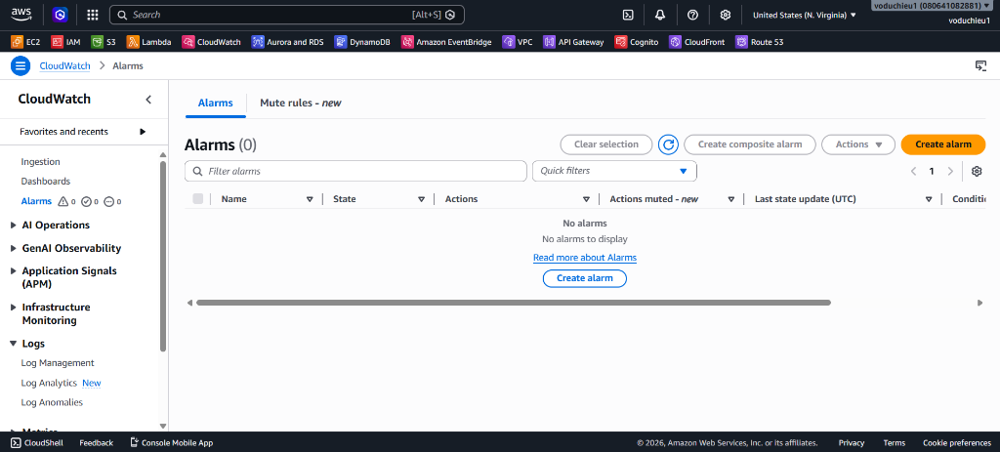
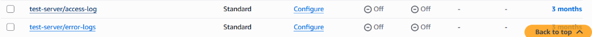
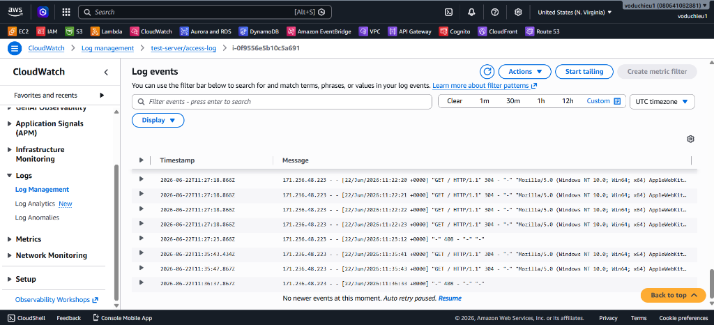
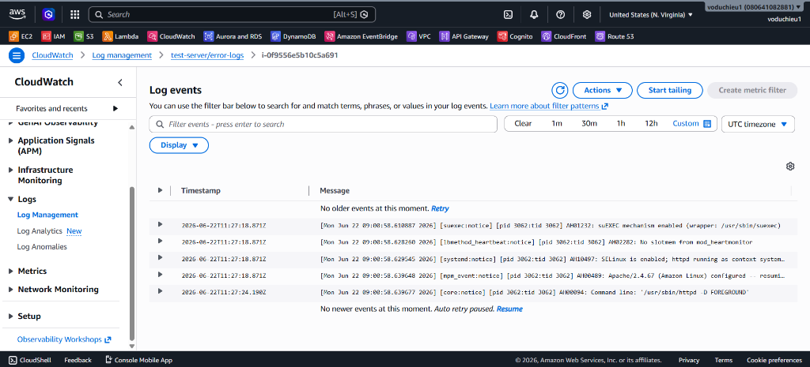
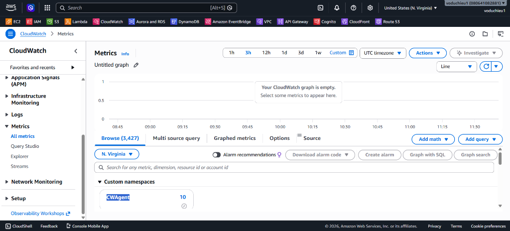
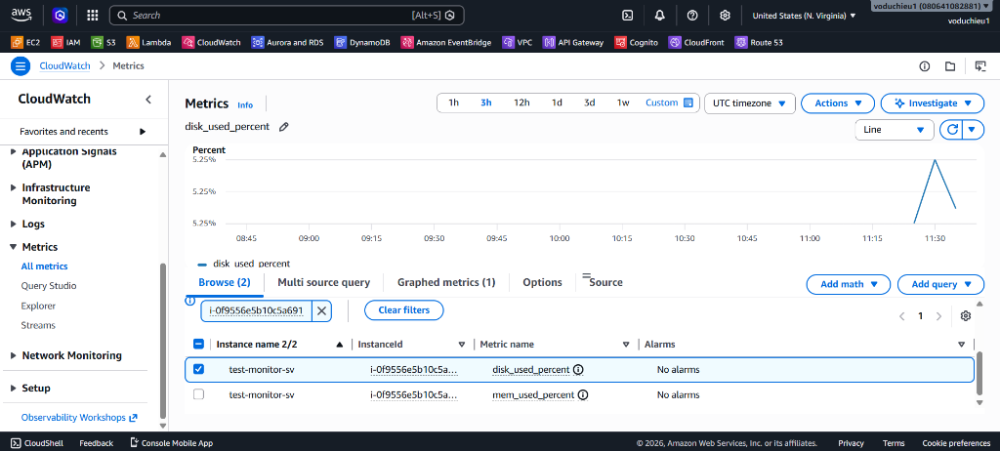

# Lab 2 - Cài đặt CloudWatch Agent để thu thập Logs & Custom Metrics

## I. Yêu cầu bài Lab
Mặc định, AWS không thể tự thu thập dung lượng Memory (RAM) sử dụng và dung lượng Disk còn trống của máy chủ EC2 do ranh giới bảo mật của hệ điều hành. Chúng ta cần cài đặt **CloudWatch Agent** bên trong máy chủ để thu thập các chỉ số này kèm theo tệp tin nhật ký truy cập và lỗi (Access Log & Error Log) của Apache Web Server.

---

## II. Các bước thực hiện chi tiết

### Bước 1: Tạo và gắn IAM Role cho EC2
Để CloudWatch Agent trên EC2 có quyền gửi metrics và logs về CloudWatch, chúng ta cần cấp quyền thông qua IAM Role.

1. Truy cập dịch vụ **IAM** > Chọn **Roles** > Click **Create role**.
2. Chọn Trusted entity type là **AWS service** và Common use case là **EC2** > Click **Next**.
3. Tại trang phân quyền, tìm kiếm và tích chọn chính sách quản lý của AWS (AWS Managed Policy):
   * **`CloudWatchAgentServerPolicy`**
   
   

4. Click **Next**. Đặt tên Role:
   * **Role name**: Nhập `EC2-CloudWatch-Agent-Role`.
   * Click **Create role**.
5. Gán Role vào EC2 Instance:
   * Vào **EC2 Console** > Nhấp chọn instance của bạn > **Actions** > **Security** > **Modify IAM role**.
   * Chọn `EC2-CloudWatch-Agent-Role` vừa tạo > Click **Update IAM role**.

---

### Bước 2: Cài đặt CloudWatch Agent trên EC2
1. SSH vào terminal của EC2.
2. Chạy lệnh cài đặt gói CloudWatch Agent từ repository (dành cho hệ điều hành Amazon Linux 2023):
   ```bash
   sudo dnf install amazon-cloudwatch-agent -y
   ```

---

### Bước 3: Cấu hình CloudWatch Agent thông qua Wizard
Chúng ta sẽ khởi chạy trình hướng dẫn cấu hình tương tác (wizard) để tạo tệp cấu hình cho agent:

```bash
sudo /opt/aws/amazon-cloudwatch-agent/bin/amazon-cloudwatch-agent-config-wizard
```

Hãy lựa chọn các thông số cấu hình như sau trong quá trình tương tác:

1. **On which OS are you planning to use the agent?**
   * Chọn: `1. linux` (mặc định)
2. **Are you using EC2 or On-Premises hosts?**
   * Chọn: `1. EC2` (mặc định)
3. **Which user are you planning to run the agent?**
   * Chọn: `2. root` (Để đảm bảo agent có đủ quyền đọc các log file trong thư mục hệ thống `/var/log`)
4. **Do you want to turn on StatsD daemon?**
   * Chọn: `1. yes` (mặc định)
5. **Which port do you want StatsD daemon to listen to?**
   * Chọn: `8125` (mặc định)
6. **What is the collect interval for StatsD daemon?**
   * Chọn: `2. 30s` (Thu thập metrics StatsD mỗi 30 giây)
7. **What is the aggregation interval for metrics collected by StatsD daemon?**
   * Chọn: `1. Do not aggregate`
8. **Do you want to monitor metrics from CollectD?**
   * Chọn: `2. no`
9. **Do you want to monitor any host metrics? e.g. CPU, memory, etc.**
   * Chọn: `1. yes` (mặc định)
10. **Do you want to monitor cpu metrics per core?**
    * Chọn: `1. yes` (mặc định)
11. **Do you want to add ec2 dimensions into all of your metrics if the info is available?**
    * Chọn: `1. yes` (mặc định)
12. **Do you want to aggregate ec2 dimensions (InstanceId)?**
    * Chọn: `1. yes` (mặc định)
13. **Would you like to collect your metrics at high resolution (sub-minute resolution)?**
    * Chọn: `3. 30s` (Độ phân giải 30 giây)
14. **Which default metrics config do you want?**
    * Chọn: `1. Basic` (Thu thập dung lượng ổ đĩa `% disk_used` và bộ nhớ RAM `% mem_used_percent`)
15. **Are you satisfied with the above config?**
    * Chọn: `1. yes` (mặc định)
16. **Do you have any existing CloudWatch Log Agent configuration file to import for migration?**
    * Chọn: `2. no` (mặc định)
17. **Do you want to monitor any log files?**
    * Chọn: `1. yes` (mặc định)
    * **Log file path**: Nhập `/var/log/httpd/access_log`
    * **Log group name**: Nhập `test-server/access-log`
    * **Log group class**: Chọn `1. STANDARD` (mặc định)
    * **Log stream name**: Chọn `{instance_id}` (mặc định)
    * **Log Group Retention in days**: Chọn `9. 90` (Lưu trữ logs trong vòng 90 ngày)
18. **Do you want to specify any additional log files to monitor?**
    * Chọn: `1. yes`
    * **Log file path**: Nhập `/var/log/httpd/error_log`
    * **Log group name**: Nhập `test-server/error_logs`
    * **Log group class**: Chọn `1. STANDARD` (mặc định)
    * **Log stream name**: Chọn `{instance_id}` (mặc định)
    * **Log Group Retention in days**: Chọn `9. 90` (Lưu trữ logs trong vòng 90 ngày)
19. **Do you want to specify any additional log files to monitor?**
    * Chọn: `2. no` (mặc định)
20. **Do you want the CloudWatch agent to also retrieve X-ray traces?**
    * Chọn: `2. no`
21. **Do you want to store the config in the SSM parameter store?**
    * Chọn: `2. no` (Lưu cục bộ tại máy chủ)

Trình wizard sẽ tự động tạo và lưu cấu hình tại đường dẫn: `/opt/aws/amazon-cloudwatch-agent/bin/config.json`.

> [!WARNING]
> Do ảnh hưởng mã hóa ký tự (encoding issue) trong terminal của trình wizard tương tác, tên của log group trong file JSON sinh ra có thể bị lỗi ký tự lạ (ví dụ: `t\ufffdest-s\ufffd\ufffderver/access-log`).
> Bạn cần biên tập lại file JSON để làm sạch các ký tự này.

Biên tập file cấu hình bằng `vi` hoặc `nano`:
```bash
sudo vi /opt/aws/amazon-cloudwatch-agent/bin/config.json
```

Thay thế nội dung bằng cấu hình JSON chuẩn đã được làm sạch dưới đây:
```json
{
  "agent": {
    "metrics_collection_interval": 30,
    "run_as_user": "root"
  },
  "logs": {
    "logs_collected": {
      "files": {
        "collect_list": [
          {
            "file_path": "/var/log/httpd/access_log",
            "log_group_class": "STANDARD",
            "log_group_name": "test-server/access-log",
            "log_stream_name": "{instance_id}",
            "retention_in_days": 90
          },
          {
            "file_path": "/var/log/httpd/error_log",
            "log_group_class": "STANDARD",
            "log_group_name": "test-server/error_logs",
            "log_stream_name": "{instance_id}",
            "retention_in_days": 90
          }
        ]
      }
    }
  },
  "metrics": {
    "aggregation_dimensions": [
      [
        "InstanceId"
      ]
    ],
    "append_dimensions": {
      "AutoScalingGroupName": "${aws:AutoScalingGroupName}",
      "ImageId": "${aws:ImageId}",
      "InstanceId": "${aws:InstanceId}",
      "InstanceType": "${aws:InstanceType}"
    },
    "metrics_collected": {
      "disk": {
        "measurement": [
          "used_percent"
        ],
        "metrics_collection_interval": 30,
        "resources": [
          "*"
        ]
      },
      "mem": {
        "measurement": [
          "mem_used_percent"
        ],
        "metrics_collection_interval": 30
      },
      "statsd": {
        "metrics_aggregation_interval": 0,
        "metrics_collection_interval": 30,
        "service_address": ":8125"
      }
    }
  }
}
```

---

### Bước 4: Khởi chạy CloudWatch Agent Service
1. Khởi chạy agent và áp dụng file cấu hình bằng lệnh nạp config:
   ```bash
   sudo /opt/aws/amazon-cloudwatch-agent/bin/amazon-cloudwatch-agent-ctl -a fetch-config -m ec2 -c file:/opt/aws/amazon-cloudwatch-agent/bin/config.json -s
   ```
2. Kiểm tra trạng thái hoạt động của agent để đảm bảo dịch vụ đang chạy bình thường (`active (running)`):
   ```bash
   sudo /opt/aws/amazon-cloudwatch-agent/bin/amazon-cloudwatch-agent-ctl -m ec2 -a status
   ```
   Hoặc kiểm tra qua systemd:
   ```bash
   sudo systemctl status amazon-cloudwatch-agent
   ```
   Nếu vì lý do nào đó dịch vụ chưa chạy, bạn có thể chạy lệnh để start:
   ```bash
   sudo /opt/aws/amazon-cloudwatch-agent/bin/amazon-cloudwatch-agent-ctl -m ec2 -a start
   ```

---

### Bước 5: Xác thực kết quả trên CloudWatch Console
1. **Gửi lưu lượng giả lập**:
   * Truy cập web server Apache vài lần hoặc dùng lệnh `curl` để sinh logs:
     ```bash
     curl http://localhost
     ```
2. **Kiểm tra Logs**:
   * Truy cập **CloudWatch Console** > Chọn **Log groups** trong menu bên trái. Bạn sẽ thấy hai Log Group mới là `test-server/access-log` và `test-server/error_logs` với thời gian lưu trữ (retention) là 90 ngày (3 tháng):
     
     
     
   * Nhấp chọn log stream (tương ứng với Instance ID của bạn) bên trong `test-server/access-log` để kiểm tra các dòng Apache Access Log đã được gửi lên CloudWatch thành công:
     
     
     
   * Tương tự, nhấp chọn log stream bên trong `test-server/error_logs` để kiểm tra các dòng Apache Error Log:
     
     

3. **Kiểm tra Custom Metrics**:
   * Chọn **Metrics** > **All metrics** trên CloudWatch Console. Tại tab *Browse*, bạn sẽ thấy một Custom Namespace mới xuất hiện tên là **`CWAgent`**:
     
     
     
   * Nhấp chọn Namespace **`CWAgent`** > Chọn tiếp các thuộc tính liên quan (ví dụ: `ImageId, InstanceId, InstanceType...`) để xem danh sách các Custom Metrics thu thập từ máy chủ. Bạn sẽ quan sát được các thông số custom của EC2: RAM (`mem_used_percent`) và ổ đĩa (`disk_used_percent`):
     
     
     
   * Từ các custom metrics này, bạn có thể thiết lập các CloudWatch Alarm để cảnh báo khi RAM/Disk của máy chủ EC2 vượt quá ngưỡng cho phép (tương tự như cách cấu hình CPU/Network ở Lab 1).


