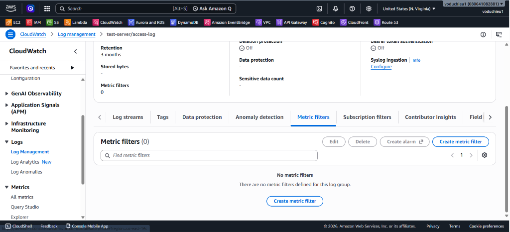
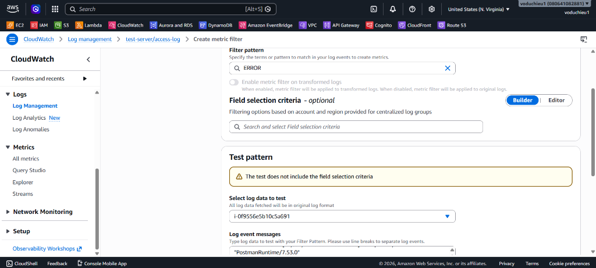
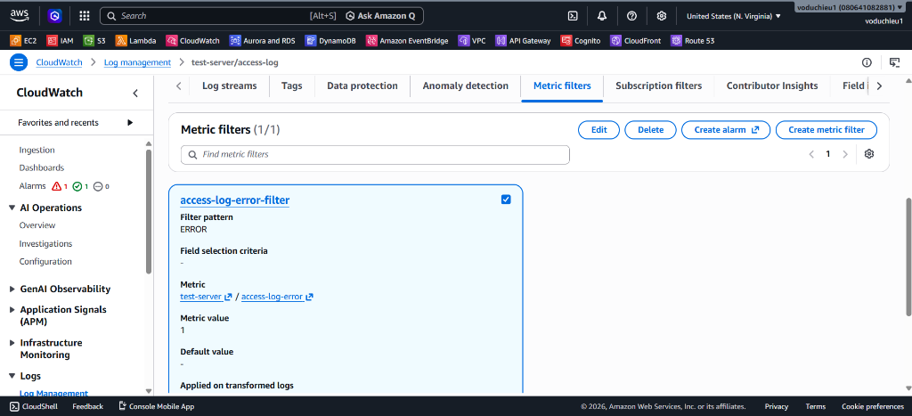
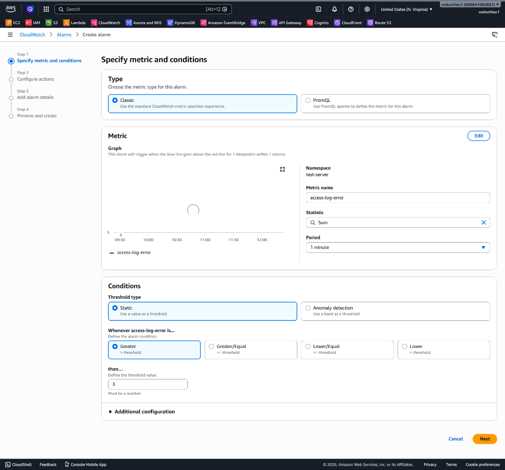
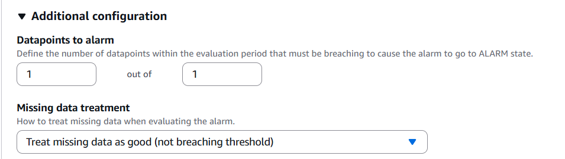
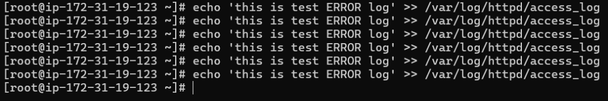
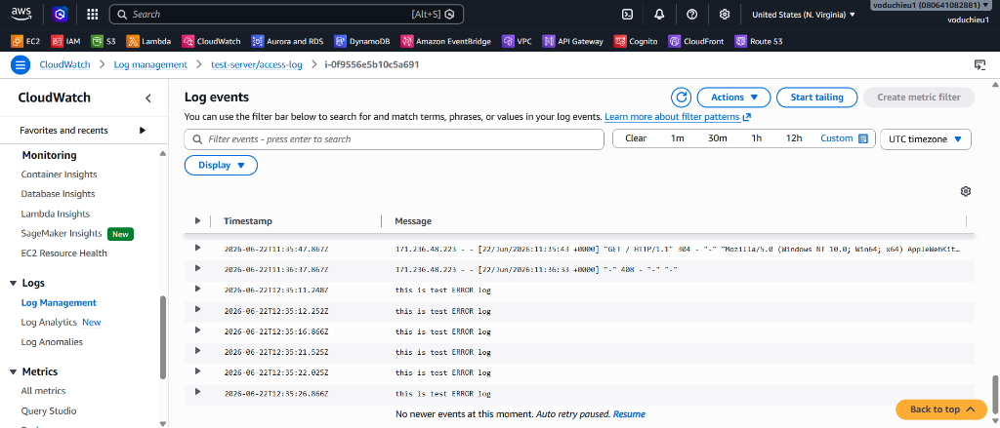
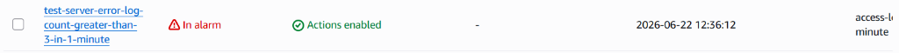
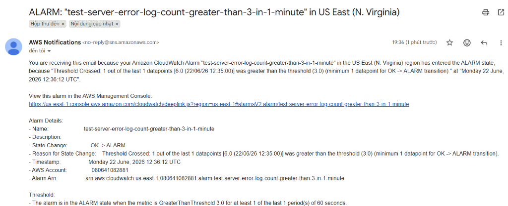

# Lab 3 - Sử dụng Log Metrics Filter & cài đặt Alarm cho Log message

## I. Yêu cầu bài Lab
Thiết lập bộ lọc từ khóa (**Metric Filter**) tự động quét qua các dòng nhật ký truy cập của Apache Web Server (`test-server/access-log`) nhằm tìm kiếm từ khóa báo lỗi `ERROR`. Đồng thời, cấu hình cảnh báo **CloudWatch Alarm** tự động gửi email thông báo khi lỗi này xuất hiện trên 1 lần trong vòng 1 phút. Cần cấu hình xử lý dữ liệu thiếu dạng **missing data as good** để đảm bảo Alarm hoạt động chính xác và không cảnh báo giả khi hệ thống bình thường.

---

## II. Các bước thực hiện chi tiết

### Bước 1: Tạo Log Metric Filter trên Log Group
1. Truy cập **CloudWatch Console** > Chọn **Log groups** trong menu bên trái > Chọn Log Group `test-server/access-log`.
2. Chuyển sang tab **Metric filters** > Quan sát danh sách trống ban đầu và nhấp chọn **Create metric filter**:

   

3. Cấu hình bộ lọc (Define pattern):
   * **Filter pattern**: Nhập **`ERROR`** (để quét tất cả các dòng log có chứa chữ ERROR).
   * Bạn có thể chọn Instance ID trong phần *Select log data to test* để chạy thử bộ lọc trên các dòng log hiện tại.
   
   

   * Click **Next**.
4. Thiết lập Metric details:
   * **Filter name**: Nhập `access-log-error-filter`.
   * **Metric namespace**: Nhập `test-server`.
   * **Metric name**: Nhập `access-log-error`.
   * **Metric value**: Nhập **`1`** (mỗi lần tìm thấy từ khóa ERROR, metric sẽ tăng thêm 1 đơn vị).
   * Click **Next** > Kiểm tra lại các thông số và click **Create metric filter**. Giao diện sẽ hiển thị filter vừa tạo thành công:

   

---

### Bước 2: Tạo Alarm dựa trên Custom Metric vừa Filter
1. Tại tab **Metric filters** của Log Group, tích chọn filter `access-log-error-filter` vừa tạo và chọn nút **Create alarm**.
2. Cấu hình Metric & Conditions cho Alarm:
   * **Namespace**: `test-server` (tự động nhận).
   * **Metric name**: `access-log-error` (tự động nhận).
   * **Statistic**: Chọn **Sum** (Tổng số lỗi xuất hiện).
   * **Period**: Chọn **1 minute** (Đánh giá mỗi 1 phút).
   * **Threshold type**: Chọn **Static** (Ngưỡng cố định).
   * **Whenever access-log-error is...**: Chọn **Greater** (Lớn hơn) và điền giá trị ngưỡng là **`1`** (Để phát cảnh báo khi số lần xuất hiện ERROR > 1 lần trong 1 phút. *Lưu ý: Trong hình ảnh demo minh họa dưới đây sử dụng giá trị ví dụ là 3*).

   

3. Cấu hình xử lý dữ liệu thiếu (Missing data treatment) - **RẤT QUAN TRỌNG**:
   * Click chọn phần **Additional configuration** ở phía cuối trang.
   * **Datapoints to alarm**: Thiết lập `1 out of 1` (để kích hoạt ngay lập tức khi phát hiện lỗi).
   * **Missing data treatment**: Chọn **Treat missing data as good (not breaching threshold)** (Xử lý dữ liệu thiếu là tốt).

   

   > [!IMPORTANT]
   > **Tại sao cần chọn "Treat missing data as good"?**
   > File log chỉ ghi nhận từ khóa `ERROR` khi có lỗi xảy ra. Ở trạng thái bình thường ổn định, hệ thống sẽ không có log lỗi nào được đẩy lên, dẫn đến việc không có dữ liệu metric (Missing data).
   > Nếu để mặc định (Treat missing data as missing/insufficient), Alarm sẽ chuyển sang trạng thái xám `INSUFFICIENT_DATA` hoặc phát cảnh báo giả. Việc cấu hình `Treat missing data as good` giúp Alarm giữ trạng thái màu xanh `OK` an toàn khi hệ thống chạy bình thường.

4. Click **Next** và cấu hình gửi thông báo:
   * **Alarm state trigger**: Chọn **In alarm**.
   * **Send a notification to the following SNS topic**: Chọn SNS topic đã tạo từ Lab 1 để nhận email cảnh báo.
   * Click **Next**.
5. Đặt tên Alarm:
   * **Alarm name**: Nhập `Apache-Access-Log-Error-Alarm`.
   * Click **Next** > Kiểm tra lại cấu hình và click **Create alarm**.

---

### Bước 3: Giả lập ghi log ERROR và kiểm chứng
1. SSH vào EC2 instance.
2. Ghi thủ công các dòng log chứa từ khóa `ERROR` vào file log của Apache để kiểm tra:
   ```bash
   echo 'this is test ERROR log' >> /var/log/httpd/access_log
   ```
   *(Thực hiện lệnh này lặp lại 6 lần trong vòng 1 phút để chắc chắn số lượng lỗi vượt quá ngưỡng cấu hình)*.
   
   
   
3. Chờ 1 phút để CloudWatch Agent thu thập log và đẩy lên CloudWatch.
4. Kiểm tra Logs trên CloudWatch Console: Truy cập Log Group `test-server/access-log` và chọn stream của bạn để xác nhận các dòng log `this is test ERROR log` đã được đồng bộ:

   

5. Kiểm tra Alarm: Tại giao diện CloudWatch Alarms, bạn sẽ thấy trạng thái Alarm của bạn (ở đây có tên là `test-server-error-log-count-greater-than-3-in-1-minute`) đã tự động chuyển sang màu đỏ **`In alarm`**:

   

6. Kiểm tra Email: Truy cập hộp thư đăng ký của bạn để xác nhận email cảnh báo tự động gửi về từ AWS SNS khi ngưỡng lỗi vượt quá giới hạn thiết lập:

   

7. Khi hệ thống ổn định và không phát sinh thêm bất kỳ log ERROR nào nữa, nhờ cấu hình xử lý dữ liệu thiếu **`Treat missing data as good`**, Alarm sẽ tự động chuyển trạng thái an toàn về lại màu xanh **`OK`** sau chu kỳ đánh giá tiếp theo.


