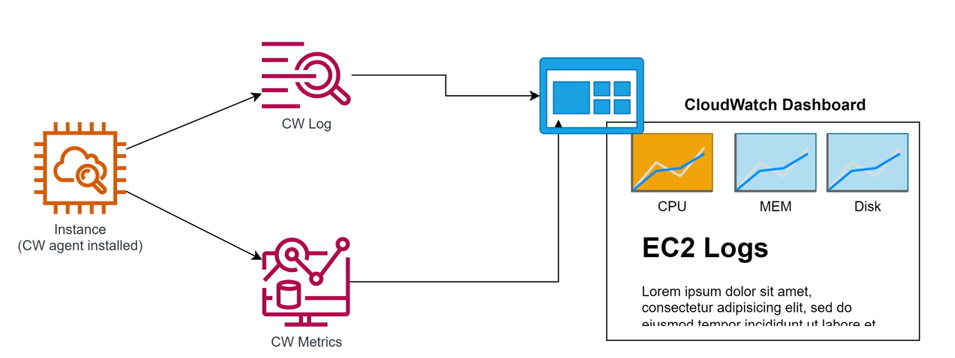
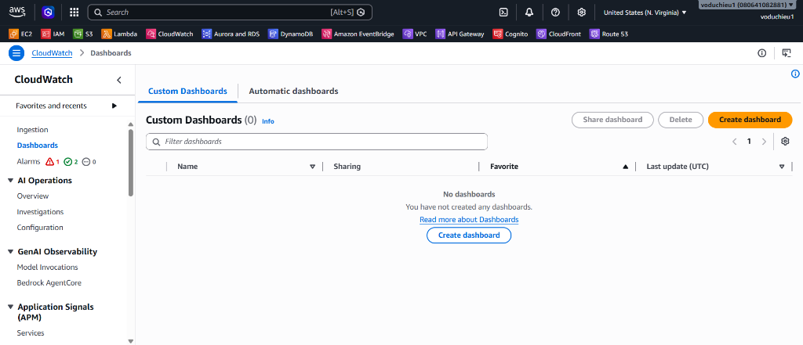
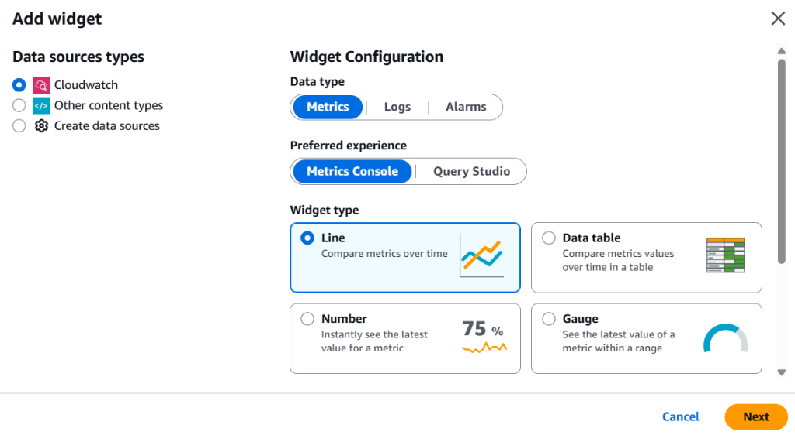
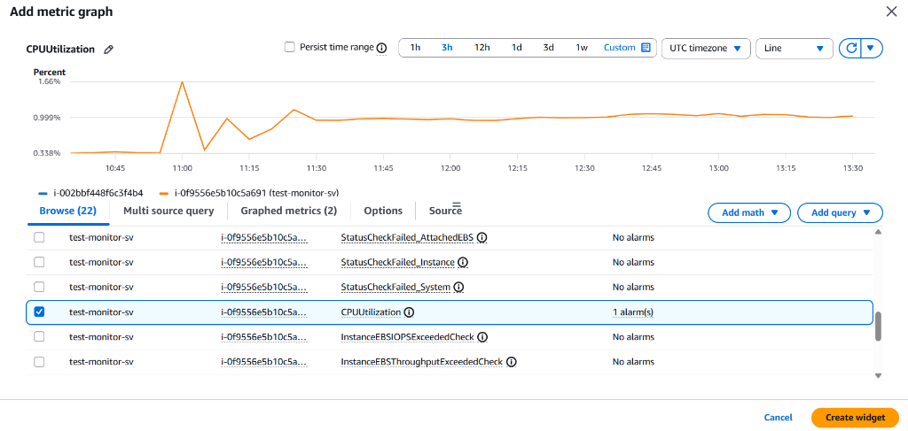
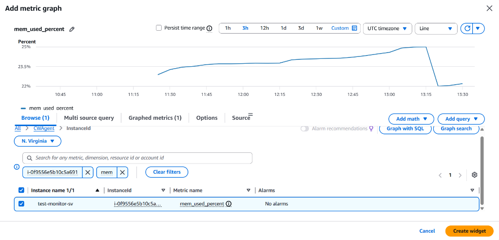

# Lab 4 - Thực hành với CloudWatch Dashboard

## I. Yêu cầu bài Lab
Thiết kế và cấu hình một màn hình giám sát tập trung (**CloudWatch Dashboard**) kết hợp hiển thị các chỉ số đo lường hiệu năng của máy chủ EC2 (CPU, RAM, Disk), các tệp nhật ký hoạt động (Logs) và hiển thị trạng thái các Alarms trên một giao diện trực quan duy nhất.

<p align="center">
  
</p>

---

## II. Các bước thực hiện chi tiết

### Bước 1: Khởi tạo CloudWatch Dashboard
1. Truy cập dịch vụ **CloudWatch** trên AWS Console.
2. Tại menu bên trái, chọn **Dashboards** > Click chọn **Create dashboard**.
3. Cấu hình tên Dashboard:
   * **Dashboard name**: Nhập `EC2-System-Monitor-Dashboard`.
   * Click **Create dashboard**.

<p align="center">
  
</p>

---

### Bước 2: Thêm Widget giám sát CPU Utilization (Line Chart)
1. Sau khi khởi tạo, AWS sẽ hiển thị hộp thoại chọn dạng Widget đầu tiên. Chọn **Line** (Đồ thị dạng đường) > Click **Next**.
2. Chọn nguồn dữ liệu là **Metrics** > Click **Configure**.

<p align="center">
  
</p>

3. Tại trang cấu hình Metric:
   * Chọn Namespace **EC2** > Chọn **Per-Instance Metrics**.
   * Tìm kiếm máy chủ của bạn (`test-monitor-sv`) và tích chọn chỉ số **`CPUUtilization`**.

<p align="center">
  
</p>

4. Thiết lập hiển thị:
   * **Period**: Chọn `1 minute` hoặc `5 minutes`.
   * **Statistic**: Chọn `Average`.
   * Click **Create widget**.
5. Kéo thả widget này ở góc trên bên trái của Dashboard.

---

### Bước 3: Thêm Widget giám sát Memory Utilization (Stacked Area Chart)
1. Click chọn biểu tượng **Add widget** (dấu cộng) trên thanh menu của Dashboard.
2. Chọn loại Widget là **Stacked area** (Đồ thị dạng vùng chồng) > Click **Next** > Chọn nguồn dữ liệu **Metrics** > Click **Configure**.
3. Tại trang cấu hình Metric:
   * Chọn Namespace **CWAgent** (Namespace thu thập từ CloudWatch Agent ở Lab 2) > Chọn **InstanceId**.
   * Tích chọn chỉ số **`mem_used_percent`** tương ứng với Instance ID của máy chủ của bạn.

<p align="center">
  
</p>

4. Click **Create widget**.
5. Kéo thả, co giãn widget RAM nằm ngay cạnh widget CPU.

---

### Bước 4: Thêm Widget hiển thị dung lượng đĩa cứng sử dụng (Number Widget)
1. Click chọn **Add widget**.
2. Chọn loại Widget là **Number** (Hiển thị con số lớn trực quan) > Click **Next** > Chọn nguồn dữ liệu **Metrics** > Click **Configure**.
3. Tại trang cấu hình Metric:
   * Chọn Namespace **CWAgent** > Chọn **InstanceId, device, fstype, path** > Tìm kiếm và tích chọn chỉ số **`disk_used_percent`** tương ứng với Instance ID của máy chủ của bạn.
4. Click **Create widget**.
5. Điều chỉnh vị trí widget này phía dưới widget CPU.

---

### Bước 5: Thêm Widget hiển thị Logs truy cập của Apache (Logs Widget)
1. Click chọn **Add widget**.
2. Tại phần cấu hình Widget Configuration:
   * **Data type**: Chọn **Logs**.
   * **Preferred experience**: Chọn **Logs Console**.
   * **Widget type**: Chọn **Table** (hoặc chọn hiển thị dạng Logs mặc định) > Click **Next**.
3. Tại màn hình tiếp theo, cấu hình nguồn logs và truy vấn:
   * **Log groups**: Chọn Log Group `test-server/access-log` (đã thu thập từ CloudWatch Agent ở Lab 2 & 3).
   * **Query editor**: Sử dụng truy vấn mặc định hoặc tùy chỉnh để lọc ra các log mới nhất:
     ```sql
     fields @timestamp, @message, @logStream, @log
     | sort @timestamp desc
     | limit 20
     ```
4. Click **Create widget**.
5. Di chuyển và co giãn widget hiển thị Logs này nằm ở phía dưới để có thể dễ dàng đọc các dòng log chi tiết.

---

### Bước 6: Thêm Widget giám sát Alarms trạng thái hoạt động (Alarm Status)
1. Click chọn **Add widget**.
2. Chọn loại dữ liệu (Data type) trong cấu hình là **Alarms** > Chọn **Alarm status** > Click **Next**.
3. Tại trang cấu hình:
   * Hệ thống tự động liệt kê các Alarms hiện có. Tích chọn các Alarms đã tạo ở các bài Lab trước:
     * `test-server-cpu-higher-than-20-percent` (Lab 1)
     * `EC2-High-NetworkIn-Alert` (Lab 1)
     * `Apache-Access-Log-Error-Alarm` (Lab 3)
4. Click **Create widget**.
5. Sắp xếp widget Alarm status nằm cạnh widget Disk.

---

### Bước 7: Lưu cấu hình và Sử dụng Dashboard
1. Nhấp chọn nút **Save** (Lưu) ở góc trên bên phải để lưu lại toàn bộ giao diện cấu hình của Dashboard.
2. **Kiểm tra tính năng xem dữ liệu**:
   * Bạn có thể điều chỉnh khoảng thời gian hiển thị dữ liệu (Time range) linh hoạt bằng cách chọn các mốc `1h` (1 giờ qua), `3h`, `12h`, `custom`... trên thanh menu.
   * Bật tính năng **Auto-refresh** (ví dụ: tự động làm mới mỗi 10 giây) để theo dõi các metrics và logs liên tục thời gian thực mà không cần tải lại trang thủ công.

<p align="center">
  
</p>

