# Lab 1 - Các thao tác cơ bản với Amazon SQS

Bài thực hành này hướng dẫn bạn từng bước khởi tạo một Amazon SQS Standard Queue trên AWS Management Console, thử gửi, kiểm tra nhận, xóa tin nhắn và thực hiện Purge hàng đợi.

---

## I. Mục tiêu bài thực hành
* Tìm hiểu cách tạo một Standard Queue trên SQS.
* Hiểu các tùy chọn cấu hình cơ bản của SQS.
* Thực hành gửi tin nhắn và nhận (poll) tin nhắn trên giao diện Console.
* Tìm hiểu cách kiểm tra nội dung và metadata của tin nhắn (ví dụ: receive count).
* Thực hành xóa từng tin nhắn riêng lẻ và Purge toàn bộ hàng đợi.

---

## II. Các bước thực hiện chi tiết

### Bước 1: Truy cập SQS & Tạo Queue
1. Đăng nhập vào tài khoản **AWS Management Console**.
2. Tìm kiếm **Simple Queue Service** hoặc **SQS** trên thanh tìm kiếm và truy cập vào dịch vụ.
3. Nhấp chọn nút **Create queue**.

<p align="center">
  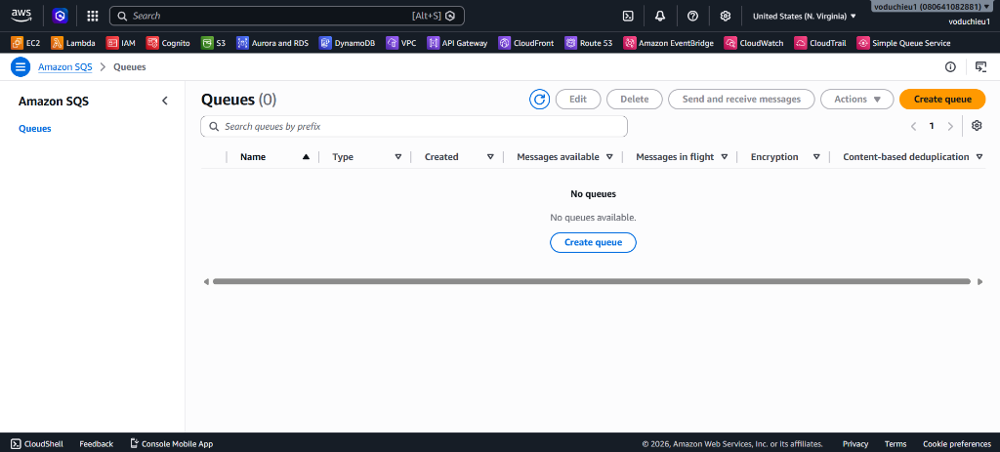
</p>

4. Cấu hình thông tin hàng đợi:
   * **Type:** Chọn **Standard** (Mặc định).
   * **Name:** Nhập `test-queue-standard`.
   * Giữ nguyên các thông số cấu hình khác (Visibility timeout, message retention, encryption, và access policy) ở chế độ mặc định.
5. Cuộn xuống cuối trang và nhấp chọn **Create queue**.

<p align="center">
  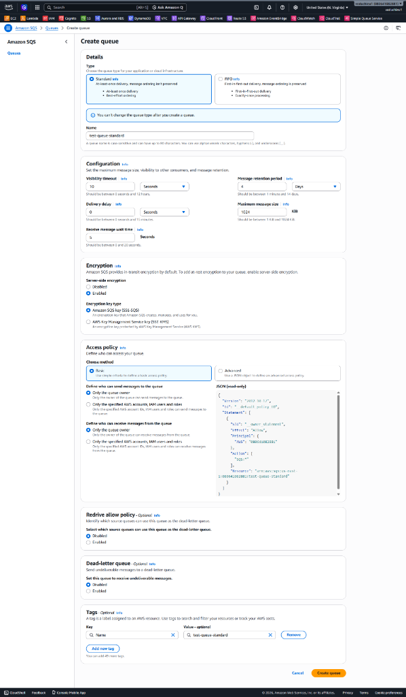
</p>

---

### Bước 2: Truy cập Queue vừa tạo
Sau khi tạo thành công, bạn sẽ được tự động chuyển hướng đến trang chi tiết của hàng đợi hiển thị ARN, URL, loại hàng đợi và các hành động quản trị.

1. Đảm bảo trạng thái của queue đang hoạt động (Active).
2. Nhấp chọn nút **Send and receive messages** ở phía trên góc phải.

<p align="center">
  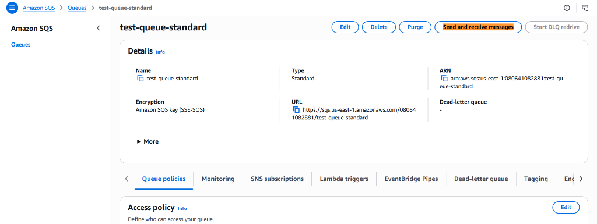
</p>

---

### Bước 3: Gửi tin nhắn thử nghiệm (Send Messages)
Chúng ta sẽ gửi khoảng 3 đến 5 tin nhắn kiểm thử vào hàng đợi.

1. Tại bảng **Send message**:
   * Tại trường **Message body**, nhập nội dung payload (ví dụ, một chuỗi JSON):
     ```json
     {
       "name": "Hieu",
       "age": 10
     }
     ```
2. Nhấp chọn nút **Send message**.
3. Lặp lại quá trình này để gửi thêm từ 3 đến 5 tin nhắn với nội dung payload khác nhau.

<p align="center">
  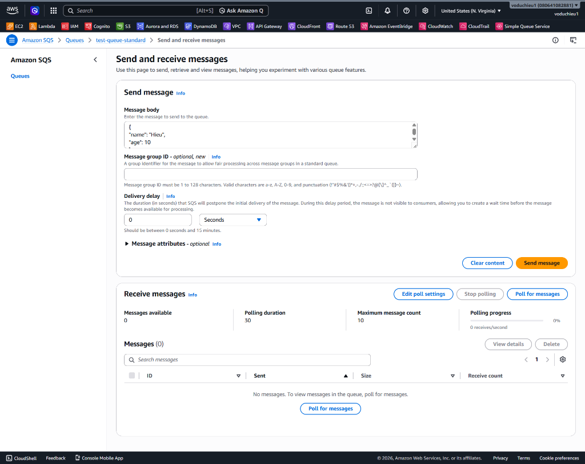
</p>

---

### Bước 4: Nhận và kiểm tra tin nhắn (Poll Messages)
1. Cuộn xuống bảng **Receive messages**.
2. Bạn sẽ thấy chỉ số **Messages available** hiển thị số lượng tin nhắn hiện có trong hàng đợi.
3. Nhấp chọn nút **Poll for messages**.

<p align="center">
  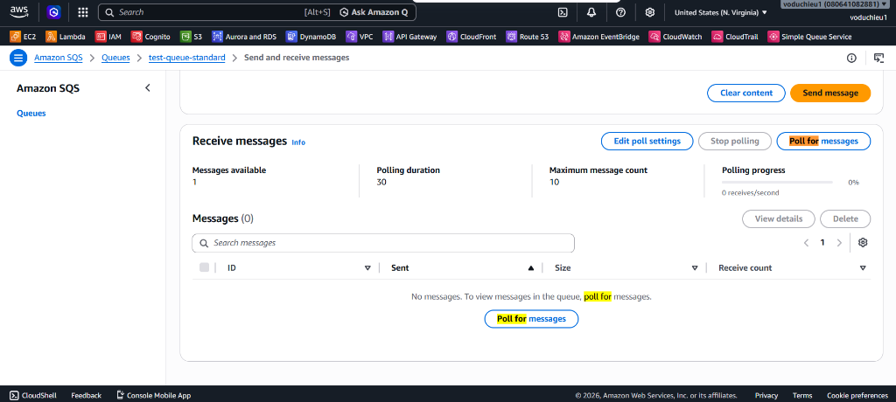
</p>

4. Giao diện console sẽ bắt đầu poll tin nhắn và hiển thị danh sách các tin nhắn nhận được trong bảng **Messages (N)**.

<p align="center">
  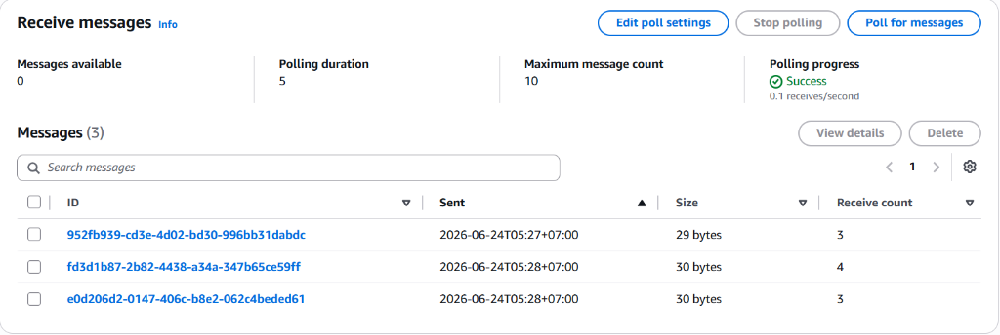
</p>

5. Nhấp chọn vào từng Message ID để kiểm tra thông tin chi tiết:
   * **Tab Body:** Kiểm tra nội dung payload do nhà sản xuất (producer) gửi (ví dụ: `{"name": "Hieu", "age": 10}`).
   * **Tab Details:** Xem metadata của tin nhắn, bao gồm **Receive count** (số lần tin nhắn được poll bởi consumer, tăng +1 sau mỗi lần poll), Message ID, Sent time, và Size.

<p align="center">
  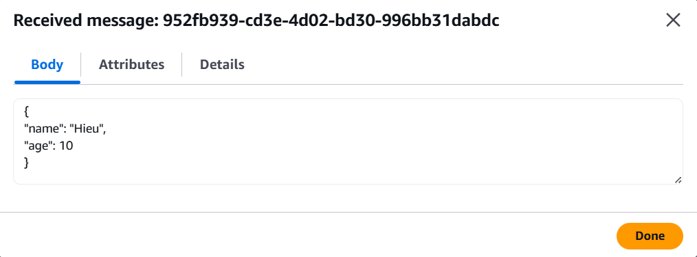
</p>

<p align="center">
  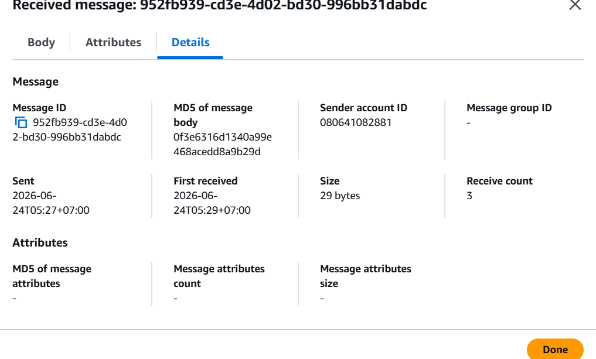
</p>

---

### Bước 5: Xóa tin nhắn (Delete Message)
1. Trong bảng danh sách **Messages (N)**, tích chọn hộp kiểm bên cạnh tin nhắn bạn muốn xóa.
2. Nhấp chọn nút **Delete**. SQS sẽ xóa vĩnh viễn tin nhắn này khỏi hàng đợi.

<p align="center">
  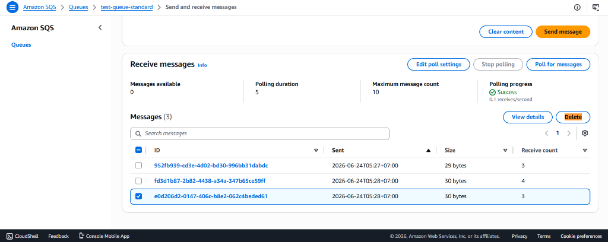
</p>

---

### Bước 6: Purge Queue (Xóa toàn bộ tin nhắn)
Nếu bạn muốn xóa sạch toàn bộ tin nhắn trong hàng đợi mà không muốn xóa hàng đợi chính:

1. Quay trở lại trang thông tin chi tiết của hàng đợi `test-queue-standard`.
2. Nhấp chọn nút **Purge** ở góc trên bên phải giao diện.
3. Xác nhận hành động Purge. Toàn bộ các tin nhắn đang được lưu trữ trong hàng đợi sẽ bị xóa sạch.

<p align="center">
  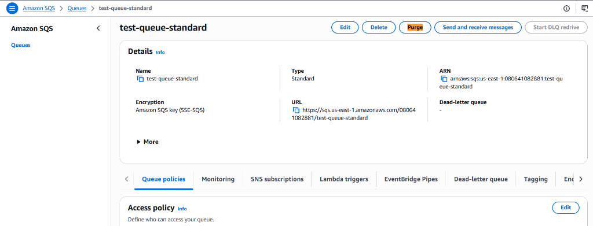
</p>

4. **Kiểm tra kết quả Purge:** 
   * Nhấp chọn nút **Send and receive messages** và chọn **Poll for messages** một lần nữa.
   * Đảm bảo chỉ số **Messages available** hiển thị bằng `0` và bảng thông báo hiển thị `No messages. To view messages in the queue, poll for messages` (như hình dưới), xác nhận rằng việc Purge hàng đợi đã thành công.

<p align="center">
  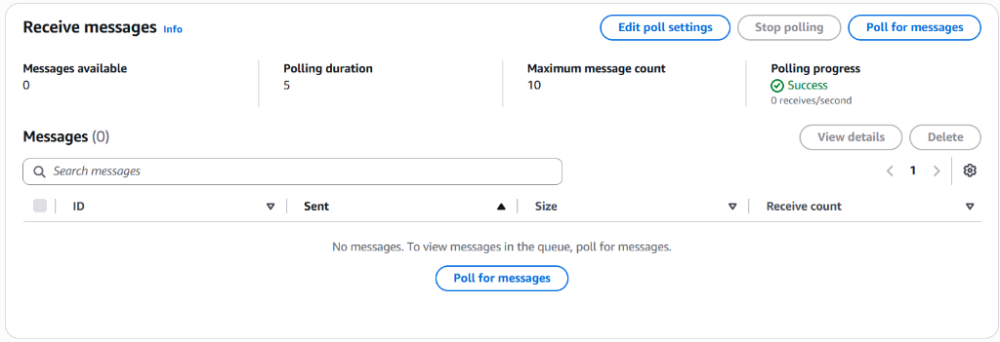
</p>
