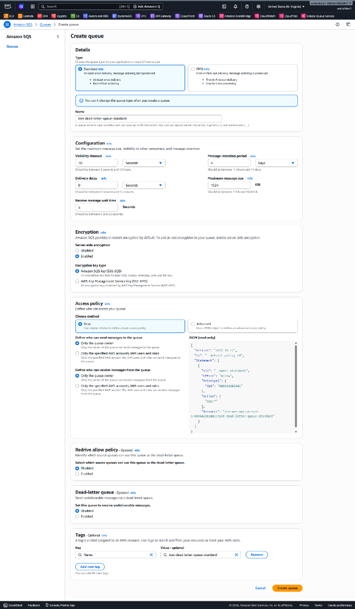
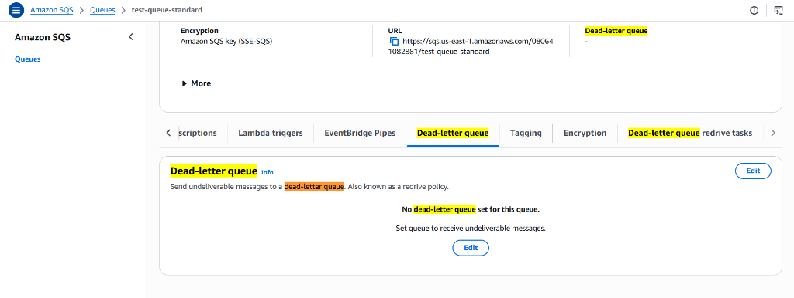
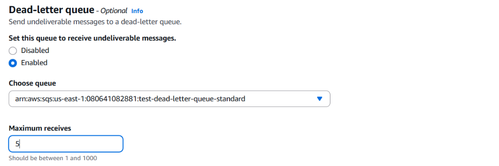
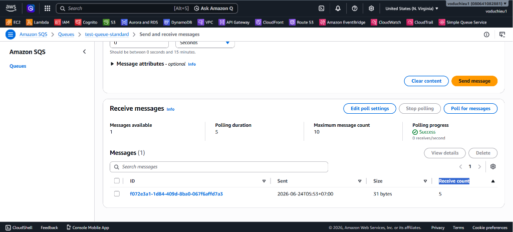
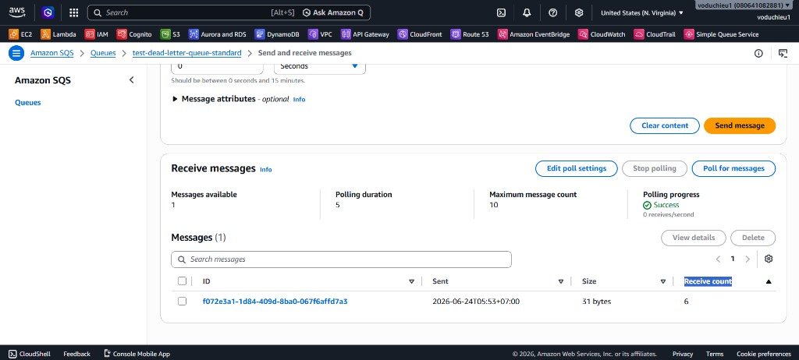

# Lab 2 - Cấu hình SQS Dead Letter Queue (DLQ)

Bài thực hành này hướng dẫn bạn từng bước cấu hình Dead Letter Queue (DLQ) cho Amazon SQS. Bạn sẽ học cách xử lý các tin nhắn lỗi hoặc không thể xử lý bằng cách tự động chuyển hướng chúng sang một hàng đợi riêng biệt để phân tích.

---

## I. Mục tiêu bài thực hành
* Tìm hiểu cách tạo hàng đợi phụ đóng vai trò Dead Letter Queue.
* Hiểu rõ cơ chế Redrive Policy và cấu hình **Maximum receives** (số lần nhận tối đa).
* Quan sát chỉ số **Receive count** tăng dần mỗi khi tin nhắn được poll.
* Xác minh cơ chế tự động chuyển hướng tin nhắn sang DLQ sau khi vượt ngưỡng xử lý tối đa.

---

## II. Các bước thực hiện chi tiết

### Bước 1: Tạo Dead Letter Queue
Trước tiên, chúng ta cần tạo một hàng đợi mới để chứa các tin nhắn không thể xử lý.

1. Truy cập vào **AWS Management Console** và mở dịch vụ **Amazon SQS**.
2. Nhấp chọn **Create queue**.
3. Cấu hình thông tin hàng đợi:
   * **Type:** Chọn **Standard**.
   * **Name:** Nhập `test-dead-letter-queue-standard`.
   * Giữ nguyên tất cả các cấu hình mặc định khác.
4. Nhấp chọn **Create queue** ở cuối trang.

  

---

### Bước 2: Cấu hình Queue chính sử dụng DLQ
Tiếp theo, chúng ta sẽ chỉnh sửa hàng đợi chính đã tạo ở Lab 1 (`test-queue-standard`) để liên kết với DLQ vừa tạo.

1. Quay trở lại danh sách hàng đợi (**Queues**).
2. Nhấp chọn hàng đợi chính: `test-queue-standard`.
3. Nhấp chọn tab **Dead-letter queue** bên dưới phần chi tiết của hàng đợi.
4. Hiện tại, hàng đợi này chưa được thiết lập DLQ. Nhấp chọn nút **Edit** trong phần **Dead-letter queue** (hoặc chọn nút **Edit** chung ở góc trên bên phải hàng đợi rồi cuộn xuống phần Dead-letter queue).

  

5. Trong bảng cấu hình **Dead-letter queue**:
   * **Set this queue to receive undeliverable messages:** Chọn **Enabled**.
   * **Choose queue:** Lựa chọn ARN của DLQ bạn vừa tạo: `arn:aws:sqs:us-east-1:080641082881:test-dead-letter-queue-standard`.
   * **Maximum receives:** Nhập số `5`. Đây là giới hạn số lần tối đa tin nhắn có thể được poll bởi các consumer mà không bị xóa trước khi bị tự động chuyển sang DLQ.
6. Nhấp chọn **Save** ở cuối trang để lưu cấu hình.

  

---

### Bước 3: Gửi tin nhắn thử nghiệm vào Queue chính
1. Từ trang chi tiết hàng đợi chính `test-queue-standard`, nhấp chọn **Send and receive messages**.
2. Trong ô **Message body**, nhập nội dung tin nhắn thử nghiệm (ví dụ: `{"msg": "Test message for DLQ verification"}`).
3. Nhấp chọn **Send message**.

---

### Bước 4: Poll tin nhắn 5 lần để tăng Receive Count
Chúng ta sẽ giả lập tình huống một consumer liên tục lấy tin nhắn ra xử lý nhưng gặp lỗi và không gọi lệnh xóa tin nhắn. Mỗi lần được poll, thông số **Receive count** của tin nhắn sẽ tự động cộng thêm +1.

1. Cuộn xuống bảng **Receive messages**.
2. Nhấp chọn nút **Poll for messages**.
3. Khi danh sách tin nhắn hiện ra, nhấp chọn vào Message ID của tin nhắn vừa gửi để mở bảng thông tin chi tiết.
4. Chuyển sang tab **Details** để kiểm tra giá trị của **Receive count**. Nó sẽ hiển thị là `1` ở lần poll đầu tiên.
5. Chờ cho đến khi thời gian **Visibility timeout** của tin nhắn hết hạn (tin nhắn sẽ tự động xuất hiện lại trong hàng đợi).
6. Tiếp tục nhấp chọn **Poll for messages** lần thứ 2. Kiểm tra chi tiết tin nhắn, bạn sẽ thấy **Receive count** tăng lên `2`.
7. Lặp lại quá trình này cho đến khi bạn poll đủ **5 lần**. Ở lần poll thứ 5, **Receive count** trong tab Details sẽ hiển thị giá trị là `5`.

  

---

### Bước 5: Kiểm tra tin nhắn chuyển sang Dead Letter Queue
Sau khi poll đủ 5 lần, tin nhắn đã đạt tới giới hạn nhận tối đa (`Maximum receives = 5`). Khi thời gian visibility timeout của lần poll thứ 5 hết hạn, SQS sẽ tự động di chuyển tin nhắn này sang Dead Letter Queue thay vì để nó hiển thị lại trong `test-queue-standard`.

1. Chờ thời gian visibility timeout của lần poll thứ 5 kết thúc.
2. Nhấp chọn **Poll for messages** một lần nữa trên hàng đợi chính `test-queue-standard`. Bạn sẽ thấy tin nhắn không còn xuất hiện, chỉ số **Messages available** trở về `0`.
3. Quay trở lại danh sách hàng đợi (**Queues**) và nhấp chọn hàng đợi phụ `test-dead-letter-queue-standard`.
4. Nhấp chọn **Send and receive messages** -> Nhấp chọn **Poll for messages**.
5. Bạn sẽ thấy tin nhắn thử nghiệm ban đầu hiện đã nằm trong Dead Letter Queue!
6. Nhấp chọn vào Message ID của tin nhắn và chuyển sang tab **Details**. Bạn sẽ thấy thông số **Receive count** hiện tại hiển thị giá trị là `6` (bao gồm 5 lần nhận lỗi ở hàng đợi chính và 1 lần nhận hiện tại ở DLQ).

  

---

## III. Kết luận
Bạn đã hoàn thành việc thiết kế và cấu hình mô hình Amazon SQS Dead Letter Queue!
* Khi các consumer poll tin nhắn nhưng không xóa chúng (biểu thị cho lỗi xử lý logic ứng dụng hoặc crash hệ thống), SQS sẽ tăng thông số **Receive count**.
* Việc thiết lập Redrive Policy với thông số **Maximum receives** giúp ngăn chặn việc các tin nhắn lỗi (poison pills) bị xử lý lặp lại vô hạn, gây lãng phí tài nguyên CPU và làm chậm hệ thống.
