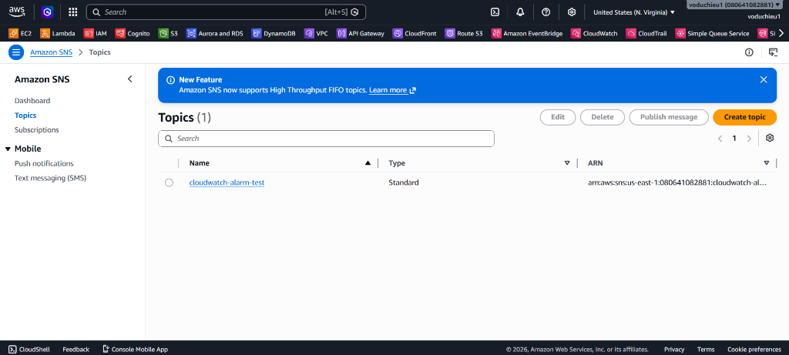
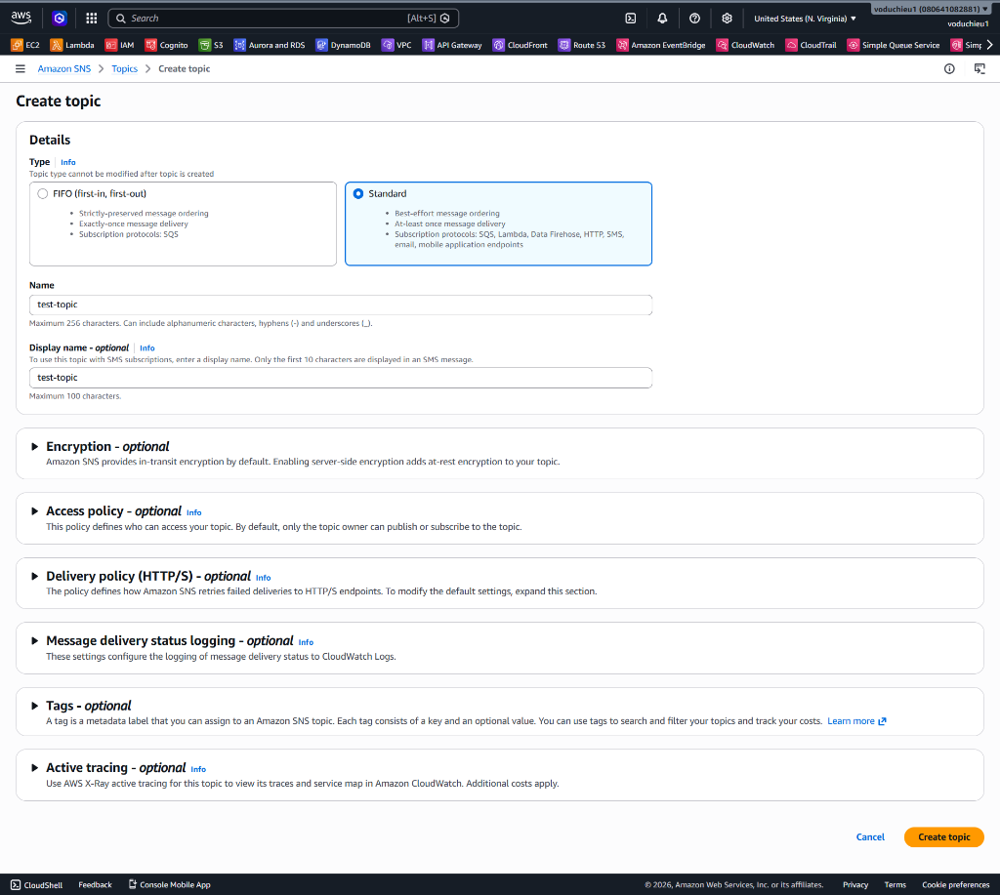
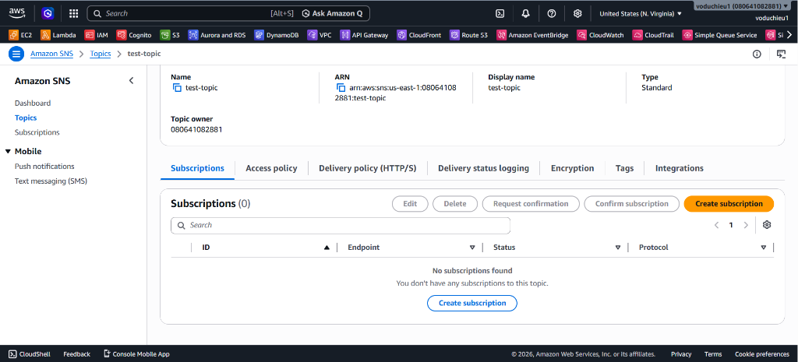
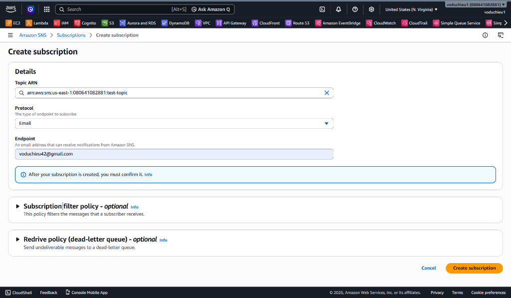
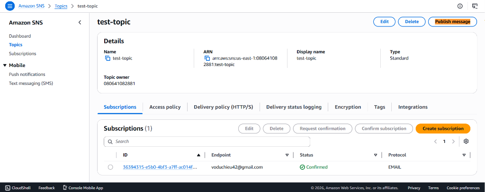
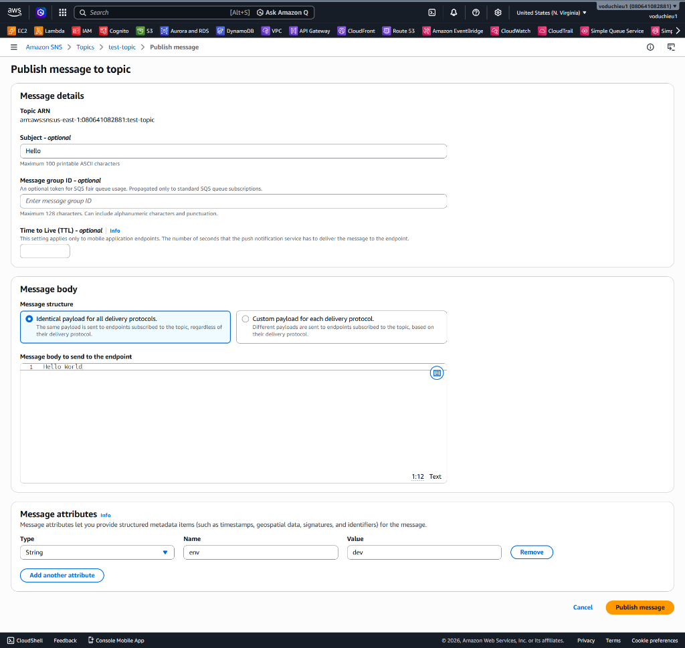
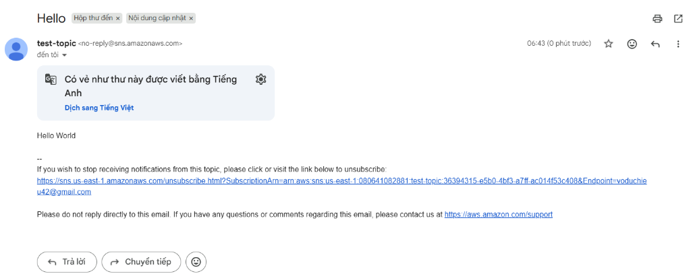

# Lab 3 - Các thao tác cơ bản với Amazon SNS

Bài thực hành này hướng dẫn bạn từng bước khởi tạo một Amazon SNS Topic trên AWS Management Console, đăng ký (subscribe) địa chỉ email để nhận thông báo, xác nhận đăng ký trong hộp thư cá nhân và tiến hành gửi tin nhắn kiểm thử (Publish Message) để xác nhận hệ thống hoạt động chính xác.

---

## I. Mục tiêu bài thực hành
* Tìm hiểu cách tạo một SNS Topic (chủ đề thông báo) loại Standard.
* Thực hành tạo Subscription với giao thức Email.
* Hiểu quy trình xác nhận đăng ký (Confirm Subscription) bắt buộc từ phía người nhận.
* Thực hiện gửi thông báo thử nghiệm (Publish Message) từ giao diện Console và kiểm tra hộp thư email.

---

## II. Các bước thực hiện chi tiết

### Bước 1: Truy cập SQS & Khởi tạo Topic
1. Đăng nhập vào tài khoản **AWS Management Console**.
2. Tìm kiếm **Simple Notification Service** hoặc **SNS** và mở bảng điều khiển quản trị dịch vụ.
3. Chọn mục **Topics** ở cột quản trị bên trái.
4. Nhấp chọn nút **Create topic**.

<p align="center">
  
</p>

5. Cấu hình thông tin Topic mới:
   * **Type:** Chọn **Standard** (Hỗ trợ nhiều giao thức đăng ký như Email, SMS, SQS, HTTP...).
   * **Name:** Nhập tên hàng đợi, ví dụ: `test-topic`.
   * **Display name - optional:** Nhập `test-topic` (tên hiển thị này sẽ xuất hiện trong tiêu đề email hoặc SMS được gửi đi).
   * Giữ nguyên tất cả các thiết lập tùy chọn nâng cao khác (Encryption, Access policy, Delivery policy...) ở chế độ mặc định.
6. Cuộn xuống cuối trang và nhấp chọn **Create topic**.

<p align="center">
  
</p>

---

### Bước 2: Tạo Subscription đăng ký nhận tin nhắn
Sau khi Topic được khởi tạo thành công, bạn sẽ được tự động chuyển hướng đến trang chi tiết của Topic đó. Bây giờ, chúng ta cần đăng ký (subscribe) một hòm thư email làm đối tượng nhận tin nhắn.

1. Tại tab **Subscriptions** ở phía dưới chi tiết Topic, nhấp chọn nút **Create subscription**.

<p align="center">
  
</p>

2. Cấu hình thông tin Subscription:
   * **Topic ARN:** Hệ thống sẽ tự động điền ARN của Topic `test-topic` vừa tạo.
   * **Protocol:** Chọn giao thức **Email**.
   * **Endpoint:** Nhập địa chỉ email cá nhân của bạn (ví dụ: `voduchieu42@gmail.com`).
3. Nhấp chọn nút **Create subscription** ở góc dưới bên phải.

<p align="center">
  
</p>

---

### Bước 3: Xác nhận đăng ký trong hòm thư Email (Confirm Subscription)
Sau khi tạo Subscription, trạng thái của đối tượng nhận tin sẽ hiển thị là **Pending confirmation** (Đang chờ xác nhận). AWS yêu cầu chủ sở hữu email phải đồng ý nhận thông báo trước khi SNS có thể gửi tin nhắn đến.

1. Mở hòm thư email cá nhân của bạn.
2. Tìm thư thông báo từ AWS với tiêu đề dạng **AWS Notification - Subscription Confirmation**.
3. Mở email và nhấp chọn liên kết **Confirm subscription**.
4. Một trang web xác nhận của AWS sẽ hiện ra hiển thị thông báo `Subscription confirmed!`.
5. Quay trở lại **AWS SNS Console**, nhấp tải lại trang chi tiết Topic. Bạn sẽ thấy trạng thái (**Status**) của Subscription đã chuyển sang màu xanh lá **Confirmed**.

<p align="center">
  
</p>

---

### Bước 4: Thử nghiệm gửi tin nhắn (Publish Message) và kiểm tra hòm thư
1. Tại trang chi tiết Topic `test-topic`, nhấp chọn nút **Publish message** ở góc trên bên phải.
2. Trong trang cấu hình gửi tin nhắn:
   * **Subject - optional:** Nhập tiêu đề của thông báo (ví dụ: `Hello`).
   * **Message body:** Chọn định dạng *Identical payload for all delivery protocols* và nhập nội dung tin nhắn gửi đến các subscriber:
     ```text
     Hello World
     ```
   * **Message attributes - optional:** Thêm một thuộc tính tùy biến để thử nghiệm:
     * *Type:* `String`
     * *Name:* `env`
     * *Value:* `dev`
3. Cuộn xuống cuối trang và nhấp chọn nút **Publish message**.

<p align="center">
  
</p>

4. **Kiểm tra hòm thư Email:**
   * Mở hộp thư đến của địa chỉ email đã đăng ký (`voduchieu42@gmail.com`).
   * Kiểm tra và mở email mới gửi từ `test-topic <no-reply@sns.amazonaws.com>`.
   * Đảm bảo tiêu đề email hiển thị chính xác là `Hello` và nội dung hiển thị đúng chuỗi `Hello World` mà bạn vừa publish.

<p align="center">
  
</p>
