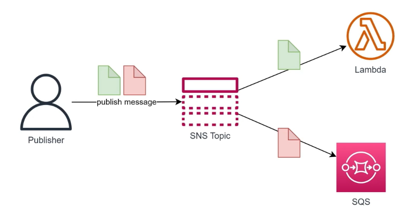
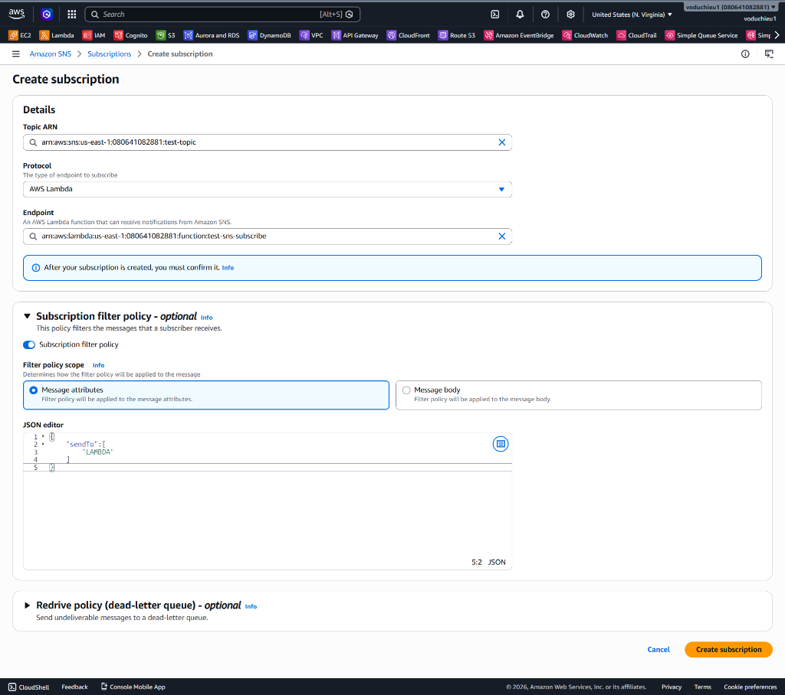
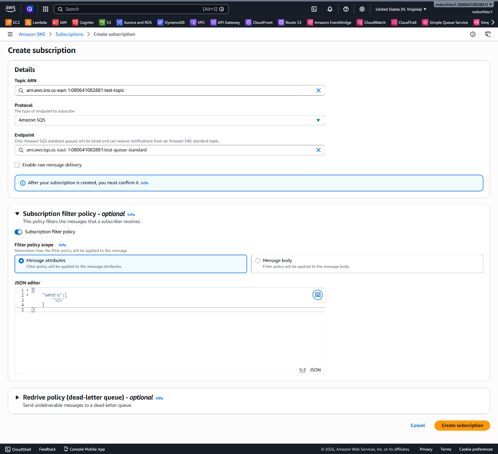
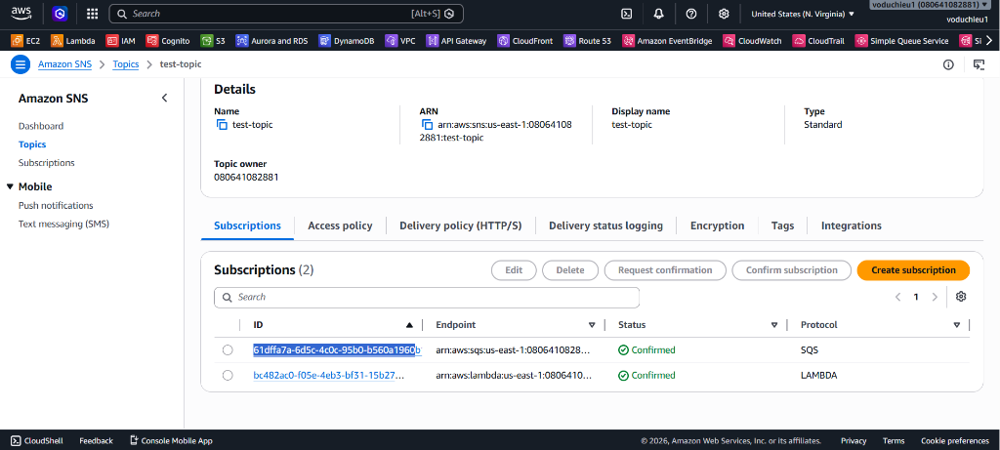
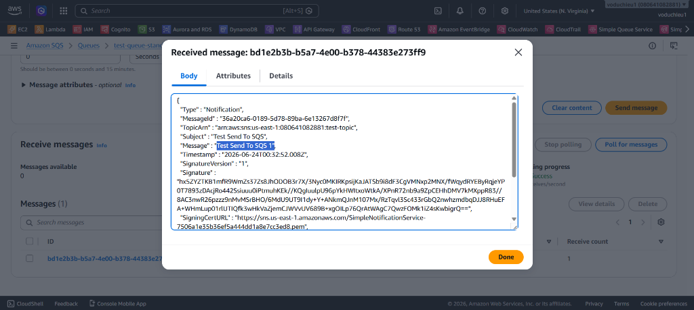
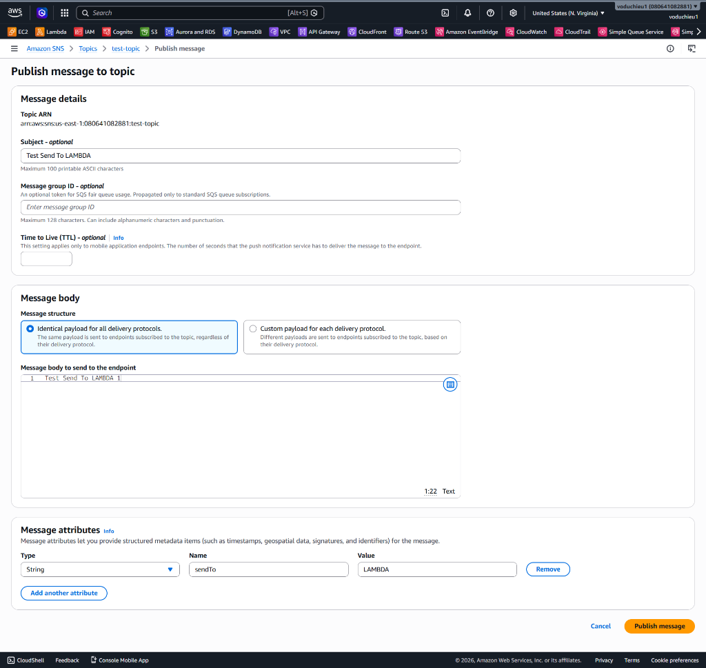
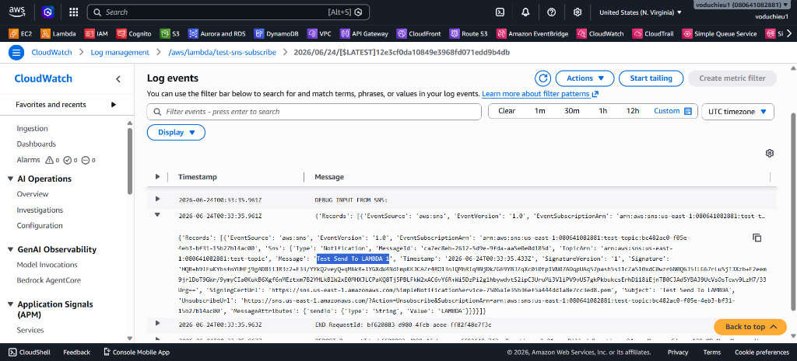

# Lab 4 - Lọc tin nhắn với Amazon SNS Message Filter

Bài thực hành này hướng dẫn bạn cấu hình tính năng **Message Filtering** (Lọc tin nhắn) trên Amazon SNS. Bạn sẽ thiết lập một mô hình định tuyến thông minh: Một Topic gửi tin nhắn đến hai Subscription khác nhau (một hàng đợi SQS và một hàm Lambda) dựa trên các thuộc tính đi kèm tin nhắn (Message Attributes).

---

## I. Sơ đồ kiến trúc & Mục tiêu bài lab

Trong bài lab này, chúng ta sẽ xây dựng luồng xử lý như sau:
* **Publisher** gửi tin nhắn vào **SNS Topic** kèm theo thuộc tính `sendTo`.
* **Subscription SQS** cấu hình filter policy: chỉ nhận tin nhắn nếu `sendTo` là `SQS`.
* **Subscription Lambda** cấu hình filter policy: chỉ nhận tin nhắn nếu `sendTo` là `LAMBDA`.

<p align="center">
  
</p>

---

## II. Các bước thực hiện chi tiết

### Bước 1: Chuẩn bị SNS Topic và SQS Queue
1. Chúng ta sẽ sử dụng lại **SNS Topic** `test-topic` đã tạo ở Lab 3.
2. Chúng ta cũng sẽ sử dụng lại **SQS Queue** `test-queue-standard` đã tạo ở Lab 1.

---

### Bước 2: Tạo Lambda Function nhận tin nhắn
Chúng ta cần tạo một hàm Lambda để đóng vai trò là một trong hai subscriber của Topic.

1. Truy cập dịch vụ **AWS Lambda** trên console.
2. Nhấp chọn **Create function**.
3. Cấu hình thông tin cơ bản:
   * **Function name:** `test-sns-subscribe`.
   * **Runtime:** Lựa chọn **Python 3.12** (hoặc phiên bản Python mới nhất).
4. Nhấp chọn **Create function**.
5. Trong trình soạn thảo code của Lambda, dán đoạn mã Python được chuẩn bị sẵn tại tệp tin [sqs-processing-lambda-function.py](sqs-processing-lambda-function.py):
   ```python
   import json

   def lambda_handler(event, context):
       
       # for debug
       print('DEBUG INPUT FROM SNS:')
       print(event)

       # Create the response body
       response_body = {
           'message': 'Request processed successfully'
       }
       
       # Create the HTTP response
       response = {
           'statusCode': 200,
           'body': json.dumps(response_body),
           'headers': {
               'Content-Type': 'application/json'
           }
       }
       
       return response
   ```
6. Nhấp chọn nút **Deploy** để cập nhật code cho hàm Lambda.

---

### Bước 3: Đăng ký Lambda Subscription và cấu hình Filter Policy
1. Quay trở lại dịch vụ **Amazon SNS** -> Chọn **Topics** -> Nhấp vào chi tiết của topic `test-topic`.
2. Tại tab **Subscriptions**, nhấp chọn nút **Create subscription**.
3. Cấu hình thông tin Subscription cho Lambda:
   * **Protocol:** Chọn **AWS Lambda**.
   * **Endpoint:** Chọn ARN của hàm Lambda bạn vừa tạo ở Bước 2 (`arn:aws:lambda:us-east-1:080641082881:function:test-sns-subscribe`).
   * **Subscription filter policy:** Tích bật tùy chọn này.
   * **Filter policy scope:** Chọn **Message attributes**.
   * **JSON editor:** Nhập cấu hình JSON filter policy sau (đã được chuẩn bị sẵn trong tệp tin [sns-message-attribute-filter.txt](sns-message-attribute-filter.txt)):
     ```json
     {
       "sendTo": [
         "LAMBDA"
       ]
     }
     ```
     *(Hàm Lambda này sẽ chỉ nhận tin nhắn nếu message attribute chứa thuộc tính `sendTo` có giá trị là `LAMBDA`)*.
4. Nhấp chọn **Create subscription** ở cuối trang.

<p align="center">
  
</p>

---

### Bước 4: Đăng ký SQS Subscription và cấu hình Filter Policy
1. Tại trang chi tiết Topic `test-topic`, tiếp tục nhấp chọn nút **Create subscription** lần thứ hai.
2. Cấu hình thông tin Subscription cho SQS:
   * **Protocol:** Chọn **Amazon SQS**.
   * **Endpoint:** Chọn ARN của hàng đợi SQS `test-queue-standard` đã tạo ở Lab 1 (`arn:aws:sqs:us-east-1:080641082881:test-queue-standard`).
   * **Subscription filter policy:** Tích bật tùy chọn này.
   * **Filter policy scope:** Chọn **Message attributes**.
   * **JSON editor:** Nhập cấu hình JSON filter policy sau (đã được chuẩn bị sẵn trong tệp tin [sns-message-attribute-filter.txt](sns-message-attribute-filter.txt)):
     ```json
     {
       "sendTo": [
         "SQS"
       ]
     }
     ```
     *(Hàng đợi SQS này sẽ chỉ nhận tin nhắn nếu message attribute chứa thuộc tính `sendTo` có giá trị là `SQS`)*.
3. Nhấp chọn **Create subscription** ở cuối trang.

<p align="center">
  
</p>

Sau khi tạo xong cả 2 subscription, bạn sẽ thấy danh sách các subscription hiển thị trạng thái **Confirmed** tại tab **Subscriptions** của Topic:

<p align="center">
  
</p>

---

### Bước 5: Kiểm tra hoạt động (Publish Messages to Test)
Chúng ta sẽ gửi hai tin nhắn thử nghiệm với các thuộc tính định tuyến khác nhau để xác minh tính năng lọc tin nhắn hoạt động chính xác.

#### Lần kiểm thử 1: Gửi tin nhắn định tuyến tới SQS
1. Tại trang chi tiết Topic `test-topic`, nhấp chọn nút **Publish message** ở góc trên bên phải.
2. Trong trang cấu hình gửi tin nhắn:
   * **Subject - optional:** Nhập `Test Send To SQS`.
   * **Message body:** Nhập nội dung `Test Send To SQS 1`.
   * **Message attributes:** Thêm thuộc tính phân loại:
     * *Type:* Chọn `String`.
     * *Name:* Nhập `sendTo`.
     * *Value:* Nhập `SQS`.
3. Nhấp chọn nút **Publish message**.

<p align="center">
  
</p>

4. **Xác minh kết quả tại SQS:**
   * Truy cập dịch vụ **SQS** -> Chọn hàng đợi `test-queue-standard` -> Chọn **Send and receive messages** -> Nhấp **Poll for messages**.
   * Bạn sẽ nhận được tin nhắn `Test Send To SQS 1` trong hàng đợi SQS.

<p align="center">
  
</p>

5. **Xác minh kết quả tại Lambda:**
   * Truy cập dịch vụ **Lambda** -> Chọn hàm `test-sns-subscribe` -> Chọn tab **Monitor** -> Chọn **View CloudWatch logs**.
   * Kiểm tra log stream mới nhất. Đảm bảo hàm Lambda **không** nhận được tin nhắn này (vì thuộc tính lọc là `SQS`, không phải `LAMBDA`).

---

#### Lần kiểm thử 2: Gửi tin nhắn định tuyến tới Lambda
1. Quay trở lại trang chi tiết Topic `test-topic` trên SNS Console, nhấp chọn **Publish message**.
2. Cấu hình gửi tin nhắn:
   * **Subject - optional:** Nhập `Test Send To LAMBDA`.
   * **Message body:** Nhập nội dung `Test Send To LAMBDA 1`.
   * **Message attributes:** Thêm thuộc tính phân loại:
     * *Type:* Chọn `String`.
     * *Name:* Nhập `sendTo`.
     * *Value:* Nhập `LAMBDA`.
3. Nhấp chọn nút **Publish message**.

<p align="center">
  
</p>

4. **Xác minh kết quả tại Lambda:**
   * Truy cập dịch vụ **Lambda** -> Chọn hàm `test-sns-subscribe` -> Chọn tab **Monitor** -> Chọn **View CloudWatch logs**.
   * Kiểm tra log stream mới nhất. Bạn sẽ thấy log in ra nội dung tin nhắn `Test Send To LAMBDA 1` đã được Lambda tiếp nhận thành công.

<p align="center">
  
</p>

5. **Xác minh kết quả tại SQS:**
   * Truy cập dịch vụ **SQS** -> Chọn hàng đợi `test-queue-standard` và thực hiện **Poll for messages** lại.
   * Xác nhận rằng hàng đợi SQS **không** nhận thêm bất kỳ tin nhắn mới nào (vì thuộc tính lọc của tin nhắn này là `LAMBDA`).

---

## III. Kết luận
Bạn đã hoàn thành bài thực hành cấu hình **Amazon SNS Message Filter**!
* Bạn đã học được cách cấu hình **Subscription filter policy** để định tuyến tin nhắn thông minh.
* Việc lọc tin nhắn trực tiếp tại tầng SNS giúp giảm tải tính toán cho các hệ thống backend, tránh gửi dữ liệu thừa cho consumer và tối ưu hóa chi phí truyền tải dữ liệu.
