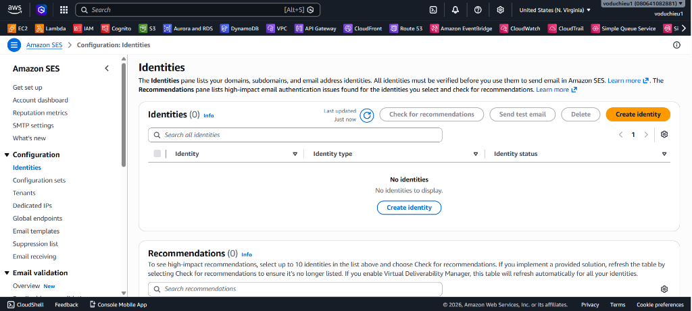
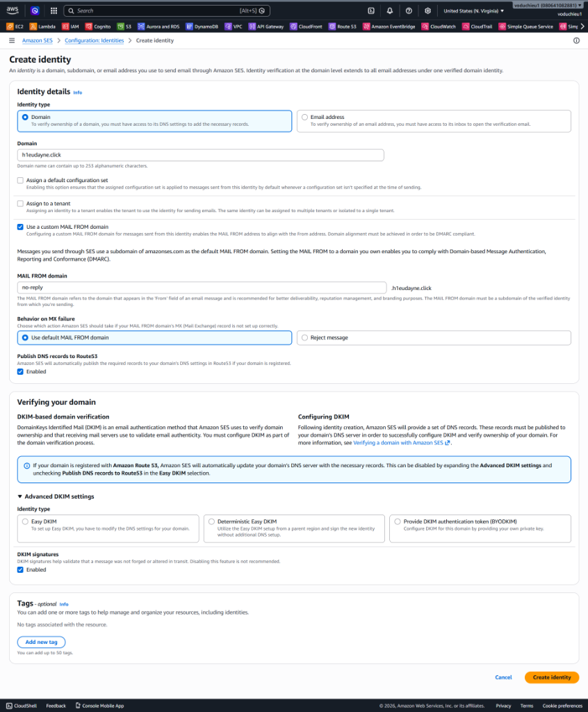
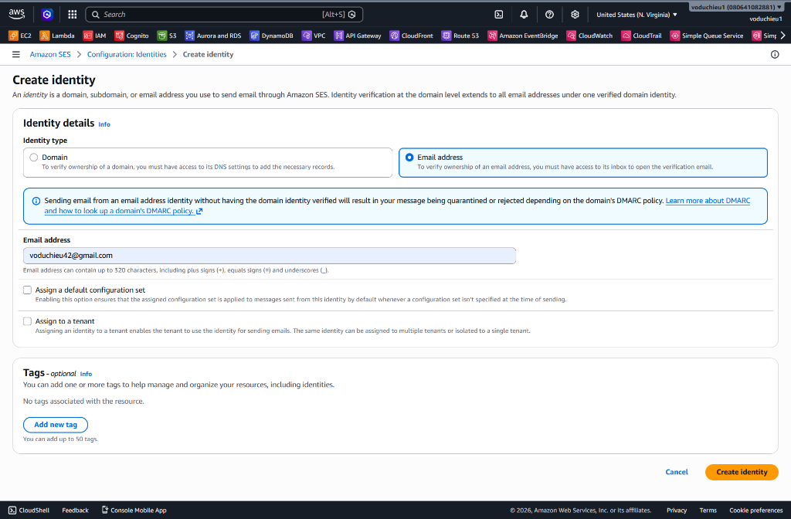
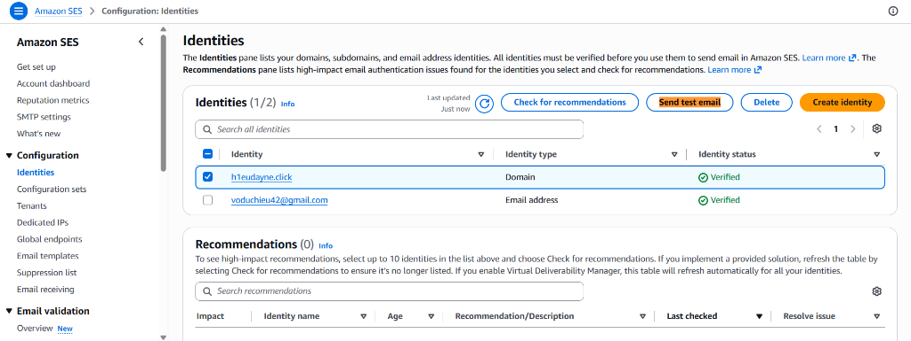
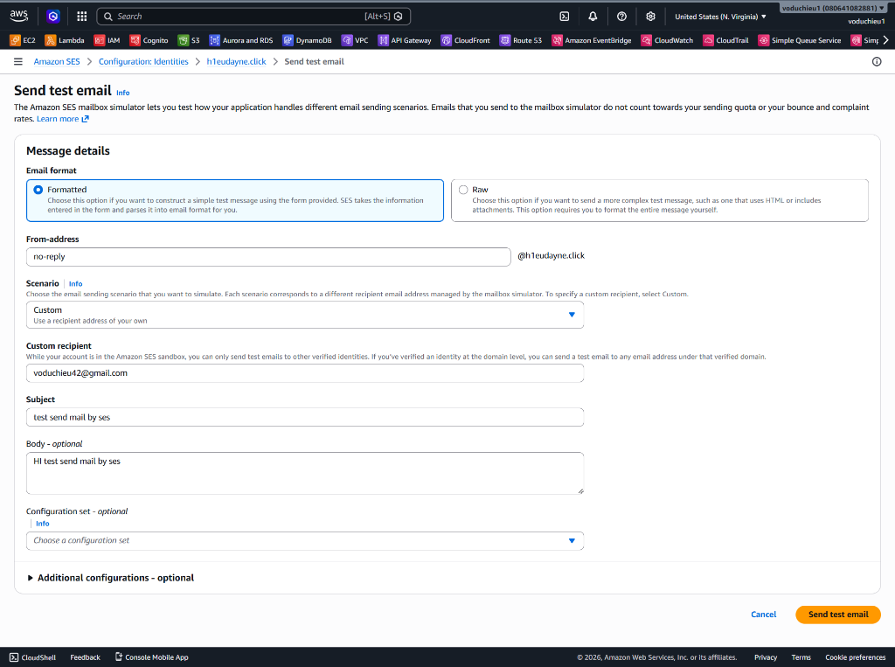
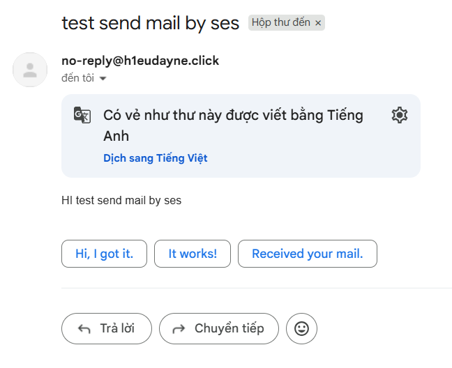

# Lab 5 - Gửi email cơ bản với Amazon SES (Sandbox Mode)

Bài thực hành này hướng dẫn bạn cấu hình và sử dụng **Amazon Simple Email Service (SES)** ở chế độ thử nghiệm **Sandbox Mode** để thực hiện xác thực tên miền (Domain Identity), xác thực địa chỉ email người nhận (Email Identity) và tiến hành gửi email thử nghiệm thành công.

---

## I. Tổng quan & Yêu cầu bài lab

### 1. Amazon SES Sandbox Mode
Khi mới sử dụng dịch vụ Amazon SES, tài khoản của bạn sẽ mặc định nằm trong phân vùng thử nghiệm gọi là **Sandbox Mode**:
* Bạn chỉ có thể gửi email đến các địa chỉ email hoặc tên miền đã được xác thực danh tính (Verified Identities) thành công trong cấu hình SES.
* Bạn chỉ có thể gửi email từ các địa chỉ email hoặc tên miền đã được xác thực danh tính.
* Tốc độ gửi thư bị giới hạn tối đa **1 email mỗi giây (1 email/second)** và tối đa **200 email mỗi 24 giờ**.

### 2. Các tài nguyên cần chuẩn bị
* Một tên miền (Domain) đã được cấu hình Private/Public Hosted Zone trên **Amazon Route 53** (trong bài này sử dụng tên miền mẫu là `h1eudayne.click`).
* Một địa chỉ email cá nhân hoạt động bình thường để làm người nhận (trong bài này sử dụng email mẫu là `voduchieu42@gmail.com`).

---

## II. Các bước thực hiện chi tiết

### Bước 1: Tạo và xác thực Domain Identity
1. Truy cập dịch vụ **Amazon SES** trên AWS Console.
2. Tại thanh điều hướng bên trái, chọn **Configuration** -> **Identities**.
3. Nhấp chọn nút **Create identity** ở góc trên bên phải.

  

4. Cấu hình thông tin Domain Identity:
   * **Identity type:** Chọn **Domain**.
   * **Domain:** Nhập tên miền của bạn (ví dụ: `h1eudayne.click`).
   * **Use a custom MAIL FROM domain:** Tích bật tùy chọn này nếu muốn tùy biến địa chỉ gửi thư (ví dụ: gửi mail từ sub-domain `no-reply.h1eudayne.click`).
   * **Publish DNS records to Route53:** Tích bật **Enabled**. *(Lưu ý quan trọng: Khi bật tùy chọn này, AWS SES sẽ tự động tạo và cập nhật các bản ghi DNS DKIM/CNAME tương ứng trực tiếp vào Route 53 Hosted Zone của bạn mà không cần thao tác thủ công)*.
5. Nhấp chọn **Create identity** ở góc dưới cùng bên phải.

  

---

### Bước 2: Tạo và xác thực Email Identity
Vì đang ở Sandbox Mode, chúng ta cần phải xác thực cả địa chỉ email của người nhận thư trước khi thực hiện gửi test.

1. Tại trang quản lý danh sách **Identities**, tiếp tục nhấp chọn **Create identity** lần thứ hai.
2. Cấu hình thông tin Email Identity:
   * **Identity type:** Chọn **Email address**.
   * **Email address:** Nhập địa chỉ email người nhận (ví dụ: `voduchieu42@gmail.com`).
3. Nhấp chọn **Create identity**.

  

4. **Xác nhận qua hòm thư:** 
   * Hãy mở hộp thư cá nhân của bạn (`voduchieu42@gmail.com`).
   * Kiểm tra email gửi từ **Amazon Web Services** với tiêu đề dạng *Amazon SES Address Verification Request*.
   * Nhấp chọn vào đường dẫn (link) trong email để hoàn tất xác thực danh tính.
5. Quay lại trang danh sách **Identities** trên AWS Console và tải lại trang. Đảm bảo trạng thái của cả **Domain** và **Email address** đều hiển thị màu xanh lá cây với chữ **Verified**.

  

---

### Bước 3: Gửi email thử nghiệm (Send Test Email)
1. Trên trang danh sách **Identities**, tích chọn ô trước tên miền của bạn (ví dụ: `h1eudayne.click`).
2. Nhấp chọn nút **Send test email** ở góc trên.
3. Cấu hình thông tin email gửi thử nghiệm:
   * **Email format:** Chọn **Formatted**.
   * **From-address:** Nhập phần đầu tên email gửi đi (ví dụ: `no-reply`), phía sau sẽ tự động nối với `@h1eudayne.click`.
   * **Scenario:** Chọn **Custom**.
   * **Custom recipient:** Nhập địa chỉ email người nhận đã xác thực (ví dụ: `voduchieu42@gmail.com`).
   * **Subject:** Nhập tiêu đề email (ví dụ: `test send mail by ses`).
   * **Body - optional:** Nhập nội dung email (ví dụ: `Hi test send mail by ses`).
4. Nhấp chọn nút **Send test email** ở góc dưới bên phải.

  

---

### Bước 4: Kiểm tra hòm thư nhận
1. Truy cập vào hộp thư của địa chỉ nhận (`voduchieu42@gmail.com`).
2. Kiểm tra hộp thư Inbox (hoặc thư mục Spam/Quảng cáo nếu có bộ lọc).
3. Đảm bảo bạn đã nhận được email gửi từ máy chủ tên miền của bạn với tiêu đề và nội dung chính xác như đã cấu hình tại Bước 3.

  

---

## III. Kết luận
Bạn đã hoàn thành bài thực hành cơ bản với **Amazon SES**!
* Bạn đã học cách xác thực Domain Identity và tận dụng sự đồng bộ tự động giữa **SES** và **Route 53**.
* Bạn đã biết cách xác thực người nhận và gửi email an toàn ở chế độ Sandbox Mode.
* **Lưu ý để chuyển sang Production Mode:** Để thoát khỏi chế độ Sandbox và có thể gửi email tự do ra ngoài Internet cho bất kỳ ai, bạn cần gửi yêu cầu phê duyệt thông qua trang **Account Dashboard** của SES. Đặc biệt, để cấu hình gửi mail từ các ứng dụng backend hoặc máy chủ bên ngoài ở chế độ Production, bạn bắt buộc phải **Tạo thông tin xác thực SMTP (Create SMTP credentials)** tại mục **SMTP settings** của dịch vụ SES để lấy thông tin Username và Password tích hợp.
