# Lab 1 - Thao tác với Amazon EventBridge

Bài thực hành này hướng dẫn bạn các bước cơ bản để làm quen và thiết lập kiến trúc sử dụng **Amazon EventBridge**, cùng với việc chuẩn bị các target bao gồm SQS Queue và SNS Topic.

---

## I. Sơ đồ kiến trúc & Mục tiêu bài lab

Trong bài lab này, chúng ta sẽ xây dựng luồng xử lý như sau:
* **Event** từ User sẽ được gửi vào một **Event bus** tuỳ chỉnh có tên là `test-event-bus`.
* **Rule 1** sẽ định tuyến các event phù hợp vào **SQS queue**.
* **Rule 2** sẽ định tuyến các event phù hợp vào **SNS Topic**, từ đó gửi email thông báo (notify) đến địa chỉ email đã đăng ký.

<p align="center">
  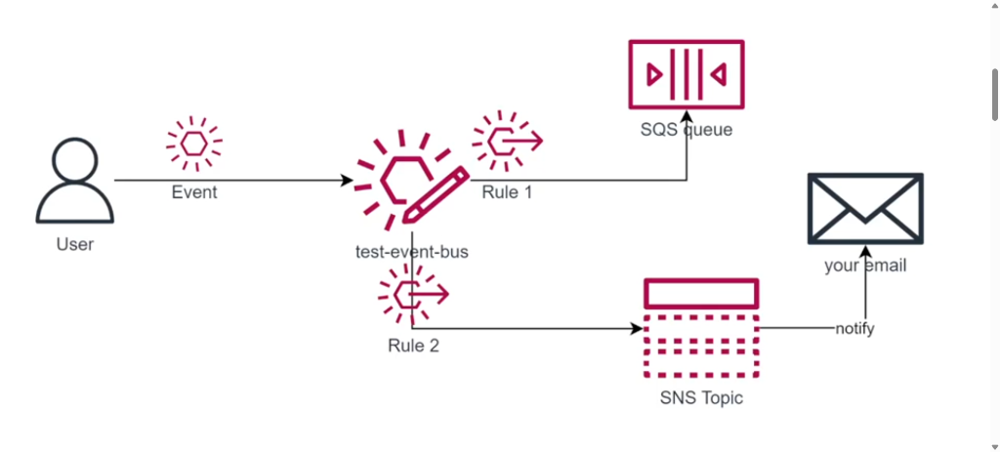
</p>

---

## II. Các bước thực hiện chi tiết

### Bước 1: Tạo Event bus

1. Truy cập dịch vụ **Amazon EventBridge** trên console -> Tại menu bên trái, chọn **Event buses** -> Nhấp vào nút **Create event bus**.

<p align="center">
  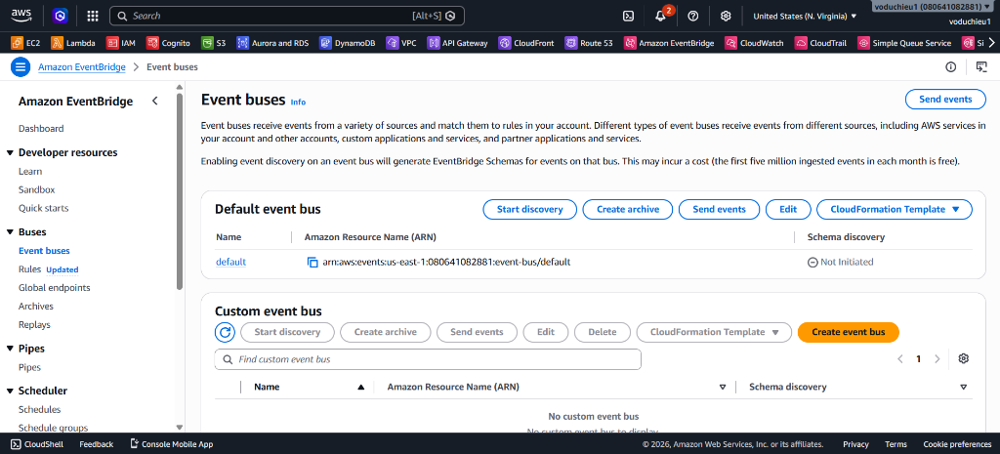
</p>

2. Tại trang cấu hình thông tin Event bus:
   * **Name:** Nhập tên là `test-event-bus`.
   * Giữ nguyên các cấu hình mặc định (như quyền hạn, logs, v.v.).
3. Kéo xuống cuối trang và nhấp chọn **Create**.

<p align="center">
  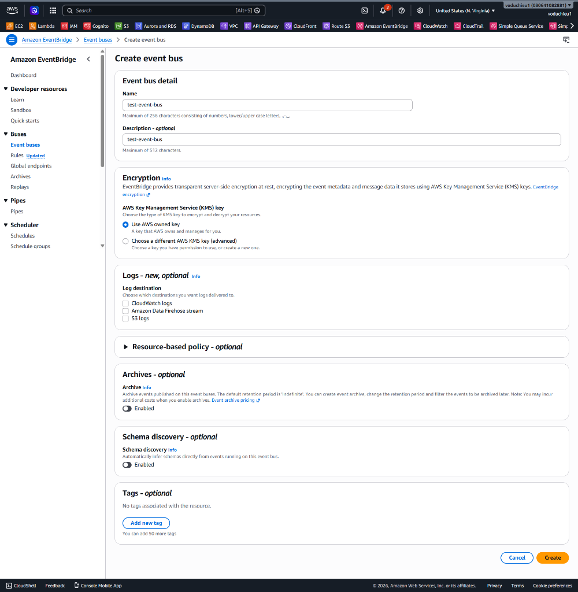
</p>

4. Sau khi tạo thành công, bạn sẽ thấy thông tin chi tiết của Event bus vừa tạo:

<p align="center">
  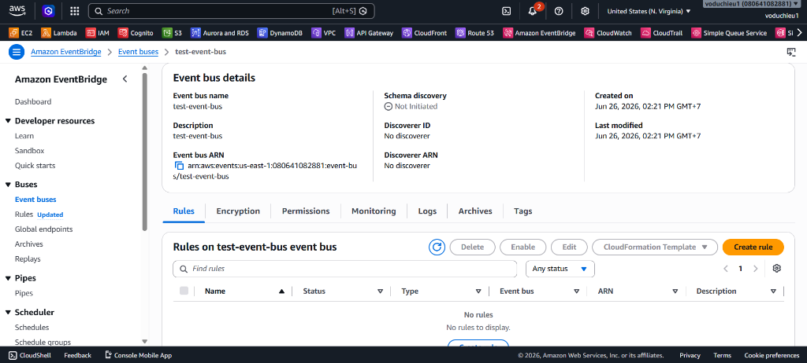
</p>

---

### Bước 2: Tạo SQS Queue

Hàng đợi SQS này sẽ được cấu hình làm target cho Rule 1 của EventBridge.

1. Mở dịch vụ **Amazon SQS (Simple Queue Service)** trong AWS Console.
2. Nhấp chọn nút **Create queue**.
3. Cấu hình thông tin cơ bản:
   * **Type:** Chọn **Standard**.
   * **Name:** Đặt tên cho queue (ví dụ: `test-sqs-queue`).
4. Giữ nguyên toàn bộ các cấu hình mặc định khác và nhấp **Create queue** ở cuối trang.

---

### Bước 3: Tạo SNS Topic và đăng ký Subscription Email

SNS Topic này sẽ được cấu hình làm target cho Rule 2 của EventBridge để thông báo tới người dùng qua email.

1. Mở dịch vụ **Amazon SNS (Simple Notification Service)**.
2. Tại menu bên trái, chọn **Topics** -> Nhấp vào nút **Create topic**.
3. Cấu hình thông tin Topic:
   * **Type:** Chọn **Standard**.
   * **Name:** Đặt tên cho topic (ví dụ: `test-sns-topic`).
4. Nhấp chọn **Create topic** để hoàn tất.
5. **Tạo Subscription Email:**
   * Ngay trong trang chi tiết của Topic vừa tạo, chuyển sang tab **Subscriptions** và nhấp chọn **Create subscription**.
   * **Protocol:** Chọn `Email`.
   * **Endpoint:** Nhập địa chỉ email cá nhân của bạn.
   * Nhấp chọn **Create subscription**.
6. **Xác nhận Email:**
   * Mở hộp thư email của bạn, tìm thư có tiêu đề "AWS Notification - Subscription Confirmation".
   * Nhấp vào đường link **Confirm subscription** trong email. Trạng thái của subscription trên console AWS sẽ chuyển sang **Confirmed**.

---

### Bước 4: Tạo Rule cho SQS

Rule này (Rule 1) sẽ có nhiệm vụ lọc các event trên `test-event-bus` nếu nội dung event có chứa thuộc tính `sendTarget` là `SQS`, và định tuyến chúng đến hàng đợi SQS.

1. Truy cập dịch vụ **Amazon EventBridge** -> Chọn **Rules** ở menu bên trái -> Nhấp chọn **Create rule**.
2. **Step 1 - Define rule detail:**
   * **Name:** Nhập `send-to-sqs-rule`.
   * **Event bus:** Chọn `test-event-bus` (Event bus bạn đã tạo ở Bước 1).
   * Nhấp **Next**.

<p align="center">
  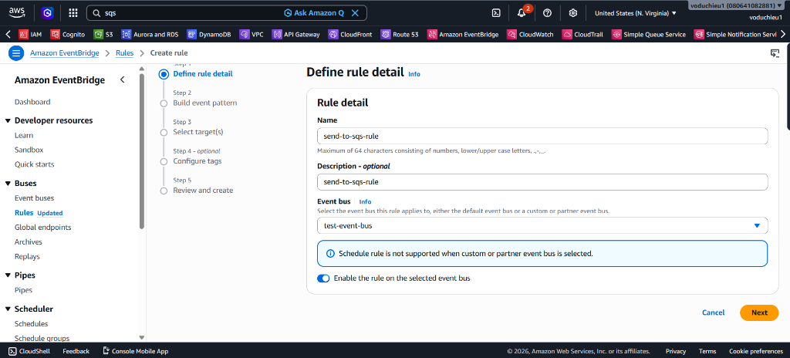
</p>

3. **Step 2 - Build event pattern:**
   * **Event source:** Chọn **Other**.
   * **Creation method:** Chọn **Custom pattern (JSON editor)**.
   * **Event pattern:** Nhập đoạn JSON cấu hình sau (Lưu ý: Bạn cần thay thế `<your-account-id>` bằng Account ID AWS của bạn hoặc copy từ file `lab1-event-bridge-filter.txt`):
     ```json
     {
       "account": ["<your-account-id>"],
       "detail": {
         "sendTarget": ["SQS"]
       }
     }
     ```
   * Nhấp **Next**.

<p align="center">
  
</p>

4. **Step 3 - Select target(s):**
   * **Target types:** Chọn **AWS service**.
   * **Select a target:** Chọn **SQS queue**.
   * **Queue:** Chọn tên queue bạn đã tạo ở Bước 2 (ví dụ: `test-sqs-queue` hoặc giống tên trong hình là `test-eventbridge-sqs`).
   * **Execution role:** Chọn **Create a new role for this specific resource**.
   * Nhấp **Next** cho đến bước Review và chọn **Create rule** để hoàn tất.

<p align="center">
  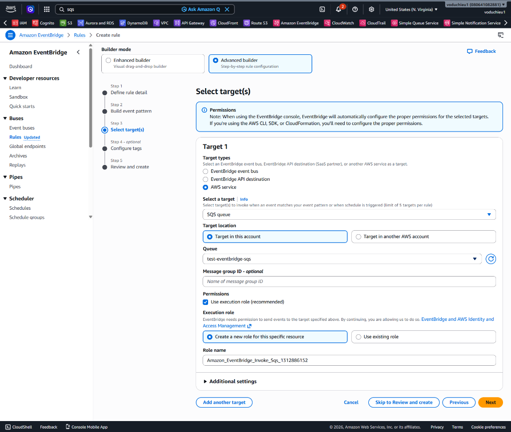
</p>

---

### Bước 5: Tạo Rule cho SNS

Rule thứ hai này (Rule 2) sẽ có nhiệm vụ lọc các event trên `test-event-bus` nếu thuộc tính `sendTarget` là `SNS`, và định tuyến chúng đến SNS Topic để gửi email.

1. Tương tự Bước 4, tại menu **Rules**, nhấp chọn **Create rule**.
2. **Step 1 - Define rule detail:**
   * **Name:** Nhập `send-to-sns-rule`.
   * **Event bus:** Chọn `test-event-bus`.
   * Nhấp **Next**.

<p align="center">
  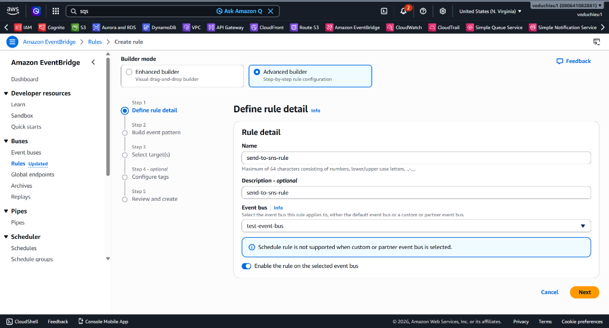
</p>

3. **Step 2 - Build event pattern:**
   * **Event source:** Chọn **Other**.
   * **Creation method:** Chọn **Custom pattern (JSON editor)**.
   * **Event pattern:** Nhập đoạn JSON sau (thay `<your-account-id>`):
     ```json
     {
       "account": ["<your-account-id>"],
       "detail": {
         "sendTarget": ["SNS"]
       }
     }
     ```
   * Nhấp **Next**.

<p align="center">
  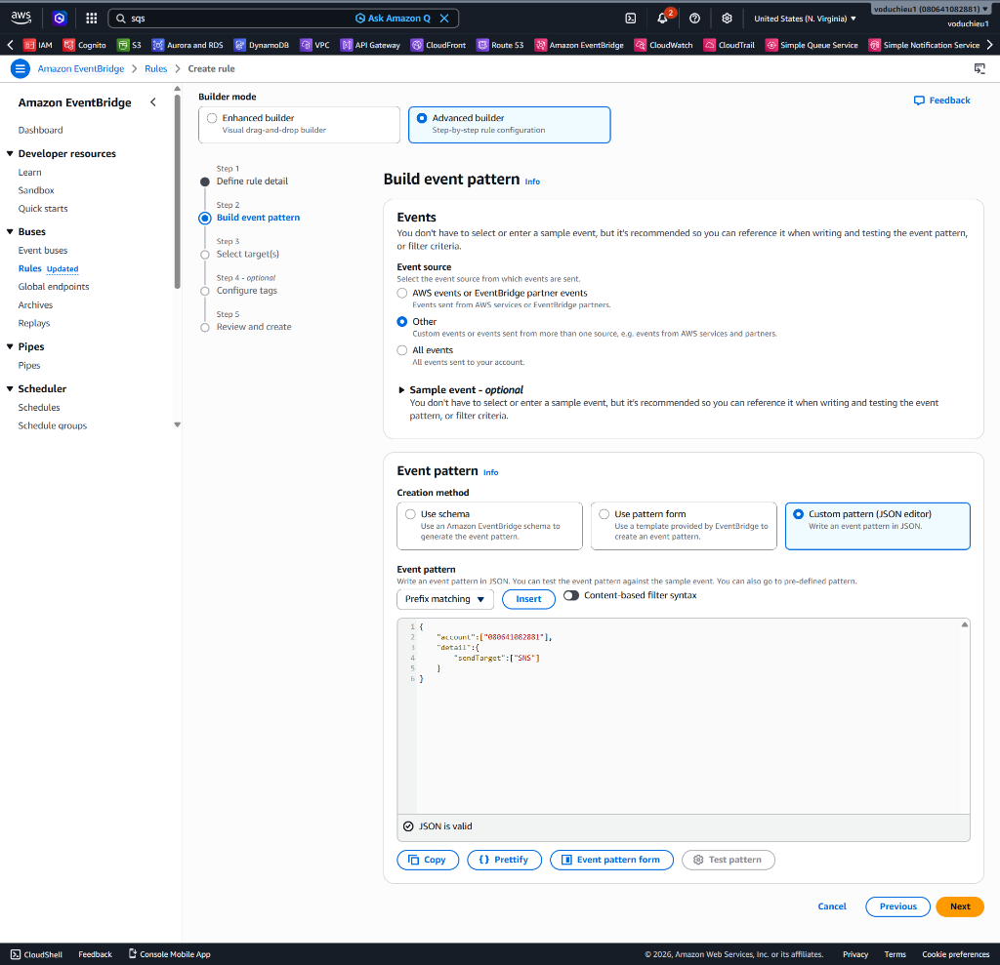
</p>

4. **Step 3 - Select target(s):**
   * **Target types:** Chọn **AWS service**.
   * **Select a target:** Chọn **SNS topic**.
   * **Topic:** Chọn tên topic bạn đã tạo ở Bước 3 (ví dụ: `test-sns-topic` hoặc giống trong hình là `test-eventbridge-sns`).
   * **Execution role:** Chọn **Create a new role for this specific resource**.
   * Nhấp **Next** đến phần cuối cùng và chọn **Create rule**.

<p align="center">
  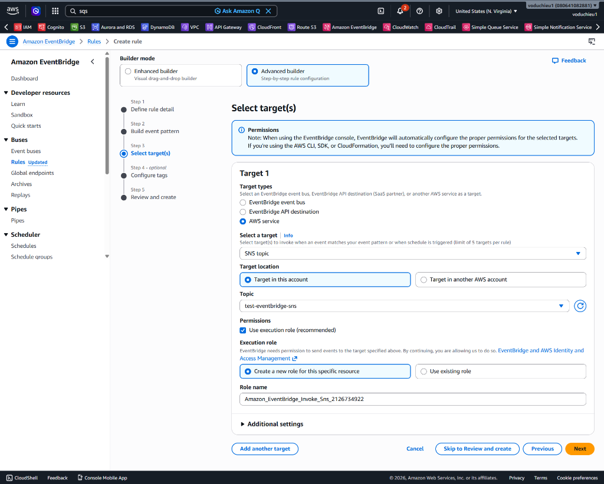
</p>

---

### Bước 6: Test (Kiểm thử)

Để kiểm thử xem hệ thống định tuyến có hoạt động đúng theo 2 Rule vừa tạo không, chúng ta sẽ gửi (Send) các event trực tiếp vào Event bus. Cả 2 message dưới đây đã được chuẩn bị sẵn trong file `lab1-event-bridge-filter.txt`.

1. Tại giao diện **Event buses**, chọn `test-event-bus` và nhấp nút **Send events** ở góc trên cùng.

<p align="center">
  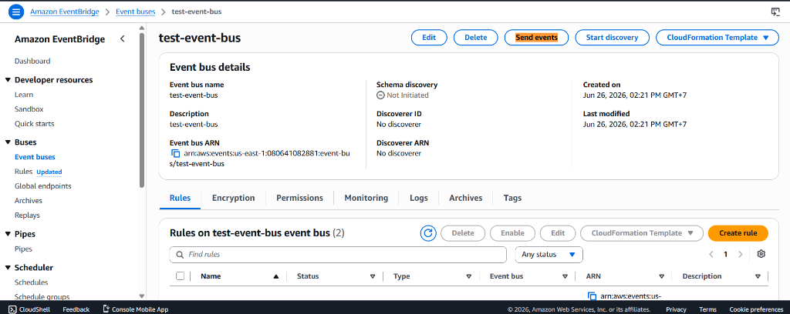
</p>

2. **Gửi Message 1 (kiểm thử định tuyến SNS):**
   * **Event source:** Nhập `my-manual`.
   * **Detail type:** Nhập `test`.
   * **Event detail (JSON):** Nhập nội dung sau để kích hoạt Rule 2:
     ```json
     {
         "name":"Hieu",
         "sendTarget":"SNS",
         "message":"This message will be sent to SNS and Email also."
     }
     ```
   * Nhấn nút **Send**. 

<p align="center">
  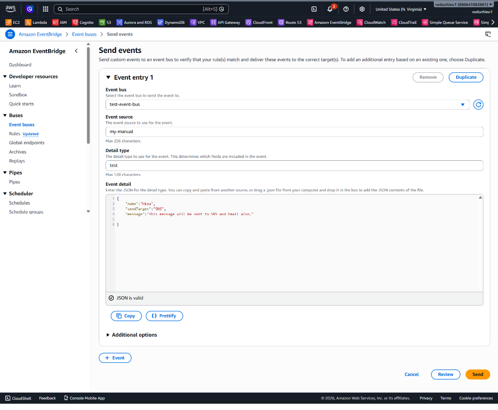
</p>

   * **Kết quả:** Bạn sẽ nhận được 1 email thông báo tại hòm thư cá nhân đã đăng ký chứa nội dung của event.

<p align="center">
  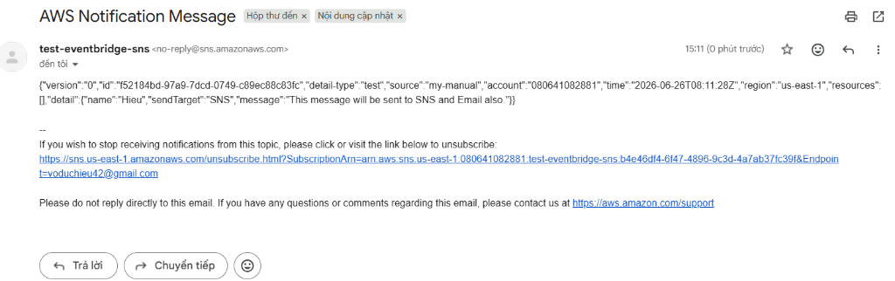
</p>

3. **Gửi Message 2 (kiểm thử định tuyến SQS):**
   * Trở lại Event bus và tiếp tục nhấp **Send events**, gửi event thứ 2 với **Event detail (JSON)** như sau để kích hoạt Rule 1:
     ```json
     {
         "name":"Hieu",
         "sendTarget":"SQS",
         "message":"This message will be sent to SQS only."
     }
     ```
   * Nhấn **Send**. 

<p align="center">
  
</p>

   * **Kết quả:** Lần này bạn sẽ **KHÔNG** nhận được email. Thay vào đó, hãy vào dịch vụ **SQS** -> Chọn Queue đã tạo -> Nhấn **Send and receive messages** -> Nhấn **Poll for messages**, bạn sẽ thấy message này xuất hiện trong hàng đợi. Nhấp vào message để xem nội dung chi tiết.

<p align="center">
  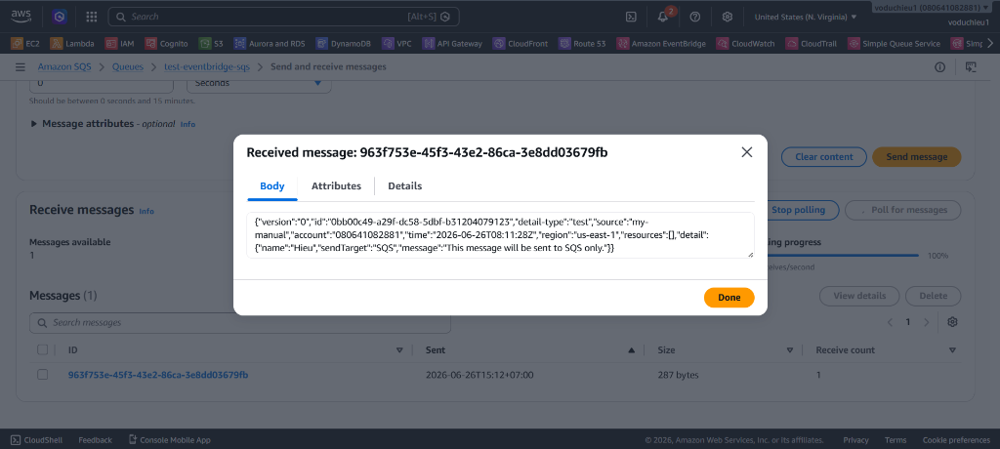
</p>

---

## III. Kết luận

Chúc mừng! Bạn đã hoàn thành toàn bộ bài thực hành:
* Thiết lập **Event bus** tuỳ chỉnh.
* Sử dụng **Event pattern** để tạo các **Rules** giúp lọc sự kiện theo nội dung (content-based filtering).
* Định tuyến thành công sự kiện đến các **Targets** khác nhau một cách linh hoạt (gửi vào hàng đợi SQS và gửi thông báo email qua SNS).
