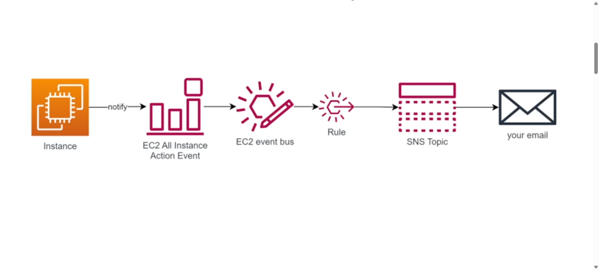
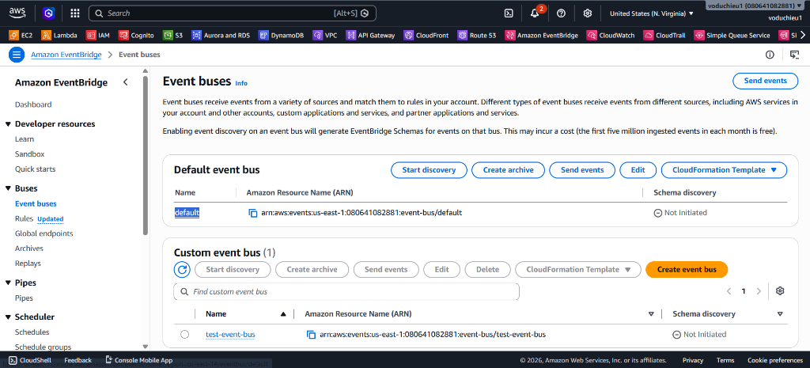
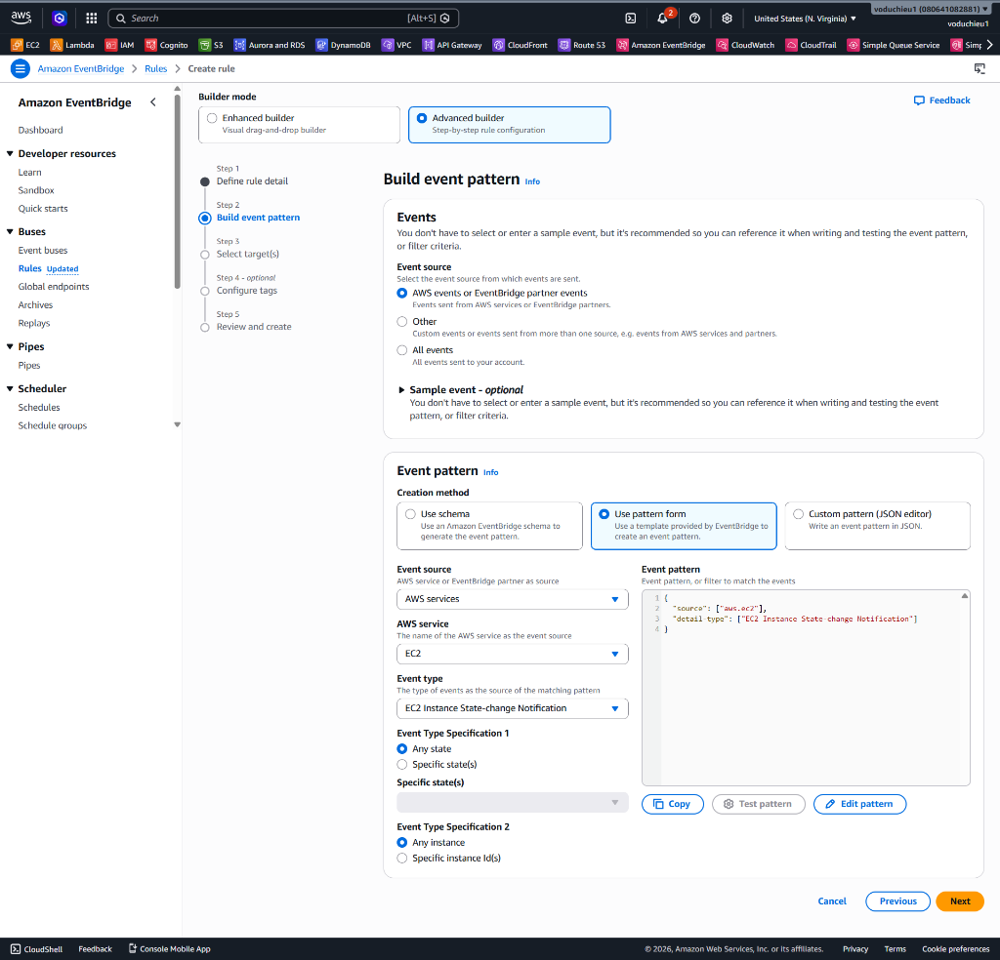
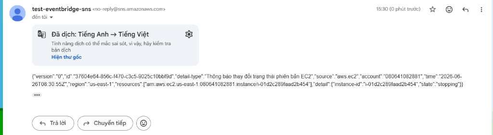

# 5. Lab 2: Capture Sự kiện (SK) với EventBridge

Bài lab này sẽ hướng dẫn bạn cách sử dụng EventBridge để bắt (capture) sự kiện thay đổi trạng thái của một EC2 instance và gửi thông báo qua email (SNS).

## Kiến trúc bài Lab

  

Quy trình hoạt động:
1. Bạn có một EC2 instance trên AWS.
2. Khi trạng thái của EC2 thay đổi (ví dụ: Stop, Start, Terminate), một Event sẽ được tự động gửi đến **Default Event Bus** của EventBridge.
3. EventBridge sẽ dùng một **Rule** để đánh giá Event này.
4. Nếu khớp với Event pattern, Rule sẽ định tuyến Event đến Target là **SNS Topic**.
5. SNS Topic sau đó sẽ gửi email thông báo trạng thái của EC2 cho bạn.

---

## I. Chuẩn bị tài nguyên

### 1. Tạo EC2
Để bắt sự kiện của EC2, bạn cần có ít nhất một EC2 instance.
1. Truy cập dịch vụ **EC2** trên AWS Console.
2. Nhấp **Launch instance** để tạo một instance mới (có thể dùng cấu hình mặc định như Amazon Linux 2023, t2.micro).
3. Đảm bảo instance đã được khởi chạy và đang ở trạng thái `Running`.

### 2. Tạo SNS Topic và Subscription (Tuỳ chọn nếu chưa có)
*Lưu ý: Nếu bạn đã làm Lab 1 và có sẵn SNS Topic (ví dụ `test-eventbridge-sns`) cùng Email Subscription, bạn có thể tái sử dụng nó.*

---

## II. Cấu hình EventBridge

### 1. Kiểm tra Default Event Bus
Với các dịch vụ nội bộ của AWS (như EC2), các event sẽ tự động được gửi đến Event Bus có tên là `default`.

1. Truy cập dịch vụ **EventBridge**.
2. Mở tab **Event buses**.
3. Bạn sẽ thấy `default` event bus đã có sẵn.

  

### 2. Tạo Rule bắt sự kiện EC2
Chúng ta sẽ tạo một Rule trên `default` Event Bus để bắt mọi thay đổi trạng thái của EC2.

1. Tại menu bên trái của EventBridge, chọn **Rules** và nhấp **Create rule**.
2. **Step 1 - Define rule detail:**
   * **Name:** Đặt tên cho Rule (ví dụ: `Capture-EC2-State-Change`).
   * **Event bus:** **QUAN TRỌNG:** Phải chọn `default`.
   * **Rule type:** Chọn **Rule with an event pattern**.
   * Nhấp **Next**.

3. **Step 2 - Build event pattern:**
   * **Event source:** Chọn **AWS services**.
   * **AWS service:** Chọn **EC2**.
   * **Event type:** Chọn **EC2 Instance State-change Notification**.
   * **Event Type Specification 1:** Chọn **Any state** (bắt tất cả các trạng thái như pending, running, stopping, stopped, v.v.).
   * **Event Type Specification 2:** Chọn **Any instance** (áp dụng cho mọi EC2 instance trong tài khoản).
   * Đoạn Event pattern bên phải sẽ tự động sinh ra đoạn JSON bắt sự kiện tương ứng.
   * Nhấp **Next**.

  

4. **Step 3 - Select target(s):**
   * **Target types:** Chọn **AWS service**.
   * **Select a target:** Chọn **SNS topic**.
   * **Topic:** Chọn SNS topic dùng để nhận email (ví dụ: `test-eventbridge-sns`).
   * Nhấp **Next** đến cuối và nhấp **Create rule**.

---

## III. Kiểm tra (Test)

Để xác minh hệ thống hoạt động, chúng ta sẽ thực hiện việc thay đổi trạng thái của EC2 instance vừa tạo.

1. Quay lại giao diện quản lý của dịch vụ **EC2**.
2. Chọn EC2 instance của bạn.
3. Ở góc trên cùng bên phải, nhấp vào **Instance state** -> **Stop instance** (để dừng máy).
4. **Kết quả:** Ngay khi máy ảo chuyển sang trạng thái `stopping` và sau đó là `stopped`, EventBridge sẽ nhận được sự kiện, kích hoạt Rule và gửi dữ liệu sang SNS.
5. Kiểm tra hòm thư email của bạn. Bạn sẽ nhận được các email thông báo chi tiết dưới định dạng JSON về việc thay đổi trạng thái của EC2 instance (như hình dưới đây).

  

## IV. Kết luận
Trong bài lab này, bạn đã học được cách làm việc với `default` Event Bus của AWS để tự động hoá việc bắt các sự kiện (Events) phát sinh từ các dịch vụ AWS có sẵn (cụ thể là EC2). Bạn cũng đã biết cách gửi cảnh báo tự động về email của quản trị viên khi có máy chủ thay đổi trạng thái.
