# 5. Lab 1: Triển khai ứng dụng lên Elastic Beanstalk

Bài Lab này sẽ hướng dẫn bạn cách khởi tạo và triển khai một ứng dụng Node.js đơn giản (sử dụng file `app.js` bạn đã tạo) lên môi trường AWS Elastic Beanstalk.

---

## 1. Tạo Application

1. Đăng nhập vào AWS Console và truy cập dịch vụ **Elastic Beanstalk**.
2. Tại màn hình chính của Elastic Beanstalk, nhấp vào nút **Create application**.

  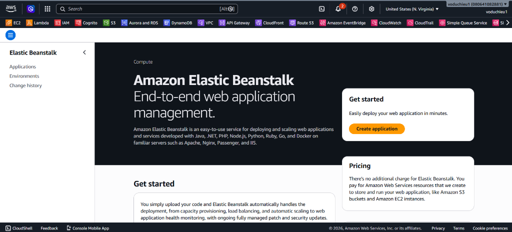

3. **Step 1 - Configure environment:**
   * **Environment tier:** Chọn **Web server environment**.
   * **Application information:** 
     * **Application name:** Đặt tên cho ứng dụng, ví dụ: `demo-app`.
   * **Environment information:** 
     * **Environment name:** Để mặc định (ví dụ: `Demo-app-env`).
     * **Domain:** Nhập tên miền mong muốn (ví dụ: `hieu-demo`) và nhấp **Check availability** để đảm bảo tên miền khả dụng.
   * **Platform:**
     * **Platform:** Chọn **Node.js**.
     * **Platform branch** & **Platform version:** Để mặc định theo đề xuất (Recommended).
   * **Application code:** 
     * Chọn **Upload your code** -> **Local file**.
     * Nhấp **Choose file** và tải lên file mã nguồn `app.js` của bạn.
   * **Presets:** Chọn **Single instance (free tier eligible)** để tiết kiệm chi phí.
   * Nhấp **Next**.

  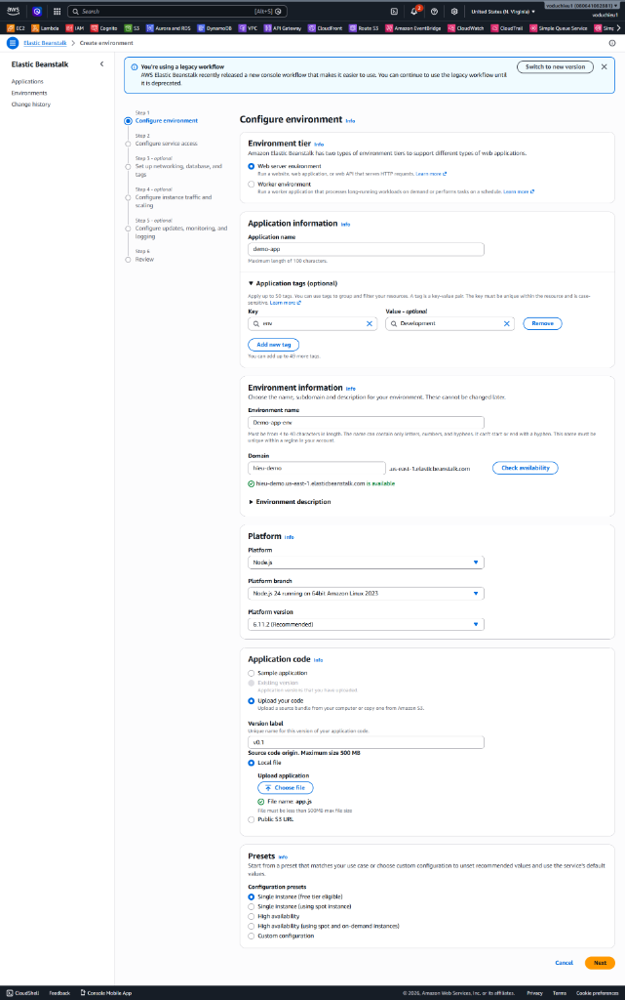

4. **Step 2 - Configure service access (Tạo Role cho Elastic Beanstalk):**
   Tại bước này, Elastic Beanstalk cần các IAM Roles để cấp quyền cho Service thực thi và EC2 tạo tài nguyên. Nếu bạn chưa có sẵn các Roles, bạn cần tạo mới chúng.
   

  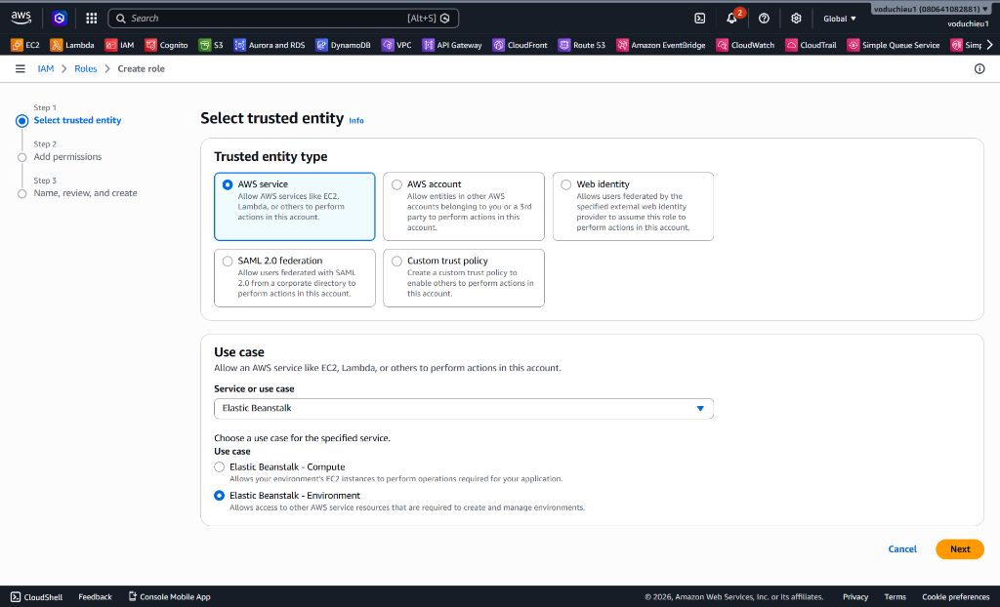

   **Cách tạo Role mới (nếu chưa có):**
   * Đối với **Service role** hoặc **EC2 instance profile**, nhấp vào **Create role** (hoặc mở một tab mới truy cập **IAM > Roles > Create role**).
   * Trong giao diện tạo Role:
     * **Trusted entity type:** Chọn **AWS service**.
     * **Use case:** Chọn **Elastic Beanstalk**. Chọn tiếp use case cụ thể (Compute hoặc Environment) tương ứng với loại Role đang tạo.
     * Hoàn thành các bước để tạo Role.

  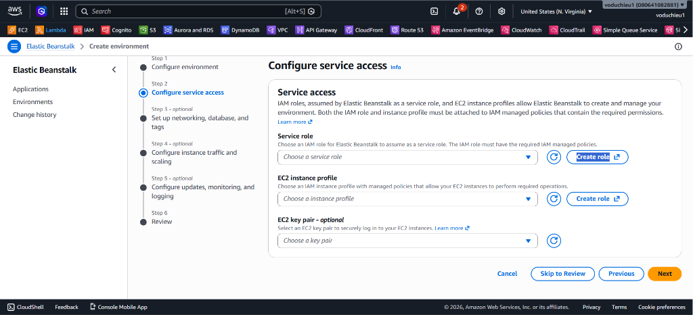

   **Gán Role đã tạo:**
   * Quay lại tab cấu hình Elastic Beanstalk, nhấn nút Refresh để tải lại danh sách Role.
   * **Service role:** Chọn `aws-elasticbeanstalk-service-role`.
   * **EC2 instance profile:** Chọn `aws-elasticbeanstalk-ec2-role`.
   * **EC2 key pair:** Chọn key pair SSH hiện có (ví dụ: `test`).
   * Nhấp **Next**.

  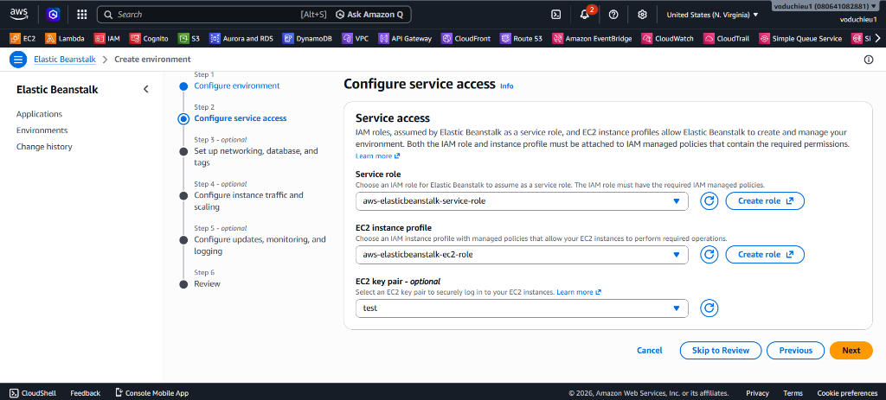

5. **Step 3 - Set up networking, database, and tags:**
   * **VPC:** Chọn VPC mặc định của bạn (Default VPC). Nếu chưa có VPC, bạn có thể nhấp vào **Create VPC** để tạo một cái mới.
   * **Instance subnets:** Chọn tất cả các Subnets khả dụng (tick tất cả các Availability Zones) để tăng cường tính sẵn sàng (High Availability).
   * **Public IP address:** Chọn **Enabled** để EC2 instance của bạn được cấp Public IP và có thể truy cập được từ bên ngoài.
   * **Database:** Ở bài Lab này để đơn giản, ta không cần tích hợp Database. Bỏ chọn "Enable database".
   * Nhấp **Next**.

  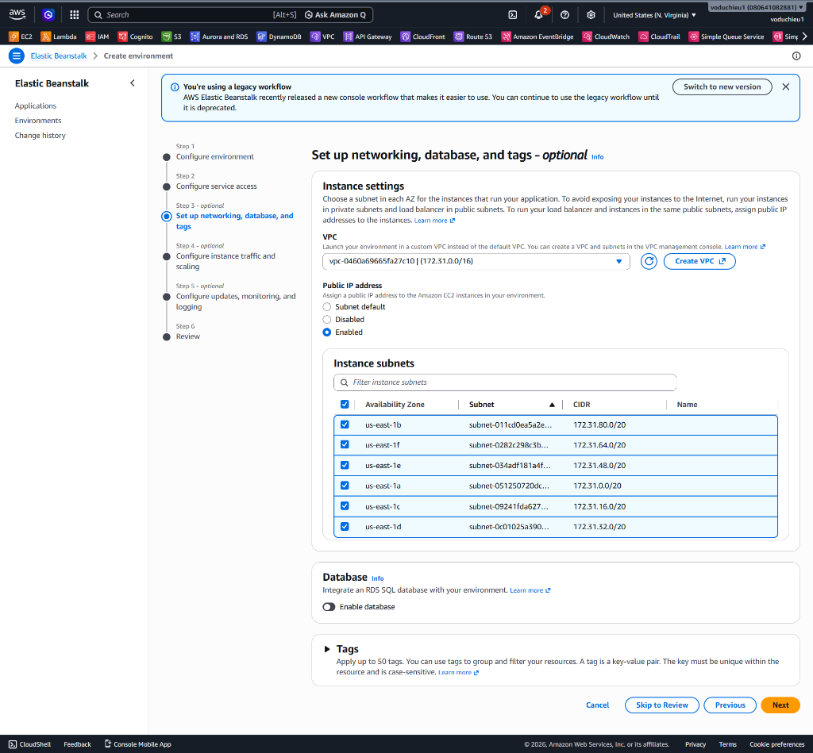

6. **Step 4 - Configure instance traffic and scaling:**
   * **Root volume (boot device):** Để mặc định (Container default, SSD).
   * **Amazon CloudWatch monitoring:** Chọn thời gian lấy số liệu (ví dụ: 5 minute).
   * **EC2 security groups:** Chọn Security Group mặc định (default VPC security group) hoặc tạo SG riêng cho phép truy cập HTTP.
   * **Capacity - Auto scaling group:** Chọn **Single instance** (như cấu hình ban đầu).
   * **Instance types:** Chọn `t2.micro` hoặc `t2.small` (tuỳ thuộc vào Free tier của bạn).
   * Nhấp **Next**.

  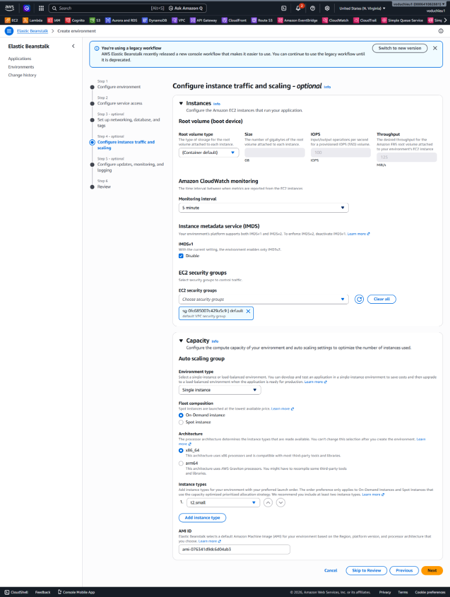

7. **Step 5 - Configure updates, monitoring, and logging:**
   * **Health reporting:** Chọn **Basic** (hệ thống monitor mức cơ bản).
   * **Managed platform updates:** Có thể tắt (Disable) hoặc để mặc định để tự động cập nhật hệ điều hành, nền tảng.
   * Các thiết lập khác để mặc định.
   * Nhấp **Next**.

  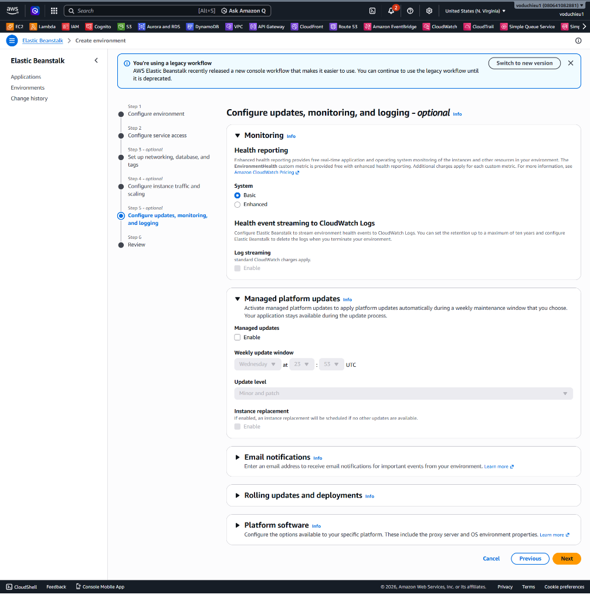

8. **Step 6 - Review:**
   * Xem lại toàn bộ cấu hình đã thiết lập.
   * Nhấp **Submit** (hoặc **Create**) để Elastic Beanstalk bắt đầu quá trình tạo Environment. Quá trình này sẽ mất vài phút.

---

## 2. Cấu hình Load Balancer cho Environment (Enable Load Balancer)

Mặc định khi bạn chọn cấu hình "Single instance" để tiết kiệm, Elastic Beanstalk sẽ không khởi tạo Application Load Balancer (ALB) và domain sẽ trỏ trực tiếp đến EC2 instance. Nếu deploy như thế này sẽ khá bất tiện vì không hỗ trợ tốt Auto Scaling và định tuyến phức tạp. Do đó, chúng ta sẽ cấu hình **Enable Load Balancer**.

1. Tại giao diện **Elastic Beanstalk**, chọn mục **Environments** ở menu bên trái.
2. Nhấp vào tên Environment của bạn (ví dụ: `Demo-app-env`).
3. Trong menu chi tiết của Environment, chọn **Configuration**.
4. Tìm đến mục **Instance traffic and scaling**, nhấp nút **Edit**.

  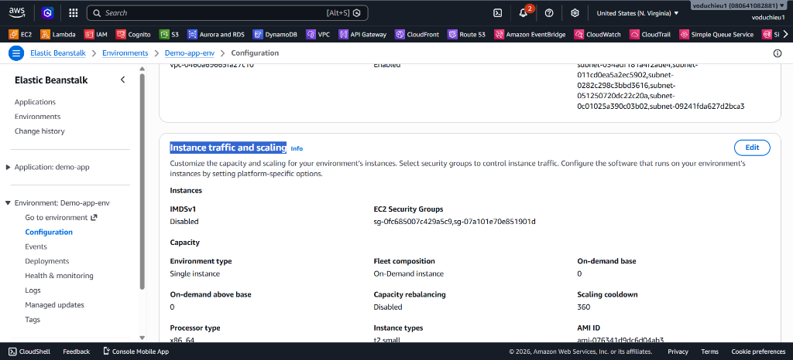

5. Tại phần chỉnh sửa, bạn cần lưu ý sửa thông tin sau:
   * Kéo xuống phần **Capacity > Auto scaling group > Environment type:** Chuyển từ *Single instance* sang **Load balanced**.

6. Tiếp tục tìm mục **Processes** trong phần Configuration, nhấp nút **Edit** ở process mặc định (default).
   * **Port:** Đổi từ mặc định sang **`5000`** (vì code ứng dụng đang lắng nghe trên cổng này hoặc để tương thích với Load Balancer trỏ vào).
   * Nhấp **Save** và **Apply** các thiết lập. Elastic Beanstalk sẽ bắt đầu quá trình cập nhật môi trường và khởi tạo Load Balancer.

  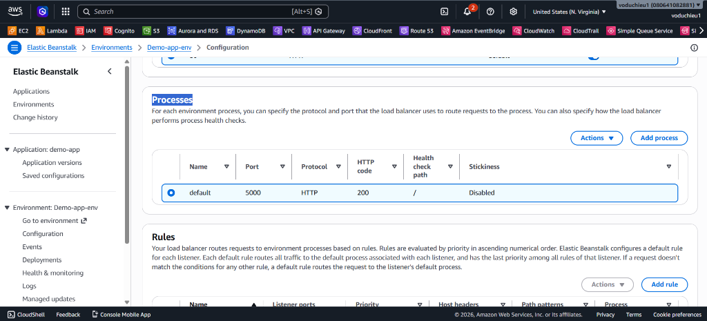

---

## 3. Kiểm tra (Test) Load Balancer
Để xem Load Balancer đã được tạo và liên kết thành công hay chưa:
1. Truy cập dịch vụ **EC2**.
2. Ở menu bên trái, phần **Load Balancing**, chọn **Load Balancers**.
3. Chọn Load Balancer vừa được Elastic Beanstalk tự động tạo ra (thường có tên bắt đầu bằng `awseb-...`).
4. Chuyển sang tab **Resource Map**. Tại đây bạn sẽ thấy kiến trúc định tuyến: Traffic từ Listener (HTTP:80) được chuyển (Forward) đến Target Group chứa EC2 instance của bạn. Đảm bảo trạng thái báo **Healthy**.

  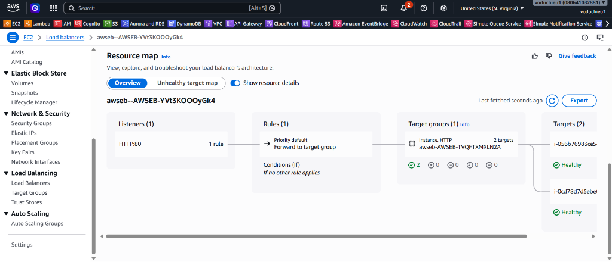

---

## 4. Kiểm tra ứng dụng bằng đường dẫn của Elastic Beanstalk
Sau khi môi trường chuyển sang trạng thái "Ok" (màu xanh lá):

1. Quay lại trang tổng quan của Environment trên Elastic Beanstalk.
2. Nhấp vào đường dẫn URL (Domain) nằm dưới tên của Environment (ví dụ: `hieu-demo.us-east-1.elasticbeanstalk.com`).
3. Trình duyệt sẽ hiển thị nội dung trang chủ được phục vụ từ file `app.js` với dòng chữ **"Welcome to Website v0.1"**.

  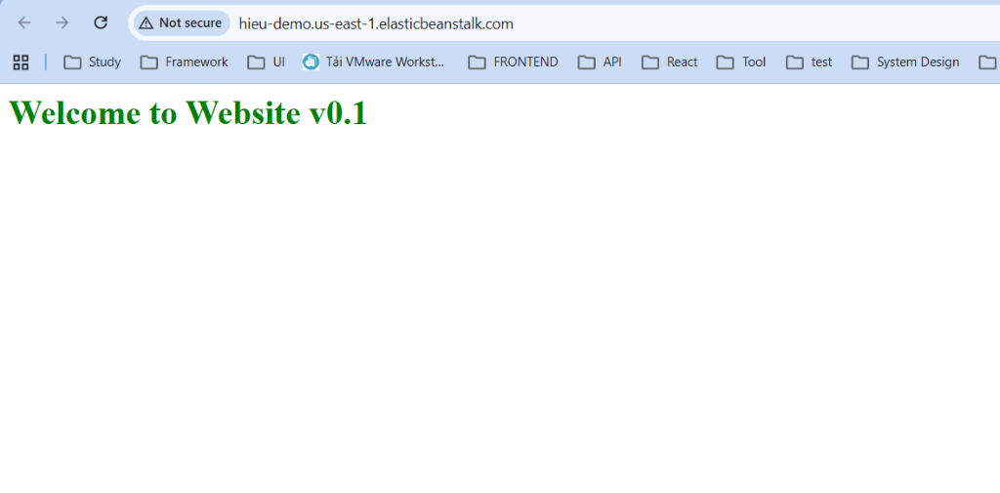

**Chúc mừng!** Bạn đã hoàn thành Lab 1: Triển khai thành công ứng dụng Node.js lên AWS Elastic Beanstalk và cấu hình Load Balancer một cách hoàn chỉnh.
