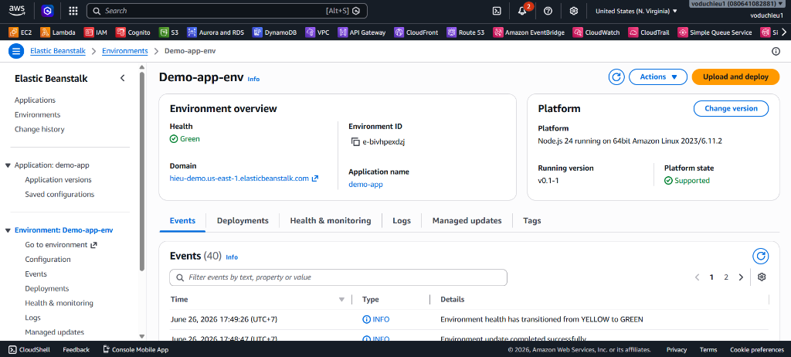
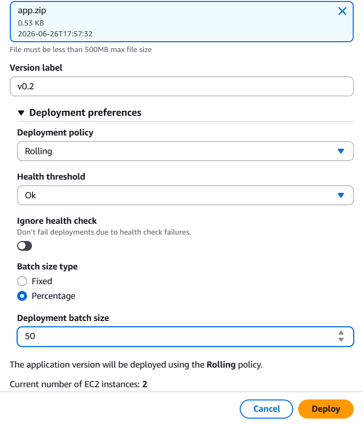

# 6. Lab 2: Update Version ứng dụng

Trong bài Lab này, chúng ta sẽ thực hành cách cập nhật (deploy) một phiên bản mới của mã nguồn lên môi trường Elastic Beanstalk đang chạy bằng chính sách **Rolling deployment**.

---

## 1. Chỉnh sửa Source code (Local)
1. Mở file `app.js` ở máy local của bạn.
2. Sửa đổi đoạn nội dung web trả về để nhận diện sự thay đổi (ví dụ: chuyển từ `v0.1` sang `v0.2`). 
   Như trong file hiện tại, bạn có thể thay đổi một đoạn bất kỳ:
   ```javascript
   // ...
   res.write('<html><body><h1 style="color:green;">Welcome to Website v0.2</h1></body></html>');
   // ...
   ```
3. Sau khi chỉnh sửa xong, hãy lưu file lại và nén (zip) file `app.js` thành `app.zip` để chuẩn bị upload. *(Lưu ý: chỉ nén file bên trong, không nén cả thư mục ngoài)*.

---

## 2. Cập nhật môi trường (Upload and Deploy)
Sau khi đã có file mã nguồn mới nén dưới dạng `app.zip`, ta tiến hành deploy lên Elastic Beanstalk.

1. Quay lại AWS Console, truy cập **Elastic Beanstalk** > **Environments**.
2. Chọn Environment bạn đang chạy (ví dụ: `Demo-app-env`).
3. Tại trang tổng quan (Dashboard) của Environment, nhấn nút **Upload and deploy**.

<p align="center">
  
</p>

4. Cửa sổ cấu hình triển khai sẽ hiện ra, bạn cần thiết lập:
   * **Choose file:** Tải lên file nén `app.zip` vừa tạo.
   * **Version label:** Đặt tên phiên bản mới (ví dụ: `v0.2`).
   * **Deployment preferences (Cấu hình nâng cao):**
     * **Deployment policy:** Chọn **Rolling** (Rolling deployment sẽ update dần dần từng phần các instance thay vì làm gián đoạn tất cả cùng lúc).
     * **Health threshold:** Chọn **Ok**.
     * **Batch size type:** Chọn **Percentage** (hoặc Fixed tuỳ thiết kế).
     * **Deployment batch size:** Để `50` (Tức là cập nhật 50% số lượng EC2 instance một lần roll, đảm bảo ứng dụng vẫn có instance phục vụ).
   * Nhấp **Deploy** để hệ thống bắt đầu quy trình cập nhật.

<p align="center">
  
</p>

Elastic Beanstalk sẽ bắt đầu Deploy. Khi sự kiện báo thành công (Health về trạng thái Green), bạn có thể truy cập lại URL của ứng dụng ở trình duyệt để thấy trang web đã được nâng cấp lên `v0.2`.
