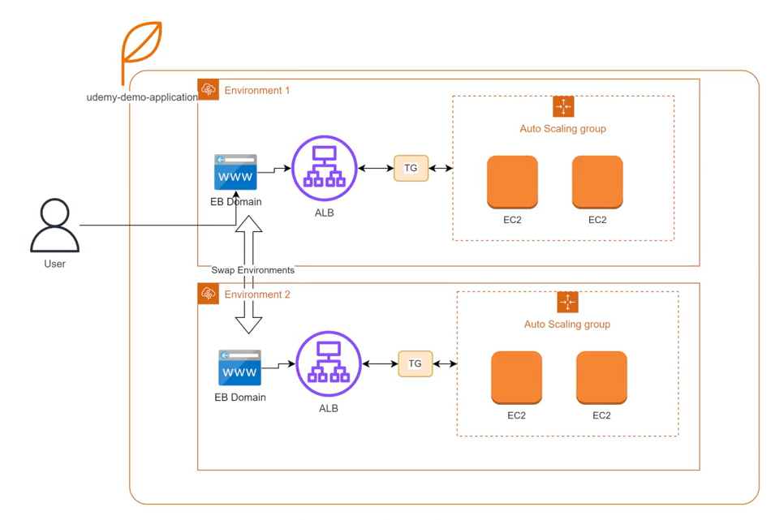
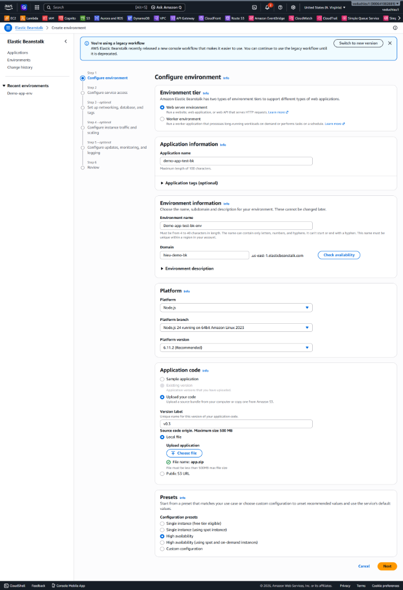
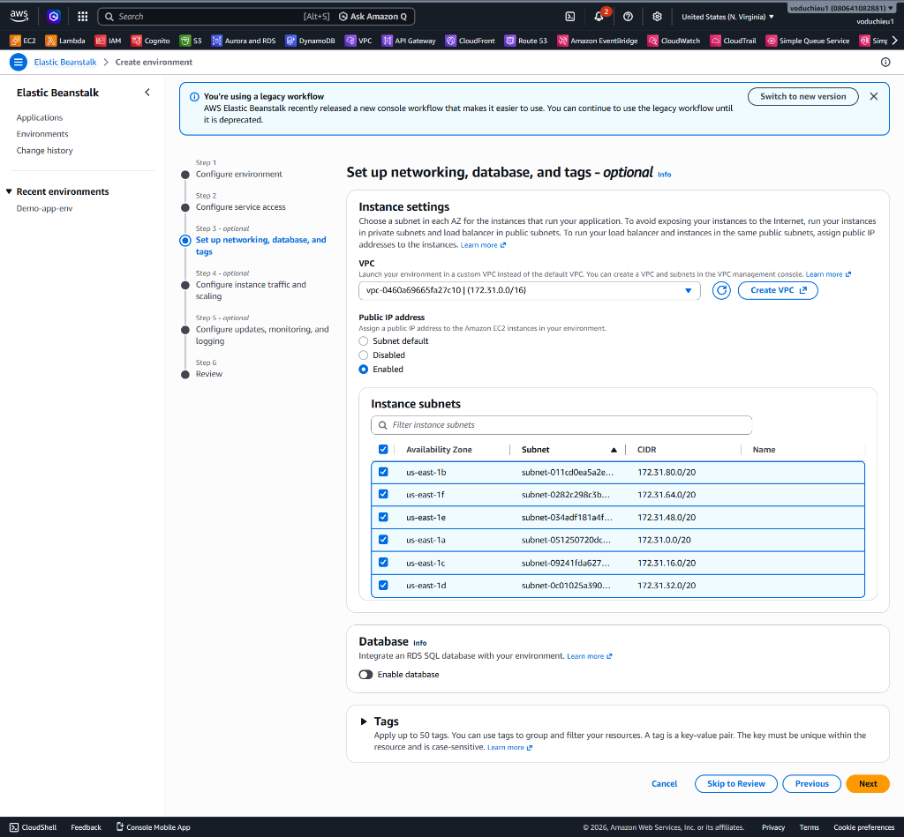
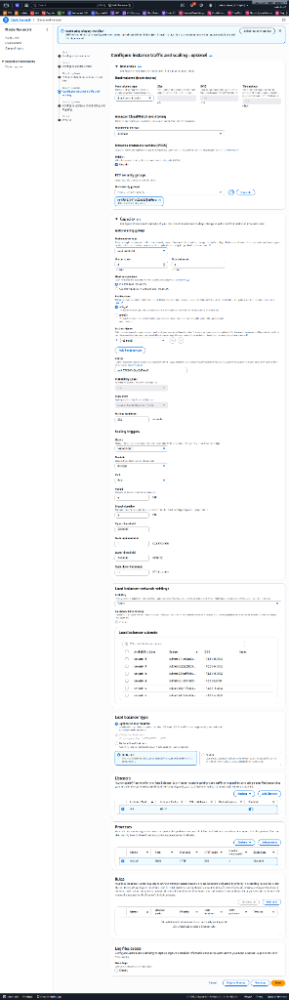
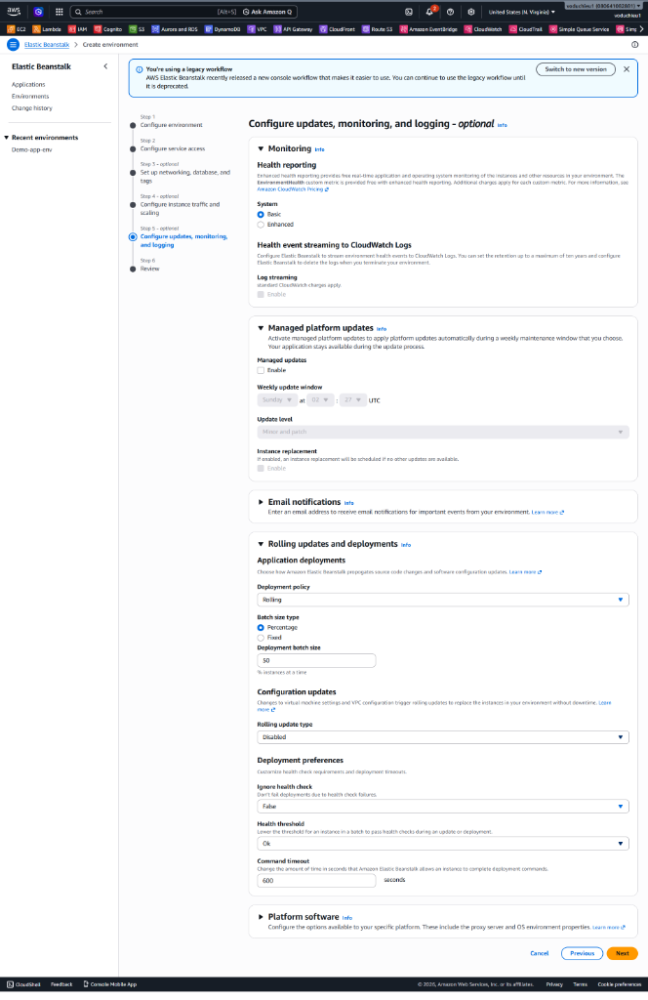
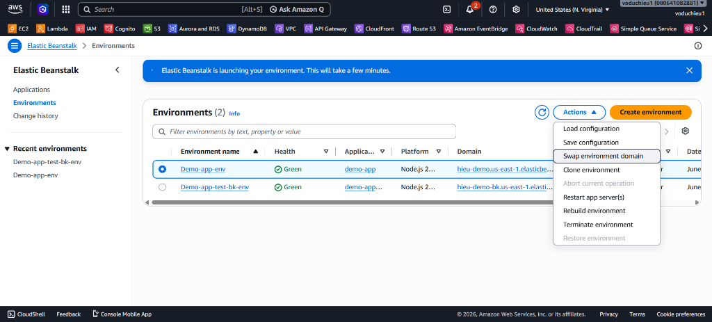
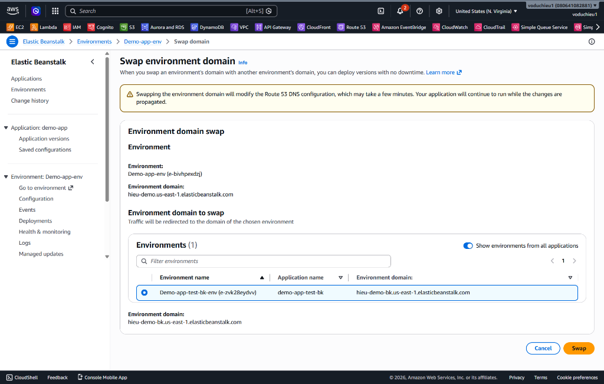
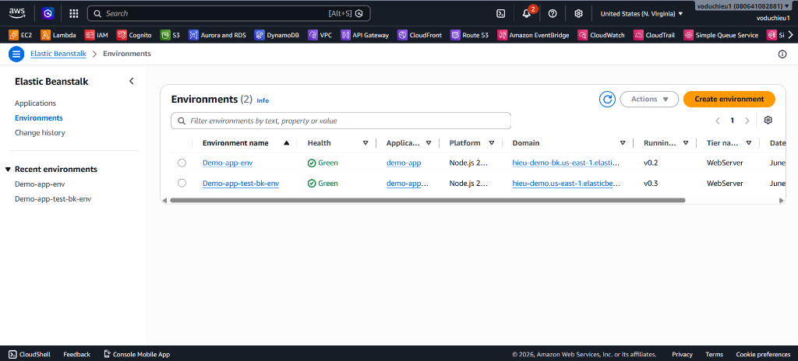
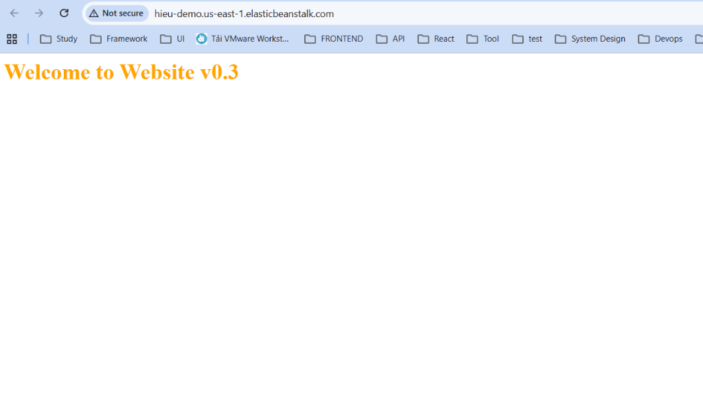
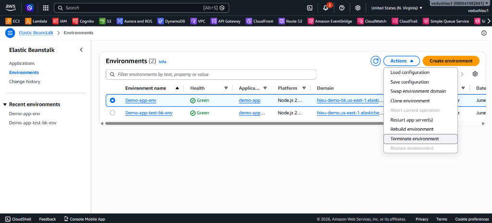

# 7. Lab 3: Blue / Green Deployment

Trong bài Lab này, chúng ta sẽ thực hành phương pháp **Blue/Green Deployment** với AWS Elastic Beanstalk. 
Phương pháp này giúp giảm thiểu downtime và rủi ro bằng cách chạy đồng thời hai môi trường giống hệt nhau (một môi trường **Blue** đang chạy bản cũ và môi trường **Green** chạy bản mới). Bạn có thể dễ dàng chuyển đổi qua lại giữa hai môi trường bằng cách hoán đổi URL (Swap Environment URLs).

<p align="center">
  
</p>

---

## 1. Cập nhật Source Code (Tạo version mới)
1. Mở file `app.js` trong thư mục code ở máy local của bạn.
2. Sửa thông báo trả về để nhận biết đây là phiên bản mới (ví dụ: chuyển sang `v0.3`):
   ```javascript
   // ...
   res.write('<html><body><h1 style="color:orange;">Welcome to Website v0.3</h1></body></html>');
   // ...
   ```
3. Lưu file và nén `app.js` thành `app.zip` để chuẩn bị cho quá trình upload.

---

## 2. Tạo Environment mới (Môi trường Green)
Thay vì deploy đè lên môi trường hiện tại (môi trường Blue), chúng ta sẽ tạo hẳn một môi trường hoàn toàn mới (Green) và deploy mã nguồn version `v0.3` lên đó.

1. Tại màn hình chính của AWS Console, truy cập vào **Elastic Beanstalk**.
2. Chọn mục **Environments** ở thanh menu bên trái, sau đó nhấn **Create environment** để bắt đầu.

**Step 1: Configure environment**
* **Environment tier:** Chọn *Web server environment*.
* **Application name:** Đặt tên ứng dụng (vd: `demo-app-test-bk`).
* **Environment name:** Đặt tên môi trường mới (vd: `Demo-app-test-bk-env`).
* **Domain:** Khai báo một sub-domain mới để test riêng biệt (vd: `hieu-demo-bk`).
* **Platform:** Chọn nền tảng *Node.js*.
* **Application code:** Chọn **Upload your code** > Tải file `app.zip` (version 0.3) lên và đặt Version label tương ứng (vd: `v0.3`).
* Nhấp **Next**.

<p align="center">
  
</p>

*(Tại Step 2: Configure service access - Hãy chọn các quyền Service Role, EC2 Key pair và IAM Instance Profile tương tự như bài Lab 1, sau đó Next)*

**Step 3: Set up networking, database, and tags**
* **VPC:** Chọn Default VPC của bạn.
* **Public IP address:** Chọn **Enabled**.
* **Instance subnets:** Tick chọn tất cả các Subnets (Availability Zones) khả dụng.
* Bỏ qua phần Database. Nhấp **Next**.

<p align="center">
  
</p>

**Step 4: Configure instance traffic and scaling**
* Cấu hình tương tự Lab 1, tại **Capacity > Auto scaling group > Environment type** bạn có thể đổi thành **Load balanced** để sử dụng ALB và Auto Scaling.
* Các mục khác tạm giữ mặc định, nhấp **Next**.

<p align="center">
  
</p>

**Step 5: Configure updates, monitoring, and logging**
* **Health reporting:** Chọn **Basic**.
* Cuộn xuống dưới cùng và nhấp **Next**.

<p align="center">
  
</p>

**Step 6: Review**
* Tại trang tổng quan, hãy kiểm tra lại toàn bộ cấu hình.
* Nhấp **Submit** (hoặc **Create**) để AWS Elastic Beanstalk tiến hành tạo môi trường.

Quá trình khởi tạo môi trường Green sẽ mất vài phút. Sau khi thanh trạng thái chuyển sang **Ok** (Green), bạn có thể nhấp vào URL của môi trường mới để xác nhận trang web hiện dòng chữ *"Welcome to Website v0.3"*.

---

## 3. Thử Swap Environment Domains (Hoán đổi URL)
Khi môi trường Green (chạy `v0.3`) đã sẵn sàng và được test thành công thông qua Domain phụ, chúng ta sẽ tiến hành Swap (Hoán đổi) Domain giữa môi trường Blue (cũ) và Green (mới) để định tuyến toàn bộ lưu lượng người dùng sang bản mới mà không làm gián đoạn hệ thống. Việc này thực chất là hoán đổi CNAME record.

1. Truy cập lại trang danh sách **Environments** hoặc vào trang chi tiết của môi trường.
2. Chọn môi trường cũ (ví dụ: `Demo-app-env` đang chạy bản cũ).
3. Ở menu thả xuống **Actions** ở góc trên cùng bên phải, chọn **Swap environment domain**.

<p align="center">
  
</p>

4. Cửa sổ Swap sẽ hiện ra. Tại mục **Environment domain to swap**, hãy chọn môi trường mới (ví dụ: `Demo-app-test-bk-env`).
5. Nhấn nút **Swap**. Quá trình này sẽ hoán đổi tên miền của 2 môi trường cho nhau trên cấu hình DNS.

<p align="center">
  
</p>

6. Đợi một lát để DNS cập nhật. Tại trang danh sách Environments, bạn sẽ thấy tên miền chính của ứng dụng (`hieu-demo.us-east-1.elasticbeanstalk.com`) giờ đây đã được gán (trỏ) tới môi trường mới (`Demo-app-test-bk-env`).

<p align="center">
  
</p>

7. Truy cập lại tên miền chính bằng trình duyệt, bạn sẽ thấy kết quả trả về của phiên bản cập nhật mới (ví dụ: *"Welcome to Website v0.3"*). Quá trình cập nhật hệ thống đã thành công mà user không hề cảm thấy downtime!

<p align="center">
  
</p>

---

## 4. Terminate Môi trường cũ (Dọn dẹp tài nguyên)
Sau khi Swap thành công và theo dõi thấy môi trường mới chạy ổn định (không có lỗi), môi trường cũ (Blue) lúc này đóng vai trò là bản backup. Tuy nhiên, nếu giữ lại chạy song song sẽ gây tốn kém chi phí vô ích. Do đó, ta sẽ tiến hành dọn dẹp nó.

1. Tại danh sách **Environments**, chọn môi trường cũ (lúc này mang domain tạm, ví dụ `Demo-app-env`).
2. Nhấp vào menu **Actions** và chọn **Terminate environment**.

<p align="center">
  
</p>

3. Xác nhận thao tác bằng cách gõ tên môi trường vào khung yêu cầu để tiến hành xóa. 

**Kết luận:** Vậy là bạn đã hoàn tất toàn bộ chu trình **Blue / Green Deployment**, cập nhật bản release mới cực kỳ an toàn và giải phóng tài nguyên sau khi nâng cấp xong.
