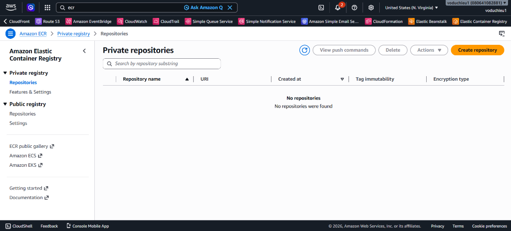
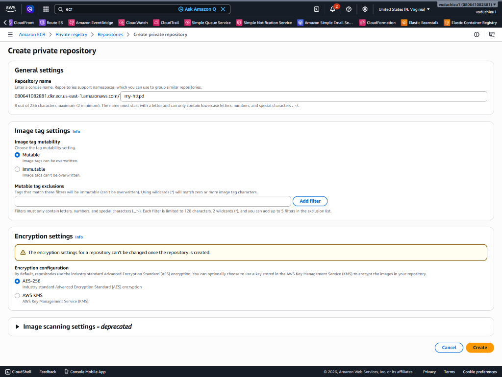
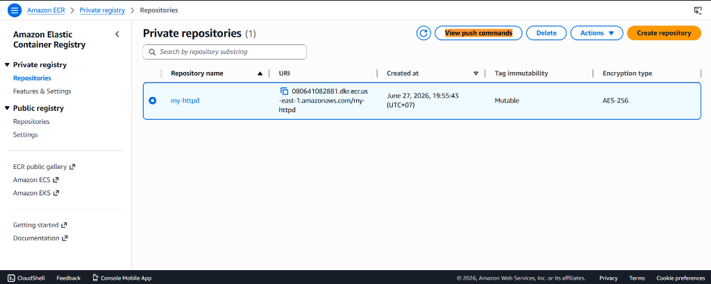
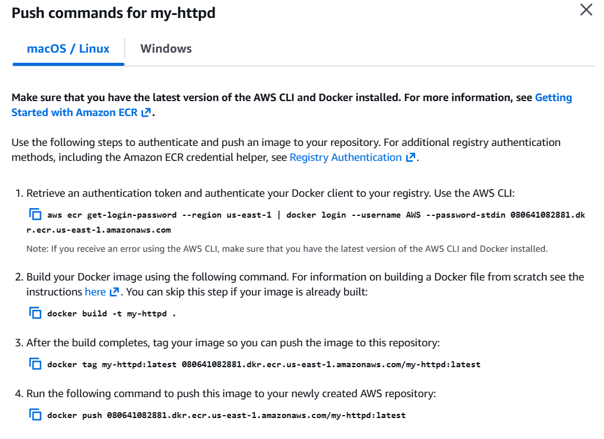
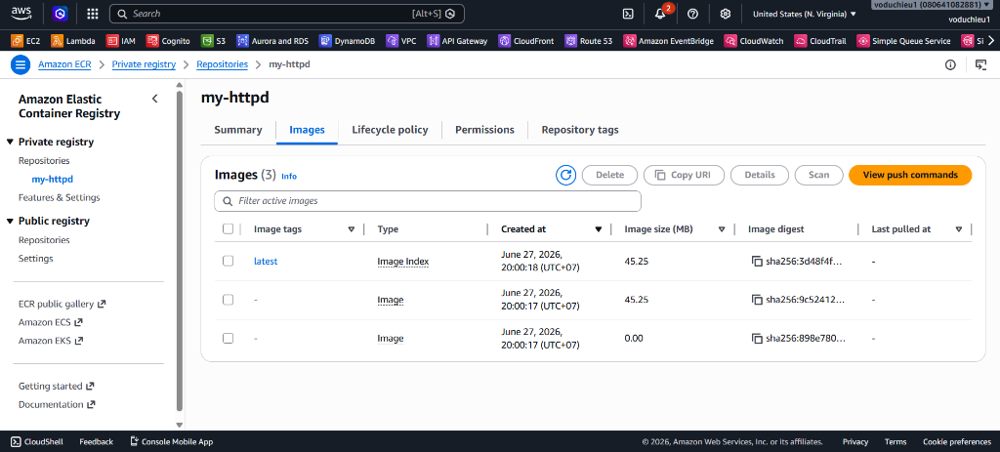

# 9. Lab 2: Tạo và Push Image lên Amazon ECR

Bài thực hành này hướng dẫn bạn cách tạo một kho lưu trữ riêng tư (Private Repository) trên **Amazon Elastic Container Registry (ECR)**, thực hiện đăng nhập Docker, gắn thẻ tag và đẩy (push) custom Docker image đã xây dựng ở bài Lab trước lên đám mây AWS.

---

## I. Mục tiêu bài Lab
* Biết cách tạo và cấu hình một Private Repository trên Amazon ECR.
* Hiểu cách lấy mã đăng nhập tạm thời từ AWS ECR qua AWS CLI để xác thực với Docker client.
* Biết cách tag và push một Docker Image cục bộ lên ECR.
* Biết cách kiểm tra, xác nhận sự hiện diện của ảnh trên AWS ECR Console.

---

## II. Các bước thực hiện chi tiết

### Bước 1: Tạo Repository trên Amazon ECR
1. Đăng nhập vào AWS Management Console, tìm kiếm dịch vụ **ECR (Elastic Container Registry)**.
2. Tại menu bên trái, chọn **Private registry > Repositories**. Bấm nút **Create repository** ở phía trên bên phải.

<p align="center">
  
</p>

3. Tại trang cấu hình **Create private repository**:
   * **Repository name:** Nhập tên repository của bạn (ví dụ: `my-httpd`).
   * **Image tag mutability:** Chọn `Mutable` (để cho phép ghi đè các tag giống nhau).
   * **Encryption settings:** Chọn `AES-256` làm cấu hình mã hóa mặc định.
   * Bấm nút **Create** ở dưới cùng.

<p align="center">
  
</p>

4. Sau khi khởi tạo thành công, bạn sẽ thấy repository `my-httpd` hiển thị trong danh sách kèm theo đường dẫn URI duy nhất.

<p align="center">
  
</p>

---

### Bước 2: Xem hướng dẫn lệnh đẩy Image (View Push Commands)
Chọn repository `my-httpd` vừa tạo và bấm nút **View push commands** ở thanh công cụ phía trên. AWS sẽ hiển thị một cửa sổ popup chứa 4 câu lệnh hướng dẫn chi tiết dành cho hệ điều hành của bạn (macOS/Linux hoặc Windows).

<p align="center">
  
</p>

---

### Bước 3: Đăng nhập, Tag và Push Image lên ECR
Mở terminal (PowerShell trên Windows) và di chuyển vào thư mục chứa Dockerfile và index.html của bài Lab này (`cloud/aws/lab/16. ECS & ECR/2. Lab 2 - Create and Push Image to ECR/`). Chạy lần lượt các lệnh sau (thay thế `<account-id>` và `<region>` tương ứng với tài khoản AWS của bạn):

1. **Đăng nhập Docker client vào AWS ECR Registry:**
   ```bash
   aws ecr get-login-password --region us-east-1 | docker login --username AWS --password-stdin <account-id>.dkr.ecr.us-east-1.amazonaws.com
   ```
   *Kết quả trả về:* `Login Succeeded`
   
   > [!WARNING]
   > **Xử lý lỗi đăng nhập (Login Fail):**
   > Nếu lệnh trên trả về lỗi liên quan đến xác thực hoặc quyền hạn, điều này có nghĩa là AWS CLI của bạn thiếu thông tin cấu hình credentials hoặc tài khoản IAM User của bạn không có đủ quyền truy cập ECR. 
   > Hãy kiểm tra lại cấu hình profile (`aws configure`) và đảm bảo tài khoản đã được gán Policy **AmazonEC2ContainerRegistryPowerUser** (như đã hướng dẫn chi tiết ở các bài học IAM Role).

2. **Xây dựng Docker Image cục bộ:**
   ```bash
   docker build -t my-httpd .
   ```

3. **Gắn thẻ tag ECR cho Docker Image:**
   ```bash
   docker tag my-httpd:latest <account-id>.dkr.ecr.us-east-1.amazonaws.com/my-httpd:latest
   ```

4. **Đẩy Docker Image lên ECR Repository:**
   ```bash
   docker push <account-id>.dkr.ecr.us-east-1.amazonaws.com/my-httpd:latest
   ```
   *Docker sẽ tải các layer của image lên máy chủ AWS ECR.*

---

### Bước 4: Kiểm tra kết quả trên ECR Console
Quay lại trang ECR Console, bấm vào tên repository `my-httpd` và chuyển sang tab **Images**. Bạn sẽ thấy tag `latest` hiển thị cùng thông tin kích thước tệp tin, mã băm digest, và thời gian tạo, xác nhận rằng Docker Image đã được tải lên AWS thành công.

<p align="center">
  
</p>

---

## III. Kết luận
Bài Lab 2 đã giúp bạn nắm bắt đầy đủ quy trình đóng gói và lưu trữ một ứng dụng container hóa lên đám mây AWS ECR một cách an toàn. Đây là bước chuẩn bị cần thiết trước khi bạn cấu hình ECS Cluster kéo image này về và khởi chạy dịch vụ container trên AWS.
