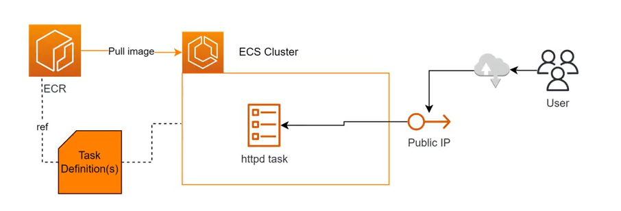
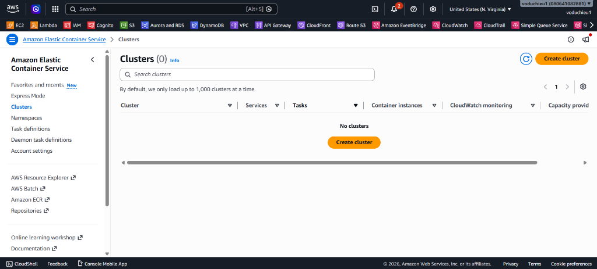
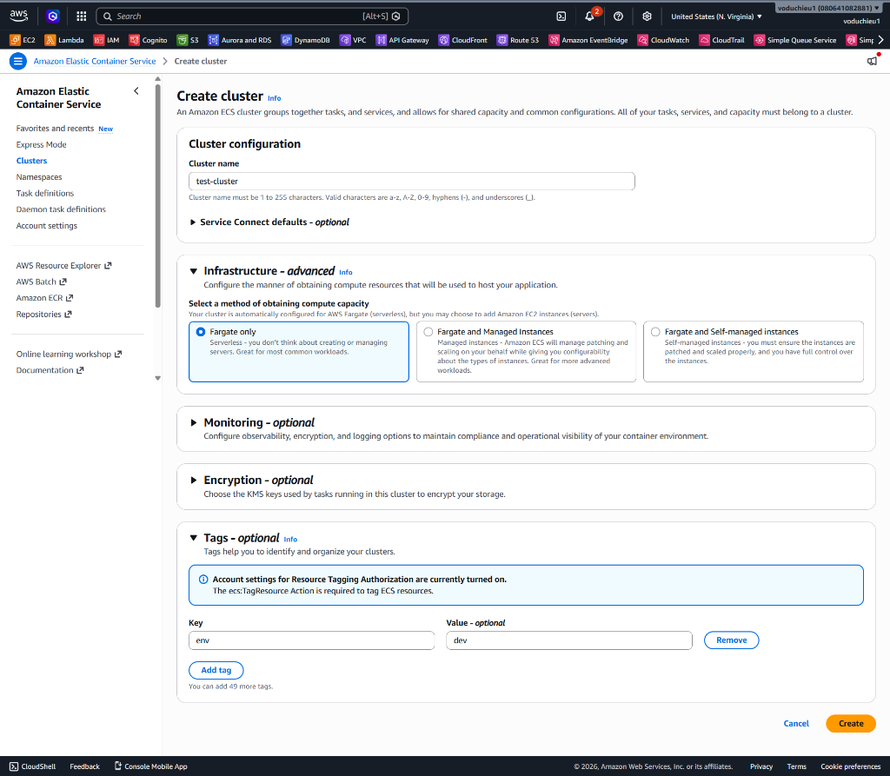
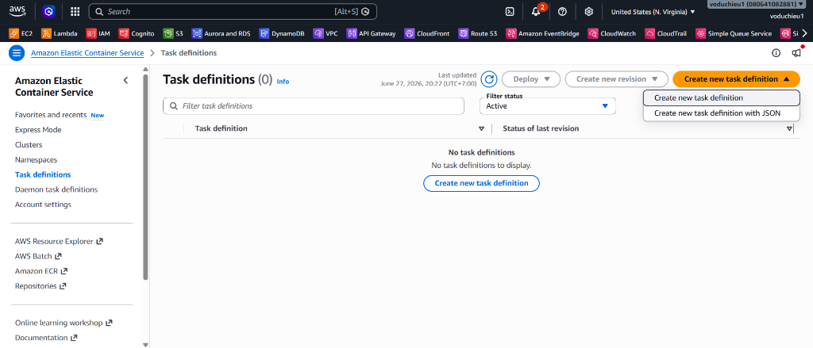
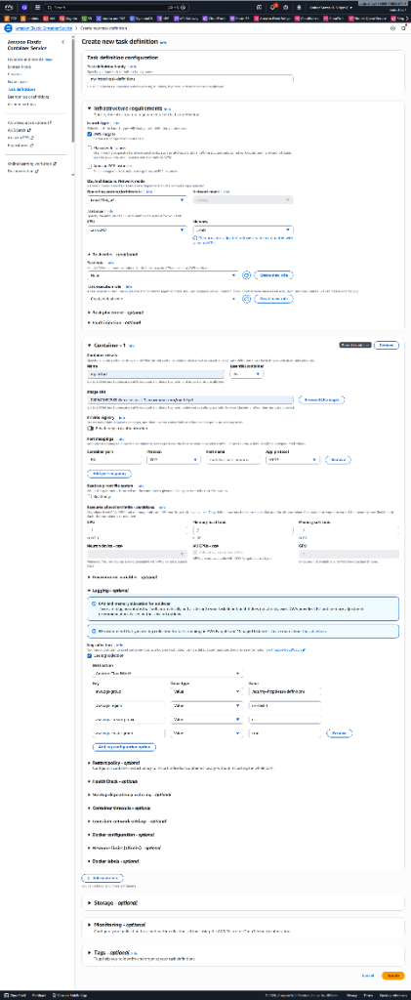
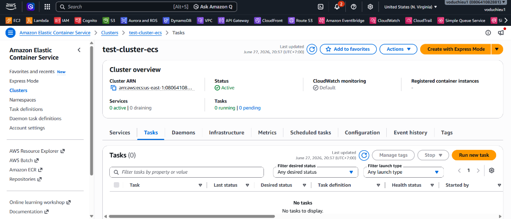
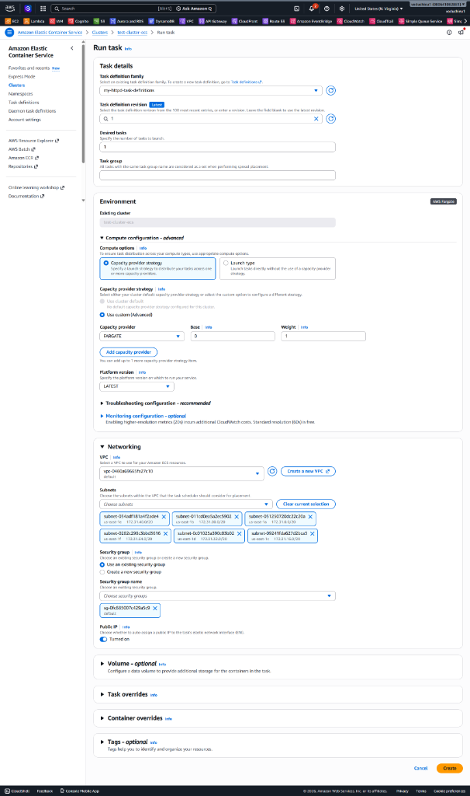
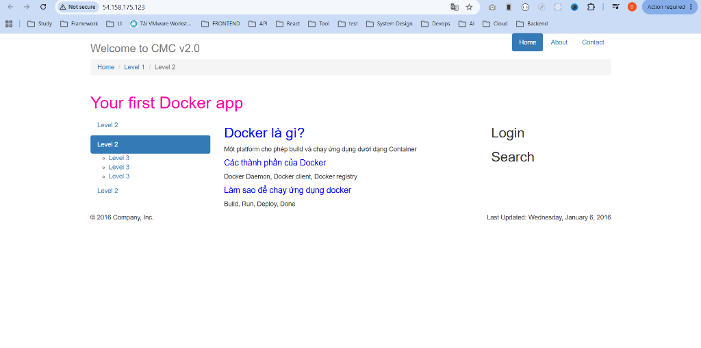

# 10. Lab 3: ECS Cluster - Khởi chạy Task trên Fargate

Bài thực hành này hướng dẫn bạn cách khởi tạo một **ECS Cluster** sử dụng chế độ Fargate (Serverless), định nghĩa **Task Definition** trỏ đến Docker image trên Amazon ECR từ Lab 2, và thực hiện khởi chạy một Task độc lập (standalone task) có kích hoạt Public IP để kiểm tra truy cập ứng dụng từ internet.

---

## I. Sơ đồ kiến trúc bài Lab

  

## II. Mục tiêu bài Lab
* Biết cách tạo một ECS Cluster chế độ Fargate.
* Hiểu cách đăng ký một Task Definition sử dụng image từ ECR Registry.
* Biết cách chạy một Task độc lập trên Cluster với cấu hình Security Group mở cổng HTTP 80 và gán Public IP.
* Thực hiện truy cập kiểm tra ứng dụng web chạy trên ECS container.

---

## III. Các bước thực hiện chi tiết

### Bước 1: Khởi tạo ECS Cluster
1. Đăng nhập vào AWS Management Console, tìm kiếm dịch vụ **ECS (Elastic Container Service)**.
2. Tại menu bên trái, chọn **Clusters**. Bấm nút **Create cluster** ở bên phải.

  

3. Tại trang cấu hình **Create cluster**:
   * **Cluster name:** Nhập tên cluster (ví dụ: `test-cluster-ecs`).
   * **Infrastructure:** Chọn **Fargate only** (Để chạy container ở chế độ Serverless do AWS quản lý hạ tầng).
   * **Tags:** Thêm tag `env: dev` để dễ dàng quản lý tài nguyên.
   * Bấm nút **Create** ở dưới cùng.

  

---

### Bước 2: Tạo Task Definition
1. Từ menu bên trái của ECS Console, chọn **Task definitions**. Bấm nút **Create new task definition > Create new task definition**.

  

2. Tại trang cấu hình **Create new task definition**:
   * **Task definition family:** Đặt tên family (ví dụ: `my-httpd-task-definition`).
   * **Infrastructure requirements:**
     - **Launch type:** Tích chọn **AWS Fargate** (Chế độ Fargate).
     - **Operating system/Architecture:** Chọn mặc định (Linux/X86_64).
     - **Task size:** Chọn CPU và Memory tối thiểu (ví dụ: CPU = `0.25 vCPU`, Memory = `0.5 GB`) để tối ưu chi phí.
   * **Container - 1:**
     - **Name:** Nhập tên container (ví dụ: `my-httpd`).
     - **Image URI:** Nhập đường dẫn URI của Docker image `my-httpd` đã push lên ECR từ bài Lab 2 (ví dụ: `080641082881.dkr.ecr.us-east-1.amazonaws.com/my-httpd:latest`).
     - **Port mappings:** Khai báo Container port `80`, Protocol `TCP`, App protocol `HTTP`.
   * Giữ nguyên các thông số cấu hình mặc định khác và bấm nút **Create** ở dưới cùng.

  

---

### Bước 3: Khởi chạy Task trên ECS Cluster
Bây giờ, chúng ta sẽ tiến hành khởi chạy một Task chạy thực tế từ bản thiết kế Task Definition vừa tạo:

1. Quay lại trang chi tiết của **Clusters**, nhấp chọn vào cluster **test-cluster-ecs** bạn đã tạo ở Bước 1.
2. Tại tab **Tasks**, bạn sẽ thấy danh sách Task đang trống. Chọn nút **Run new task**.

  

3. Cấu hình các thông số chạy Task:
   * **Compute options:** Chọn `Launch type`.
   * **Launch type:** Chọn `FARGATE`.
   * **Family:** Chọn `my-httpd-task-definition` (Revision 1).
   * **Deployment configuration:** Số lượng Task cần chạy là `1`.
   * **Networking:**
     - **VPC:** Chọn VPC mặc định của tài khoản (ví dụ: `vpc-0460a60615fa27c10`).
     - **Subnets:** Chọn các Public Subnet có sẵn.
     - **Security group:** Chọn một Security Group có sẵn hoặc tạo mới. **QUAN TRỌNG:** Security Group này phải mở (allow) Inbound rule cổng **80 (HTTP)** để cho phép truy cập từ internet.
     - **Public IP:** Đảm bảo được gạt sang trạng thái **Turned on** (hoặc Enabled).
4. Bấm nút **Create** ở dưới cùng để khởi chạy Task.

  

---

### Bước 4: Kiểm tra và Truy cập Ứng dụng
1. Đợi từ 1 - 2 phút để trạng thái của Task chuyển đổi từ `PROVISIONING` -> `PENDING` -> **RUNNING** (Hoạt động tốt).
2. Nhấp chọn trực tiếp vào ID của Task đang chạy để xem thông tin chi tiết.
3. Tại phần **Configuration > Network**, tìm kiếm dòng **Public IP** và sao chép địa chỉ IP công cộng (ví dụ: `54.158.175.123`).
4. Mở trình duyệt web của bạn và truy cập vào địa chỉ IP này:
   👉 **`http://<địa-chỉ-public-ip-của-task>`**

  

5. **Kết quả:**
   Trình duyệt hiển thị thành công trang web chào mừng **"Welcome to CMC v2.0"** với nội dung giới thiệu về Docker chạy trực tiếp trên ECS container.

---

## IV. Kết luận
Bài Lab 3 đã giúp bạn nắm bắt quy trình vận hành container Serverless Fargate trên Amazon ECS, từ tạo Cluster, viết cấu hình Task Definition tham chiếu ECR image, cấu hình phân quyền Security Group, cho đến khởi chạy Task độc lập và truy cập kiểm thử thành công.
