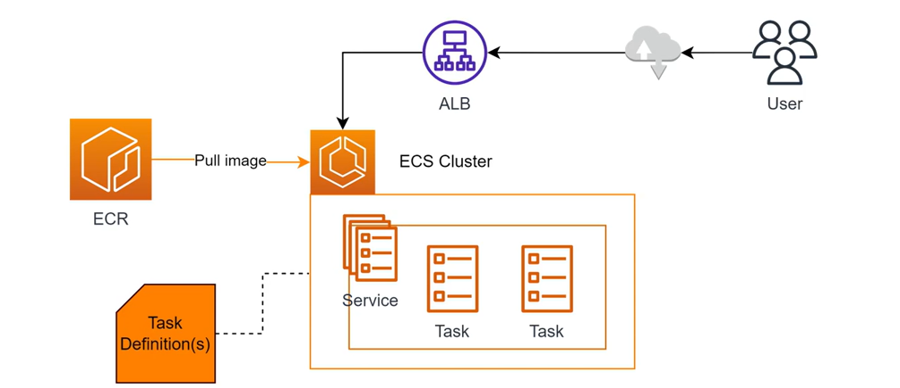
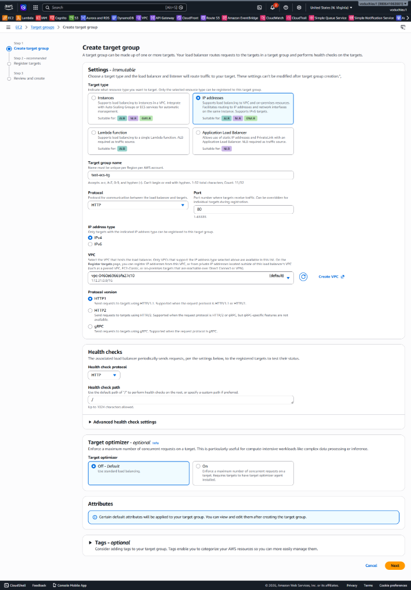
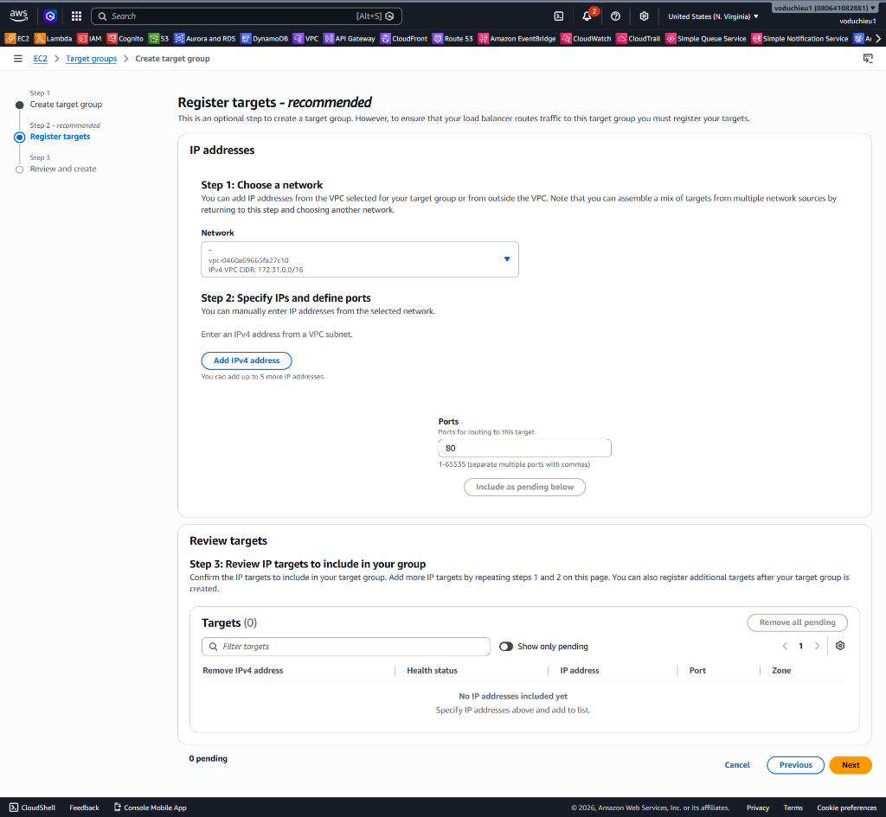
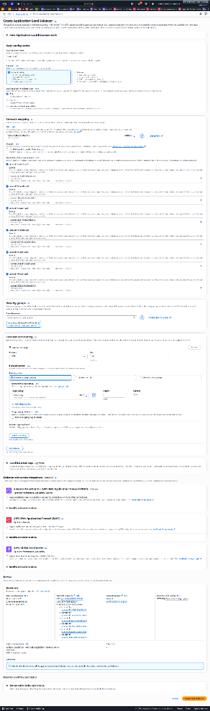
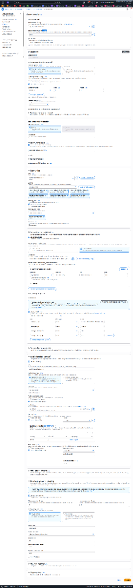
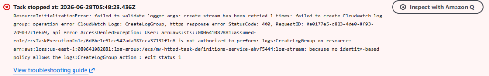
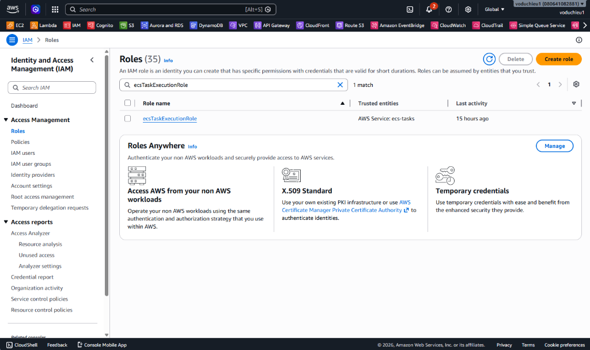
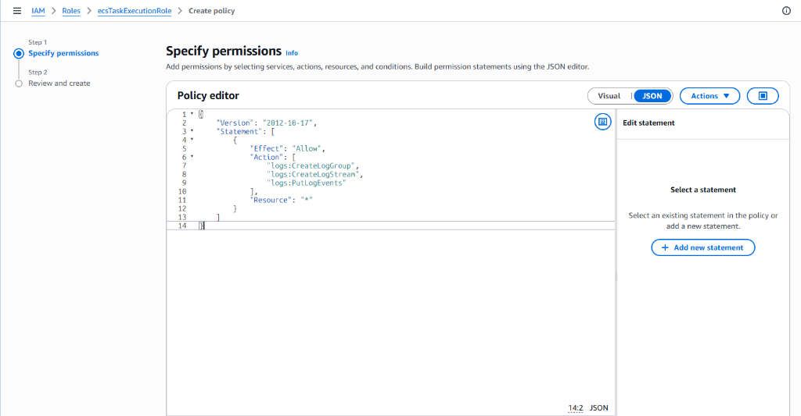
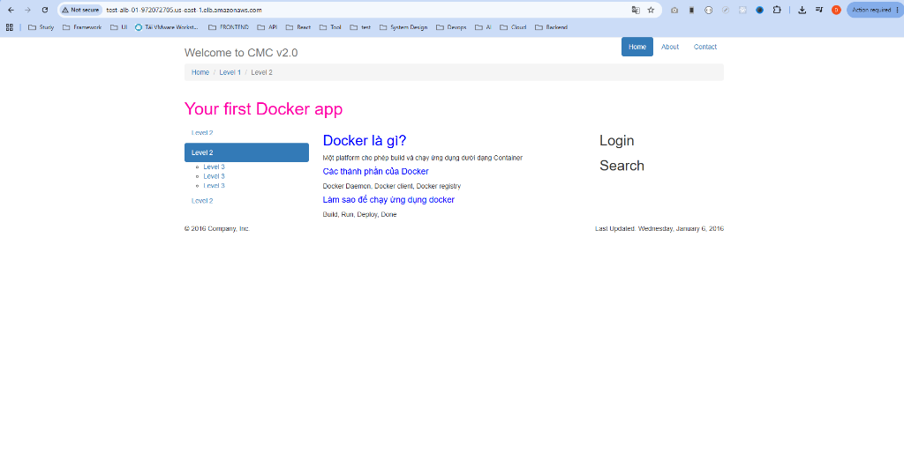

# 11. Lab 4: ECS Cluster - Khởi tạo Service kết nối Application Load Balancer

Bài thực hành này hướng dẫn bạn cách chuyển từ việc chạy Task đơn lẻ sang khởi tạo một **ECS Service** để quản lý dài hạn các container. Đồng thời, bạn sẽ cấu hình một **Application Load Balancer (ALB)** kết nối với **Target Group (IP type)** để tiếp nhận, phân phối lưu lượng truy cập từ internet vào các Task chạy ngầm bên dưới mà không cần kích hoạt Public IP trực tiếp của chúng.

---

## I. Sơ đồ kiến trúc bài Lab

<p align="center">
  
</p>

---

## II. Mục tiêu bài Lab
* Biết cách tạo một Target Group loại **IP addresses** phù hợp với chế độ mạng `awsvpc` của ECS Fargate.
* Khởi tạo Application Load Balancer (ALB) chuyển tiếp cổng 80 sang Target Group.
* Khởi tạo một ECS Service duy trì số lượng `2` Tasks song song hoạt động, tự động đồng bộ IP vào Target Group.
* Nắm được cách tắt **Public IP** của Task để tăng cường bảo mật và truy cập gián tiếp qua địa chỉ DNS của ALB.
* Kiểm thử khả năng chịu lỗi (Self-Healing) của ECS Service.

---

## III. Các bước thực hiện chi tiết

### Bước 1: Tạo Target Group (TG)
1. Đăng nhập AWS Management Console, truy cập dịch vụ **EC2**.
2. Tại menu bên trái, cuộn xuống mục **Load Balancing** và chọn **Target Groups**. Bấm nút **Create target group**.
3. Cấu hình các thông số Target Group:
   * **Target type:** Tích chọn **IP addresses** (Bắt buộc đối với ECS Fargate chạy chế độ mạng awsvpc).
   * **Target group name:** Nhập tên (ví dụ: `test-ecs-tg`).
   * **Protocol / Port:** Chọn **HTTP** và cổng **80**.
   * **VPC:** Chọn VPC mặc định của bạn (ví dụ: `vpc-0460a60615fa27c10`).
   * Bấm **Next**.

<p align="center">
  
</p>

4. Tại màn hình **Register targets**:
   * **QUAN TRỌNG:** Không điền hay thêm bất kỳ địa chỉ IP nào ở bước này. ECS Service khi khởi tạo sẽ tự động đăng ký (register) địa chỉ IP của các container vào Target Group này.
   * Bấm **Create target group** để hoàn tất.

<p align="center">
  
</p>

---

### Bước 2: Tạo Application Load Balancer (ALB)
1. Từ menu trái EC2 Console, chọn **Load Balancers** nằm ngay trên Target Groups. Bấm **Create load balancer > Application Load Balancer**.
2. Cấu hình Load Balancer:
   * **Load balancer name:** Nhập tên (ví dụ: `test-ecs-alb`).
   * **Scheme:** Chọn **Internet-facing** (Đảm bảo Load Balancer có IP công cộng để nhận request từ internet).
   * **IP address type:** Chọn **IPv4**.
   * **Network mapping:** Chọn VPC mặc định của bạn và tích chọn tất cả các Availability Zone (Subnet) có sẵn để tăng độ dự phòng và tính sẵn sàng cao.
   * **Security groups:** Chọn một Security Group mở (allow) Inbound rule cổng **80 (HTTP)** từ nguồn bất kỳ (`0.0.0.0/0`).
   * **Listeners and routing:**
     - **Listener HTTP:80:** Tại cột **Default action**, bấm chọn forward tới Target Group `test-ecs-tg` vừa tạo ở Bước 1.
   * Bấm nút **Create load balancer** ở dưới cùng.

<p align="center">
  
</p>

---

### Bước 3: Khởi tạo ECS Service trên Cluster
1. Truy cập dịch vụ **ECS**, click vào tên cluster **test-cluster-ecs** của bạn.
2. Tại tab **Services**, bấm nút **Create**.
3. Cấu hình khởi tạo Service:
   * **Environment:**
     - **Launch type:** Chọn **FARGATE**.
   * **Deployment configuration:**
     - **Application type:** Chọn **Service**.
     - **Family:** Chọn Task Definition của bạn (`my-httpd-task-definition` - Revision 1).
     - **Service name:** Đặt tên service (ví dụ: `test-ecs-service`).
     - **Desired tasks:** Nhập số lượng mong muốn là **2** (Để chạy 2 bản sao song song).
   * **Load balancing:**
     - **Load balancer type:** Chọn **Application Load Balancer**.
     - **Load balancer:** Chọn `test-ecs-alb` bạn đã khởi tạo ở Bước 2.
     - **Container to load balance:** Chọn `my-httpd : 80 : 80` và bấm nút gán nếu cần thiết.
     - **Target group:** Chọn **Use an existing target group**, và chọn Target group `test-ecs-tg`.
   * **Networking:**
     - **Public IP:** Chuyển sang trạng thái **Disabled** (hoặc Turned off). Vì lưu lượng truy cập từ bên ngoài sẽ đi qua ALB trung chuyển, các task nằm ẩn bên trong không cần public IP trực tiếp, nâng cao khả năng bảo mật cho hệ thống.
   * **Service Connect:**
     - Bật tính năng **Service Connect** (Turn on Service Connect).
   * Bấm nút **Create** ở dưới cùng.

<p align="center">
  
</p>

---

### Bước 4: Sửa lỗi quyền tạo Log Group (Nếu có)
Trong quá trình Service tạo Task, nếu Task bị dừng đột ngột và báo lỗi `ResourceInitializationError: failed to create Cloudwatch log group... AccessDeniedException: User... is not authorized to perform: logs:CreateLogGroup...` (như hình dưới), điều này có nghĩa là IAM Role đang gắn cho Task (thường là `ecsTaskExecutionRole`) chưa có quyền tự động tạo Log Group.

<p align="center">
  
</p>

**Cách khắc phục:**
1. Truy cập vào **IAM** console, chọn **Roles**.
2. Tìm kiếm và click vào role **ecsTaskExecutionRole**.
3. Tại tab **Permissions**, chọn **Add permissions > Create inline policy**.
4. Chuyển sang tab **JSON** và dán đoạn mã sau vào:
```json
{
    "Version": "2012-10-17",
    "Statement": [
        {
            "Effect": "Allow",
            "Action": [
                "logs:CreateLogGroup",
                "logs:CreateLogStream",
                "logs:PutLogEvents"
            ],
            "Resource": "*"
        }
    ]
}
```
5. Đặt tên cho policy (ví dụ: `AllowECSCreateLogGroup`) và bấm **Create policy**.
6. Quay lại giao diện ECS, các Task mới sẽ được tự động khởi tạo lại thành công.

<p align="center">
  
</p>
<p align="center">
  
</p>

---

### Bước 5: Kiểm tra truy cập qua Application Load Balancer
1. Vào **EC2 > Load Balancers**, chọn ALB bạn đã tạo (ví dụ: `test-ecs-alb`).
2. Tìm dòng **DNS name** ở phần chi tiết và sao chép địa chỉ URL (ví dụ: `test-alb-197272705.us-east-1.elb.amazonaws.com`).
3. Dán DNS name này vào trình duyệt web. Bạn sẽ thấy trang web chào mừng hiển thị thành công. 

**Lưu ý:** Lúc này trong service đã có 2 task nhưng 2 task này không có Public IP, nên người dùng chỉ có thể truy cập được ứng dụng thông qua ALB.

<p align="center">
  
</p>

---

### Bước 6: Thử điều chỉnh số lượng task (Scale Service) và khả năng chịu lỗi
1. **Kiểm chứng khả năng tự phục hồi (Self-Healing):**
   * Truy cập **ECS > test-cluster-ecs > tab Tasks**. Chọn một trong hai Task đang chạy của service và bấm nút **Stop**.
   * Số lượng Task hoạt động lúc này giảm xuống còn `1`.
   * **Kết quả:** ECS Service sẽ tự động phát hiện số lượng Task hiện tại thấp hơn `Desired tasks` (2), tự động khởi tạo thêm một Task mới thay thế và đăng ký IP vào Target Group. Dịch vụ web hoàn toàn không bị gián đoạn.

2. **Thử điều chỉnh số lượng task (Capacity):**
   * Bạn có thể chọn Service và bấm vào nút **Update service**.
   * Điều chỉnh **Desired tasks** lên một con số khác (ví dụ: `3` hoặc `4`) để kiểm tra khả năng mở rộng (Scale Out).
   * Quan sát ECS tự động khởi tạo thêm Task cho đến khi đạt đủ số lượng cấu hình mới, và ALB tự động cân bằng tải cho các Task mới này.

---

## IV. Kết luận
Bài Lab 4 giúp bạn hiểu rõ nguyên lý hoạt động của ECS Service trong môi trường production thực tế. Việc kết hợp ECS Service, Fargate (awsvpc), Target Group IP addresses và Application Load Balancer là mô hình kiến trúc chuẩn chỉnh. Thiết kế này đem lại tính bảo mật cao (nhờ disable Public IP của Container) và độ sẵn sàng cao cùng khả năng tự sửa lỗi và mở rộng linh hoạt.
