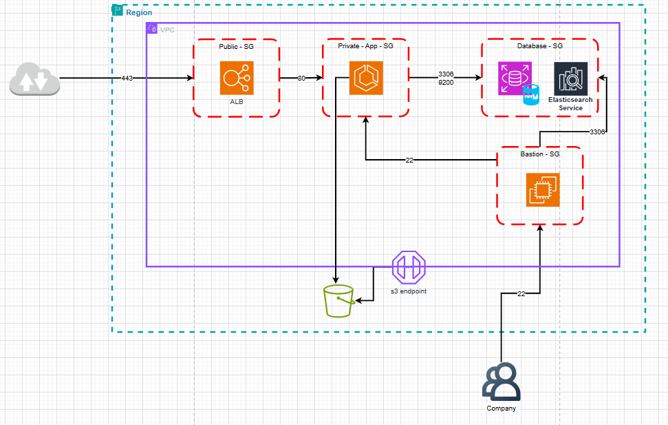
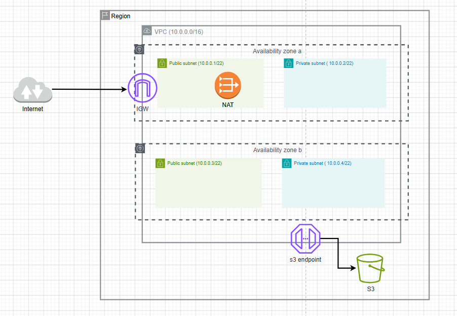

# 1. Lab 1 – Thiết kế VPC Đơn giản (Amazon VPC Hands-on Lab)

Bài thực hành này hướng dẫn thực hiện **Lab 1 – Thiết kế VPC Đơn giản** với 2 nhiệm vụ vẽ sơ đồ thiết kế kiến trúc mạng độc lập (bằng Draw.io hoặc PowerPoint) và hướng dẫn triển khai cấu hình thực tế từng bước trên AWS Console.

---

## I. Yêu Cầu Thiết Kế & Thực Hành (Lab Specifications)

Bài thực hành này được chia thành **2 nhiệm vụ vẽ sơ đồ thiết kế chính** trước khi tiến hành triển khai trên AWS Console:

### [Hình 1] Nhiệm vụ 1: Thiết kế Sơ đồ Phân hoạch Mạng (Network Topology Diagram)
Thiết kế sơ đồ mô tả cấu trúc phân vùng mạng vật lý/logic của VPC đáp ứng các tiêu chí sau:
*   **VPC CIDR:** `10.0.0.0/16` ($65,536$ địa chỉ IP).
*   **Availability Zones (AZs):** Triển khai trên ít nhất 2 AZs (ví dụ: `us-east-1a` và `us-east-1b`) để đảm bảo tính sẵn sàng cao.
*   **Subnetting:** Chia thành 2 loại: **Public Subnet** và **Private Subnet**. Mỗi subnet phải chứa **ít nhất 1,000 địa chỉ IPs** (sử dụng CIDR **`/22`** tương đương với $1,024$ IPs mỗi subnet).
*   **Internet Gateway (IGW):** Gắn 1 IGW vào VPC, cấu hình Route Table của Public Subnet trỏ dải `0.0.0.0/0` tới IGW.
*   **NAT Gateway:** Đặt 1 NAT Gateway tại Public Subnet, cấu hình Route Table của Private Subnet trỏ dải `0.0.0.0/0` tới NAT Gateway.
*   **S3 VPC Endpoint:** Thiết kế 1 Gateway VPC Endpoint kết nối trực tiếp Private Subnet tới dịch vụ S3.

### [Hình 2] Nhiệm vụ 2: Thiết kế Sơ đồ luồng Traffic & Security Groups (Security Group Flow Diagram)
Thiết kế sơ đồ mô tả chi tiết các luồng kết nối và phân quyền cổng mạng cho **4 nhóm đối tượng** áp dụng nguyên tắc liên kết chéo (Security Group Chaining):
*   **Application Load Balancer (ALB):** Mở cổng HTTPS `443` nhận traffic từ ngoài internet (`0.0.0.0/0`).
*   **App Server:** Chỉ cho phép nhận traffic ở cổng HTTP `80` đi từ Security Group của ALB, và cổng SSH `22` từ Security Group của Bastion Server.
*   **Database Server & Elasticsearch:** Sử dụng cổng MySQL `3306` nhận traffic từ Security Group của App Server và Bastion Server. Cổng Elasticsearch `9200` nhận traffic từ Security Group của App Server.
*   **Bastion Server (Jump Host):** Chỉ cho phép nhận kết nối SSH ở cổng `22` từ IP tĩnh của văn phòng Công ty.

---

## II. Sơ đồ Thiết kế Mẫu (Draw.io / PowerPoint Reference Diagrams)

Dưới đây là đáp án thiết kế cho 2 yêu cầu vẽ sơ đồ của bài Lab:

### 1. Đáp án Nhiệm vụ 2: Sơ đồ luồng traffic và phân quyền Security Groups
Sơ đồ mô tả cách cấu hình Inbound Rules cho 4 nhóm đối tượng (ALB, App Server, Database & Elasticsearch, Bastion) áp dụng Security Group Chaining để bảo vệ tài nguyên an toàn:

### 2. Đáp án Nhiệm vụ 1: Sơ đồ phân hoạch Subnets trên đa vùng khả dụng (Multi-AZ Network Topology)
Sơ đồ mô tả cách phân hoạch 4 subnets quy mô lớn hơn 1000 IPs (sử dụng dải CIDR `/22` tương ứng 1024 IPs) trên 2 Availability Zones (`us-east-1a`, `us-east-1b`), tích hợp Internet Gateway, NAT Gateway và S3 Endpoint:

> [!NOTE]
> **Lưu ý về nhãn địa chỉ trong sơ đồ:** Trong sơ đồ thiết kế trên, các subnet có ghi nhãn như `10.0.0.1/22`, `10.0.0.2/22`, `10.0.0.3/22`, `10.0.0.4/22`. Đây là cách ghi nhãn mang tính tượng trưng để phân biệt thứ tự subnet trong thiết kế Draw.io. 
> Khi cấu hình thực tế trên AWS Console, các dải CIDR mạng con **bắt buộc không được trùng lặp** và phải nằm trên ranh giới mạng chuẩn (ví dụ: `10.0.0.0/22`, `10.0.4.0/22`, `10.0.8.0/22`, `10.0.12.0/22`) để tránh xung đột định tuyến.

---

## III. Các bước cấu hình chi tiết trên AWS Console

### Bước 1: Khởi tạo VPC `10.0.0.0/16`
1. Truy cập dịch vụ **VPC** trên AWS Console.
2. Chọn **Your VPCs** → Click **Create VPC**.
3. Cấu hình:
   *   **Resources to create:** `VPC only`
   *   **Name tag:** `Lab1-VPC`
   *   **IPv4 CIDR block:** `10.0.0.0/16`
4. Click **Create VPC**.

### Bước 2: Tạo các Subnets (Kích thước `/22`)
Chúng ta cần tạo 4 subnets đáp ứng quy mô tối thiểu 1000 IPs:
1. Vào **Subnets** → Click **Create subnet** → Chọn VPC **Lab1-VPC**.
2. Thêm và cấu hình lần lượt 4 subnet:
   *   **Subnet 1 (Public AZ-A):**
       *   Name: `Public-Subnet-1A`
       *   AZ: `us-east-1a`
       *   CIDR: `10.0.0.0/22` (Chứa 1024 IPs)
   *   **Subnet 2 (Public AZ-B):**
       *   Name: `Public-Subnet-1B`
       *   AZ: `us-east-1b`
       *   CIDR: `10.0.4.0/22` (Chứa 1024 IPs)
   *   **Subnet 3 (Private AZ-A):**
       *   Name: `Private-Subnet-1A`
       *   AZ: `us-east-1a`
       *   CIDR: `10.0.8.0/22` (Chứa 1024 IPs)
   *   **Subnet 4 (Private AZ-B):**
       *   Name: `Private-Subnet-1B`
       *   AZ: `us-east-1b`
       *   CIDR: `10.0.12.0/22` (Chứa 1024 IPs)
3. Click **Create subnet**.

### Bước 3: Tạo và Gắn Internet Gateway (IGW)
1. Chọn **Internet Gateways** → Click **Create internet gateway**.
2. Đặt tên: `Lab1-IGW` → Click **Create**.
3. Chọn IGW vừa tạo → Click **Actions** → **Attach to VPC** → Chọn **Lab1-VPC** → Nhấn **Attach**.

### Bước 4: Tạo NAT Gateway ở Public Subnet
1. Chọn **NAT Gateways** → Click **Create NAT gateway**.
2. Điền thông số:
   *   Name: `Lab1-NAT-GW`
   *   Subnet: Chọn **Public-Subnet-1A**
   *   Connectivity type: `Public`
   *   Elastic IP: Click **Allocate Elastic IP** để sinh IP tĩnh.
3. Click **Create NAT gateway**.

### Bước 5: Cấu hình các Route Table
1. **Public Route Table:**
   *   Vào **Route tables** → Click **Create route table** → Tên: `Public-RT` → Chọn VPC `Lab1-VPC` → Click **Create**.
   *   Chọn tab **Routes** → **Edit routes** → **Add route** → Destination: `0.0.0.0/0` | Target: `Internet Gateway` (`Lab1-IGW`) → Save.
   *   Chọn tab **Subnet associations** → **Edit subnet associations** → Tích chọn `Public-Subnet-1A` và `Public-Subnet-1B` → Save.
2. **Private Route Table:**
   *   Tạo Route Table mới → Tên: `Private-RT` → Chọn VPC `Lab1-VPC` → Click **Create**.
   *   Chọn tab **Routes** → **Edit routes** → **Add route** → Destination: `0.0.0.0/0` | Target: `NAT Gateway` (`Lab1-NAT-GW`) → Save.
   *   Chọn tab **Subnet associations** → **Edit subnet associations** → Tích chọn `Private-Subnet-1A` và `Private-Subnet-1B` → Save.

### Bước 6: Cấu hình 4 Security Groups (SG Chaining)
Chúng ta sẽ tạo lần lượt 4 Security Groups trong VPC `Lab1-VPC`:

1.  **Tạo ALB Security Group (`alb-sg`):**
    *   Vào **Security groups** → Click **Create security group**.
    *   Tên: `alb-sg`, VPC: `Lab1-VPC`.
    *   **Inbound Rules:** Add rule → Type: `HTTPS` | Port: `443` | Source: `Anywhere-IPv4` (`0.0.0.0/0`).
    *   Click **Create**.
2.  **Tạo Bastion Security Group (`bastion-sg`):**
    *   Click **Create security group**.
    *   Tên: `bastion-sg`, VPC: `Lab1-VPC`.
    *   **Inbound Rules:** Add rule → Type: `SSH` | Port: `22` | Source: `Custom` → điền IP tĩnh của công ty (Ví dụ: `198.51.100.50/32`).
    *   Click **Create**.
3.  **Tạo App Server Security Group (`app-sg`):**
    *   Click **Create security group**.
    *   Tên: `app-sg`, VPC: `Lab1-VPC`.
    *   **Inbound Rules:**
        *   Rule 1: Type: `HTTP` (Port 80) | Source: Chọn Custom → Gõ và chọn ID của Security Group `alb-sg`.
        *   Rule 2: Type: `SSH` (Port 22) | Source: Chọn Custom → Gõ và chọn ID của Security Group `bastion-sg`.
    *   Click **Create**.
4.  **Tạo Database Security Group (`db-sg`):**
    *   Click **Create security group**.
    *   Tên: `db-sg`, VPC: `Lab1-VPC`.
    *   **Inbound Rules:**
        *   Rule 1: Type: `MySQL/Aurora` (Port 3306) | Source: Chọn Custom → Gõ và chọn ID của Security Group `app-sg`.
        *   Rule 2: Type: Custom TCP (Port 9200) | Source: Chọn Custom → Gõ và chọn ID của Security Group `app-sg` (cho Elasticsearch).
        *   Rule 3: Type: `MySQL/Aurora` (Port 3306) | Source: Chọn Custom → Gõ và chọn ID của Security Group `bastion-sg` (cho phép Bastion truy cập trực tiếp Database).
    *   Click **Create**.

### Bước 7: Cấu hình Gateway VPC Endpoint cho S3
Sử dụng Gateway Endpoint để gửi nhận file trực tiếp lên S3 hoàn toàn miễn phí mà không cần qua NAT Gateway:
1. Vào **Endpoints** ở menu bên trái → Click **Create endpoint**.
2. Cấu hình:
   *   Name: `s3-gateway-endpoint`
   *   Service category: `AWS services`
   *   Services: Tìm kiếm và chọn dịch vụ dạng **`com.amazonaws.us-east-1.s3`** (đảm bảo Type là `Gateway`).
   *   VPC: Chọn **Lab1-VPC**.
   *   Route tables: Tích chọn **Private-RT** (AWS sẽ tự động chèn 1 route trỏ tới Endpoint này vào Route Table được chọn).
   *   Policy: Chọn `Full Access` (hoặc cấu hình Custom Policy nếu muốn kiểm soát chi tiết).
3. Click **Create endpoint**.

---

## IV. Kiểm tra và Đánh giá (Verification)

1.  **Xác minh bảng định tuyến S3 Endpoint:**
    *   Truy cập **Route tables** → Chọn **Private-RT** → Xem tab **Routes**.
    *   Xác nhận có một dòng route mới dạng: `pl-xxxxxxxx (com.amazonaws.us-east-1.s3)` trỏ tới Target `vpce-xxxxxxxx` (VPC Endpoint).
2.  **Kiểm tra tính bảo mật chéo (Security Group Isolation):**
    *   Khởi tạo máy chủ cơ sở dữ liệu trong Private Subnet gán Security Group `db-sg`.
    *   Bất kỳ kết nối trực tiếp nào từ ngoài Internet hoặc từ các máy chủ không được phép tới Database Server ở cổng 3306/9200 đều sẽ bị block. Chỉ có App Server (ở port 3306/9200) và Bastion Server (ở port 3306) là được kết nối tới Database.
