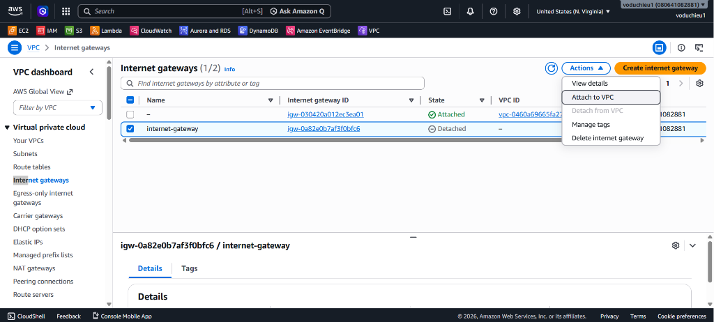
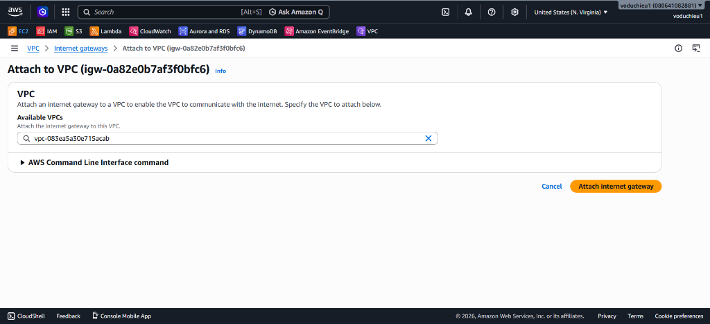
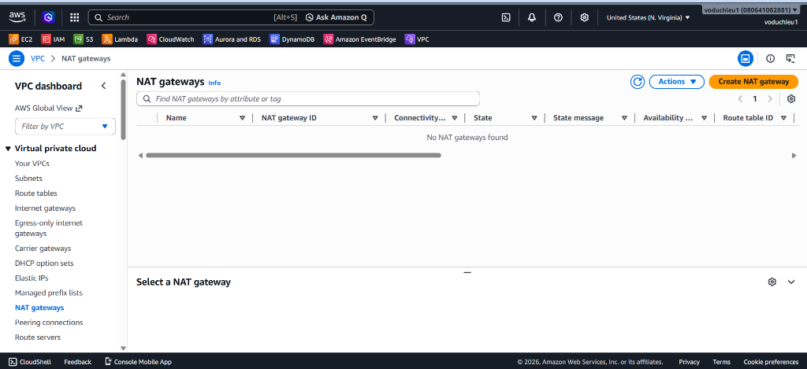
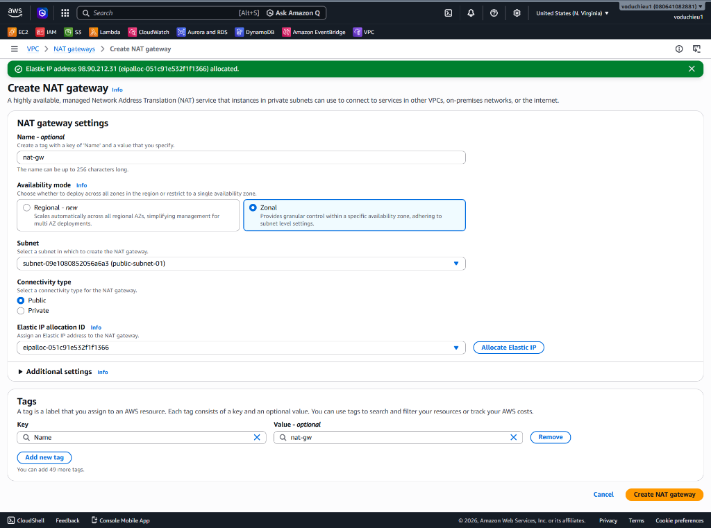
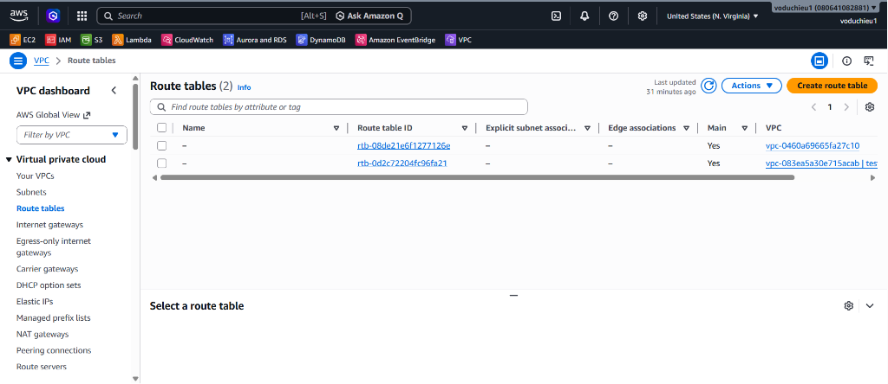
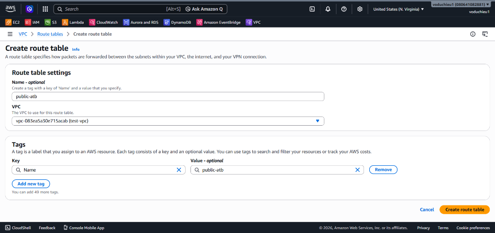
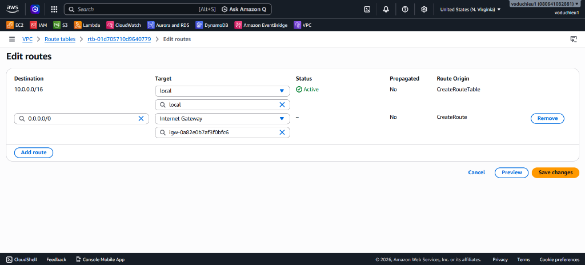
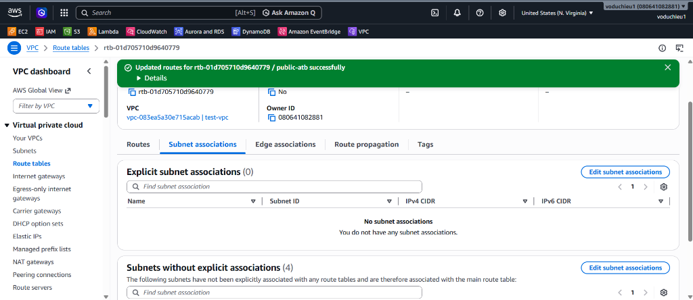
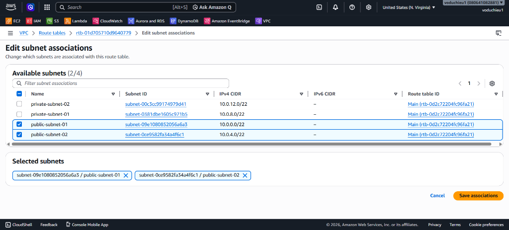
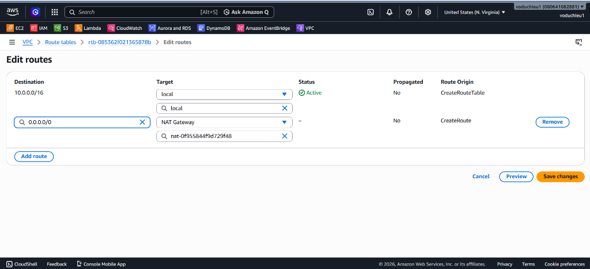

# 2. Lab 2 – Tạo VPC đã thiết kế (Amazon VPC Hands-on Lab)

Bài thực hành này hướng dẫn từng bước cấu hình thực tế trên giao diện AWS Management Console để khởi tạo hệ thống mạng VPC, phân hoạch các Subnets và tạo Internet Gateway theo thiết kế đã vẽ ở Lab 1.

---

## I. Các bước thực hiện chi tiết (Step-by-Step Guide)

### Bước 1: Khởi tạo VPC (`test-vpc`)
1. Truy cập vào AWS Management Console, tìm kiếm dịch vụ **VPC** và truy cập vào trang quản trị **VPC Dashboard**:

   

2. Tại menu bên trái, chọn **Your VPCs** → Click **Create VPC**.
3. Cấu hình các thông số như hình dưới:
   *   **Resources to create:** Chọn `VPC only`.
   *   **Name tag:** `test-vpc`
   *   **IPv4 CIDR block:** Chọn `IPv4 CIDR manual input`.
   *   **IPv4 CIDR:** Điền `10.0.0.0/16` (Không gian mạng chính).
   *   **Tenancy:** Chọn `Default`.
   *   **Tags:** Khóa `Name` tự động điền giá trị `test-vpc`.

   

4. Nhấn nút **Create VPC** ở góc dưới cùng bên phải để hoàn tất.

---

### Bước 2: Tạo các Subnets (4 Subnets)
Chúng ta sẽ tiến hành tạo đồng thời 4 Subnets cho 2 phân khu Public và Private nằm trên 2 Availability Zones (`us-east-1a` và `us-east-1b`) với dung lượng mỗi subnet là `/22` (chứa 1024 địa chỉ IP):

1. Tại menu bên trái, chọn **Subnets** → Click **Create subnet**.
2. Chọn VPC ID của VPC vừa tạo ở Bước 1 (`test-vpc`).
3. Nhập thông tin cho lần lượt 4 subnet. Sử dụng nút **Add new subnet** ở cuối trang để cấu hình nhanh:
   *   **Subnet 1 (Public Subnet 1):**
       *   **Subnet name:** `public-subnet-01`
       *   **Availability Zone:** Chọn `us-east-1a` (hoặc zone đầu tiên trong khu vực).
       *   **IPv4 CIDR block:** `10.0.0.0/22`
   *   **Subnet 2 (Public Subnet 2):**
       *   **Subnet name:** `public-subnet-02`
       *   **Availability Zone:** Chọn `us-east-1b` (hoặc zone thứ hai).
       *   **IPv4 CIDR block:** `10.0.4.0/22`
   *   **Subnet 3 (Private Subnet 1):**
       *   **Subnet name:** `private-subnet-01`
       *   **Availability Zone:** Chọn `us-east-1a`.
       *   **IPv4 CIDR block:** `10.0.8.0/22`
   *   **Subnet 4 (Private Subnet 2):**
       *   **Subnet name:** `private-subnet-02`
       *   **Availability Zone:** Chọn `us-east-1b`.
       *   **IPv4 CIDR block:** `10.0.12.0/22`

   

4. Sau khi nhập đủ thông tin và xác nhận không có dải IP nào bị chồng chéo (overlapping), click **Create subnet**.

---

### Bước 3: Tạo Internet Gateway (IGW)
Internet Gateway là thành phần đóng vai trò như một bộ định tuyến trung gian kết nối các tài nguyên Public với mạng internet toàn cầu.

1. Tại menu bên trái, chọn **Internet gateways**:

   

2. Nhấn nút **Create internet gateway** ở góc trên cùng bên phải.
3. Cấu hình thông tin:
   *   **Name tag:** Điền `internet-gateway`.
   *   **Tags:** Tự động tạo khóa `Name` với giá trị `internet-gateway`.

   

4. Nhấn **Create internet gateway**.
5. Sau khi tạo xong, trạng thái của Internet Gateway sẽ là `Detached` (Chưa gắn vào VPC). Để liên kết, chọn Internet Gateway vừa tạo → Click vào nút **Actions** ở góc trên bên phải → Chọn **Attach to VPC**:

   

6. Chọn VPC **test-vpc** vừa tạo ở Bước 1 từ danh sách thả xuống.
7. Click **Attach internet gateway** để kích hoạt kết nối.

   

> [!IMPORTANT]
> **Quy tắc quan trọng của AWS:** Mỗi VPC chỉ có thể gắn (Attach) được **tối đa duy nhất 1 Internet Gateway**. Nếu VPC đã được gắn một IGW trước đó, bạn sẽ không thấy VPC đó xuất hiện trong danh sách thả xuống để liên kết nữa.

---

### Bước 4: Khởi tạo NAT Gateway cho Private Subnets
NAT Gateway giúp chuyển tiếp các outbound request từ Private Subnets ra ngoài Internet (ví dụ để cập nhật phần mềm, tải thư viện) nhưng ngăn chặn kết nối chiều ngược lại từ Internet vào.

1. Tại menu bên trái, chọn **NAT gateways**:

   

2. Nhấn nút **Create NAT gateway** ở góc trên cùng bên phải.
3. Cấu hình các thông số chi tiết như hình dưới:
   *   **Name:** `nat-gw`
   *   **Subnet:** Chọn **public-subnet-01** (Bắt buộc phải đặt NAT Gateway trong Public Subnet để nó có thể định tuyến ra ngoài thông qua Internet Gateway).
   *   **Connectivity type:** Chọn `Public`.
   *   **Elastic IP allocation ID:** Để NAT Gateway hoạt động, nó cần một địa chỉ IPv4 tĩnh công cộng. Nếu chưa có Elastic IP nào sẵn dùng, click vào nút **Allocate Elastic IP** bên cạnh để AWS tự động cấp phát một IP mới (nhãn thông báo màu xanh lá sẽ hiển thị khi đã cấp phát thành công).

   

4. Nhấn **Create NAT gateway**.
*(Quá trình khởi tạo NAT Gateway có thể mất từ 2-3 phút, trạng thái sẽ chuyển từ `Pending` sang `Available`).*

---

### Bước 5: Cấu hình Route Tables (Public và Private)
Mặc định khi tạo VPC, AWS sẽ tự động tạo ra một **Main Route Table**. Tuy nhiên, để quản lý định tuyến độc lập và tối ưu bảo mật, chúng ta sẽ tạo thêm 2 bảng định tuyến tùy chỉnh (Custom Route Tables): `public-rt` và `private-rt`.

#### A. Tạo và cấu hình Public Route Table (`public-rt`)
Public Route Table sẽ định tuyến lưu lượng `0.0.0.0/0` qua **Internet Gateway** (IGW) và liên kết với 2 subnet Public.

1. Tại menu bên trái, chọn **Route tables**:

   

2. Nhấn nút **Create route table** ở góc trên cùng bên phải.
3. Cấu hình thông tin cho Public Route Table:
   *   **Name tag:** `public-rt` (Trong hình ví dụ là `public-atb`, khuyến nghị đặt `public-rt` để dễ quản lý).
   *   **VPC:** Chọn `test-vpc`.

   

4. Nhấn **Create route table**.
5. Thêm tuyến đường đi ra Internet (Route to IGW):
   *   Chọn Route Table `public-rt` vừa tạo → Chọn tab **Routes** ở bên dưới → Click **Edit routes**.
   *   Click **Add route**:
       *   **Destination:** `0.0.0.0/0` (Tất cả lưu lượng ra ngoài internet).
       *   **Target:** Chọn **Internet Gateway** → Chọn ID của `internet-gateway` mà bạn đã attach vào VPC ở Bước 3.

   

   *   Nhấn **Save changes** để lưu lại cấu hình. Bạn sẽ thấy thông báo cập nhật thành công màu xanh lá.
6. Liên kết với các Public Subnets (Subnet Association):
   *   Chọn tab **Subnet associations** → Click **Edit subnet associations**:

     

   *   Chọn 2 subnet Public: **public-subnet-01** (`10.0.0.0/22`) và **public-subnet-02** (`10.0.4.0/22`).

     

   *   Nhấn **Save associations** để hoàn tất liên kết.

#### B. Tạo và cấu hình Private Route Table (`private-rt`)
Private Route Table sẽ định tuyến lưu lượng `0.0.0.0/0` qua **NAT Gateway** (NGW) để các tài nguyên trong phân khu Private có thể ra internet tải cập nhật nhưng bên ngoài không thể truy cập trực tiếp vào.

1. Tại menu bên trái, chọn **Route tables** → Click **Create route table**.
2. Cấu hình thông tin cho Private Route Table:
   *   **Name tag:** `private-rt`
   *   **VPC:** Chọn `test-vpc`.
3. Nhấn **Create route table**.
4. Thêm tuyến đường đi ra NAT Gateway (Route to NGW):
   *   Chọn Route Table `private-rt` → Chọn tab **Routes** → Click **Edit routes**.
   *   Click **Add route**:
       *   **Destination:** `0.0.0.0/0`
       *   **Target:** Chọn **NAT Gateway** → Chọn ID của `nat-gw` mà bạn đã tạo ở Bước 4.

   

   *   Nhấn **Save changes**.
5. Liên kết với các Private Subnets (Subnet Association):
   *   Chọn tab **Subnet associations** → Click **Edit subnet associations**.
   *   Chọn 2 subnet Private: **private-subnet-01** (`10.0.8.0/22`) và **private-subnet-02** (`10.0.12.0/22`).
   *   Nhấn **Save associations**.

> [!WARNING]
> **Điểm cực kỳ quan trọng:**
> *   Tuyến đường mặc định `0.0.0.0/0` của **Public Route Table** bắt buộc phải trỏ về **Internet Gateway (IGW)**.
> *   Tuyến đường mặc định `0.0.0.0/0` của **Private Route Table** bắt buộc phải trỏ về **NAT Gateway (NGW)**. Tuyệt đối không trỏ Private Route Table về IGW vì điều này sẽ biến các Private Subnet thành Public Subnet, làm mất đi tính chất an toàn, bảo mật của thiết kế.

---

## II. Kiểm tra và Đánh giá (Verification)
1. Truy cập mục **Your VPCs**, kiểm tra VPC `test-vpc` trạng thái hiển thị là `Available`.
2. Truy cập mục **Subnets**, kiểm tra 4 subnet mới được tạo với dải CIDR và Availability Zones khớp hoàn toàn với cấu hình.
3. Truy cập mục **Internet gateways**, kiểm tra Internet Gateway `internet-gateway` đã chuyển sang trạng thái `Attached` và liên kết thành công với VPC ID của `test-vpc`.
4. Truy cập mục **NAT gateways**, kiểm tra NAT Gateway `nat-gw` đã hiển thị trạng thái `Available` và được gán chính xác Elastic IP công cộng vừa Allocate.
5. Truy cập mục **Route tables**, kiểm tra 2 bảng định tuyến `public-rt` và `private-rt` đã được liên kết chính xác với các subnet tương ứng, đồng thời có các tuyến đường (Routes) trỏ về IGW (`igw-xxxxxx`) và NAT Gateway (`nat-xxxxxx`) một cách chính xác.

