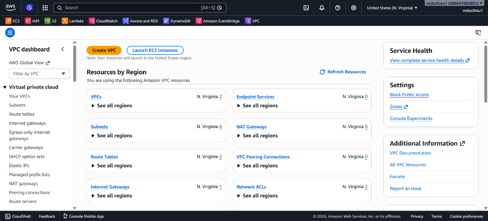
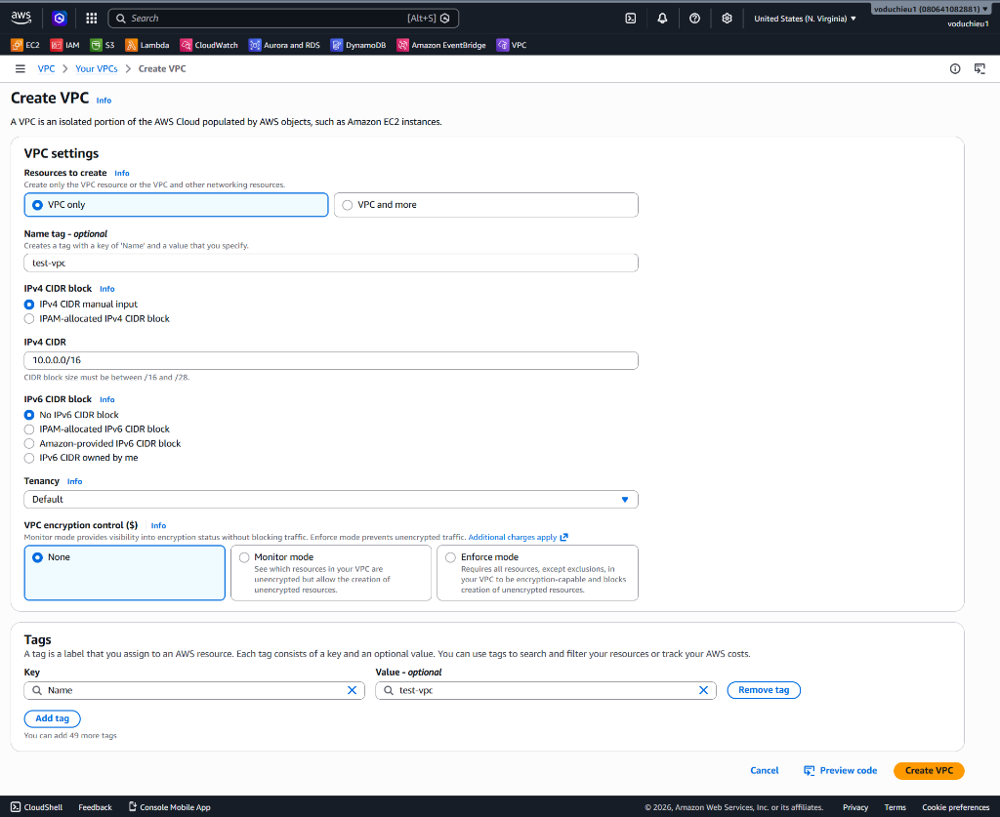
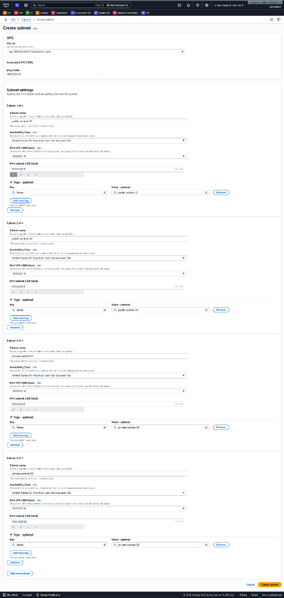
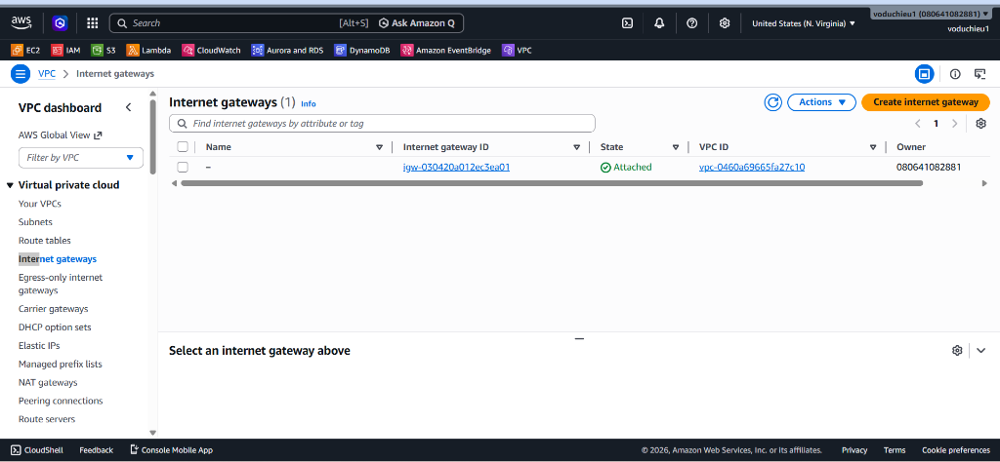
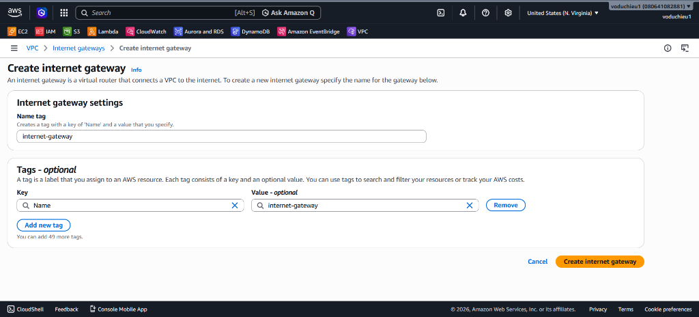

# 2. Lab 2 – Tạo VPC đã thiết kế (Amazon VPC Hands-on Lab)

Bài thực hành này hướng dẫn từng bước cấu hình thực tế trên giao diện AWS Management Console để khởi tạo hệ thống mạng VPC, phân hoạch các Subnets và tạo Internet Gateway theo thiết kế đã vẽ ở Lab 1.

---

## I. Các bước thực hiện chi tiết (Step-by-Step Guide)

### Bước 1: Khởi tạo VPC (`test-vpc`)
1. Truy cập vào AWS Management Console, tìm kiếm dịch vụ **VPC** và truy cập vào trang quản trị **VPC Dashboard**:

   

2. Tại menu bên trái, chọn **Your VPCs** → Click **Create VPC**.
3. Cấu hình các thông số như hình dưới:
   *   **Resources to create:** Chọn `VPC only`.
   *   **Name tag:** `test-vpc`
   *   **IPv4 CIDR block:** Chọn `IPv4 CIDR manual input`.
   *   **IPv4 CIDR:** Điền `10.0.0.0/16` (Không gian mạng chính).
   *   **Tenancy:** Chọn `Default`.
   *   **Tags:** Khóa `Name` tự động điền giá trị `test-vpc`.

   

4. Nhấn nút **Create VPC** ở góc dưới cùng bên phải để hoàn tất.

---

### Bước 2: Tạo các Subnets (4 Subnets)
Chúng ta sẽ tiến hành tạo đồng thời 4 Subnets cho 2 phân khu Public và Private nằm trên 2 Availability Zones (`us-east-1a` và `us-east-1b`) với dung lượng mỗi subnet là `/22` (chứa 1024 địa chỉ IP):

1. Tại menu bên trái, chọn **Subnets** → Click **Create subnet**.
2. Chọn VPC ID của VPC vừa tạo ở Bước 1 (`test-vpc`).
3. Nhập thông tin cho lần lượt 4 subnet. Sử dụng nút **Add new subnet** ở cuối trang để cấu hình nhanh:
   *   **Subnet 1 (Public Subnet 1):**
       *   **Subnet name:** `public-subnet-01`
       *   **Availability Zone:** Chọn `us-east-1a` (hoặc zone đầu tiên trong khu vực).
       *   **IPv4 CIDR block:** `10.0.0.0/22`
   *   **Subnet 2 (Public Subnet 2):**
       *   **Subnet name:** `public-subnet-02`
       *   **Availability Zone:** Chọn `us-east-1b` (hoặc zone thứ hai).
       *   **IPv4 CIDR block:** `10.0.4.0/22`
   *   **Subnet 3 (Private Subnet 1):**
       *   **Subnet name:** `private-subnet-01`
       *   **Availability Zone:** Chọn `us-east-1a`.
       *   **IPv4 CIDR block:** `10.0.8.0/22`
   *   **Subnet 4 (Private Subnet 2):**
       *   **Subnet name:** `private-subnet-02`
       *   **Availability Zone:** Chọn `us-east-1b`.
       *   **IPv4 CIDR block:** `10.0.12.0/22`

   

4. Sau khi nhập đủ thông tin và xác nhận không có dải IP nào bị chồng chéo (overlapping), click **Create subnet**.

---

### Bước 3: Tạo Internet Gateway (IGW)
Internet Gateway là thành phần đóng vai trò như một bộ định tuyến trung gian kết nối các tài nguyên Public với mạng internet toàn cầu.

1. Tại menu bên trái, chọn **Internet gateways**:

   

2. Nhấn nút **Create internet gateway** ở góc trên cùng bên phải.
3. Cấu hình thông tin:
   *   **Name tag:** Điền `internet-gateway`.
   *   **Tags:** Tự động tạo khóa `Name` với giá trị `internet-gateway`.

   

4. Nhấn **Create internet gateway**.
5. Sau khi tạo xong, trạng thái của Internet Gateway sẽ là `Detached` (Chưa gắn vào VPC).
6. Click vào nút **Actions** ở góc trên bên phải → Chọn **Attach to VPC**.
7. Chọn VPC **test-vpc** vừa tạo ở Bước 1 từ danh sách thả xuống.
8. Click **Attach internet gateway** để kích hoạt kết nối.

---

## II. Kiểm tra và Đánh giá (Verification)
1. Truy cập mục **Your VPCs**, kiểm tra VPC `test-vpc` trạng thái hiển thị là `Available`.
2. Truy cập mục **Subnets**, kiểm tra 4 subnet mới được tạo với dải CIDR và Availability Zones khớp hoàn toàn với cấu hình.
3. Truy cập mục **Internet gateways**, kiểm tra Internet Gateway `internet-gateway` đã chuyển sang trạng thái `Attached` và liên kết thành công với VPC ID của `test-vpc`.
