# 3. Lab 3 – Test kết nối trên VPC đã tạo (Amazon VPC Hands-on Lab)

Bài thực hành này hướng dẫn từng bước khởi tạo một máy chủ ảo EC2 trong phân khu Public Subnet để kiểm tra khả năng kết nối mạng qua Internet Gateway (IGW) và thực hiện cấu hình gán địa chỉ IP tĩnh công cộng (Elastic IP) cho máy chủ.

---

## I. Sơ đồ Kiến trúc Kết nối rút gọn (Simplified Lab Topology)

Để dễ hình dung luồng dữ liệu đi qua các thành phần mạng và tránh bị rối, sơ đồ dưới đây đã được lược bỏ các yếu tố dự phòng Multi-AZ (chỉ hiển thị một vùng khả dụng đơn lẻ đại diện):


---

## II. Các bước thực hiện chi tiết (Step-by-Step Guide)

### Bước 1: Khởi tạo máy chủ ảo EC2 trong Public Subnet

1. Truy cập vào trang quản trị dịch vụ **EC2 Dashboard** → Click **Launch instance**.
2. Cấu hình các thông số cơ bản cho máy chủ:
   *   **Name:** `public-instance`
   *   **Application and OS Images (Amazon Machine Image):** Chọn `Amazon Linux 2023 AMI` (mặc định, đủ điều kiện Free Tier).
   *   **Instance type:** Chọn `t2.micro` (hoặc `t3.micro` tùy theo Free Tier khả dụng của tài khoản).
   *   **Key pair (login):** Chọn Key pair sẵn có của bạn hoặc tạo mới để SSH vào máy chủ.
3. Cấu hình mạng tại mục **Network settings**:
   *   Nhấp chọn **Edit** ở góc phải mục Network settings.
   *   **VPC - required:** Chọn đúng VPC tùy chỉnh mà bạn đã tạo ở Lab 2 (`test-vpc`).
   *   **Subnet:** Chọn **1 trong 2 Subnet Public** đã phân hoạch (ví dụ: `public-subnet-01` hoặc `public-subnet-02`).
   *   **Auto-assign public IP:** Chọn **Enable** (Bắt buộc kích hoạt để AWS tự động cấp phát một địa chỉ IP công cộng ngẫu nhiên, giúp máy chủ có thể định tuyến ra Internet qua IGW).
   *   **Firewall (security groups):** Click **Select existing security group** → Chọn nhóm bảo mật `public-sg` hoặc `bastion-sg` (đảm bảo luật Inbound cho phép cổng SSH 22 truy cập từ địa chỉ IP của bạn).

4. Nhấn **Launch instance** ở bảng điều khiển bên phải. Đợi khoảng 1-2 phút để máy chủ khởi động hoàn tất và hiển thị trạng thái `Running`.

---

### Bước 2: Đăng nhập SSH và kiểm tra kết nối mạng qua Internet Gateway

Chúng ta sẽ đăng nhập vào máy chủ qua SSH và thử ping tới một địa chỉ bên ngoài (ví dụ: `google.com`) để xác nhận bảng định tuyến Public Route Table cùng Internet Gateway đã hoạt động chính xác.

1. Lấy địa chỉ Public IP của máy ảo vừa tạo (Xem tại tab **Details** của Instance).
2. Sử dụng Terminal (hoặc Git Bash, Command Prompt trên Windows) thực hiện lệnh SSH kết nối:
   ```bash
   ssh -i "/path/to/your-key.pem" ec2-user@<YOUR_PUBLIC_IP>
   ```
3. Sau khi kết nối thành công vào Terminal của máy ảo, thực hiện lệnh `ping` kiểm tra mạng:
   ```bash
   ping google.com -c 4
   ```
4. Nếu kết quả hiển thị các gói tin ICMP được gửi và nhận thành công với thời gian phản hồi (RTT) cụ thể, điều này chứng tỏ máy chủ của bạn đã đi ra ngoài Internet thông qua Internet Gateway thành công:

   

---

### Bước 3: Gán địa chỉ IP tĩnh công cộng (Elastic IP) cho máy chủ

Địa chỉ Public IP mặc định được cấp phát tự động ở Bước 1 sẽ bị thay đổi mỗi khi bạn Stop và Start lại máy chủ. Để giữ địa chỉ IP cố định, chúng ta cần gán cho nó một **Elastic IP (EIP)**.

1. Tại menu bên trái trang quản trị EC2 (hoặc VPC), cuộn xuống mục **Network & Security** → Chọn **Elastic IPs**:

   

2. Nhấn nút **Allocate Elastic IP address** ở góc trên cùng bên phải.
3. Giữ các cấu hình mặc định (Network Border Group, Amazon's pool of IPv4 addresses) → Nhấn **Allocate** ở góc dưới cùng.
4. AWS sẽ cấp phát một IP tĩnh công cộng mới (ví dụ: `18.204.57.220`).
5. Liên kết Elastic IP với Instance của bạn:
   *   Chọn địa chỉ Elastic IP vừa Allocate thành công từ danh sách.
   *   Click nút **Actions** ở góc trên bên phải → Chọn **Associate Elastic IP address**:

   

   *   Tại giao diện cấu hình liên kết:
       *   **Resource type:** Chọn `Instance`.
       *   **Instance:** Chọn đúng máy ảo `public-instance` bạn đã khởi tạo ở Bước 1.
       *   **Private IP address:** Chọn địa chỉ IP nội bộ tương ứng của máy ảo đó.

   

   *   Nhấn nút **Associate** để hoàn tất.

6. **Kiểm tra lại kết nối:** Thử ngắt kết nối SSH hiện tại và SSH lại vào máy chủ bằng địa chỉ Elastic IP mới vừa được gán. Kết nối SSH phải thành công bình thường và ping ra Internet thông suốt:

   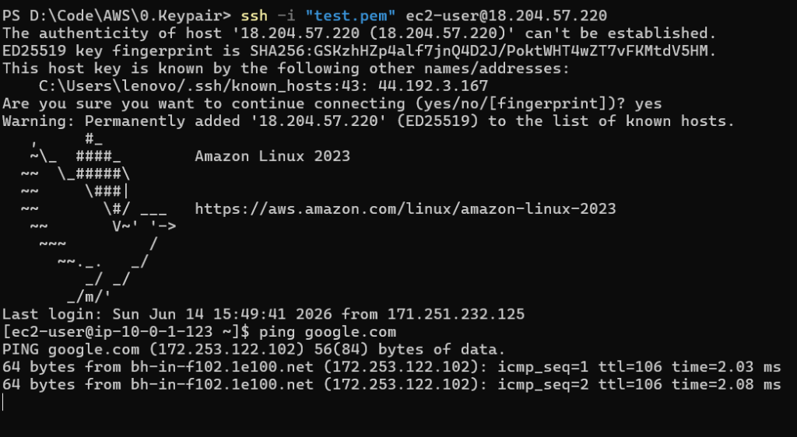

> [!WARNING]
> **Lưu ý về Chi phí Elastic IP:**
> AWS miễn phí Elastic IP khi nó được liên kết (Associate) với một máy chủ đang chạy. Tuy nhiên, nếu bạn giải phóng máy chủ (Terminate/Stop) nhưng **không giải phóng (Release) địa chỉ Elastic IP**, AWS sẽ tính phí phạt theo giờ trên địa chỉ IP nhàn rỗi này để tránh lãng phí tài nguyên IPv4 công cộng.

---

### Bước 4: Khởi tạo máy chủ ảo EC2 trong Private Subnet và cấu hình kết nối SSH bắc cầu từ Bastion Host

Để kiểm thử khả năng kết nối và định tuyến của **Private Subnet** (không đi trực tiếp ra ngoài Internet mà phải thông qua NAT Gateway), chúng ta sẽ tạo một EC2 instance nằm trong Private Subnet và thực hiện SSH vào nó từ máy chủ Bastion Host (`public-instance`) đã tạo ở các bước trước.

#### 1. Khởi tạo EC2 Instance trong Private Subnet

1. Tại **EC2 Dashboard** → Click **Launch instance**.
2. Cấu hình các thông số cơ bản cho máy chủ:
   *   **Name:** `private-instance`
   *   **Application and OS Images (AMI):** Chọn `Amazon Linux 2023 AMI` (hoặc hệ điều hành khác tùy cấu hình của bạn).
   *   **Instance type:** Chọn `t2.micro` (hoặc `t3.micro`).
   *   **Key pair (login):** Chọn **cùng Key pair** đã dùng cho Public Instance (ví dụ: `test.pem`) để đơn giản hóa quá trình quản lý key.
3. Cấu hình mạng tại mục **Network settings**:
   *   Nhấp chọn **Edit** ở góc phải mục Network settings.
   *   **VPC - required:** Chọn đúng VPC đã tạo (`test-vpc`).
   *   **Subnet:** Chọn **1 trong 2 Subnet Private** (ví dụ: `private-subnet-01` như hình dưới).
   *   **Auto-assign public IP:** Chọn **Disable** (để đảm bảo máy ảo này không có địa chỉ IP công cộng và không thể truy cập trực tiếp từ Internet).
   *   **Firewall (security groups):** Click **Select existing security group** → Chọn nhóm bảo mật `app-sg` (đảm bảo nhóm bảo mật này cho phép nhận lưu lượng SSH cổng 22 từ Security Group của Bastion Host - `bastion-sg` / `public-sg`).
4. Kiểm tra lại thông tin và click **Launch instance**:

   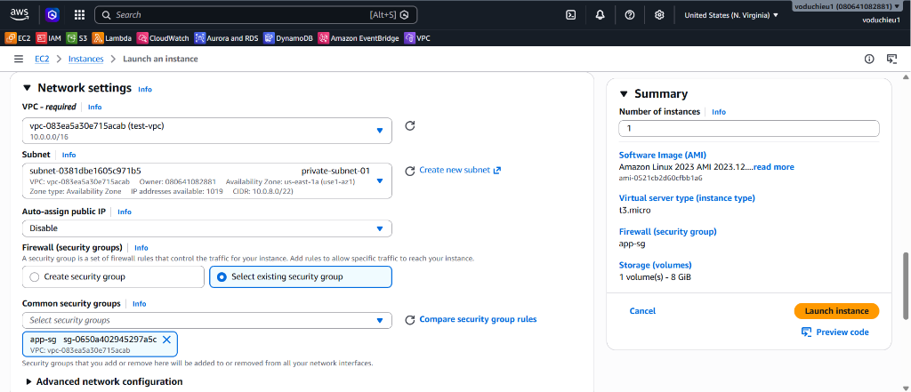

#### 2. Cấu hình Private Key (.pem) trên Bastion Host

Vì `private-instance` không có Public IP, chúng ta không thể SSH trực tiếp từ máy tính cá nhân. Thay vào đó, chúng ta sẽ SSH vào Bastion Host trước, sau đó từ Bastion Host thực hiện SSH sang Private Instance. Để thực hiện việc này, chúng ta cần đưa file key pair (`test.pem`) lên Bastion Host:

1. Đăng nhập SSH vào Bastion Host qua địa chỉ Elastic IP.
2. Tạo file key pair mới bằng trình soạn thảo `vi` (hoặc `nano`):
   ```bash
   sudo vi test.pem
   ```
   *(Nhấn phím `i` để vào chế độ soạn thảo (Insert), copy toàn bộ nội dung file `.pem` từ máy cá nhân của bạn và dán vào Terminal. Nhấn `Esc`, gõ `:wq` và ấn `Enter` để lưu và thoát).*
3. Thay đổi quyền và chủ sở hữu của file key pair để đảm bảo tính bảo mật nghiêm ngặt của AWS (nếu không đổi quyền sang chỉ đọc cho chủ sở hữu, lệnh SSH sẽ bị từ chối):
   *   Thay đổi quyền truy cập thành chỉ đọc:
       ```bash
       sudo chmod 400 test.pem
       ```
   *   Thay đổi chủ sở hữu của file sang user chạy SSH (mặc định là `ec2-user`):
       ```bash
       sudo chown -R ec2-user:ec2-user test.pem
       ```
4. Kiểm tra lại thông tin file key pair bằng lệnh `ls -lsa` để đảm bảo file đã được phân quyền chính xác (`-r--------`):

   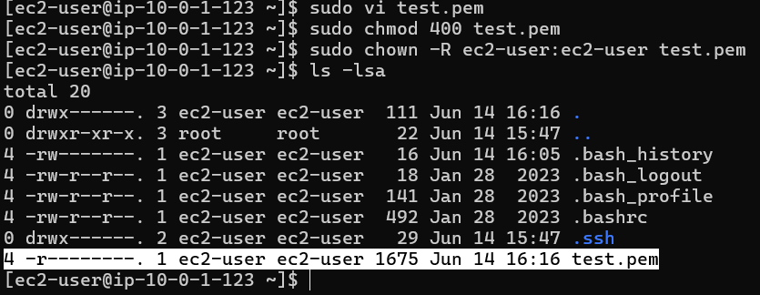

#### 3. SSH từ Bastion Host sang Private Instance và kiểm tra định tuyến NAT Gateway

Vì `private-instance` không có địa chỉ Public IP, việc kết nối phải thực hiện hoàn toàn nội bộ thông qua địa chỉ Private IP của máy ảo:

1. **Lấy thông tin và lệnh kết nối SSH:**
   * Tại **EC2 Dashboard**, nhấp chọn máy ảo `private-instance` → Nhấn **Connect**.
   * Chọn tab **SSH client**.
   * Lưu ý phần địa chỉ IP kết nối lúc này sẽ hiển thị địa chỉ **Private IP** nội bộ (ví dụ: `10.0.10.38`). Copy lệnh ví dụ ở bên dưới:
     ```bash
     ssh -i "test.pem" ec2-user@10.0.10.38
     ```

   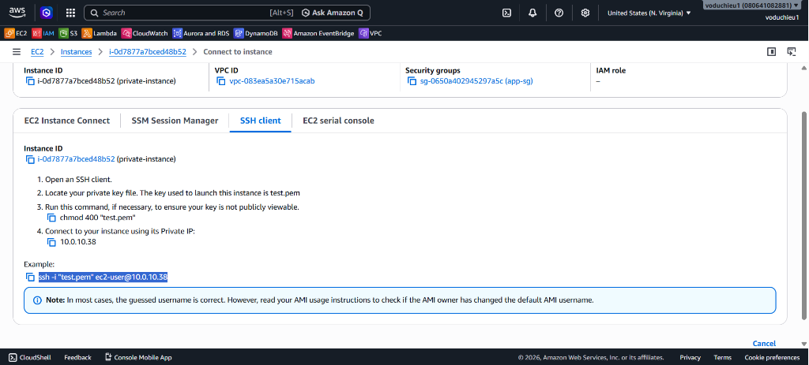

2. **Thực hiện kết nối từ Bastion Host (Public Instance):**
   * Quay trở lại màn hình Terminal (nơi bạn đang SSH vào Bastion Host).
   * Thực hiện chạy lệnh SSH vừa copy để kết nối tới Private Instance qua địa chỉ IP nội bộ:
     ```bash
     ssh -i "test.pem" ec2-user@<YOUR_PRIVATE_IP>
     ```
     *(Trong hình minh họa là `ssh -i "test.pem" ec2-user@10.0.10.38`)*
   * Hệ thống sẽ hỏi xác nhận độ tin cậy của Host (fingerprint) → Gõ `yes` và nhấn `Enter`. Kết nối SSH bắc cầu sẽ được thiết lập thành công:

   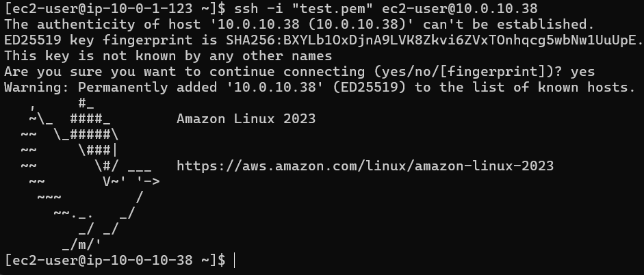

3. **Kiểm tra định tuyến NAT Gateway (Ping Test):**
   * Sau khi đã đăng nhập thành công vào Private Instance (màn hình hiển thị shell dạng `[ec2-user@ip-10-0-10-38 ~]$`), hãy thử thực hiện lệnh ping ra ngoài Internet để kiểm tra:
     ```bash
     ping google.com
     ```
   * Do Private Subnet đã được cấu hình Route Table trỏ luồng đi `0.0.0.0/0` qua NAT Gateway (NGW) ở Lab 2, Private Instance sẽ nhận được phản hồi ICMP từ Google một cách thông suốt:

   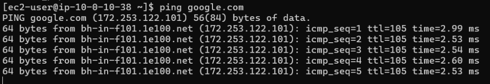

   * Nhấn `Ctrl + C` để dừng lệnh ping. Như vậy, chúng ta đã cấu hình định tuyến và kiểm thử kết nối thành công cho cả phân khu Public Subnet (qua IGW) và Private Subnet (qua NAT Gateway)!

---

### Bước 5: Kiểm nghiệm ngắt định tuyến NAT Gateway và xác thực hoạt động của S3 Gateway Endpoint

Để chứng minh vai trò và nguyên lý hoạt động của **S3 Gateway Endpoint** (định tuyến nội bộ tới dịch vụ S3 mà không cần qua Internet công cộng), chúng ta sẽ thực hiện ngắt định tuyến ra Internet qua NAT Gateway của Private Subnet, sau đó kiểm tra khả năng truy cập S3 từ Private Instance.

#### 1. Khởi tạo và gán IAM Role truy cập S3 cho Private Instance

Để EC2 instance có quyền tương tác với dịch vụ S3, chúng ta cần tạo một IAM Role và gán nó cho máy chủ.

**A. Tạo IAM Role cho EC2:**
1. Truy cập **IAM Dashboard** → Chọn mục **Roles** ở cột bên trái → Click **Create role**.
2. Tại màn hình **Select trusted entity**:
   *   **Trusted entity type:** Chọn `AWS service`.
   *   **Service or use case:** Chọn `EC2` (cho phép các máy chủ EC2 gọi các dịch vụ AWS thay thế bạn).
   *   Nhấn **Next** ở góc dưới bên phải:

   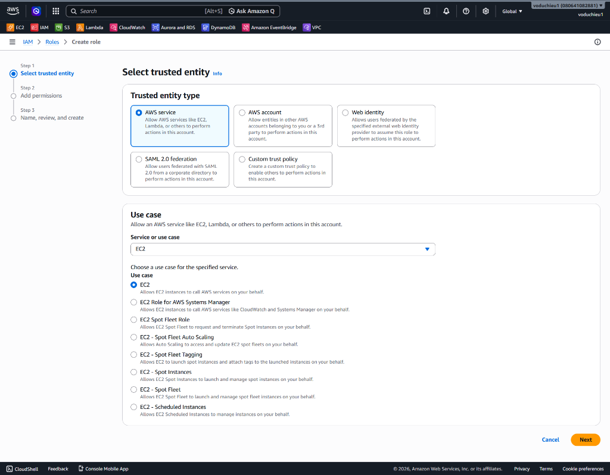

3. Tại màn hình **Add permissions**:
   *   Tìm kiếm policy `AmazonS3FullAccess` (hoặc `AmazonS3ReadOnlyAccess` nếu muốn bảo mật hơn).
   *   Check chọn chính xác Policy → Nhấn **Next**:

   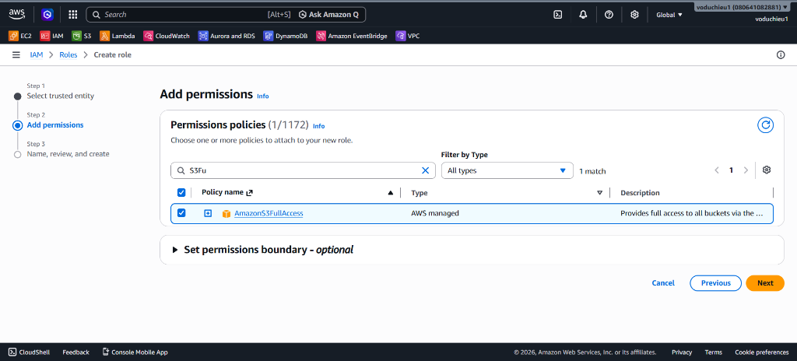

4. Nhập tên cho Role (ví dụ: `test-ec2-s3-role`) → Nhấn **Create role** để hoàn tất khởi tạo.

**B. Gán IAM Role cho EC2 Instance:**
1. Quay lại trang **EC2 Dashboard** → Chọn máy ảo `private-instance`.
2. Click nút **Actions** ở góc trên bên phải → Chọn **Security** → **Modify IAM role**:

   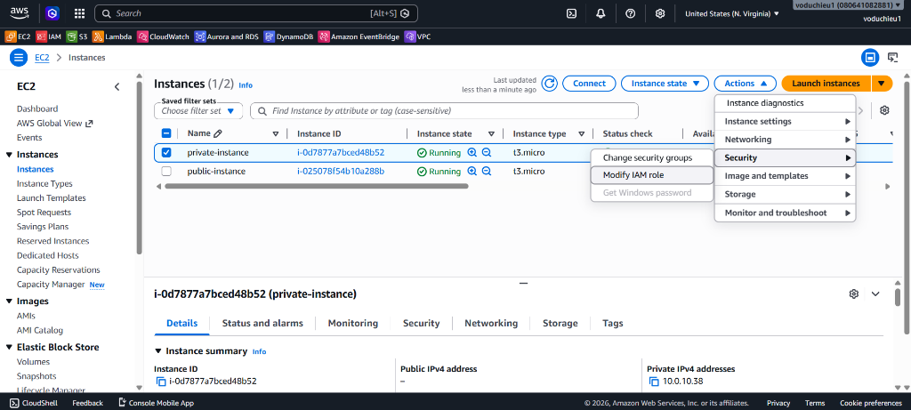

3. Tại màn hình Modify IAM role, click chọn đúng IAM role vừa tạo (`test-ec2-s3-role`) → Click **Update IAM role** để áp dụng:

   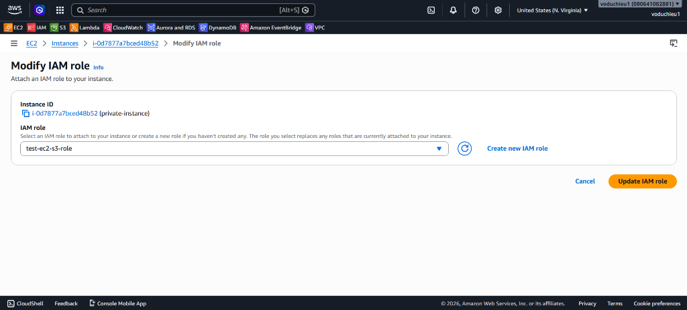

#### 2. Gỡ bỏ Route trỏ đến NAT Gateway trong Private Route Table

1. Truy cập **VPC Dashboard** → Chọn mục **Route tables** → Chọn Private Route Table của bạn (`pv-rtb`).
2. Xem tab **Routes** ở phía dưới để thấy các định tuyến hiện tại của Private Subnet:
   *   `10.0.0.0/16` trỏ đến `local` (Định tuyến nội bộ VPC).
   *   `pl-63a5400a` trỏ đến `vpce-xxxx` (Định tuyến đi tới S3 Gateway Endpoint).
   *   `0.0.0.0/0` trỏ đến `nat-xxxx` (Định tuyến đi ra Internet qua NAT Gateway).

   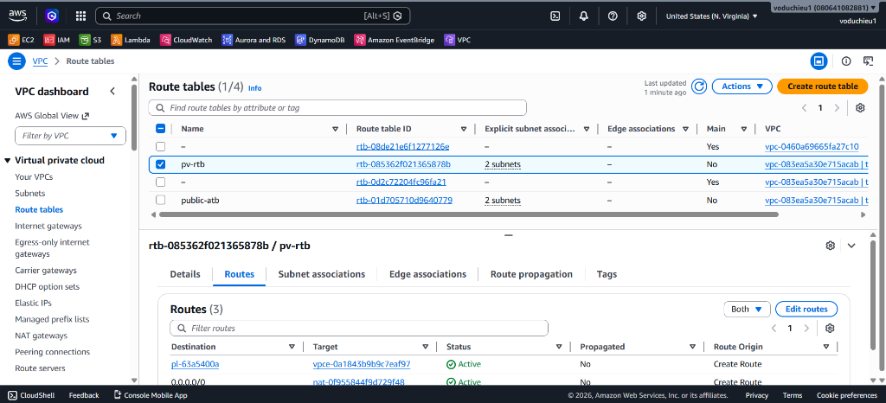

3. Click nút **Edit routes** ở góc phải.
4. Tại giao diện chỉnh sửa, tìm dòng định tuyến `0.0.0.0/0` trỏ tới target **NAT Gateway** → Nhấn nút **Remove** bên phải dòng đó để loại bỏ định tuyến đi Internet:

   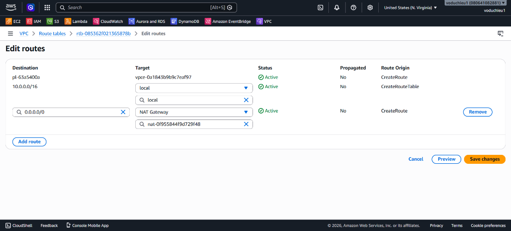

5. Sau khi loại bỏ route NAT Gateway, bảng định tuyến chỉ còn lại 2 định tuyến (`local` và `S3 endpoint`). Nhấn **Save changes** để hoàn tất cấu hình:

   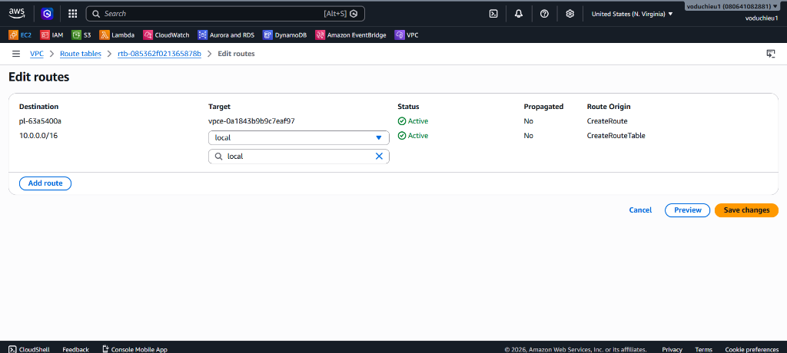

#### 3. Kiểm tra kết nối Internet (Ping Test)

1. Quay trở lại màn hình Terminal của `private-instance` (đã đăng nhập qua SSH ở Bước 4).
2. Thực hiện lệnh ping kiểm tra kết nối tới Internet công cộng:
   ```bash
   ping google.com
   ```
3. Đợi một lát và nhấn `Ctrl + C` để dừng. Kết quả sẽ hiển thị **100% packet loss** (không nhận được gói tin phản hồi nào), chứng tỏ máy chủ trong Private Subnet lúc này hoàn toàn bị ngắt kết nối với Internet do route đi qua NAT Gateway đã bị xóa bỏ:

   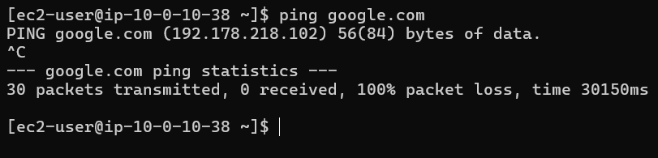

#### 4. Xác thực kết nối tới S3 thông qua Gateway Endpoint

Mặc dù `private-instance` đã mất hoàn toàn kết nối Internet (không thể ping `google.com`), chúng ta sẽ chạy lệnh AWS CLI để truy vấn dữ liệu dịch vụ S3 nhằm xác thực hoạt động của S3 Gateway Endpoint:

1. Chạy lệnh liệt kê danh sách các S3 Bucket:
   ```bash
   aws s3 ls
   ```
2. **Kết quả:** Lệnh AWS CLI vẫn thực hiện thành công và trả về danh sách các S3 bucket hiện có trong tài khoản của bạn (ví dụ dưới hình hiển thị bucket `h1eudayne` của tài khoản của bạn):

   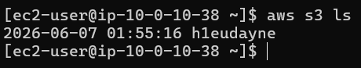

3. **Giải thích nguyên lý:** 
   * Do Route Table của Private Subnet vẫn giữ nguyên dòng định tuyến trỏ dải địa chỉ của dịch vụ S3 (Prefix List `pl-63a5400a`) đi qua VPC Endpoint (`vpce-xxxx`), toàn bộ yêu cầu kết nối tới S3 từ máy ảo sẽ được AWS định tuyến ngầm hoàn toàn trong mạng nội bộ của AWS.
   * Điều này giúp máy chủ trong Private Subnet truy cập S3 an toàn, độ trễ thấp và tiết kiệm chi phí băng thông NAT Gateway mà không cần mở kết nối ra ngoài Internet công cộng.

---

## III. Kiểm tra và Đánh giá (Verification)
1. Kiểm tra máy ảo EC2 `public-instance` trong VPC `test-vpc` đã chuyển sang trạng thái `Running` và được liên kết chính xác với một Public Subnet.
2. Xác nhận kết nối SSH vào máy chủ thông qua Public IP thành công.
3. Thực hiện ping ra internet (`ping google.com`) từ máy chủ thành công, chứng minh Internet Gateway đã hoạt động.
4. Xác nhận Elastic IP được gán chính xác cho máy chủ và có thể SSH bình thường qua địa chỉ IP tĩnh này.
5. Kiểm tra máy ảo EC2 `private-instance` khởi tạo thành công trong Private Subnet, không có địa chỉ Public IP.
6. Xác nhận sao chép key và cấu hình phân quyền thành công trên Bastion Host (`chmod 400` và `chown`).
7. Xác nhận SSH bắc cầu thành công từ Bastion Host sang Private Instance qua địa chỉ Private IP.
8. Thực hiện ping Internet thành công từ Private Instance khi có NAT Gateway.
9. Xác nhận gỡ bỏ định tuyến `0.0.0.0/0` qua NAT Gateway trong Private Route Table thành công.
10. Xác nhận Private Instance không thể kết nối Internet công cộng (100% packet loss khi ping `google.com`).
11. Xác nhận Private Instance truy cập dịch vụ S3 thành công qua S3 Gateway Endpoint bằng câu lệnh `aws s3 ls` (đã gán IAM Role phù hợp).
