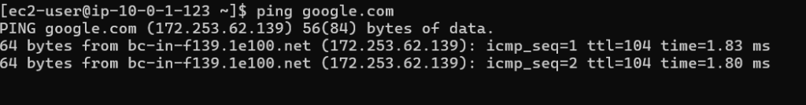
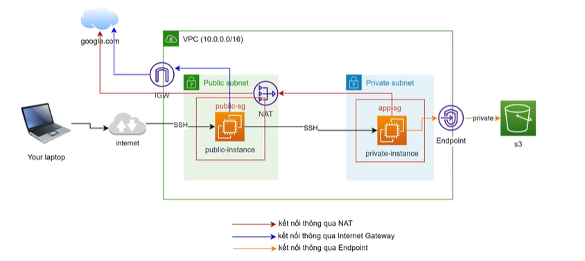
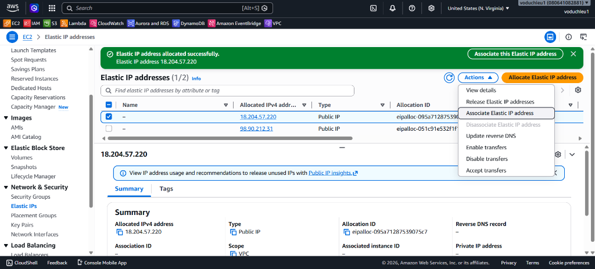
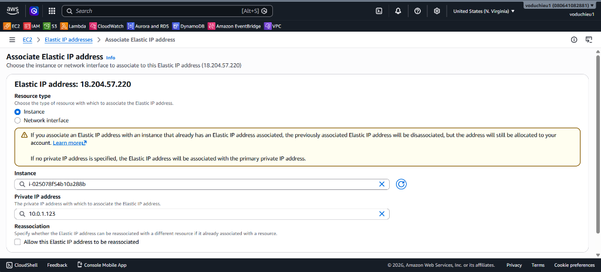

# 3. Lab 3 – Test kết nối trên VPC đã tạo (Amazon VPC Hands-on Lab)

Bài thực hành này hướng dẫn từng bước khởi tạo một máy chủ ảo EC2 trong phân khu Public Subnet để kiểm tra khả năng kết nối mạng qua Internet Gateway (IGW) và thực hiện cấu hình gán địa chỉ IP tĩnh công cộng (Elastic IP) cho máy chủ.

---

## I. Sơ đồ Kiến trúc Kết nối rút gọn (Simplified Lab Topology)

Để dễ hình dung luồng dữ liệu đi qua các thành phần mạng và tránh bị rối, sơ đồ dưới đây đã được lược bỏ các yếu tố dự phòng Multi-AZ (chỉ hiển thị một vùng khả dụng đơn lẻ đại diện):



---

## II. Các bước thực hiện chi tiết (Step-by-Step Guide)

### Bước 1: Khởi tạo máy chủ ảo EC2 trong Public Subnet

1. Truy cập vào trang quản trị dịch vụ **EC2 Dashboard** → Click **Launch instance**.
2. Cấu hình các thông số cơ bản cho máy chủ:
   *   **Name:** `public-instance`
   *   **Application and OS Images (Amazon Machine Image):** Chọn `Amazon Linux 2023 AMI` (mặc định, đủ điều kiện Free Tier).
   *   **Instance type:** Chọn `t2.micro` (hoặc `t3.micro` tùy theo Free Tier khả dụng của tài khoản).
   *   **Key pair (login):** Chọn Key pair sẵn có của bạn hoặc tạo mới để SSH vào máy chủ.
3. Cấu hình mạng tại mục **Network settings**:
   *   Nhấp chọn **Edit** ở góc phải mục Network settings.
   *   **VPC - required:** Chọn đúng VPC tùy chỉnh mà bạn đã tạo ở Lab 2 (`test-vpc`).
   *   **Subnet:** Chọn **1 trong 2 Subnet Public** đã phân hoạch (ví dụ: `public-subnet-01` hoặc `public-subnet-02`).
   *   **Auto-assign public IP:** Chọn **Enable** (Bắt buộc kích hoạt để AWS tự động cấp phát một địa chỉ IP công cộng ngẫu nhiên, giúp máy chủ có thể định tuyến ra Internet qua IGW).
   *   **Firewall (security groups):** Click **Select existing security group** → Chọn nhóm bảo mật `public-sg` hoặc `bastion-sg` (đảm bảo luật Inbound cho phép cổng SSH 22 truy cập từ địa chỉ IP của bạn).

4. Nhấn **Launch instance** ở bảng điều khiển bên phải. Đợi khoảng 1-2 phút để máy chủ khởi động hoàn tất và hiển thị trạng thái `Running`.

---

### Bước 2: Đăng nhập SSH và kiểm tra kết nối mạng qua Internet Gateway

Chúng ta sẽ đăng nhập vào máy chủ qua SSH và thử ping tới một địa chỉ bên ngoài (ví dụ: `google.com`) để xác nhận bảng định tuyến Public Route Table cùng Internet Gateway đã hoạt động chính xác.

1. Lấy địa chỉ Public IP của máy ảo vừa tạo (Xem tại tab **Details** của Instance).
2. Sử dụng Terminal (hoặc Git Bash, Command Prompt trên Windows) thực hiện lệnh SSH kết nối:
   ```bash
   ssh -i "/path/to/your-key.pem" ec2-user@<YOUR_PUBLIC_IP>
   ```
3. Sau khi kết nối thành công vào Terminal của máy ảo, thực hiện lệnh `ping` kiểm tra mạng:
   ```bash
   ping google.com -c 4
   ```
4. Nếu kết quả hiển thị các gói tin ICMP được gửi và nhận thành công với thời gian phản hồi (RTT) cụ thể, điều này chứng tỏ máy chủ của bạn đã đi ra ngoài Internet thông qua Internet Gateway thành công:

   

---

### Bước 3: Gán địa chỉ IP tĩnh công cộng (Elastic IP) cho máy chủ

Địa chỉ Public IP mặc định được cấp phát tự động ở Bước 1 sẽ bị thay đổi mỗi khi bạn Stop và Start lại máy chủ. Để giữ địa chỉ IP cố định, chúng ta cần gán cho nó một **Elastic IP (EIP)**.

1. Tại menu bên trái trang quản trị EC2 (hoặc VPC), cuộn xuống mục **Network & Security** → Chọn **Elastic IPs**:

   

2. Nhấn nút **Allocate Elastic IP address** ở góc trên cùng bên phải.
3. Giữ các cấu hình mặc định (Network Border Group, Amazon's pool of IPv4 addresses) → Nhấn **Allocate** ở góc dưới cùng.
4. AWS sẽ cấp phát một IP tĩnh công cộng mới (ví dụ: `18.204.57.220`).
5. Liên kết Elastic IP với Instance của bạn:
   *   Chọn địa chỉ Elastic IP vừa Allocate thành công từ danh sách.
   *   Click nút **Actions** ở góc trên bên phải → Chọn **Associate Elastic IP address**:

   

   *   Tại giao diện cấu hình liên kết:
       *   **Resource type:** Chọn `Instance`.
       *   **Instance:** Chọn đúng máy ảo `public-instance` bạn đã khởi tạo ở Bước 1.
       *   **Private IP address:** Chọn địa chỉ IP nội bộ tương ứng của máy ảo đó.

   

   *   Nhấn nút **Associate** để hoàn tất.

6. **Kiểm tra lại kết nối:** Thử ngắt kết nối SSH hiện tại và SSH lại vào máy chủ bằng địa chỉ Elastic IP mới vừa được gán. Kết nối SSH phải thành công bình thường.

> [!WARNING]
> **Lưu ý về Chi phí Elastic IP:**
> AWS miễn phí Elastic IP khi nó được liên kết (Associate) với một máy chủ đang chạy. Tuy nhiên, nếu bạn giải phóng máy chủ (Terminate/Stop) nhưng **không giải phóng (Release) địa chỉ Elastic IP**, AWS sẽ tính phí phạt theo giờ trên địa chỉ IP nhàn rỗi này để tránh lãng phí tài nguyên IPv4 công cộng.

---

## III. Kiểm tra và Đánh giá (Verification)
1. Kiểm tra máy ảo EC2 `public-instance` trong VPC `test-vpc` đã chuyển sang trạng thái `Running` và được liên kết chính xác với một Public Subnet.
2. Xác nhận kết nối SSH vào máy chủ thông qua Public IP thành công.
3. Thực hiện ping ra internet (`ping google.com`) từ máy chủ thành công, chứng minh Internet Gateway đã hoạt động.
4. Xác nhận Elastic IP được gán chính xác cho máy chủ và có thể SSH bình thường qua địa chỉ IP tĩnh này.
