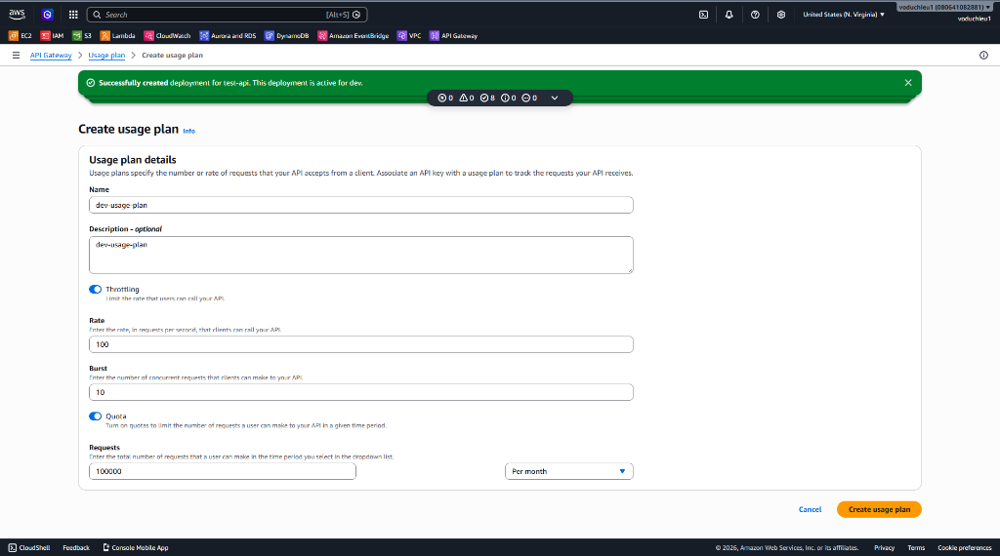
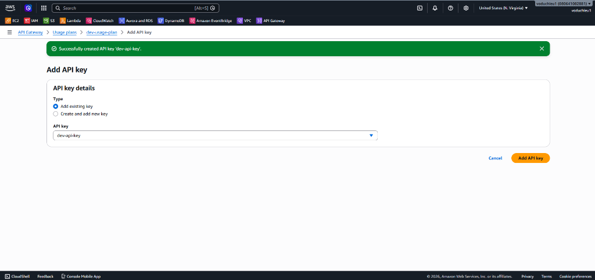
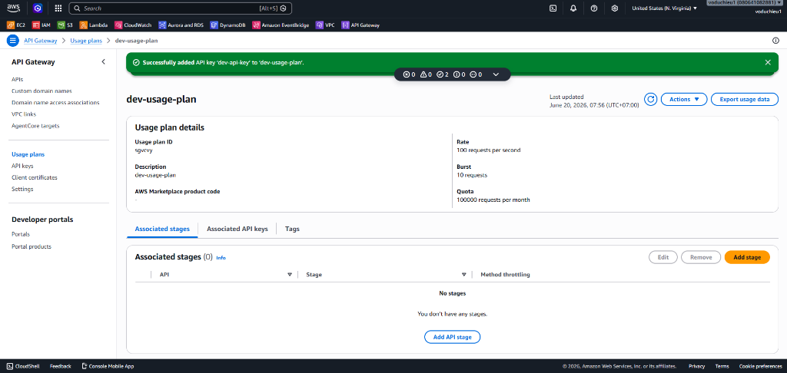
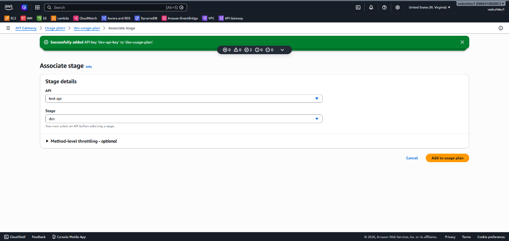
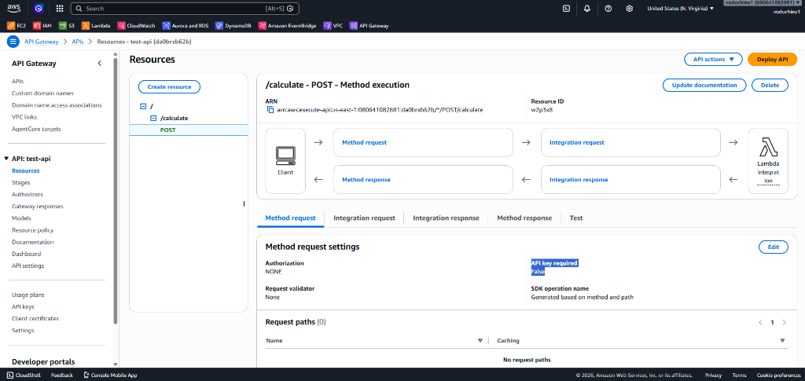
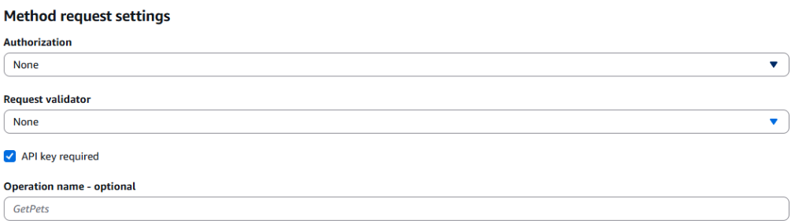
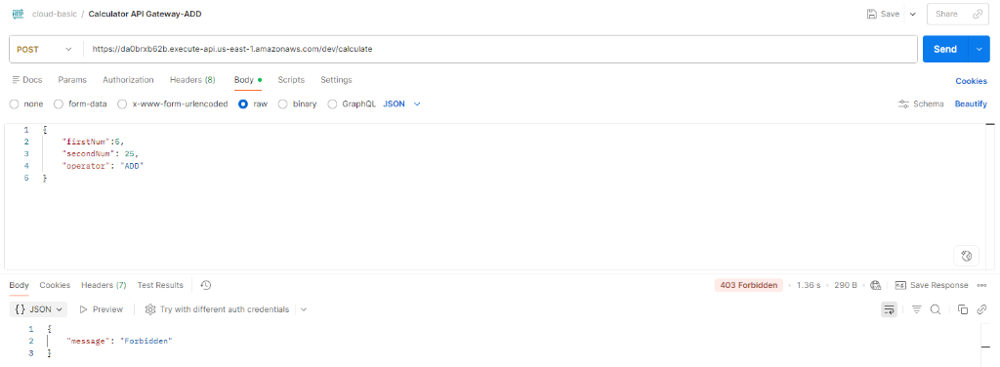
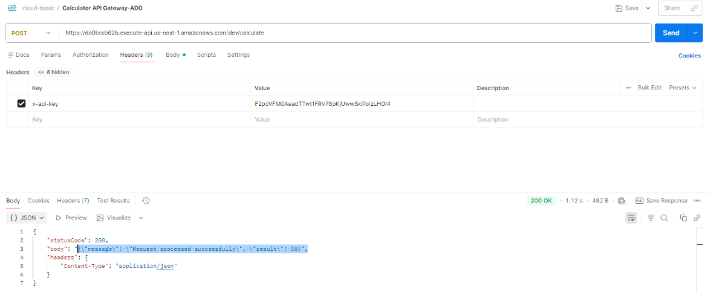

# 2. API Key và Usage Plan trong API Gateway - Hướng dẫn chi tiết

 **[Xem Đề bài / Yêu cầu bài Lab](2.%20Lab%202%20-%20API%20Key%20and%20Usage%20Plan.md)**

---

## Các bước thực hiện chi tiết

### Bước 1: Tạo Usage Plan (Kế hoạch sử dụng)

Usage Plan giúp quy định tần suất giới hạn (Rate Limiting) và hạn mức (Quota) sử dụng API của các client nhằm tránh quá tải hệ thống.

1. Tại menu danh mục bên trái của API Gateway, click chọn **Usage plans**.
2. Click chọn nút **Create usage plan**.
3. Cấu hình thông tin chi tiết cho kế hoạch sử dụng:
   * **Name**: Nhập `dev-usage-plan`.
   * **Throttling (Điều tiết tần suất):**
     * **Rate**: Nhập `100` (tối đa 100 requests mỗi giây ổn định).
     * **Burst**: Nhập `10` (cho phép tối đa 10 requests tăng đột biến xử lý ngay lập tức).
   * **Quota (Hạn mức dung lượng):**
     * **Limit**: Nhập `100000` (tổng số request tối đa).
     * **Period**: Chọn `Month` (mỗi tháng).
4. Nhấn **Create usage plan** ở góc dưới bên phải để hoàn tất.



---

### Bước 2: Tạo API Key trên Console

Ta tiến hành tạo một API Key để phân phát cho client đính kèm vào các cuộc gọi API:

1. Tại menu danh mục bên trái của API Gateway, click chọn **API keys**.
2. Click chọn nút **Create API key** (hoặc chọn từ menu *Actions* $\rightarrow$ *Create API key*):
   * **Name**: Nhập tên gợi nhớ, ví dụ: `dev-api-key`.
   * **API key**: Tích chọn **Auto-generate** để AWS tự động sinh chuỗi khóa bảo mật.
3. Nhấp chọn **Save** ở dưới cùng (hoặc click chọn **Create API key**).
4. Sau khi lưu thành công, bạn sẽ thấy thông tin chi tiết của API Key hiện ra.
5. Click chọn **Show** ở dòng **API key** và sao chép chuỗi ký tự bí mật (chuỗi này có dạng tương tự như: `d41d8cd98f00b204e9800998ecf8427e`). Hãy lưu chuỗi này lại để kiểm thử trên Postman ở bước sau.

---

### Bước 3: Gán API Key cho Usage Plan

Để Usage Plan áp dụng hạn mức và tần suất cụ thể cho khóa truy cập, ta cần gán API Key vào Usage Plan:

1. Vào giao diện **Usage plans** $\rightarrow$ Click chọn Usage Plan **`dev-usage-plan`** vừa tạo.
2. Click chuyển sang tab **Associated API keys** nằm bên cạnh tab *Associated stages*.
3. Click chọn **Add API key**:
   * **Type**: Chọn **Add existing key**.
   * **API key**: Chọn **`dev-api-key`** từ danh sách xổ xuống.
4. Click chọn **Add API key** để hoàn tất việc gán API Key vào Usage Plan.



*Sau khi gán thành công, hệ thống sẽ hiện thông báo màu xanh chúc mừng, lúc này ta chuyển sang liên kết Stage ở Bước 4.*

---

### Bước 4: Gán API Gateway cho Usage Plan (Apply cho cấp độ Stage)

Để áp đặt Usage Plan lên một môi trường (Stage) cụ thể của API Gateway, ta thực hiện như sau:

1. Tại màn hình chi tiết của Usage Plan **`dev-usage-plan`**, click chọn tab **Associated stages**.
   *(Lúc này tab Associated stages của bạn đang trống và có thông báo thành công từ bước gán API Key trước đó)*



2. Click chọn nút **Add stage** hoặc **Add API stage**:
   * **API**: Chọn **`test-api`** từ danh sách xổ xuống.
   * **Stage**: Chọn **`dev`**.
3. Click chọn nút **Add to usage plan** để lưu cấu hình liên kết.



---

### Bước 5: Bật API key required trên Method và Tiến hành Deploy API

Để phương thức API thực sự yêu cầu API Key khi được gọi từ client, ta phải kích hoạt cài đặt này ở mức Resource Method:

1. Tại danh mục menu bên trái, click chọn **APIs** $\rightarrow$ Chọn API **`test-api`** $\rightarrow$ Click chọn **Resources**.
2. Trong cây thư mục tài nguyên, click chọn method **`POST`** nằm dưới `/calculate`.
3. Tìm đến tab **Method request** ở khu vực quản trị bên phải. Bạn sẽ thấy dòng **API key required** hiện tại đang ở trạng thái **`False`**:



4. Click chọn nút **Edit** ở góc phải của khu vực *Method request settings*:
   * Tích chọn ô vuông **`API key required`** để chuyển trạng thái thành **`True`**.



5. Nhấn **Save** (hoặc **Save changes**) để lưu lại cấu hình.
6. **Deploy API (Bắt buộc):** Sau khi save xong cấu hình, bạn phải deploy API lên stage để các thay đổi có hiệu lực:
   * Click chọn nút **Deploy API** ở góc trên cùng bên phải.
   * **Stage**: Chọn **`dev`**.
   * Nhấn nút **Deploy**.

---

### Bước 6: Kiểm thử và Xác minh kết quả trên Postman

Mở công cụ Postman và thực hiện kiểm tra 2 tình huống gọi API để kiểm nghiệm:

#### Tình huống 1: Gọi API KHÔNG kèm API Key trong Header
1. Chọn request **`POST Calculator API Gateway-ADD`** trong collection Postman của bạn.
2. Nhấn **Send** trực tiếp mà không cấu hình thêm gì cả.
3. **Kết quả trả về:** Bạn sẽ nhận được mã lỗi HTTP Status **`403 Forbidden`** kèm theo phản hồi từ API Gateway:
   ```json
   {
       "message": "Forbidden"
   }
   ```
   *Điều này chứng tỏ cấu hình bảo mật đã hoạt động chính xác. API Gateway đã chặn đứng request không hợp lệ trước khi nó tiếp cận tới Lambda backend.*



#### Tình huống 2: Gọi API CÓ KÈM API Key hợp lệ trong Header
1. Trong giao diện gửi request của Postman, click chuyển sang tab **Headers** (nằm bên dưới URL).
2. Thêm một dòng Header mới với thông số sau:
   * **Key**: **`x-api-key`** (đây là Header chuẩn của AWS API Gateway để nhận diện API Key).
   * **Value**: Dán chuỗi API Key bạn đã sao chép ở Bước 2.
3. Nhấn **Send** để gửi request.
4. **Kết quả trả về:** Bạn sẽ nhận được mã HTTP Status **`200 OK`** cùng với body phản hồi thành công chứa kết quả phép tính từ Lambda backend:
   ```json
   {
       "statusCode": 200,
       "body": "{\"message\": \"Request processed successfully\", \"result\": 30}",
       "headers": {
           "Content-Type": "application/json"
         }
   }
   ```



*Đến đây, bạn đã hoàn thành xuất sắc việc bảo mật và quản lý tần suất gọi API Gateway bằng API Key và Usage Plan!*

---

* **Bài trước**: [1. Lab 1 – API Gateway sử dụng Lambda làm backend](../1.%20Lab%201%20-%20API%20Gateway%20with%20Lambda%20Backend/1.%20Lab%201%20-%20API%20Gateway%20with%20Lambda%20Backend.md)
* **Bài tiếp theo**: Sắp ra mắt (Coming soon...)

---

 **[Quay lại Đề bài](2.%20Lab%202%20-%20API%20Key%20and%20Usage%20Plan.md)**
