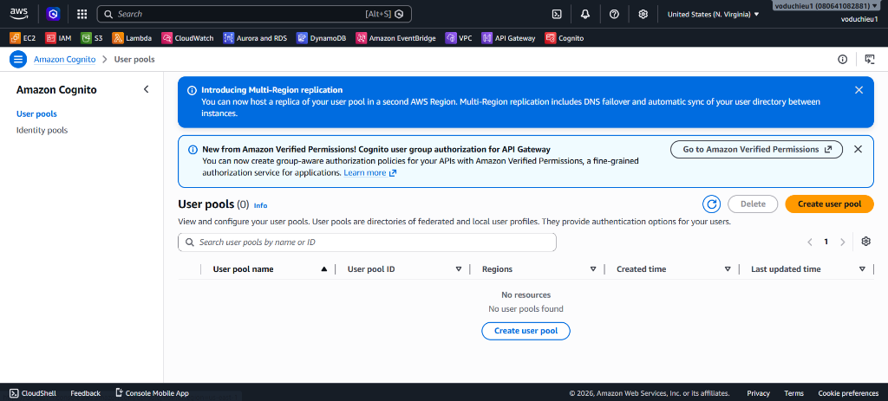
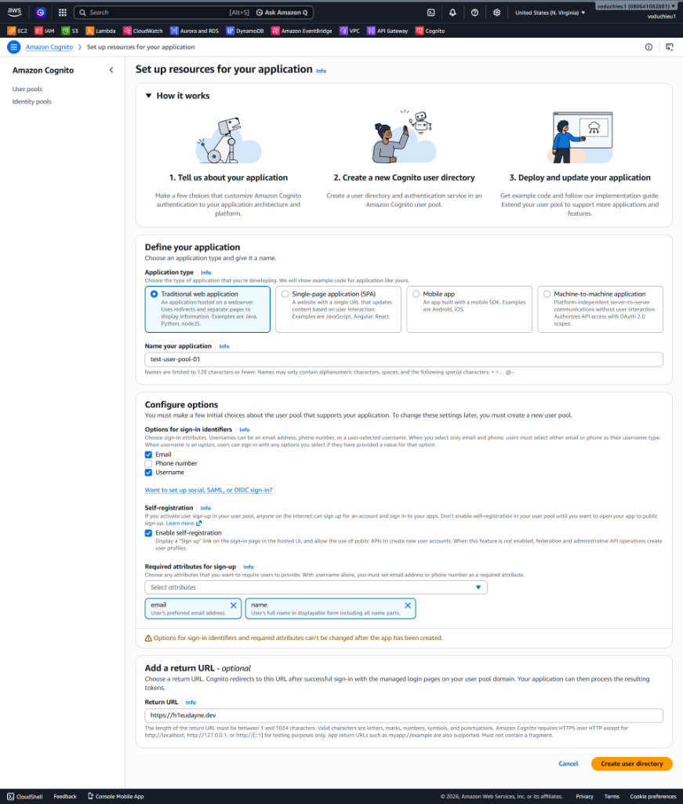
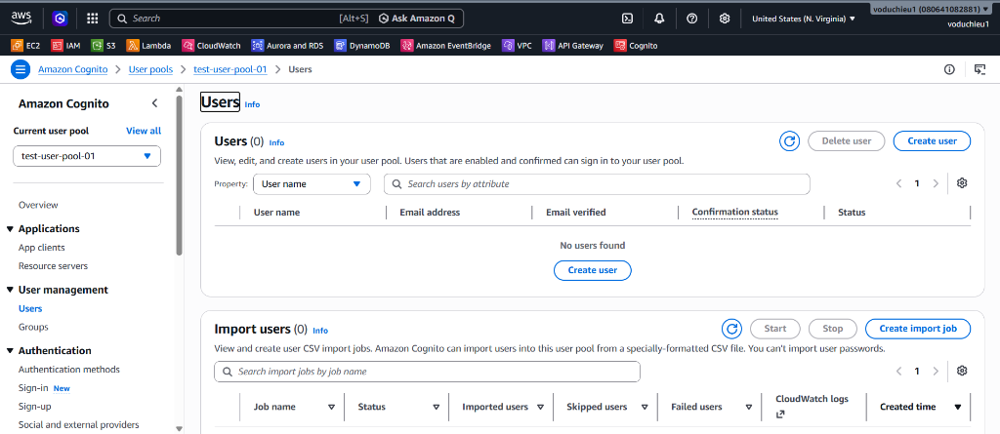
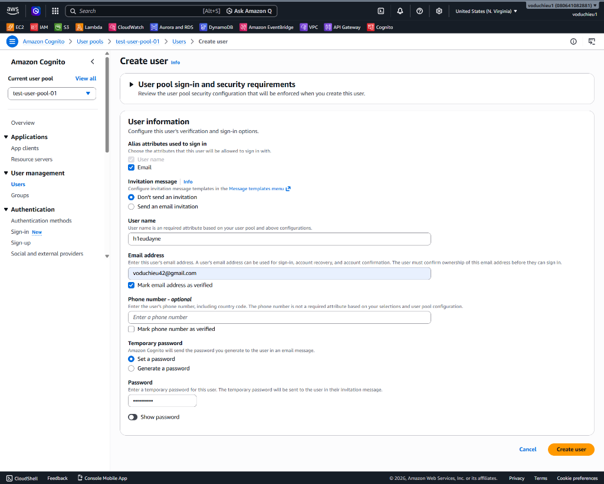
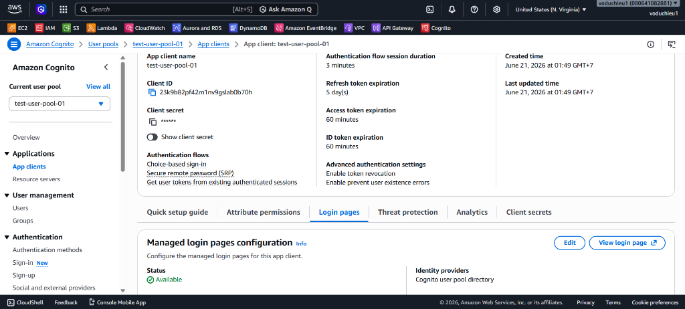
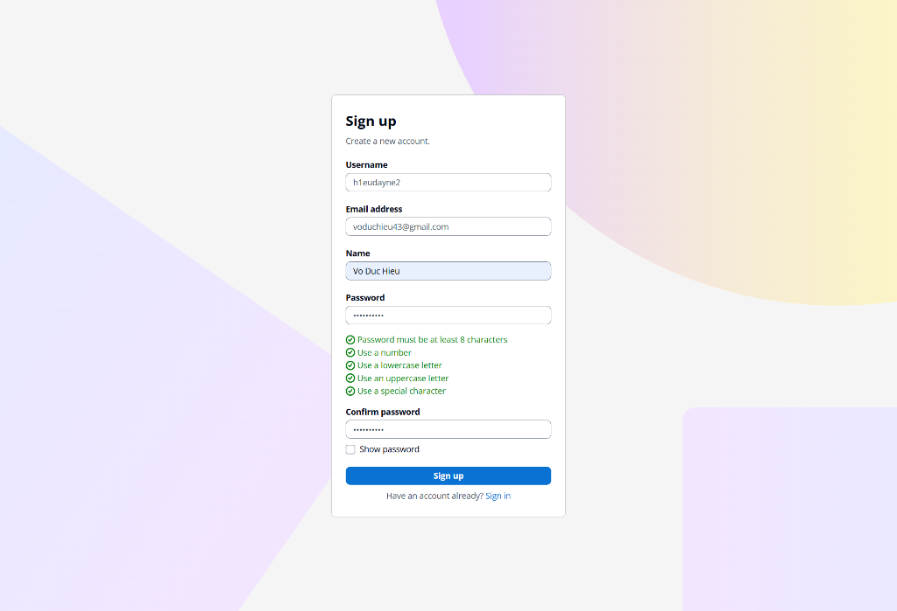
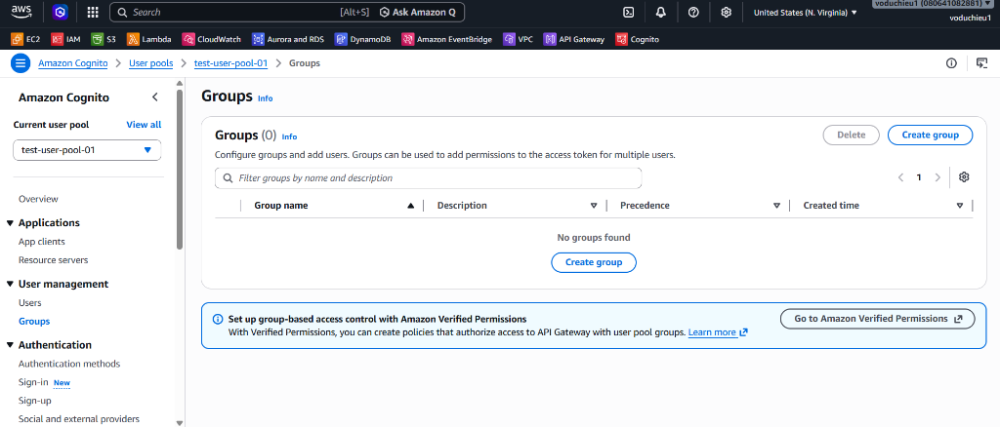
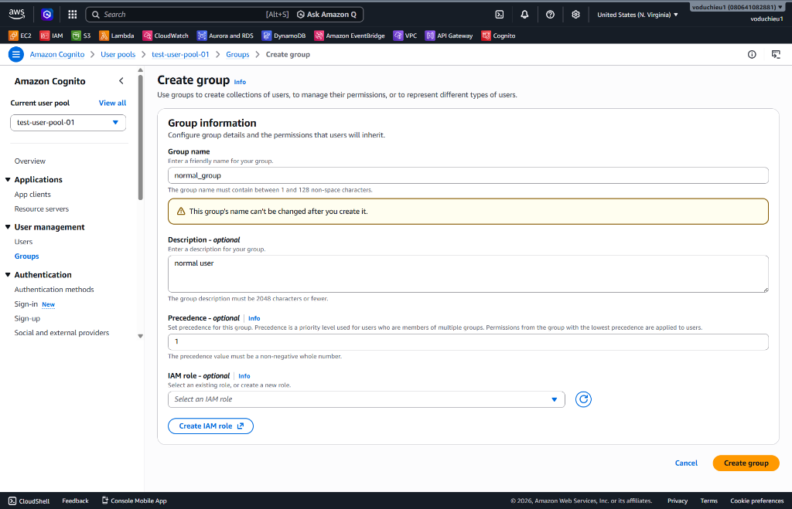
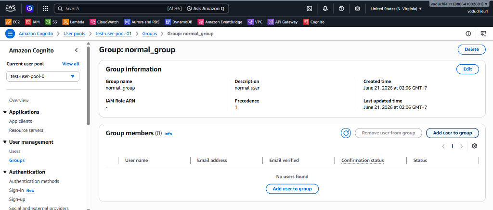
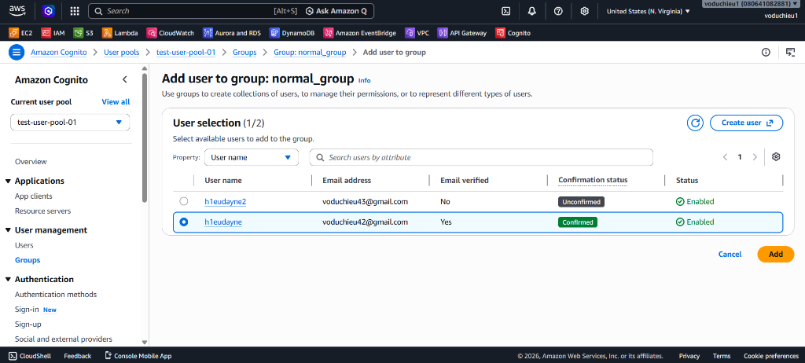

# 3. Cognito Operation Basic - Hướng dẫn chi tiết

 **[Xem Đề bài / Yêu cầu bài Lab](3.%20Lab%203%20-%20Cognito%20Operation%20Basic.md)**

---

## Các bước thực hiện chi tiết

### Bước 1: Khởi tạo Cognito User Pool

Amazon Cognito User Pool là một thư mục người dùng hỗ trợ các chức năng đăng ký, đăng nhập và xác thực cho ứng dụng của bạn.

1. Đăng nhập vào AWS Management Console, tìm kiếm và truy cập dịch vụ **Cognito**.
2. Tại màn hình dashboard của Amazon Cognito, click chọn nút **Create user pool**.

3. Tiến hành cấu hình thông tin cho ứng dụng tại trang **Set up resources for your application**:
   * **Define your application:**
     * **Application type**: Chọn **Traditional web application**.
     * **Name your application**: Nhập `test-user-pool-01`.
   * **Configure options:**
     * **Options for sign-in identifiers**: Tích chọn cả **Email** và **Username**.
     * **Self-registration**: Tích chọn **Enable self-registration** (Cho phép người dùng tự đăng ký).
     * **Required attributes for sign-up**: Chọn **email** và **name** từ danh sách các thuộc tính bắt buộc.
   * **Add a return URL - optional:**
     * **Return URL**: Nhập `https://h1eudayne.dev` (Đây là URL mà Cognito sẽ chuyển hướng người dùng quay trở lại sau khi họ đăng nhập thành công).
4. Click chọn nút **Create user directory** ở góc dưới cùng bên phải để hoàn tất việc tạo User Pool.

---

### Bước 2: Tạo User bằng quyền quản trị (Admin)

Để tạo sẵn các tài khoản nội bộ mà không cần thông qua form đăng ký công khai, quản trị viên có thể khởi tạo trực tiếp người dùng từ bảng điều khiển Cognito:

1. Click chọn User Pool **`test-user-pool-01`** vừa tạo.
2. Tại menu danh mục bên trái, chọn **Users** dưới phần *User management*.
3. Click chọn nút **Create user**.

4. Cấu hình chi tiết thông tin người dùng mới:
   * **Invitation message**: Chọn **Don't send an invitation** (Không gửi thư mời qua email).
   * **User name**: Nhập `h1eudayne`.
   * **Email address**: Nhập `voduchieu42@gmail.com`.
   * Tích chọn **Mark email address as verified** (Đánh dấu email đã được xác minh để bỏ qua bước xác thực mã OTP khi đăng nhập).
   * **Temporary password**: Chọn **Set a password** và nhập mật khẩu tạm thời cho người dùng.
5. Click chọn **Create user** để lưu.

---

### Bước 3: Thử nghiệm Đăng nhập bằng Hosted UI của Cognito

AWS Cognito cung cấp sẵn một trang web giao diện đăng nhập (Hosted UI) giúp bạn dễ dàng tích hợp và thử nghiệm mà không cần tự code frontend:

1. Tại trang quản trị User Pool, click chọn menu **App clients** dưới phần *Applications*.
2. Click chọn App client tương ứng của bạn.
3. Chuyển sang tab **Login pages** trong phần thông tin App client.
4. Tại khu vực *Managed login pages configuration*, click chọn nút **View login page** để mở trang đăng nhập được Cognito hosted tự động.

5. Tại trang web đăng nhập vừa mở ra:
   * Nhập **Username** (`h1eudayne`) và **Mật khẩu tạm thời** bạn vừa đặt ở Bước 2.
   * Nhấp chọn **Sign In**.
   * Hệ thống sẽ yêu cầu bạn đổi mật khẩu mới trong lần đầu tiên đăng nhập. Nhập mật khẩu mới và xác nhận.
   * Sau khi đổi mật khẩu thành công, trình duyệt sẽ tự động chuyển hướng (redirect) về địa chỉ URL bạn đã cấu hình (`https://h1eudayne.dev`) kèm theo chuỗi query parameter chứa mã xác thực/token trên thanh URL (ví dụ: `?code=xxxx-xxxx-xxxx-xxxx`).

*Chúc mừng bạn đã cấu hình và xác thực thành công tài khoản trên Amazon Cognito User Pool!*

---

### Bước 4: Đăng ký tài khoản thông thường (Self Sign-up)

Bên cạnh việc admin tạo user thủ công, Cognito cũng hỗ trợ giao diện đăng ký tự động (Self Sign-up) cho người dùng bên ngoài:

1. Từ trang đăng nhập Hosted UI của Cognito (được mở ở Bước 3), click chọn liên kết **Sign up** ở dưới cùng.
2. Nhập các thông tin đăng ký cho tài khoản mới:
   * **Username**: `h1eudayne2`
   * **Email address**: `voduchieu43@gmail.com`
   * **Name**: `Vo Duc Hieu`
   * **Password / Confirm password**: Thiết lập mật khẩu thỏa mãn các quy tắc bảo mật của Cognito (được tích xanh toàn bộ).
3. Click chọn **Sign up** để đăng ký.

*Lưu ý:* Sau khi nhấn Sign up, tài khoản tự đăng ký này sẽ mặc định ở trạng thái `UNCONFIRMED` (chưa được xác thực) cho tới khi nhập mã OTP xác thực được gửi đến email đăng ký.

---

### Bước 5: Tạo Group và Thêm User vào Group

Group (Nhóm) trong Cognito giúp gom cụm người dùng để phân quyền truy cập thông qua IAM Role hoặc token claims.

1. Quay lại trang quản trị User Pool **`test-user-pool-01`** trên AWS Console.
2. Chọn mục **Groups** ở thanh danh mục bên trái (trong mục *User management*).
3. Click chọn nút **Create group**.

4. Cấu hình chi tiết cho Group mới:
   * **Group name**: Nhập `normal_group`.
   * **Description**: Nhập `normal user`.
   * **Precedence**: Nhập `1` (Mức độ ưu tiên để Cognito xác định group chính khi người dùng thuộc nhiều group).
   * **IAM role**: Để trống hoặc chọn mặc định (ở đây ta chưa cần gán IAM role).
5. Click chọn nút **Create group** ở góc dưới cùng bên phải.

6. Sau khi tạo thành công, click vào group **`normal_group`** vừa tạo.
7. Click chọn nút **Add user to group** (Thêm người dùng vào nhóm).

8. Trong bảng danh sách người dùng hiển thị:
   * Tích chọn người dùng **`h1eudayne`** (trạng thái `Confirmed`).
   * Click chọn nút **Add** ở góc dưới cùng bên phải.

> [!NOTE]
> **Một số lưu ý quan trọng về Cognito Group:**
> - **Không hỗ trợ nhóm lồng nhau (No nested groups):** Amazon Cognito không hỗ trợ cấu trúc nhóm con bên trong nhóm cha. Tất cả các nhóm đều nằm ở mức độ ngang hàng nhau trong cùng một User Pool.
> - AWS cho phép tích hợp Group với **Amazon Verified Permissions** để thực hiện phân quyền chi tiết (fine-grained authorization) cho các API trên API Gateway.

---

* **Bài trước**: [2. Lab 2 – API Key và Usage Plan trong API Gateway](../2.%20Lab%202%20-%20API%20Key%20and%20Usage%20Plan/2.%20Lab%202%20-%20API%20Key%20and%20Usage%20Plan.md)
* **Bài tiếp theo**: Sắp ra mắt (Coming soon...)

---

 **[Quay lại Đề bài](3.%20Lab%203%20-%20Cognito%20Operation%20Basic.md)**
