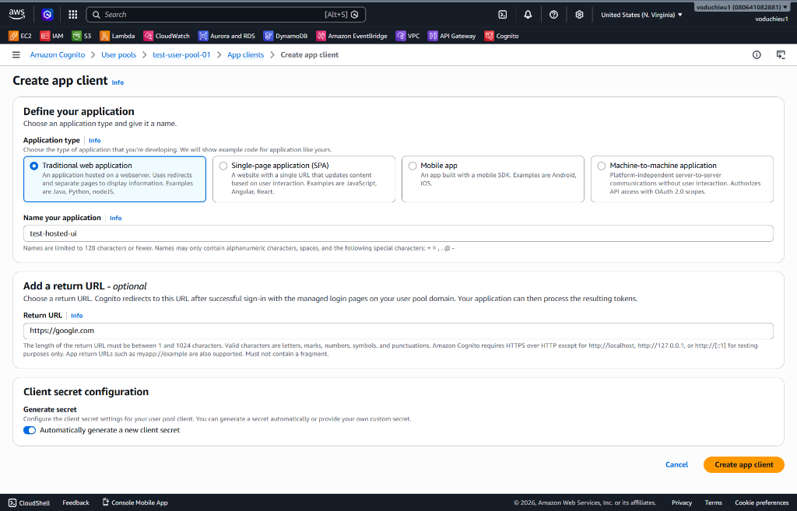
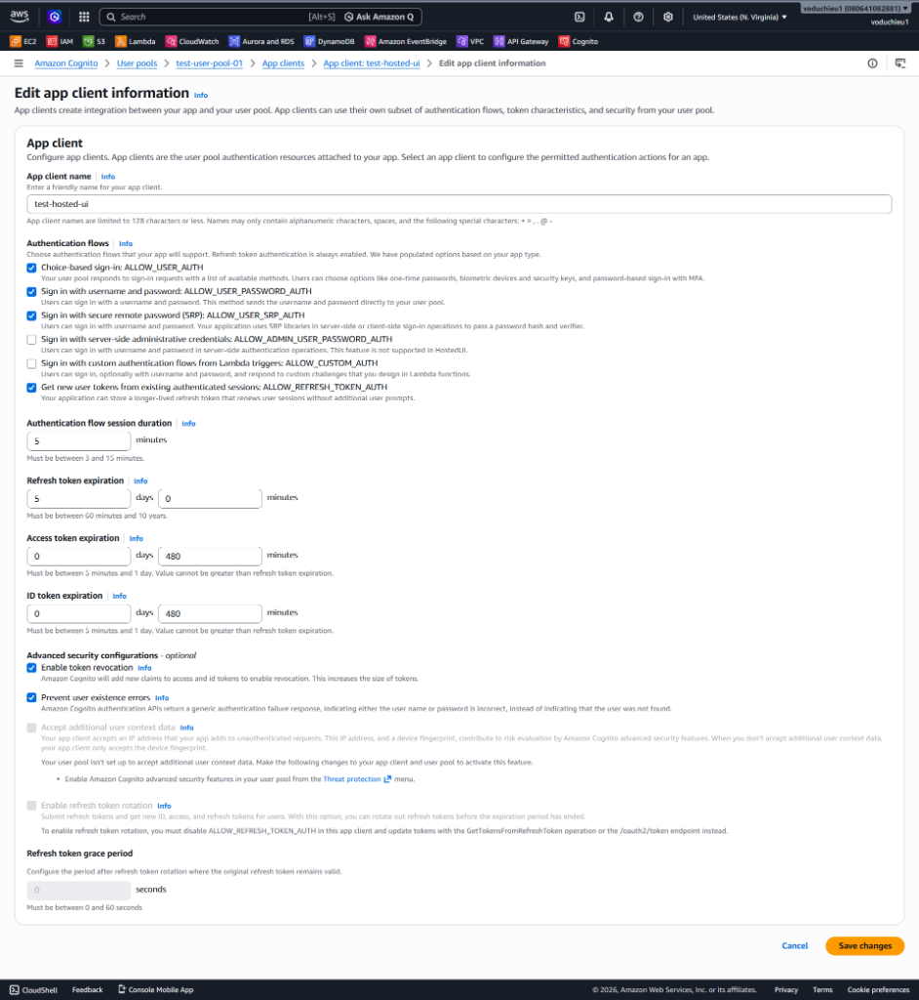
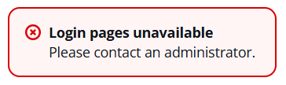
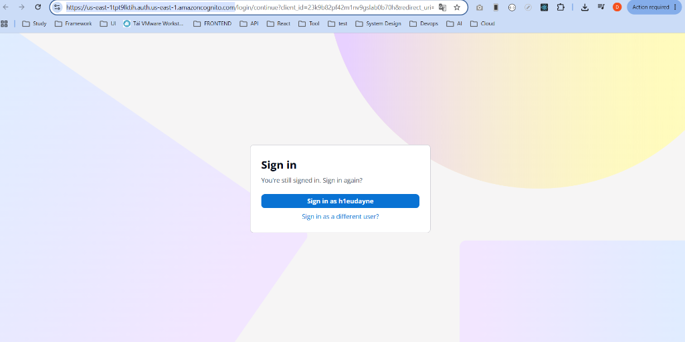
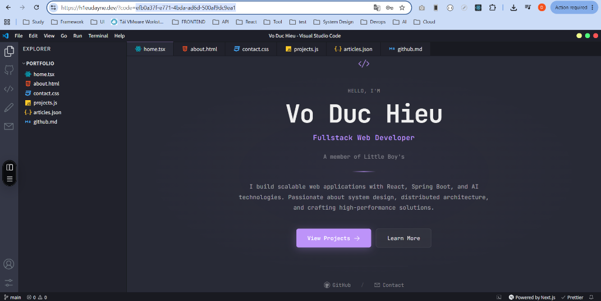

# 4. Sử dụng Cognito Hosted UI để login và lấy token - Hướng dẫn chi tiết

 **[Xem Đề bài / Yêu cầu bài Lab](4.%20Lab%204%20-%20Cognito%20Hosted%20UI%20Login%20and%20Token.md)**

---

## Các bước thực hiện chi tiết

### Bước 1: Tạo App Client mới cho User Pool

Để ứng dụng của bạn có thể giao tiếp với Cognito và thực hiện đăng nhập, bạn cần khởi tạo một App Client:

1. Đăng nhập vào AWS Management Console, truy cập dịch vụ **Cognito** và click chọn User Pool **`test-user-pool-01`** đã tạo ở Lab 3.
2. Chọn mục **App clients** ở menu bên trái (dưới mục *Applications*) -> Click chọn **Create app client**.
3. Cấu hình thông số App Client mới:
   * **Application type**: Chọn **Traditional web application** (Ứng dụng web truyền thống sử dụng redirect và client secret).
   * **Name your application**: Nhập `test-hosted-ui`.
   * **Return URL (Redirect URI)**: Nhập `https://h1eudayne.dev` (Đây là địa chỉ trang web cá nhân của bạn, nơi Cognito chuyển hướng về kèm theo `code` sau khi đăng nhập thành công).
   * **Client secret configuration**: Tích chọn **Automatically generate a new client secret** để hệ thống tự động sinh khóa bí mật.
4. Click chọn nút **Create app client** để lưu cấu hình.



---

### Bước 2: Chỉnh sửa cấu hình App Client (Edit App Client Settings)

Sau khi khởi tạo, bạn cần điều chỉnh các cơ chế dòng chảy xác thực (Authentication flows) và thời gian sống của token:

1. Tại danh sách App clients, click chọn App client **`test-hosted-ui`** vừa tạo.
2. Click chọn nút **Edit** tại mục *App client information*.
3. Tiến hành kiểm tra và cấu hình các mục sau:
   * **Authentication flows**: Đảm bảo đã tích chọn các luồng:
     * `ALLOW_USER_AUTH`
     * `ALLOW_USER_PASSWORD_AUTH`
     * `ALLOW_USER_SRP_AUTH`
     * `ALLOW_REFRESH_TOKEN_AUTH`
   * **Token expiration**: Cấu hình thời gian hết hạn của token:
     * **Refresh token expiration**: `5` days.
     * **Access token expiration**: `480` minutes (8 tiếng).
     * **ID token expiration**: `480` minutes (8 tiếng).
   * Tích chọn **Prevent user existence errors** để bảo mật hệ thống.
4. Nhấn **Save changes** để hoàn tất chỉnh sửa.



---

### Bước 3: Sửa lỗi "Login pages unavailable" (Nếu gặp phải)

Khi click chọn **View login page** để mở Hosted UI, nếu bạn gặp phải thông báo lỗi màu đỏ:
```text
Login pages unavailable
Please contact an administrator.
```



#### Nguyên nhân & Cách khắc phục:
Lỗi này xảy ra khi Cognito User Pool chưa được cấu hình tên miền (Domain) hoặc App Client chưa được bật nhà cung cấp định danh (Identity Provider).

1. **Cấu hình Domain cho User Pool:**
   * Trong giao diện quản lý User Pool, truy cập tab **App integration** (Tích hợp ứng dụng).
   * Cuộn xuống phần **Domain** -> Chọn **Actions** -> Click chọn **Create Cognito domain**.
   * Nhập một tiền tố tên miền duy nhất (ví dụ: `your-domain-prefix`) và lưu lại.
2. **Kích hoạt Identity Provider cho App Client:**
   * Truy cập tab **App integration** -> Cuộn xuống mục **App clients and analytics** -> Click chọn App client `test-hosted-ui`.
   * Tại tab **Login pages**, click chọn **Edit** tại mục *Managed login pages configuration*.
   * Trong phần **Identity providers**, đảm bảo bạn đã tích chọn **Cognito user pool directory** (đây là thư mục tài khoản cục bộ của bạn).
   * Nhấn **Save changes** và thử click lại **View login page** để mở Hosted UI.

---

### Bước 4: Đăng nhập Hosted UI và lấy Authorization Code

Khi Hosted UI hiển thị chính xác trang đăng nhập:

1. Click chọn **Sign in as h1eudayne** (nếu trình duyệt đã ghi nhớ phiên đăng nhập trước đó) hoặc nhập tài khoản `h1eudayne` kèm mật khẩu đã thiết lập ở Lab 3.



2. Đăng nhập thành công, trình duyệt sẽ tự động chuyển hướng về trang web cá nhân của bạn (`https://h1eudayne.dev`).
3. Quan sát thanh địa chỉ (Address bar) của trình duyệt để lấy mã **Authorization Code** nằm sau tham số `?code=` (Mã này có dạng tương tự như: `efb0a37f-e771-4bda-ad6d-500af9dc9ea1`).



---

### Bước 5: Đổi Authorization Code lấy JWT Tokens qua script Python

Vì mã `code` trên URL chỉ có thời hạn sử dụng 1 lần duy nhất trong vòng 5-10 phút, bạn cần thực hiện đổi (exchange) nó lấy các JSON Web Tokens (JWT) thông qua API OAuth2:

1. Mở file [exchange-token.py](exchange-token.py) có sẵn trong thư mục bài Lab này.
2. Tiến hành thay thế các tham số cấu hình bằng thông tin thực tế từ tài khoản AWS của bạn:
   * **`client_id`**: Client ID của App client `test-hosted-ui`.
   * **`client_secret`**: Client secret nhận được từ App client `test-hosted-ui`.
   * **`redirect_uri`**: Redirect URI bạn đã cấu hình (`https://h1eudayne.dev`).
   * **`token_endpoint`**: Đường dẫn Token endpoint của Cognito (Có dạng `https://<your-cognito-domain>.auth.<region>.amazoncognito.com/oauth2/token`).
   * **`authorization_code`**: Dán mã Code bạn vừa sao chép từ URL ở Bước 4 vào đây.

```python
client_id = '23k9b82pf42m1nv9gslab0b70h'
client_secret = '1t6g4lial29aloo5i4g5hsqb8puskogo6k2kb629nf9ddpebfruv'
redirect_uri = 'https://h1eudayne.dev'
token_endpoint = 'https://us-east-1tpt9lktih.auth.us-east-1.amazoncognito.com/oauth2/token'
authorization_code = 'efb0a37f-e771-4bda-ad6d-500af9dc9ea1'
```

3. Mở terminal tại thư mục bài Lab và chạy file script Python:
   ```bash
   python ./exchange-token.py
   ```

4. **Kết quả trả về:** Khi mã code hợp lệ và chưa hết hạn, script sẽ gửi request POST tới Cognito Token Endpoint và in ra màn hình 3 loại token:
   * **ID Token:** Chứa thông tin hồ sơ của người dùng (name, email, v.v.).
   * **Access Token:** Dùng để xác thực quyền truy cập đối với các API hoặc dịch vụ backend.
   * **Refresh Token:** Dùng để lấy Access Token mới khi Access Token cũ hết hạn mà không bắt người dùng đăng nhập lại.

---

* **Bài trước**: [3. Lab 3 – Cognito Operation Basic](../3.%20Lab%203%20-%20Cognito%20Operation%20Basic/3.%20Lab%203%20-%20Cognito%20Operation%20Basic.md)
* **Bài tiếp theo**: [5. Lab 5 – Kết hợp API Gateway & Cognito](../5.%20Lab%205%20-%20Integrate%20API%20Gateway%20and%20Cognito/5.%20Lab%205%20-%20Integrate%20API%20Gateway%20and%20Cognito.md)

---

 **[Quay lại Đề bài](4.%20Lab%204%20-%20Cognito%20Hosted%20UI%20Login%20and%20Token.md)**
