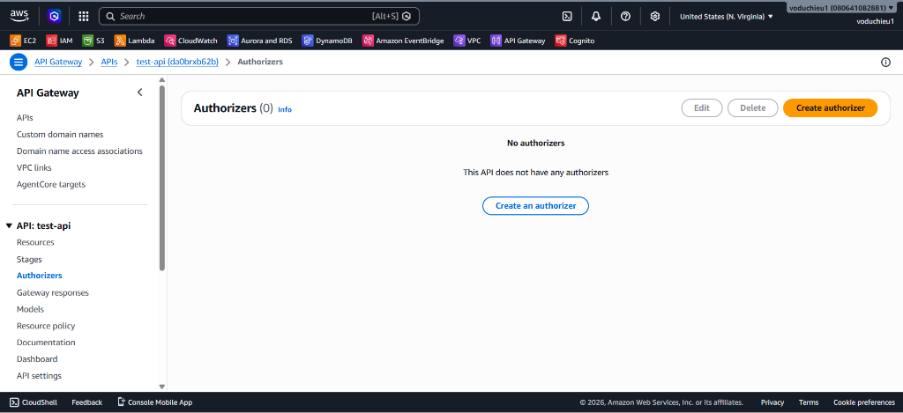
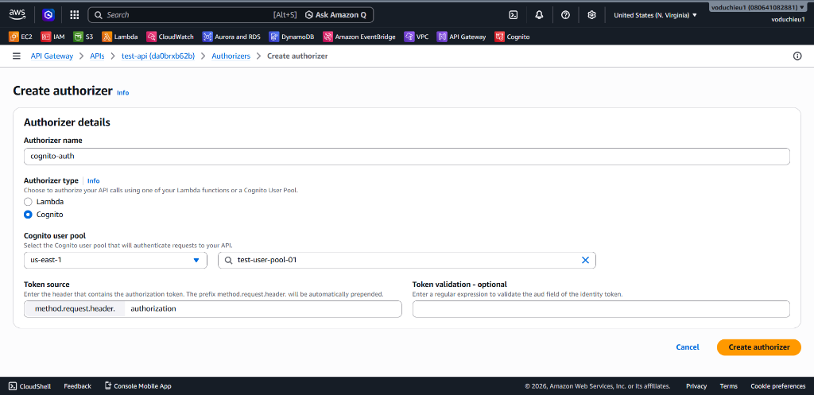
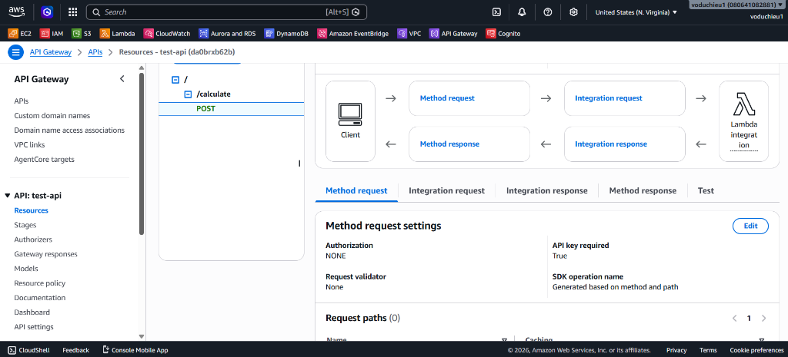
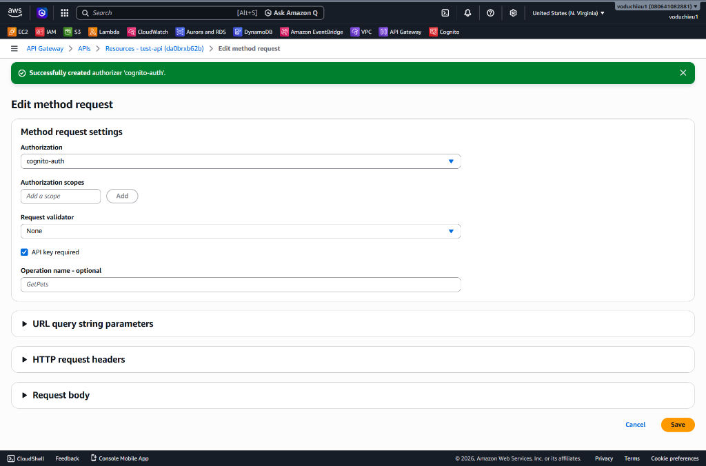
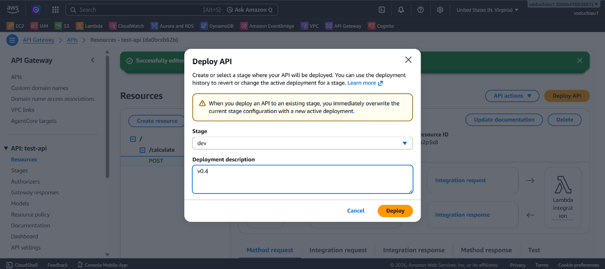
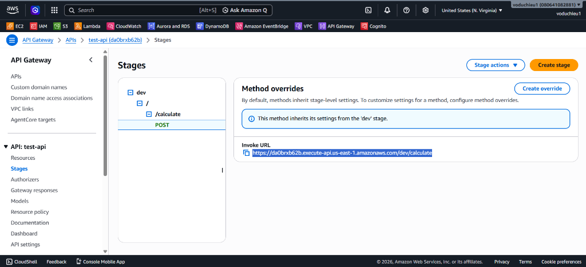
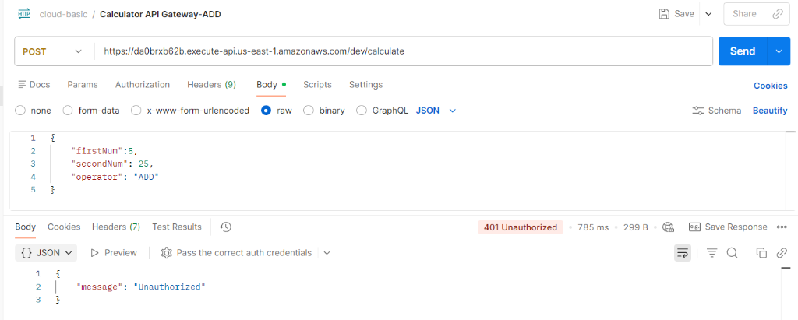
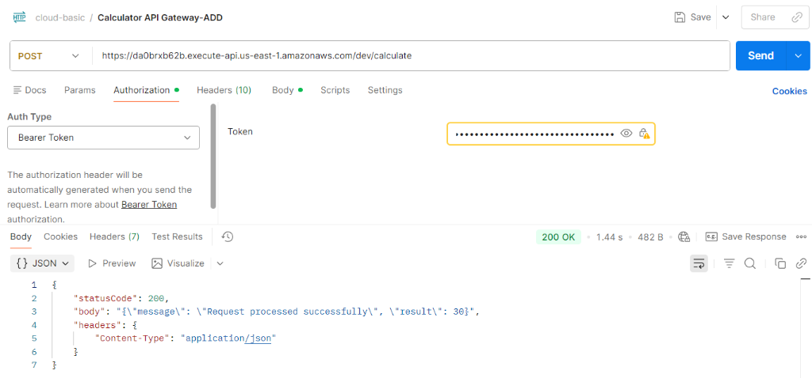

# 5. Kết hợp API Gateway & Cognito - Hướng dẫn chi tiết

 **[Xem Đề bài / Yêu cầu bài Lab](5.%20Lab%205%20-%20Integrate%20API%20Gateway%20and%20Cognito.md)**

---

## Các bước thực hiện chi tiết

### Bước 1: Khởi tạo Cognito Authorizer trên API Gateway

Trước tiên, bạn cần cấu hình để API Gateway biết cách kết nối với Cognito User Pool để xác thực token gửi lên từ client.

1. Truy cập vào AWS Management Console, mở dịch vụ **API Gateway**.
2. Chọn API **`test-api`** của bạn từ danh sách.
3. Ở menu bên trái dưới mục **API: test-api**, click chọn **Authorizers**.
4. Hiện tại danh sách Authorizers đang trống. Click chọn **Create authorizer** (hoặc **Create an authorizer** ở giữa màn hình).



5. Cấu hình chi tiết Authorizer mới:
   * **Authorizer name**: Nhập `cognito-auth`.
   * **Authorizer type**: Tích chọn **Cognito**.
   * **Cognito user pool**:
     * Chọn Region tương ứng (ví dụ: `us-east-1`).
     * Nhấp chọn ô tìm kiếm và chọn User Pool **`test-user-pool-01`** đã tạo trước đó.
   * **Token source**: Nhập `method.request.header.authorization`.
     * *Lưu ý: Cấu hình này chỉ định API Gateway sẽ tìm kiếm JWT token từ Header mang tên `authorization` (hoặc `Authorization`) trong request của Client gửi lên.*
   * **Token validation**: Để trống (không bắt buộc).
6. Click chọn nút **Create authorizer** ở góc dưới bên phải để lưu.



---

### Bước 2: Liên kết Authorizer vào Resource Method

Sau khi đã tạo Authorizer, bạn cần áp dụng nó vào phương thức API cụ thể để bảo vệ endpoint đó.

1. Ở menu bên trái, chọn **Resources**.
2. Tìm đến resource `/calculate` và click chọn phương thức **POST**.
3. Tại giao diện **Method request** (phần cấu hình yêu cầu từ Client), bạn sẽ thấy phần **Authorization** mặc định là `NONE`.



4. Click vào nút **Edit** ở góc phải của khu vực *Method request settings*.
5. Tại mục **Authorization**, nhấp chọn menu thả xuống và chọn **`cognito-auth`** vừa tạo ở Bước 1.
6. Mục **API key required**: Đảm bảo vẫn giữ là `True` nếu bạn muốn giữ lớp bảo vệ API Key song song với Cognito.
7. Click chọn **Save** để cập nhật thay đổi.



---

### Bước 3: Deploy API Gateway để áp dụng cấu hình mới

Mọi cấu hình trên API Gateway chỉ thực sự có hiệu lực sau khi bạn tiến hành deploy API lên một stage cụ thể.

1. Nhấp chọn nút **Deploy API** ở góc trên bên phải giao diện quản lý Resources.
2. Trong hộp thoại **Deploy API**:
   * **Stage**: Chọn stage **`dev`** đang sử dụng.
   * **Deployment description**: Nhập mô tả phiên bản cập nhật (ví dụ: `v0.4` hoặc `Integrate Cognito authorizer`).
3. Click chọn nút **Deploy**.



---

### Bước 4: Kiểm thử và xác minh tích hợp bằng Postman

Bây giờ API của bạn đã được bảo vệ bởi **Cognito Authorizer (JWT Token)**. Chúng ta sẽ lấy URL gọi API và tiến hành kiểm thử qua Postman.

#### 1. Lấy API Invoke URL
1. Trong menu bên trái của API Gateway, chọn mục **Stages**.
2. Click chọn stage **`dev`** -> Tìm đến phương thức **`POST`** của `/calculate`.
3. Sao chép địa chỉ **Invoke URL** hiển thị trên màn hình (địa chỉ dạng: `https://da0brxb62b.execute-api.us-east-1.amazonaws.com/dev/calculate`).



#### 2. Kiểm thử khi KHÔNG truyền Token (Xác minh chặn quyền truy cập)
1. Mở Postman, tạo một request mới với phương thức **POST** và dán địa chỉ **Invoke URL** vừa copy ở trên.
2. Tại tab **Body**, chọn kiểu **raw** -> **JSON** và nhập nội dung tính toán (ví dụ: phép tính cộng):
   ```json
   {
       "firstName": 5,
       "secondNum": 25,
       "operator": "ADD"
   }
   ```
3. Nhấn **Send** khi **không** đính kèm bất kỳ thông tin xác thực nào trong Header hay Authorization.
4. **Kết quả**: API Gateway lập tức chặn lại và trả về mã lỗi **`401 Unauthorized`** cùng nội dung phản hồi:
   ```json
   {
       "message": "Unauthorized"
   }
   ```
   *(Nhờ cơ chế chặn ở biên, Lambda backend của bạn không bị kích hoạt vô ích, giúp tối ưu chi phí).*



#### 3. Kiểm thử khi truyền ID Token hợp lệ (Xác minh cấp quyền truy cập)
1. Mở file [id_token.txt](../4.%20Lab%204%20-%20Cognito%20Hosted%20UI%20Login%20and%20Token/id_token.txt) ở Lab trước và sao chép toàn bộ chuỗi Token.
2. Trong Postman, di chuyển sang tab **Authorization**:
   * **Auth Type**: Chọn **Bearer Token**.
   * **Token**: Dán chuỗi ID Token vừa sao chép ở bước trên.
   *(Lưu ý: Postman sẽ tự động sinh ra header `Authorization` chứa chuỗi token gửi lên API Gateway).*
3. Nhấn nút **Send**.
4. **Kết quả**: API Gateway xác thực Token hợp lệ từ Cognito và chuyển tiếp yêu cầu xuống Lambda backend. Hệ thống xử lý thành công, trả về mã trạng thái **`200 OK`** cùng dữ liệu phản hồi từ Lambda:
   ```json
   {
       "statusCode": 200,
       "body": "{\"message\": \"Request processed successfully\", \"result\": 30}",
       "headers": {
           "Content-Type": "application/json"
       }
   }
   ```



> [!NOTE]
> Khi cấu hình **Token source** là `method.request.header.authorization`, API Gateway sẽ trích xuất token từ header `authorization` (Postman tự sinh ra header này khi bạn sử dụng tab Authorization với kiểu Bearer Token). Hãy đảm bảo ID Token của bạn còn trong thời gian hiệu lực (thường là 60 phút từ khi sinh ra) để việc xác thực diễn ra thành công.


---

* **Bài trước**: [4. Lab 4 – Sử dụng Cognito Hosted UI để login và lấy token](../4.%20Lab%204%20-%20Cognito%20Hosted%20UI%20Login%20and%20Token/4.%20Lab%204%20-%20Cognito%20Hosted%20UI%20Login%20and%20Token.md)
* **Bài tiếp theo**: Sắp ra mắt (Coming soon...)

---

 **[Quay lại Đề bài](5.%20Lab%205%20-%20Integrate%20API%20Gateway%20and%20Cognito.md)**
