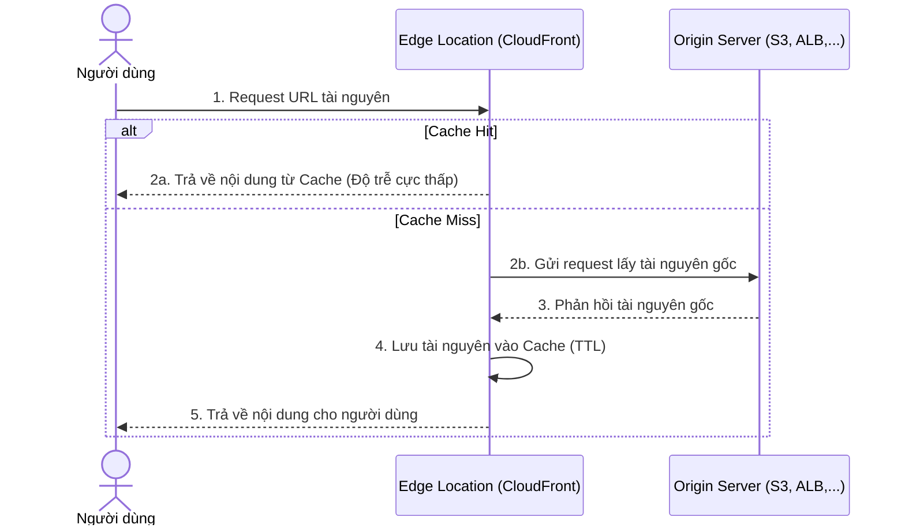

# 1. Amazon CloudFront Overview (Tổng quan về Amazon CloudFront)

  

## I. Amazon CloudFront là gì?

**Amazon CloudFront** là dịch vụ **CDN (Content Delivery Network)** được quản lý hoàn toàn bởi AWS. Nó giúp phân phối dữ liệu, video, ứng dụng và các API đến người dùng trên toàn thế giới với độ trễ thấp (low latency) và tốc độ truyền tải cao.

---

## II. Mạng phân phối nội dung (CDN) là gì?

**CDN** viết tắt của **Content Delivery Network** (Mạng lưới phân phối nội dung), là một hệ thống gồm nhiều máy chủ được phân bố ở các vị trí địa lý khác nhau (Edge Servers), làm việc cùng nhau để phân phối nội dung Internet (như trang HTML, tệp tin javascript, stylesheet, hình ảnh, video) tới người dùng cuối một cách nhanh chóng nhất.

Nguyên lý cốt lõi của CDN dựa trên việc điều hướng yêu cầu truy cập của người dùng tới máy chủ chứa bản sao tài nguyên gần họ nhất về mặt địa lý thay vì gửi trực tiếp về máy chủ gốc (Origin Server).

### 1. Khi không sử dụng CDN (Direct Access)

Khi hệ thống không có CDN, tài nguyên từ máy chủ gốc sẽ được phân phối trực tiếp tới mọi thiết bị của client bất kể khoảng cách địa lý.

*   **Đặc điểm:** Tốc độ truy cập nhanh hay chậm phụ thuộc hoàn toàn vào khoảng cách vật lý giữa client và server. 
*   **Vấn đề:** Nếu máy chủ gốc đặt ở Mỹ (US) và người dùng ở Việt Nam truy cập, dữ liệu phải đi qua nhiều chặng mạng xuyên đại dương, dẫn đến thời gian phản hồi cực kỳ chậm (high latency). Đồng thời, máy chủ gốc dễ bị quá tải khi lượng truy cập tăng cao.

  

### 2. Khi sử dụng CDN (Edge Caching Access)

Khi hệ thống tích hợp CDN, tài nguyên của máy chủ gốc sẽ được lưu đệm (cache) trên các máy chủ biên (**Edge Locations**).

*   **Đặc điểm:** Khi người dùng gửi yêu cầu truy cập tài nguyên thông qua CloudFront, DNS sẽ tự động chuyển hướng (redirect) yêu cầu của họ đến máy chủ Edge gần nhất.
*   **Lợi ích:** Nếu tài nguyên đã được lưu đệm tại máy chủ Edge đó (Cache Hit), người dùng sẽ nhận ngay phản hồi với độ trễ cực thấp (chỉ vài mili-giây) mà không cần đi vòng về máy chủ gốc, giúp nâng cao trải nghiệm người dùng và giải phóng tải xử lý cho máy chủ gốc.

  

---

## III. Cách thức hoạt động của CloudFront

Quy trình xử lý một yêu cầu truy cập thông qua CloudFront diễn ra như sau:

1. **Yêu cầu (Request):** Người dùng truy cập website hoặc gọi API qua tên miền CloudFront.
2. **Định tuyến (Routing):** DNS của CloudFront tự động hướng request đến **Edge Location** gần người dùng nhất.
3. **Kiểm tra bộ nhớ đệm (Cache Check):**
   * **Cache Hit:** Nếu tài nguyên đã được cache tại Edge Location và vẫn còn hạn (TTL), CloudFront phản hồi ngay cho người dùng mà không cần gọi về server gốc.
   * **Cache Miss:** Nếu tài nguyên chưa được cache hoặc đã hết hạn, CloudFront sẽ chuyển tiếp yêu cầu đến **Origin Server** (như Amazon S3, ALB, hoặc Custom Origin).
4. **Lưu đệm & Phản hồi (Cache & Respond):** Origin trả về dữ liệu cho Edge Location. CloudFront lưu đệm dữ liệu này cho các request tiếp theo và gửi phản hồi cuối cùng tới người dùng.

---

## IV. Các nguồn gốc dữ liệu (Origins) hỗ trợ

CloudFront có thể lấy dữ liệu gốc từ nhiều nguồn khác nhau (gọi là **Origins**):

* **Amazon S3 Bucket:** Thường dùng để phân phối các static asset (hình ảnh, video, tệp tin tải về, static website).
* **Application Load Balancer (ALB):** Thường dùng cho các ứng dụng web động (dynamic web apps) chạy trên EC2, ECS.
* **Amazon API Gateway:** Hỗ trợ tăng tốc và quản lý các luồng gọi REST/HTTP API.
* **Custom Origin:** Bất kỳ server HTTP/HTTPS nào bên ngoài AWS (ví dụ: máy chủ on-premise của doanh nghiệp).

---

## V. Edge Locations và Regional Edge Caching

Hạ tầng phân phối của CloudFront bao gồm hai thành phần chính:

1. **Edge Locations (Điểm biên):** Điểm phân phối trực tiếp cho người dùng. Có hàng trăm điểm biên trên toàn thế giới, bao gồm cả Việt Nam (Hà Nội và TP.HCM), giúp giảm thiểu tối đa chặng mạng (network hop) cuối cùng đến người dùng.
2. **Regional Edge Caches (Bộ nhớ đệm vùng biên):** Nằm giữa Edge Location và Origin Server. Khi một Edge Location bị **Cache Miss**, nó sẽ tìm ở Regional Edge Cache trước khi gọi về Origin. Regional Edge Cache có dung lượng lớn hơn giúp giữ lại các nội dung ít phổ biến hơn để giảm tải tối đa cho Origin Server.

---

* **Bài tiếp theo**: [2. CloudFront Key Concepts](2.%20CloudFront%20Key%20Concepts.md)
