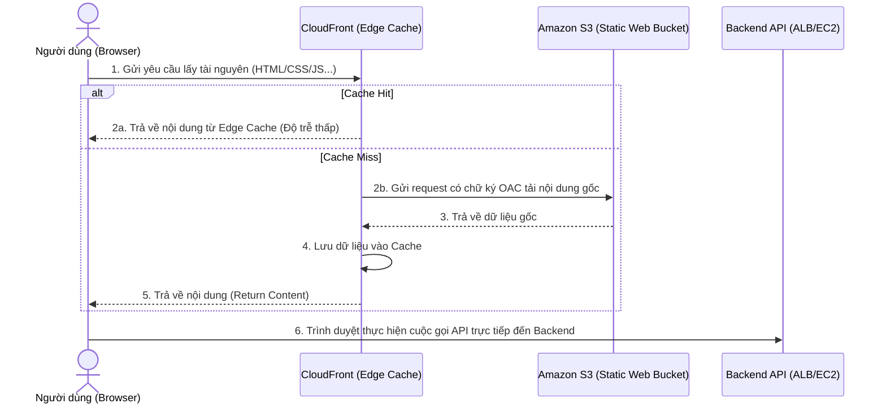
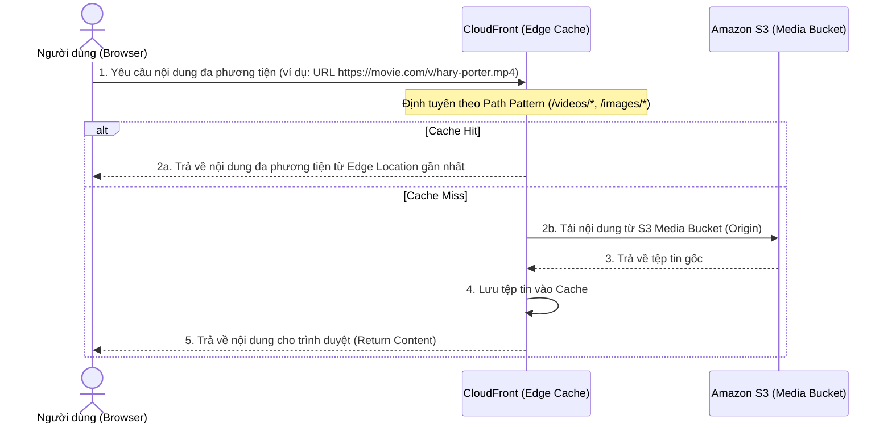
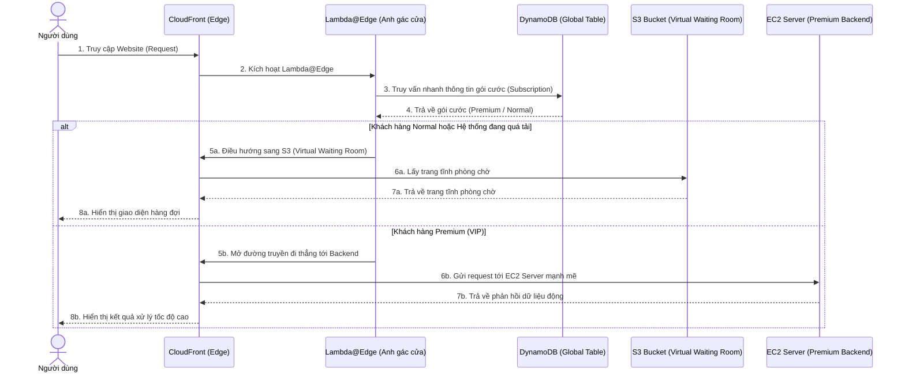
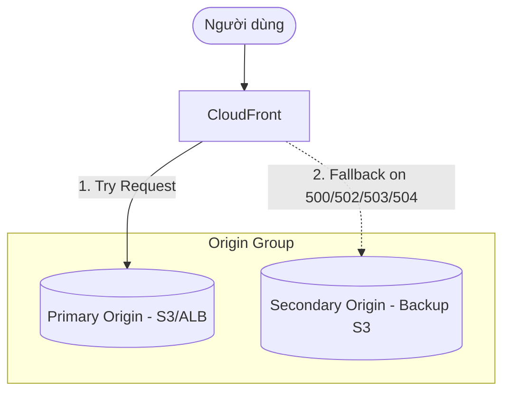

# 5. CloudFront Architecture Patterns (Mô hình kiến trúc sử dụng CloudFront)

Dưới đây là một số mô hình thiết kế kiến trúc hệ thống thực tế phổ biến nhất kết hợp giữa CloudFront với các dịch vụ AWS khác để đạt hiệu năng, độ bảo mật và tính sẵn sàng cao:

---

## Pattern 1: Hosting Static Website (S3 + CloudFront + OAC)

Đây là mô hình tiêu chuẩn để deploy các Single Page Application (SPA) xây dựng từ các framework hiện đại (như Angular, Vue, React, Node.js) được đóng gói (build) thành dạng tĩnh chỉ gồm HTML, CSS và Javascript để lưu trữ trên S3 bucket.

*   **Nguyên lý hoạt động:**
    *   S3 Bucket chứa mã nguồn tĩnh được cấu hình ở chế độ hoàn toàn **Private** (Block all public access), tắt chức năng static website hosting để bảo mật.
    *   CloudFront sử dụng **Origin Access Control (OAC)** để ký số các request chuyển tiếp. S3 Bucket Policy chỉ cho phép các yêu cầu có chữ ký hợp lệ của CloudFront được phép đọc file (`s3:GetObject`).
    *   Trình duyệt của người dùng sau khi tải về thành công giao diện tĩnh sẽ thực hiện các cuộc gọi API trực tiếp tới Backend API (ALB/API Gateway) độc lập.
*   **Lợi ích:** Tốc độ tải trang tĩnh cực nhanh nhờ Edge Cache toàn cầu, bảo vệ mã nguồn tĩnh trên S3 không bị truy cập trực tiếp.

---

## Pattern 2: Serving Media Content (Video & Image Distribution)

Mô hình tối ưu để phân phối các tệp tin đa phương tiện dung lượng lớn như hình ảnh chất lượng cao hoặc các tệp video dạng streaming/on-demand.

*   **Nguyên lý hoạt động:**
    *   Dữ liệu media (ví dụ: video `hary-porter.mp4` hoặc hình ảnh độ nét cao) được lưu trữ trong một S3 Bucket làm nguồn gốc.
    *   Người dùng gửi request thông qua tên miền CloudFront hoặc một URL tùy chỉnh (ví dụ: `https://movie.com/v/hary-porter.mp4`).
    *   CloudFront dựa vào cấu hình Behaviors định hướng các path cụ thể như `/videos/*` hoặc `/images/*` về S3 Media Origin.
*   **Lợi ích:** Đem lại trải nghiệm mượt mà cho người dùng cuối do tệp tin dung lượng lớn được phục vụ trực tiếp từ máy chủ Edge gần nhất về mặt địa lý, hạn chế tối đa giật lag hay mất kết nối.

---

## Pattern 3: Customize at the Edge (Lambda@Edge + DynamoDB Global Table)

Mô hình phân luồng và ưu tiên người dùng dựa trên gói dịch vụ đăng ký (User Prioritization) sử dụng tính năng tính toán tại biên mạng kết hợp cơ sở dữ liệu phân tán toàn cầu.

*   **Nguyên lý hoạt động:**
    *   Yêu cầu của người dùng gửi tới CloudFront kích hoạt **Lambda@Edge** hoạt động như một nhân viên gác cổng thông minh.
    *   Lambda@Edge thực hiện truy vấn nhanh thông tin gói cước của người dùng từ **Amazon DynamoDB Global Table** (cơ sở dữ liệu NoSQL được đồng bộ dữ liệu thời gian thực giữa nhiều vùng trên thế giới với độ trễ cực thấp).
    *   **Phân luồng quyết định:**
        *   **Đối với khách hàng Normal (hoặc khi hệ thống quá tải):** Lambda@Edge tự động điều hướng request của người dùng sang một trang web tĩnh rẻ tiền được host trên Amazon S3 đóng vai trò làm phòng chờ ảo (Virtual Waiting Room).
        *   **Đối với khách hàng Premium (VIP):** Request lập tức được định tuyến đi thẳng vào hệ thống máy chủ backend mạnh mẽ chạy trên Amazon EC2 để xử lý với hiệu năng tối đa.
*   **Lợi ích:** Tối ưu hóa hạ tầng máy chủ động, bảo vệ hệ thống backend chính không bị sập khi traffic tăng đột biến bằng cách tạo phòng chờ tự động cho khách hàng thường ngay tại biên mạng.

---

## Pattern 4: Multi-Origin Failover (Kiến trúc dự phòng chịu lỗi)

Kiến trúc dành cho các hệ thống yêu cầu tính sẵn sàng cực cao (High Availability), tự động chuyển đổi nguồn cấp dữ liệu khi xảy ra sự cố.

*   **Nguyên lý hoạt động:**
    *   Thiết lập một **Origin Group** chứa: **Primary Origin** (máy chủ chạy chính) và **Secondary Origin** (S3 bucket chứa trang tĩnh dự phòng).
    *   CloudFront luôn hướng request tới Primary Origin.
    *   Nếu Primary Origin trả về các mã lỗi hệ thống (`500`, `502`, `503`, `504`...) hoặc bị timeout kết nối, CloudFront lập tức tự động gửi request sang Secondary Origin để lấy trang web tĩnh thay thế.
*   **Lợi ích:** Đảm bảo tính liên tục của dịch vụ, người dùng sẽ được chuyển sang trang thông báo bảo dưỡng hoặc trang tĩnh dự phòng thay vì nhìn thấy mã lỗi hệ thống thô.

---

*   **Bài trước**: [4. CloudFront Pricing](4.%20CloudFront%20Pricing.md)
*   **Bài tiếp theo**: [6. CloudFront Behavior](6.%20CloudFront%20Behavior.md)
