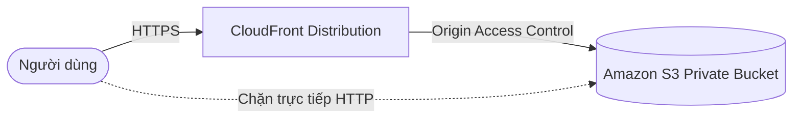
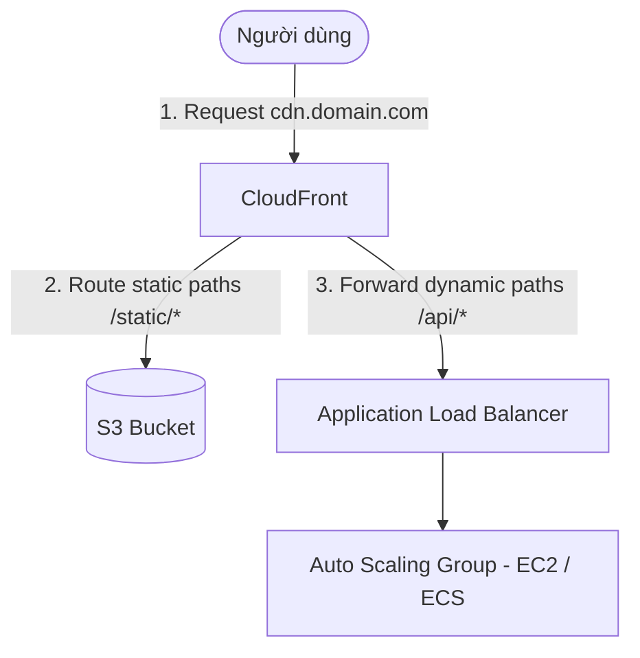
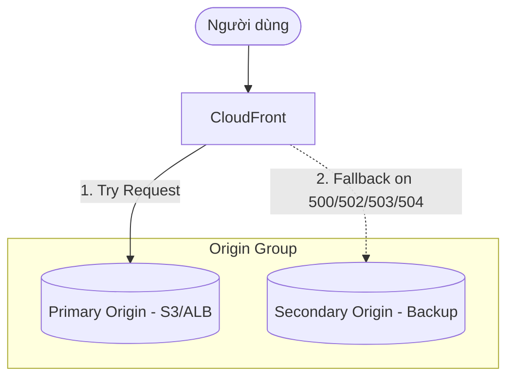

# 5. CloudFront Architecture Patterns (Mô hình kiến trúc sử dụng CloudFront)

Dưới đây là một số mô hình thiết kế kiến trúc hệ thống thực tế phổ biến nhất kết hợp giữa CloudFront với các dịch vụ AWS khác để đạt hiệu năng, độ bảo mật và tính sẵn sàng cao:

---

## Pattern 1: CloudFront + S3 + OAC (Kiến trúc phân phối Static Web an toàn)

Đây là mô hình tiêu chuẩn để deploy các Single Page Application (SPA) như React, Vue, Angular hoặc các trang web tĩnh.

* **Nguyên lý hoạt động:**
  * S3 Bucket chứa mã nguồn website được cấu hình ở chế độ hoàn toàn **Private** (Block all public access).
  * CloudFront sử dụng **Origin Access Control (OAC)** để ký số các request gửi tới S3.
  * S3 Bucket Policy chỉ cho phép các yêu cầu có chữ ký hợp lệ từ CloudFront OAC được đọc file (`s3:GetObject`).
* **Lợi ích:** Người dùng bắt buộc phải đi qua CloudFront (để được hưởng cache, SSL, WAF bảo mật) và hoàn toàn không thể dò tìm hoặc tải trực tiếp từ link S3 bucket gốc.

---

## Pattern 2: CloudFront + ALB + EC2/ECS (Kiến trúc ứng dụng web động)

Mô hình tối ưu cho các ứng dụng web truyền thống (Server-Side Rendering hoặc APIs) cần khả năng xử lý logic phức tạp ở backend.

* **Nguyên lý hoạt động:**
  * CloudFront đóng vai trò là cổng truy cập duy nhất (Single Entry Point).
  * Sử dụng tính năng **Path-based Routing** của CloudFront Behaviors để chia luồng:
    * Gửi request tĩnh `/static/*` hoặc `/images/*` sang S3.
    * Chuyển tiếp request động `/api/*` hoặc `/login` sang ALB.
  * Tách biệt SSL Termination: Khách hàng kết nối HTTPS tới CloudFront, CloudFront duy trì kết nối bảo mật tới ALB.
* **Lợi ích:** Tiết kiệm tải xử lý SSL cho ALB/EC2, giảm chi phí băng thông, tăng tốc độ xử lý API động qua mạng AWS backbone.

---

## Pattern 3: CloudFront + API Gateway (Kiến trúc Serverless API toàn cầu)

Thích hợp cho các ứng dụng Serverless cần phân phối API cho người dùng trên toàn cầu với độ trễ thấp nhất.

* **Nguyên lý hoạt động:**
  * Client gọi API thông qua CloudFront endpoint.
  * CloudFront chuyển tiếp request đến API Gateway, nơi kích hoạt Lambda function xử lý dữ liệu và đọc/ghi DynamoDB.
  * Cấu hình caching tại CloudFront cho các API GET có dữ liệu ít thay đổi để giảm tần suất kích hoạt Lambda (giảm chi phí Serverless).

---

## Pattern 4: Multi-Origin Failover (Kiến trúc dự phòng chịu lỗi)

Kiến trúc dành cho các hệ thống yêu cầu tính sẵn sàng cực cao (High Availability), không bị gián đoạn hoạt động khi server chính gặp sự cố.

* **Nguyên lý hoạt động:**
  * Bạn tạo một **Origin Group** chứa hai Origins: **Primary Origin** (chính) và **Secondary Origin** (phụ/dự phòng).
  * CloudFront sẽ luôn gửi yêu cầu đến Primary Origin trước.
  * Nếu Primary Origin trả về mã lỗi chỉ định (như `500`, `502`, `503`, `504` hoặc lỗi kết nối timeout), CloudFront tự động chuyển hướng request sang Secondary Origin để lấy dữ liệu.
* **Lợi ích:** Đảm bảo website vẫn hiển thị trang bảo trì (maintenance page) hoặc trang tĩnh dự phòng một cách mượt mà, người dùng không thấy màn hình lỗi hệ thống.

---

* **Bài trước**: [4. CloudFront Pricing](4.%20CloudFront%20Pricing.md)
* **Bài tiếp theo**: [6. CloudFront Behavior](6.%20CloudFront%20Behavior.md)
