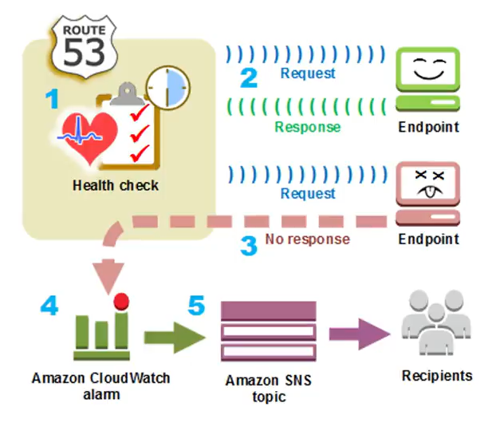

# 12. Giới thiệu Route 53 Health check

**Route 53 Health check** là tính năng giám sát sức khỏe tài nguyên của Amazon Route 53. Dịch vụ này định kỳ gửi các yêu cầu (requests) tới các điểm cuối (endpoints) mà bạn muốn theo dõi để xác định xem chúng có đang hoạt động bình thường hay không.

---

## I. Cơ chế hoạt động của Health Check

Dưới đây là sơ đồ luồng hoạt động chi tiết khi Route 53 thực hiện giám sát sức khỏe một endpoint và gửi thông báo cảnh báo khi xảy ra sự cố:

*Hình 1: Luồng xử lý và gửi thông báo sự cố của dịch vụ Route 53 Health Check.*

### Giải thích các bước trong quy trình:
1. **Bước 1 (Health check):** Route 53 được cấu hình định kỳ gửi các yêu cầu kiểm tra sức khỏe đến endpoint đích.
2. **Bước 2 (Request & Response):** Với các endpoint hoạt động bình thường, Route 53 gửi request và nhận lại response phản hồi hợp lệ (mã trạng thái HTTP 2xx/3xx hoặc kết nối TCP thành công).
3. **Bước 3 (No response):** Khi máy chủ gặp sự cố (offline hoặc lỗi ứng dụng), Route 53 gửi request nhưng không nhận được response phản hồi hoặc nhận phản hồi lỗi.
4. **Bước 4 (Amazon CloudWatch alarm):** Khi số lần thất bại vượt quá ngưỡng giới hạn cấu hình (Failure threshold), Route 53 sẽ đánh dấu endpoint là *Unhealthy* và kích hoạt trạng thái báo động trên **Amazon CloudWatch Alarm**.
5. **Bước 5 (Amazon SNS topic & Recipients):** CloudWatch Alarm kích hoạt gửi thông báo tới một **Amazon SNS topic**, từ đó tự động gửi thông báo (Email, SMS hoặc webhook) tới người nhận (ví dụ: đội ngũ vận hành hệ thống/Operator) để kịp thời xử lý sự cố.

---

## II. Các thông số cấu hình chính (Settings)

Khi khởi tạo một Health Check, bạn có thể thiết lập các thông số sau:

* **Endpoint to Monitor (IP / Domain name):** Địa chỉ IP công cộng (IPv4/IPv6) hoặc tên miền của máy chủ ứng dụng cần kiểm tra.
* **Protocol:** Giao thức kiểm tra, hỗ trợ **TCP**, **HTTP**, hoặc **HTTPS**.
* **Port:** Cổng mạng cần kết nối (ví dụ: `80` cho HTTP, `443` cho HTTPS, hoặc cổng tùy chỉnh).
* **Interval:** Tần suất gửi request kiểm tra. Mặc định là **30 giây** (Standard) hoặc có thể chọn **10 giây** (Fast - tính phí cao hơn).
* **Failure threshold:** Ngưỡng số lần thất bại liên tiếp trước khi tính là lỗi. Ví dụ: Thiết lập là `3` lần liên tiếp không có phản hồi thì Route 53 mới chuyển trạng thái tài nguyên thành *Unhealthy*.
* **Notification (Tùy chọn):** Cấu hình tích hợp với CloudWatch Alarm và Amazon SNS để gửi cảnh báo tự động ngay khi trạng thái sức khỏe tài nguyên thay đổi.
