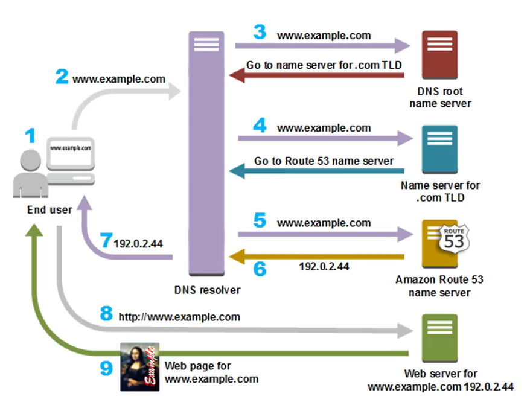

# 3. DNS Resolver and Query Flow

## I. DNS Resolver là gì?
**DNS Resolver** đóng vai trò trung gian thực hiện việc tra cứu địa chỉ IP của một tên miền thay cho người dùng cuối. Khi bạn gõ một tên miền lên trình duyệt, DNS Resolver sẽ là tác nhân đứng ra giao tiếp với các Name Servers trên Internet để tìm ra địa chỉ IP vật lý chính xác của máy chủ chứa trang web đó.

---

## II. Sơ đồ luồng phân giải tên miền (DNS Query Flow)
Hình bên dưới mô tả toàn bộ luồng xử lý (flow) kể từ khi người dùng gõ địa chỉ của một trang web (ví dụ: `www.example.com`) lên trình duyệt cho tới khi nội dung thực sự được trả về từ máy chủ:

*Hình 1: Sơ đồ chi tiết 9 bước trong quy trình phân giải DNS sử dụng DNS Resolver và Route 53.*

---

## III. Giải thích chi tiết các bước trong quy trình
1. **Bước 1 (End user):** Người dùng nhập địa chỉ tên miền `www.example.com` vào trình duyệt web.
2. **Bước 2 (Trình duyệt ➔ DNS Resolver):** Trình duyệt gửi yêu cầu truy vấn DNS tới DNS Resolver (thường do nhà cung cấp dịch vụ Internet - ISP quản lý, hoặc DNS công cộng như Google `8.8.8.8`).
3. **Bước 3 (DNS Resolver ➔ DNS root name server):** DNS Resolver gửi truy vấn `www.example.com` tới máy chủ tên gốc (**DNS root name server**). Root name server sẽ chỉ hướng: *"Hãy tìm đến Name Server phụ trách đuôi `.com` (TLD Name Server)"*.
4. **Bước 4 (DNS Resolver ➔ Name server for .com TLD):** DNS Resolver gửi truy vấn tới **TLD Name Server của đuôi `.com`**. Máy chủ này phản hồi: *"Hãy tìm đến Route 53 Name Server để biết IP cụ thể"*.
5. **Bước 5 (DNS Resolver ➔ Amazon Route 53 name server):** DNS Resolver gửi truy vấn trực tiếp tới địa chỉ **Amazon Route 53 Name Server** (Authoritative Name Server của domain).
6. **Bước 6 (Amazon Route 53 name server ➔ DNS Resolver):** Route 53 Name Server kiểm tra cấu hình trong Hosted Zone và trả về địa chỉ IP của máy chủ web tương ứng (ví dụ: `192.0.2.44`).
7. **Bước 7 (DNS Resolver ➔ End user):** DNS Resolver gửi trả lại địa chỉ IP `192.0.2.44` cho trình duyệt của người dùng.
8. **Bước 8 (End user ➔ Web server):** Trình duyệt gửi yêu cầu HTTP/HTTPS (ví dụ: `http://www.example.com`) trực tiếp tới địa chỉ IP `192.0.2.44`.
9. **Bước 9 (Web server ➔ End user):** Máy chủ web tại địa chỉ `192.0.2.44` xử lý và gửi trả lại nội dung trang web hiển thị lên trình duyệt cho người dùng.
