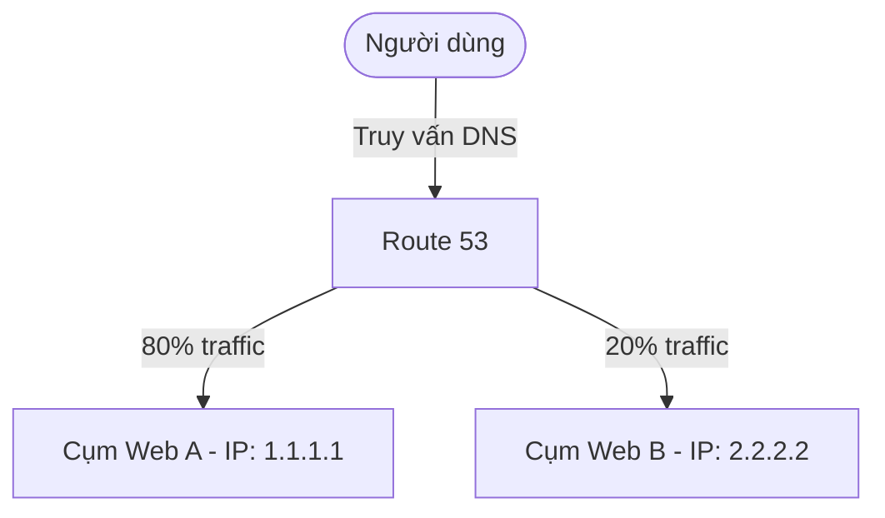

# 6. Route 53 Routing Policies

Khi bạn tạo một DNS Record, bạn cần quyết định routing policy sẽ sử dụng cho record đó. Routing Policy xác định cách thức Route 53 phản hồi các yêu cầu truy vấn DNS từ phía Client để tối ưu hiệu năng hạ tầng và tăng tính sẵn sàng của ứng dụng:

---

## 1. Simple routing policy (Định tuyến đơn giản)
* **Khái niệm:** Sử dụng trong trường hợp bạn trỏ DNS Record tới một resource riêng lẻ ví dụ: CloudFront, Web Server run on EC2.
* **Cơ chế:** Cấu hình một bản ghi duy nhất trả về một hoặc nhiều địa chỉ IP (dạng danh sách). Route 53 trả về toàn bộ danh sách IP và Client tự chọn ngẫu nhiên một IP để kết nối. Không hỗ trợ kiểm tra sức khỏe (Health Check) để loại bỏ tự động IP bị lỗi.

---

## 2. Failover routing policy (Định tuyến dự phòng)
* **Khái niệm:** Sử dụng khi cấu hình một cặp resource hoạt động theo cơ chế active-passive failover. Thường sử dụng trong private hosted zone.
* **Cơ chế:** Liên kết bản ghi chính (Primary) với một Health Check. Khi máy chủ chính hoạt động tốt, mọi truy cập đều hướng về Primary. Nếu máy chủ chính gặp sự cố (unhealthy), DNS tự động chuyển hướng người dùng sang máy chủ dự phòng (Secondary).

---

## 3. Geolocation routing policy (Định tuyến theo vị trí địa lý)
* **Khái niệm:** Điều hướng traffic từ user tới các target dựa trên vị trí địa lý của user.
* **Cơ chế:** Nhận diện vị trí người dùng qua địa chỉ IP để điều hướng yêu cầu đến đúng cụm máy chủ phục vụ cho khu vực đó (ví dụ: hiển thị đúng ngôn ngữ hoặc giới hạn nội dung theo khu vực pháp lý).

---

## 4. Geoproximity routing policy (Định tuyến theo khoảng cách vật lý)
* **Khái niệm:** Sử dụng khi bạn muốn điều hướng traffic dựa trên vị trí của resource. Bạn cũng có thể shift traffic từ resource location này sang resource ở location khác.
* **Cơ chế:** Điều chỉnh vùng phủ sóng địa lý bằng giá trị **bias** để mở rộng hoặc thu hẹp vùng ảnh hưởng của tài nguyên.

---

## 5. Latency routing policy (Định tuyến theo độ trễ)
* **Khái niệm:** Sử dụng khi bạn có nhiều resource trên multi regions và muốn điều hướng traffic tới region có latency tốt nhất.
* **Cơ chế:** Đo lường độ trễ mạng (ping) từ người dùng tới các Region để trả về IP của Region có tốc độ phản hồi nhanh nhất.

---

## 6. IP-based routing policy (Định tuyến dựa trên địa chỉ IP)
* **Khái niệm:** Điều hướng traffic dựa trên location của user và dựa trên IP address mà traffic bắt nguồn.
* **Cơ chế:** Cho phép bạn định nghĩa các dải CIDR IP nguồn của Client và ánh xạ chúng tới các tài nguyên cụ thể để tối ưu hóa luồng đi hoặc đáp ứng yêu cầu mạng riêng.

---

## 7. Multivalue answer routing policy (Định tuyến đa giá trị)
* **Khái niệm:** Sử dụng khi bạn muốn query up-to 8 record healthy được lựa chọn ngẫu nhiên.
* **Cơ chế:** Khác với Simple Routing, Multivalue tích hợp kèm **Health Check** để đảm bảo Route 53 chỉ trả về địa chỉ IP của các máy chủ đang hoạt động bình thường, giúp nâng cao khả năng chịu lỗi cho Client.

---

## 8. Weighted routing policy (Định tuyến theo trọng số)
* **Khái niệm:** Phân chia tỉ lệ điều hướng tới target theo một tỷ lệ nhất định mà bạn mong muốn.
* **Cơ chế:** Chỉ định tỷ lệ phần trăm phân phối lưu lượng truy cập cho nhiều tài nguyên khác nhau xử lý cùng một tên miền.

